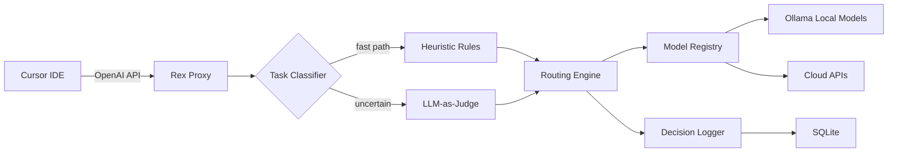
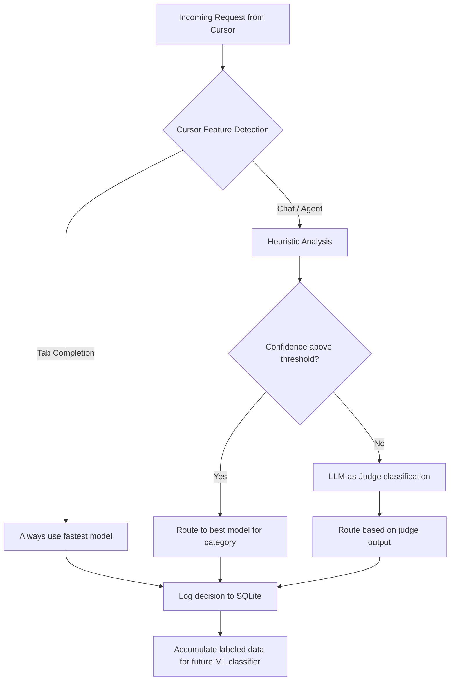

# Rex — Architecture

An OpenAI-compatible proxy that sits between Cursor IDE and multiple AI model backends (local + cloud), automatically selecting the best model for each coding task.

## System Overview



## Design Decisions

| Decision | Choice | Rationale |
|---|---|---|
| Language | Python + FastAPI | Fastest to prototype, async-native, rich AI ecosystem |
| Model backends | LiteLLM as library | Handles 100+ providers with unified interface |
| Local models | Ollama | Easiest way to run open-source models locally |
| Classification | Hybrid (heuristics + LLM judge) | Heuristics are fast and free; LLM judge catches edge cases |
| Config format | YAML | Human-readable, easy to edit |
| Logging | SQLite | Zero-dependency, single-file, good enough for single user |

## Task Categories

The classifier maps each incoming prompt into one of these categories. Each category has different model requirements:

| Category | Signals | Model Needs |
|---|---|---|
| **completion** | Short prompt, code context, single-turn | Fastest model, latency < 100ms |
| **debugging** | Stack traces, "error", "fix", "bug" | Strong reasoning model |
| **refactoring** | "refactor", "clean up", "simplify" | Large context window |
| **test_generation** | "write tests", "add test", "spec" | Good instruction-following model |
| **explanation** | "explain", "what does", "how does" | Any decent model, optimize cost |
| **generation** | Writing new code from description | Strong coding model |
| **general** | Fallback when nothing else matches | Default model |

## Routing Strategy



**Fast path**: Tab completion requests skip classification entirely — always use the fastest available model.

**Heuristic path**: Analyze the prompt with keyword matching, pattern detection, and structural analysis. If the confidence score is high enough, route immediately (<1ms overhead).

**LLM judge fallback**: When heuristics are uncertain, use a small local model to classify the task. Only triggered for chat/agent requests where 200-500ms extra latency is acceptable.

## Project Structure

```
rex/
  main.py                # FastAPI app entry point
  config.yaml            # Model registry + routing config
  router/
    classifier.py        # Heuristic task classifier
    llm_judge.py         # LLM-as-judge fallback
    engine.py            # Routing engine (classifier -> model selection)
    registry.py          # Model registry loader
  proxy/
    handler.py           # OpenAI-compatible request handler
    streaming.py         # SSE streaming response logic
  logging/
    store.py             # SQLite decision logging
    cli.py               # CLI for stats, review, and labeling
  requirements.txt
  README.md
  ROADMAP.md
```
