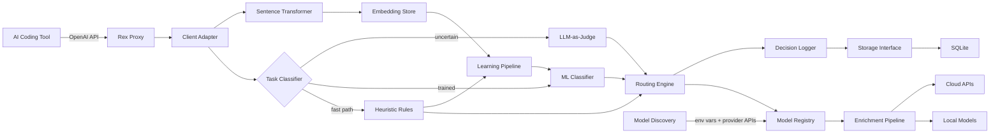
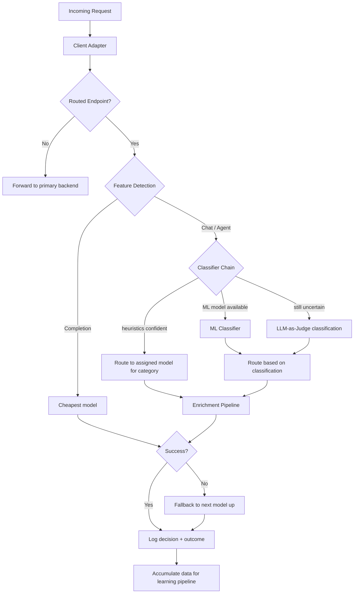
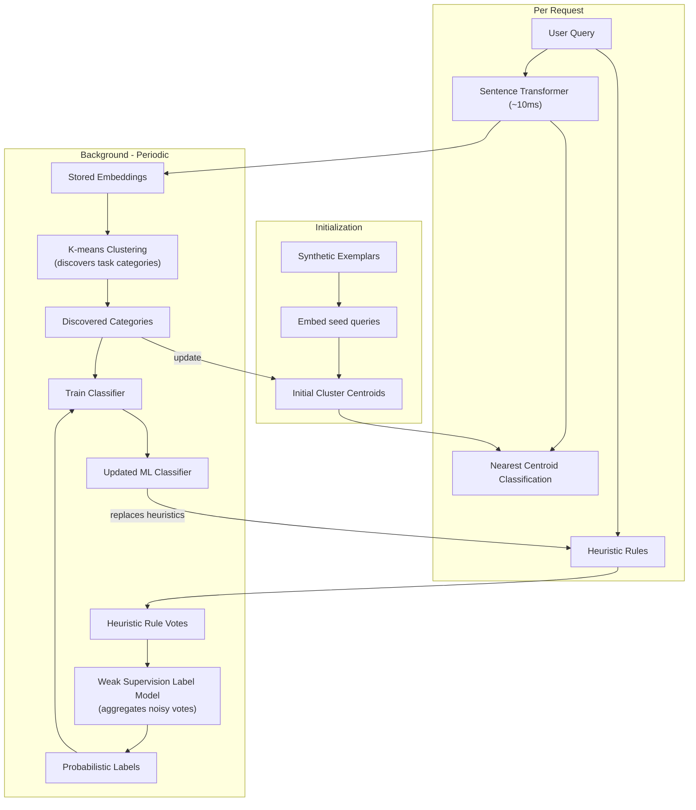

# Rex — Architecture

For a project overview and getting started guide, see [README.md](README.md). For the delivery plan, see [ROADMAP.md](ROADMAP.md).

An OpenAI-compatible proxy that sits between AI-powered coding tools and multiple model backends (local + cloud). Rex identifies what each coding task needs and routes it to the cheapest model that fits.

- Compatible with any tool that supports a custom OpenAI API base URL (Cursor, Claude Code, Continue, Aider, etc.).
- Each user runs their own Rex instance locally — all data, embeddings, and trained classifiers stay on the user's machine.
- The ML classifier personalizes to each user's coding patterns over time.

## System Overview



- **Model Discovery** detects available providers from environment variables, queries their APIs for available models, and enriches each model with metadata from LiteLLM's built-in database.
- The **Client Adapter** normalizes tool-specific request patterns into a common format for the classifier.
- Each supported tool (Cursor, Claude Code, etc.) has its own adapter that detects features like tab completion vs. chat.
- The **Learning Pipeline** runs in the background, consuming query embeddings and heuristic votes to train the ML classifier automatically.
- The **Enrichment Pipeline** transforms requests after routing but before the model call. Each enricher is opt-in and modifies the request (e.g., injecting task decomposition instructions for complex tasks).

## Design Decisions

| Decision | Choice | Rationale |
|---|---|---|
| Language | Python + FastAPI | Fastest to prototype, async-native, rich AI ecosystem |
| Model backends | LiteLLM as library | Handles 100+ providers (local and cloud) with unified interface |
| Classification | Hybrid (heuristics → ML classifier → LLM judge) | Heuristics are fast and free; ML classifier replaces heuristics once trained; LLM judge catches edge cases |
| Query embeddings | Sentence Transformer ([all-MiniLM-L6-v2](https://huggingface.co/sentence-transformers/all-MiniLM-L6-v2)) | ~80MB local model, ~10ms per query on CPU, zero API cost; produces vectors for clustering and classification ([Reimers & Gurevych, 2019](https://arxiv.org/abs/1908.10084); [Wang et al., 2020](https://arxiv.org/abs/2002.10957)) |
| Category discovery | Unsupervised K-means clustering | Automatically discovers task categories from query embeddings without labels; [silhouette score](https://doi.org/10.1016/0377-0427(87)90125-7) selects optimal cluster count (Rousseeuw, 1987) |
| Automated labeling | Weak supervision | Heuristic rules act as noisy labeling functions; a probabilistic label model aggregates their votes into clean training labels without manual annotation ([Ratner et al., 2016](https://arxiv.org/abs/1605.07723); [Ratner et al., 2017](https://arxiv.org/abs/1711.10160)) |
| Model discovery | Automatic from environment variables | Rex scans for known API keys (e.g. `OPENAI_API_KEY`, `ANTHROPIC_API_KEY`), queries each provider's `/v1/models` endpoint, and probes local runtimes (Ollama at `localhost:11434`); zero configuration required |
| Model metadata | LiteLLM built-in database | `litellm.get_model_info()` provides context window, pricing, and capability flags for known models; no manual metadata needed |
| Routing criteria | Cost + context window + capability flags | All routing signals come from measurable model properties — no manually curated "strengths" list |
| Config format | Optional YAML overrides | Config file is not required; when present, it adds models and overrides routing defaults |
| Client detection | User-Agent header → adapter | Rex selects the adapter based on the client's User-Agent header; new tools supported by adding an adapter |
| API compatibility | Full OpenAI, transparent proxy | Rex routes known endpoints and passes through everything else to the primary model's backend; never blocks unknown endpoints |
| Error handling | Graceful degradation | Every failure falls back to a simpler path; classification failure → primary model; all models fail → error to client |
| Logging storage | Repository pattern | Core logic decoupled from storage; SQLite as default implementation, swappable without touching routing code |
| Deployment model | Per-user local instance | All data stays on the user's machine; each instance learns independently from its own usage |
| Default storage | SQLite | Zero-dependency, single-file, good enough for single user |
| Cost tracking | LiteLLM runtime cost calculation | LiteLLM's `completion_cost()` returns actual cost per request from its built-in pricing database; no manual cost config needed for known models |
| Prompt enrichment | Pluggable pipeline, opt-in per enricher | Keeps enrichment logic separate from routing; each enricher toggles independently; zero overhead when disabled |

## Task Categories

The heuristic classifier uses these predefined categories as a starting point:

| Category | Signals | Routing Criteria |
|---|---|---|
| **completion** | Short prompt, code context, single-turn | Cheapest model, lowest latency |
| **debugging** | Stack traces, "error", "fix", "bug", "crash" | `supports_reasoning`, cheapest among matches |
| **refactoring** | "refactor", "clean up", "simplify", "restructure" | Context window ≥ 32K, cheapest among matches |
| **optimization** | "faster", "performance", "optimize", "memory", "efficient" | `supports_reasoning`, cheapest among matches |
| **test_generation** | "write tests", "add test", "spec", "coverage" | Context window ≥ 16K, cheapest among matches |
| **explanation** | "explain", "what does", "how does", "why" | Cheapest model |
| **documentation** | "document", "docstring", "README", "API docs" | Cheapest model |
| **code_review** | "review", "is this correct", "what's wrong", "security" | Context window ≥ 32K, `supports_reasoning`, cheapest among matches |
| **generation** | Writing new code from description | Context window ≥ 16K, cheapest among matches |
| **migration** | "upgrade", "migrate", "convert to", "update from" | Cloud model (`is_local` = false), cheapest among matches |
| **general** | Fallback when nothing else matches | Primary model |

All routing criteria come from measurable model properties — cost, context window, capability flags from LiteLLM, and `is_local`. Rex never uses a manually curated "strengths" list.

- All categories start on the cheapest model that meets the criteria. The learning pipeline tracks outcomes and promotes categories to different models when needed (see [Upward Migration](#upward-migration)).
- Once clustering produces a silhouette score above the quality threshold (>0.5), unsupervised clustering takes over.
- The learning pipeline discovers the user's actual task categories from their real usage patterns.
- Discovered categories may differ from the predefined ones — they reflect how the individual user actually works.

## API Surface

Rex exposes a fully OpenAI-compatible API as a transparent proxy:

- **Routed endpoints** — Rex applies classification and routing logic:
  - `POST /v1/chat/completions` (streaming and non-streaming)
  - `POST /v1/completions` (legacy)
- **Handled directly**:
  - `GET /v1/models` — returns models from Rex's registry
  - `GET /health` — returns proxy status
- **Transparent passthrough** — Rex forwards to the primary model's backend without routing:
  - `/v1/embeddings`, `/v1/audio/*`, `/v1/images/*`, `/v1/files`, `/v1/moderations`, and any other endpoint
  - Rex never blocks an unknown endpoint — it passes it through to the primary model's backend

## Routing Strategy



- **Client adapter**: Normalizes the incoming request from a specific tool into a common format. Detects features (completion vs. chat/agent) based on tool-specific request patterns.
- **Cheap-first**: All tasks start on the cheapest available model. The fallback chain escalates to more expensive models on failure.

**Classifier chain** (the router evaluates in order, stops at the first confident result):

1. **Heuristics**: Keyword matching, pattern detection, structural analysis.
   - The router routes immediately if confidence is high (<1ms overhead).
   - Heuristic rules also serve as labeling functions for the learning pipeline.
2. **ML classifier**: Classifies by nearest pre-seeded centroid in embedding space from day 1.
   - Evolves to logistic regression trained on cluster-derived and weakly-supervised labels once clusters stabilize.
   - Runs locally, <50ms inference.
3. **LLM judge**: A small local LLM classifies the task when the above are uncertain ([Zheng et al., 2023](https://arxiv.org/abs/2306.05685)).
   - Only triggered for chat/agent requests where 200-500ms extra latency is acceptable.

### Upward Migration

Rex optimizes for cost. Every task category starts on the cheapest model. The learning pipeline tracks outcomes per category and promotes categories to more capable models when needed.

- The fallback chain handles individual failures in real time — if the cheap model fails, Rex escalates to the next model immediately.
- The learning pipeline spots patterns: if a category consistently triggers fallbacks, Rex permanently promotes it to a more capable model, avoiding repeated fallback latency.
- Promotion is data-driven — Rex only moves a category up when it observes a persistent pattern of poor outcomes, not on a single failure.
- Outcome signals: fallback triggers, user re-asks, error rate, response latency patterns.

## Enrichment Pipeline

The enrichment pipeline transforms requests after routing but before the model call. Each enricher receives the request (messages, selected model, task category) and returns a modified request.

- Enrichers are opt-in — each one toggles independently via config.
- Enrichers run in sequence. Each one receives the output of the previous one.
- The pipeline only applies to `chat` requests — `completion` requests (tab completions) skip it entirely.
- If no enrichers are enabled, the pipeline is a no-op with zero overhead.

### Task Decomposition Enricher

The first enricher. When enabled, it detects complex tasks and injects a system-level instruction telling the model to break the task into numbered steps and work through them one at a time.

**Complexity detection** uses the task category from classification:

| Signal | How it indicates complexity |
|---|---|
| Task category | `generation`, `refactoring`, `migration`, `code_review`, `test_generation`, `documentation` are inherently multi-step |

- The enricher appends to the existing system message — it never replaces it.
- Simple tasks (`completion`, `debugging`, `optimization`, `explanation`, `general`) skip enrichment entirely.
- Rex decides complexity, not the model. The classifier output is already available at zero cost.

## Learning Pipeline

The learning pipeline trains the ML classifier automatically in the background, without manual labeling.



**Initialization**:
- The system embeds synthetic exemplar queries for each predefined category (e.g., "fix this null pointer exception" → debugging).
- These embeddings serve as initial cluster centroids, enabling semantic classification from the first query ([Kushnareva et al., 2025](https://arxiv.org/abs/2601.09692)).

**Per request**:
- The sentence transformer embeds each query (~10ms, local CPU).
- The router classifies by nearest centroid in embedding space.
- This catches semantic similarity that keyword heuristics miss (e.g., "fix this crash" matches the debugging cluster without the word "error").
- The system stores the embedding and heuristic rule votes for the background pipeline.

**Periodically (~every 100 queries)**:
1. **Clustering**: K-means re-groups stored embeddings.
   - Centroids shift to reflect actual usage patterns.
   - New categories can emerge beyond the predefined set.
   - [Silhouette score](https://doi.org/10.1016/0377-0427(87)90125-7) determines optimal cluster count and whether clusters are stable enough to promote (threshold: >0.5) (Rousseeuw, 1987).
   - Unsupervised clustering on query embeddings can match oracle-level routing accuracy ([Neurometric, 2026](https://neurometric.substack.com/p/unsupervised-llm-routing-matching)).
2. **Weak supervision**: Heuristic rules act as noisy labeling functions.
   - A probabilistic label model learns each rule's reliability from agreement/disagreement patterns.
   - The model produces clean probabilistic labels without any ground-truth labels ([Ratner et al., 2017](https://arxiv.org/abs/1711.10160)).
3. **Training**: A lightweight classifier (logistic regression) trains on the cluster-derived and weakly-supervised labels.
   - Once trained, it replaces heuristics as the primary classifier in the chain.

## Project Structure

```
app/
  main.py                # FastAPI app entry point
  config.py              # Pydantic settings model + optional YAML loader
  adapters/
    base.py              # Client adapter interface and NormalizedRequest
    default.py           # Default adapter (generic feature detection)
    registry.py          # Selects adapter by User-Agent header
  discovery/
    providers.py         # Detects available providers from env vars
    models.py            # Queries provider APIs for available models
    metadata.py          # Enriches models with LiteLLM metadata
    registry_builder.py  # Orchestrates discovery and builds the model registry
  enrichment/
    context.py           # EnrichmentContext dataclass
    pipeline.py          # Enricher protocol and pipeline runner
    task_decomposition.py # Task decomposition enricher
  learning/
    embeddings.py        # Sentence transformer embedding service
    centroids.py         # Centroid classifier with synthetic exemplars
  logging/
    models.py            # DecisionRecord dataclass
    repository.py        # DecisionRepository protocol
    sqlite.py            # SQLite implementation of decision repository
  router/
    categories.py        # Task categories and routing requirements
    classifier.py        # Heuristic task classifier (keyword + structural)
    detector.py          # Feature detection (completion vs. chat)
    engine.py            # Routing engine (task-aware selection + fallback)
    llm_judge.py         # LLM-as-Judge fallback classifier
    registry.py          # Model registry (lookups, cost sorting, filtering)
  proxy/
    handler.py           # OpenAI-compatible request handler
    streaming.py         # SSE streaming response logic
config.yaml.example     # Example configuration (optional)
pyproject.toml           # Project dependencies (uv)
tests/                   # pytest test suite
```

Future phases will add:
- `app/router/ml_classifier.py` — trained ML classifier
- `app/learning/clustering.py` — K-means clustering and weak supervision
- `app/learning/ml_classifier.py` — logistic regression classifier training
