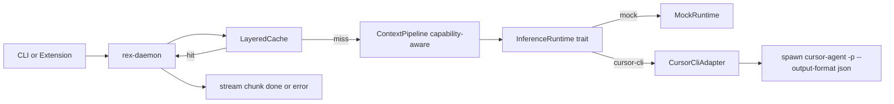

# REX Architecture

This document defines the long-term technical direction for REX.

## Purpose

- Centralize local AI inference in one daemon.
- Keep clients thin (CLI, editor, scripts).
- Expose one stable local protocol for all clients.

## Technology stack

| Topic | Decision |
|---|---|
| Primary platform | macOS on Apple Silicon |
| Runtime language | Rust |
| Protocol | gRPC |
| Transport | Unix Domain Socket (`/tmp/rex.sock`) |
| Inference direction | Apple MLX (post-MVP), mock engine in MVP |

## Thin client, thick server

| Concern | Thin client | REX daemon |
|---|---|---|
| UX rendering | Owns | Does not own |
| Model lifecycle | Does not own | Owns |
| Scheduling and policy | Does not own | Owns |
| Streaming contract | Consumes | Produces |

## Core components

### `rex-daemon`

- Host process for model lifecycle and inference orchestration.
- Enforce queueing, cancellation, and stream lifecycle.
- Apply machine-aware policy (memory, thermal, battery) as the project evolves.
- Manage plugin sidecar lifecycle in post-MVP phases.

### `rex-proto`

- Keep protobuf definitions in `proto/rex/v1`.
- Generate shared Rust types and gRPC stubs.
- Preserve backward compatibility in `rex.v1`.

### `rex-cli`

- Connect to daemon over UDS.
- Call status and streaming endpoints.
- Provide a deterministic interface for MVP validation.

## Inference adapters

The daemon does not hard-code a single inference engine. REX keeps prompt construction, context policy, **layered caching** (see `docs/CACHING.md`), and the streaming contract; inference backends are **pluggable adapters** behind a stable `InferenceRuntime` seam (contract details in `docs/ADAPTERS.md`).

| Adapter (examples) | Role |
|---|---|
| Mock | Default for MVP: deterministic stream without a real model. |
| Cursor CLI | **Frontier-model gateway** — use Cursor for account-bound models. Cursor runs its own agent loop; it is not a pass-through, so REX does not treat it as the only context or retrieval system. |
| Apple MLX (future) | Local model path; REX can drive context shaping and inference together. |

Adapters declare **capabilities** so the daemon can skip or apply pipeline stages (indexer, compressor, token budget, behavioral prefilter) per adapter. A future **gRPC sidecar** can implement the same `InferenceRuntime` contract without client changes.



## Plugin model (high level)

REX adopts a runtime-managed gRPC sidecar model for early plugin phases.

### Design summary

- Plugins run as separate OS processes (sidecars), not inside `rex-daemon`.
- Each sidecar exposes a gRPC server using the shared protobuf contract.
- `rex-daemon` launches, probes, monitors, and stops plugin processes.
- Plugin configuration declares runtime, version, and entrypoint.

### Why this model

| Factor | Runtime-managed sidecars |
|---|---|
| Plugin author experience | Fast onboarding with familiar language runtimes |
| Iteration speed | High; no compile-to-Wasm requirement |
| Isolation | Process boundary by default |
| Contract stability | Strong; gRPC + protobuf versioning |
| Operational cost | Higher runtime/dependency management burden |

### Operating boundaries

- Keep communication local through UDS by default.
- Limit supported runtimes in early phases to reduce complexity.
- Enforce health checks, startup timeouts, and explicit compatibility metadata.
- Treat plugin packaging and security hardening as phased work.

## Protocol contract (high level)

| RPC | Type | Purpose |
|---|---|---|
| `GetSystemStatus` | Unary | Return daemon metadata and health status. |
| `StreamInference` | Server streaming | Stream inference chunks to clients. |

## Data flow

1. Client receives a user action.
2. Client sends a gRPC request over UDS.
3. Daemon validates the request, applies optional **layered cache** lookup, and on miss runs a **capability-aware** context pipeline, then dispatches to the selected `InferenceRuntime` adapter.
4. The inference adapter (mock, Cursor CLI, MLX, or a future sidecar) produces chunks.
5. Daemon applies terminal stream semantics and streams chunks back to the client.
6. Client renders incremental output.

## Reliability rules

- Start with one socket owner and predictable lifecycle.
- Handle graceful shutdown and always remove stale socket files.
- Use bounded queues to prevent unbounded buffering.
- Return clear errors on startup, connection, and stream failures.

## Security rules

- Keep communication local through UDS by default.
- Use filesystem permissions to scope socket access.
- Keep remote listeners disabled unless a future spec enables them.

## Directory structure

Recommended structure for this phase:

```text
.
├── Cargo.toml
├── README.md
├── ARCHITECTURE.md
├── MVP_SPEC.md
├── docs/
│   ├── README.md
│   ├── ADAPTERS.md
│   ├── CACHING.md
│   └── DOCUMENTATION.md
├── proto/
│   └── rex/v1/rex.proto
└── crates/
    ├── rex-proto/
    ├── rex-daemon/
    │   └── src/
    │       ├── main.rs      # thin entrypoint
    │       ├── runtime.rs   # process lifecycle
    │       ├── service.rs   # gRPC handlers
    │       └── domain.rs    # core constants and pure helpers
    └── rex-cli/
        └── src/
            ├── main.rs      # thin entrypoint
            ├── runtime.rs   # command execution flow
            ├── command.rs   # parse and validate CLI commands
            ├── transport.rs # daemon connection boundary
            ├── error.rs     # typed error contracts
            └── domain.rs    # shared constants
```

## Non-goals in this document

- Full API schema details (see `MVP_SPEC.md` for current scope).
- Plugin model design details.
- Full adapter and caching field lists (see `docs/ADAPTERS.md` and `docs/CACHING.md`).
- Production hardening checklist for multi-user environments.
