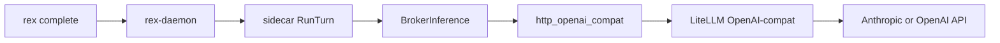

# Inference adapters

Pluggable backends behind **`InferenceRuntime`** (daemon `adapters` + `http_openai_compat` modules). The daemon remains **transport- and stream-authoritative**. Adapters emit **chunks** ending in a single **`done`** semantics or map failures to observable terminal errors ([MVP_SPEC.md](MVP_SPEC.md), NDJSON facade).

Product stance: **`rex-daemon` owns economics, policy, and brokering** ([ADR 0001](architecture/decisions/0001-daemon-owns-agent-orchestration-and-economics.md)); the **agent loop** runs in a **sidecar** ([MVP_SPEC.md](MVP_SPEC.md)). Adapters are **broker mechanisms** — they produce completion streams when the daemon fulfills a sidecar inference request (or in harness-only direct paths).

## Purpose

- **MVP broker backend:** OpenAI-compatible **HTTP** chat/completions (`http_openai_compat`).
- **Harness / legacy:** in-process **mock** and optional **Cursor CLI** subprocess — CI and migration; **not** MVP product acceptance without sidecar.
- Trace optimization levers: [CONTEXT_EFFICIENCY.md](CONTEXT_EFFICIENCY.md) · [CACHING.md](CACHING.md).
- **Multi-provider (Anthropic, OpenAI, local):** **default API** is OpenAI-compat toward **LiteLLM** — [INFERENCE_GATEWAY.md](INFERENCE_GATEWAY.md), [Multi-provider gateway via LiteLLM](#multi-provider-gateway-via-litellm-default-api); native Anthropic Messages API is **planned** — [Direct Anthropic Messages API](#direct-anthropic-messages-api-planned--secondary). Strategy: [ADR 0018](architecture/decisions/0018-gateway-first-multi-provider-inference.md), [ADR 0019](architecture/decisions/0019-inference-gateway-opt-in-litellm.md).

## Terminology: protocol vs vendor

Rex names adapters and config blocks after the **HTTP wire contract**, not the upstream **model vendor**.

| Name layer | What it means | Anthropic reachable? |
|------------|---------------|----------------------|
| `http_openai_compat` / `http-openai-compat` | Client speaks **OpenAI Chat Completions** (`POST …/chat/completions`, SSE `choices[].delta.content`) | **Yes**, when `base_url` points at an OpenAI-compat server (LiteLLM, Ollama, LM Studio, OpenAI API) |
| `inference.openai_compat` / `REX_OPENAI_COMPAT_*` | Configuration for that adapter (URL, key, model id on the wire) | **Yes** on the gateway path — `model` is whatever the compat server expects |
| Planned `anthropic` runtime | **Anthropic Messages API** (`POST /v1/messages`, different SSE events) | **Yes**, native second hop — not OpenAI-shaped |

**Rule:** *OpenAI-compat* = request shape; vendor is chosen by **`base_url`** and server-side routing (for example LiteLLM config).

## Adapter granularity (protocol vs vendor)

Rex adds **one `InferenceRuntime` per distinct HTTP contract**, not one per brand.

| Approach | When to use | Rex stance |
|----------|-------------|------------|
| **Protocol adapter** | Same wire (chat/completions) for Ollama, LiteLLM, OpenAI API | **`http_openai_compat`** today |
| **Vendor adapter** | Wire or features diverge (Messages API, vendor-only cache headers) | **`anthropic`** planned — secondary |
| **Per-brand duplicates** | Identical wire, different logos only | **Avoid** — duplicates SSE/HTTP and broker dispatch |

**LiteLLM** is a **gateway** on the OpenAI-compat surface, not a third protocol. A dedicated `litellm` runtime would still POST to `/v1/chat/completions` unless LiteLLM-specific headers are required later.

See [ADR 0018](architecture/decisions/0018-gateway-first-multi-provider-inference.md) for alternatives considered.

## `InferenceRequest` (design contract)

| Field | Purpose |
|---|---|
| `prompt` | User-visible task after optional pipeline rewriting. |
| `mode` | `ask`, `plan`, `agent` driving cacheability ([CACHING.md](CACHING.md)). |
| `model_hint` | Optional id from client; HTTP runtime uses env default when unset. |
| `trace_id` | Correlation across daemon, CLI, extension. |

**Invariant:** exactly **one terminal client-visible outcome** per `StreamInference` attempt.

## Streaming response shape

Chunks carry incremental `text`, monotonic `index`, terminating `done` chunk **or** gRPC/internal error surfaced as terminal **`error`** on the NDJSON CLI path.

## HTTP OpenAI-compatible chat/completions profile (broker)

Runtime id remains **`http-openai-compat`** (`REX_INFERENCE_RUNTIME`). Config keys remain **`REX_OPENAI_COMPAT_*`** / `inference.openai_compat` — they name the **protocol**, not OpenAI-the-vendor.

| Aspect | Policy |
|---|---|
| Runtime id | `http-openai-compat` (`REX_INFERENCE_RUNTIME`) |
| Endpoint | `POST {base}/chat/completions` with `stream: true` (SSE) |
| Configuration | [CONFIGURATION.md](CONFIGURATION.md) — `REX_OPENAI_COMPAT_*` |
| Context injection | **On** — daemon `ContextPipeline` may shape prompt before HTTP call |
| Cacheable modes | **`ask`** only (same as mock; **`agent`** never cached) |
| Timeouts | `REX_OPENAI_COMPAT_TIMEOUT_SECS` (default 120s) |

### Operator profiles (examples)

| Backend | Typical `REX_OPENAI_COMPAT_BASE_URL` | Notes |
|---------|--------------------------------------|-------|
| **LiteLLM (multi-provider)** | `http://127.0.0.1:4000/v1` (managed or external) | **Default API** for Anthropic + OpenAI + Ollama via gateway — [INFERENCE_GATEWAY.md](INFERENCE_GATEWAY.md) |
| Ollama (local) | `http://127.0.0.1:11434/v1` | Local OSS |
| LM Studio | `http://127.0.0.1:1234/v1` | Local OSS |
| OpenAI API (direct) | `https://api.openai.com/v1` (+ `REX_OPENAI_COMPAT_API_KEY`) | Secondary — same adapter, direct vendor URL |

### Verification

- Local: configure env, start daemon, `rex complete "hello" --format ndjson`.
- LiteLLM: see [CONFIGURATION.md](CONFIGURATION.md#operator-profile-litellm-anthropic-and-other-providers).
- Automated: `http_openai_compat` unit test with in-process TCP SSE stub; UDS e2e uses **`mock`** — [CI.md](CI.md).

## Multi-provider gateway via LiteLLM (default API)

**Status:** `accepted` (design) — [ADR 0019](architecture/decisions/0019-inference-gateway-opt-in-litellm.md). Hub: [INFERENCE_GATEWAY.md](INFERENCE_GATEWAY.md). Shipped `http_openai_compat` unchanged; gateway supervisor **planned**.

### Purpose

Use a single OpenAI-compat broker URL where **LiteLLM** holds provider keys (Anthropic, OpenAI, etc.), discovers **local Ollama models** on `/v1/models`, and routes by **`model`**. Rex keeps daemon-first policy; the sidecar still calls **`BrokerInference`** only.

### Scope

| In | Out |
|----|-----|
| Default API documentation; opt-in **managed** gateway (daemon spawn/stop/health) | Embedding LiteLLM inside `rex-daemon` |
| Env/JSON mapping, model hint → LiteLLM, secrets on gateway host | Gateway as `rex.sidecar.v1` plugin |
| Ollama auto-discovery via LiteLLM template | Replacing the sidecar agent loop |
| Broker error intent catalog (below) | Stable Rust error enums (until [ERROR_HANDLING.md](ERROR_HANDLING.md) exists) |

### Boundaries

- **Mechanism:** existing `http_openai_compat` ([ADR 0002](architecture/decisions/0002-inference-adapter-contract.md)).
- **Policy:** `ContextPipeline`, L1 cache, and mode gates unchanged ([ADR 0001](architecture/decisions/0001-daemon-owns-agent-orchestration-and-economics.md)).
- **Secrets:** Anthropic and OpenAI API keys live in **LiteLLM** configuration, not Rex `config.json` (optional LiteLLM master key via `REX_OPENAI_COMPAT_API_KEY`).

### Interfaces (intent)

| Setting | Example |
|---------|---------|
| `REX_OPENAI_COMPAT_BASE_URL` | `http://127.0.0.1:4000/v1` |
| `REX_OPENAI_COMPAT_API_KEY` | LiteLLM proxy key (if enabled) |
| `REX_OPENAI_COMPAT_MODEL` | LiteLLM model alias (for example Claude id configured in LiteLLM) |
| `rex complete --model` | Passes through to LiteLLM as the chat/completions `model` field |

JSON (R015 target): `inference.openai_compat` block — see [CONFIGURATION.md](CONFIGURATION.md#operator-profile-litellm-anthropic-and-other-providers).

### Operator flow

### Broker provider errors (intent)

Design catalog for `BrokerInferenceResponse.error` (implementation follow-up). Prefix with `provider_` for machine parsing.

| Condition | Intended `error` prefix | Operator action |
|-----------|-------------------------|-----------------|
| HTTP 401 / 403 | `provider_auth` | Fix LiteLLM or upstream API keys |
| HTTP 429 | `provider_rate_limit` | Back off; check LiteLLM quotas |
| HTTP 5xx / timeout | `provider_unavailable` | Check LiteLLM and upstream health |
| Unknown model (gateway body) | `provider_model` | Fix `REX_OPENAI_COMPAT_MODEL` / LiteLLM model map |

Fold into [ERROR_HANDLING.md](ERROR_HANDLING.md) when that hub is created ([ADR 0018](architecture/decisions/0018-gateway-first-multi-provider-inference.md)).

### Cross-links

- [CONFIGURATION.md](CONFIGURATION.md#operator-profile-litellm-anthropic-and-other-providers)
- [CONTEXT_EFFICIENCY.md](CONTEXT_EFFICIENCY.md) — LiteLLM gateway economics row
- [ADR 0018](architecture/decisions/0018-gateway-first-multi-provider-inference.md)
- [ADR 0004](architecture/decisions/0004-routing-daemon-first-optional-http-gateway.md)

## Direct Anthropic Messages API (planned — secondary)

**Status:** `planned` — not shipped. Roadmap: [ROADMAP.md](ROADMAP.md) (**Could**, Later).

### Purpose

Optional **native** Anthropic adapter when an OpenAI-compat gateway hop is undesirable (latency, regulated direct tenant, or Anthropic-only wire features).

### Scope

| In (design stage) | Out (design stage) |
|---|---|
| Runtime id `anthropic`, Messages API streaming → Rex chunk/`done` semantics | Replacing LiteLLM-primary operator path |
| `inference.anthropic` config block (intent) | Sidecar-held Anthropic SDK keys |
| Broker dispatch from `inference.runtime` (intent) | Mandatory native adapter for all installs |

### Boundaries

- **Mechanism:** new `InferenceRuntime` + broker path dispatch ([ADR 0002](architecture/decisions/0002-inference-adapter-contract.md)).
- **Wire:** `POST /v1/messages` with SSE (`message_delta` / `content_block_delta` events) — not chat/completions.
- **Today:** `broker_inference` is hardwired to `http_openai_compat`; native path requires provider dispatch (documented intent only).

### Interfaces (intent)

- Runtime id: `anthropic` on `REX_INFERENCE_RUNTIME`.
- Config: `inference.anthropic` — `base_url`, `api_key`, `model`, `timeout_secs`, optional `api_version` header.
- `AdapterCapabilities`: same as HTTP OpenAI-compat (`attach_context`, `truncate_prompt`, **`ask`**-only L1) unless Anthropic-specific limits are documented at implementation time.

### Cross-links

- [CACHING.md](CACHING.md#vendor-kv-and-prompt-cache-hints-planned) — Anthropic prompt-cache metadata on native adapter
- [CONTEXT_EFFICIENCY.md](CONTEXT_EFFICIENCY.md) — native Anthropic economics row
- [ADR 0018](architecture/decisions/0018-gateway-first-multi-provider-inference.md)

## Mock profile (test harness)

| Aspect | Policy |
|---|---|
| Runtime id | `mock` |
| Role | Deterministic chunks for CI, UDS e2e, extension fixtures — **not** the MVP product backend |
| Output | `mock: {prompt}` style text via `domain::build_mock_output` |

## Cursor CLI subprocess profile (legacy / non-MVP)

Optional subprocess via `REX_INFERENCE_RUNTIME=cursor-cli`. Not the REX agent product boundary. See [CONFIGURATION.md](CONFIGURATION.md) for `REX_CURSOR_CLI_*`.

CI exercises this path with a **`printf` stub** in `uds_e2e.rs`, not the real `cursor-agent` binary.

## `AdapterCapabilities` (implemented)

Rust struct in `crates/rex-daemon/src/adapters.rs`; passed into `ContextPipeline::prepare`.

| Field | HTTP / mock | Cursor CLI |
|---|---|---|
| `attach_context` | `true` — lexical `[context]` when indexer hits | `false` — no `[context]` suffix |
| `truncate_prompt` | `true` — token budget on user prompt | `false` — full prompt to subprocess |

| Capability (partial / planned) | Meaning |
|---|---|
| `native_tool_calling` | **Partial (R038 PR 1–2 Done):** daemon forwards OpenAI `tools[]` / `tool_choice`, parses SSE `delta.tool_calls`, Ollama `/api/show` probe; sidecar routes native `tool_calls` with interim fallback — [NATIVE_TOOL_CALLING.md](NATIVE_TOOL_CALLING.md). Operator E2E proof: **R038 PR 3**. Default broker profile for agent tools: **direct Ollama** (`http://127.0.0.1:11434/v1`); gateway opt-in. |
| `cacheable_modes` | Subset permitted for L1 (**`ask`** only today). |
| `max_prompt_tokens` / `max_context_tokens` | Optional per-adapter clamps beyond pipeline defaults. |
| `default_timeout` | Adapter-specific watchdog. |
| `supported_modes` | Early rejection of unsupported mode strings. |

## In-process adapter → optional gRPC drop-in

Same contract may run out-of-process per [PLUGIN_ROADMAP.md](PLUGIN_ROADMAP.md) — **`rex.v1` clients unchanged**.

## New adapter checklist

1. Declare capabilities + safe cache modes ([ADR 0003](architecture/decisions/0003-layered-cache-agent-mode-policy.md)).
2. Guarantee single terminal semantics.
3. Document env catalog in [CONFIGURATION.md](CONFIGURATION.md).
4. Add profile subsection here.
5. Update [PLUGIN_ROADMAP.md](PLUGIN_ROADMAP.md) if placement shifts.

## Local MLX path (planned)

**Status:** `planned` — not shipped. Roadmap: [ROADMAP.md](ROADMAP.md) (**Could**, Later horizon).

### Purpose

Optional **Apple MLX** (or similar local runtime) as an `InferenceRuntime` broker backend for on-device inference, increasing local-first leverage without embedding ML stacks in the daemon core.

### Scope

| In (design stage) | Out (design stage) |
|---|---|
| Adapter profile: capabilities, env catalog, streaming terminal semantics | Replacing sidecar agent loop ([MVP_SPEC.md](MVP_SPEC.md)) |
| Broker-only invocation from daemon (same as HTTP OpenAI-compat) | Default Mac product path (HTTP broker remains primary) |
| CI harness with mock/stub, not live MLX on every PR | |

### Boundaries

- **Mechanism:** new adapter implementing `InferenceRuntime` ([ADR 0002](architecture/decisions/0002-inference-adapter-contract.md)).
- **Policy:** routing, cache, and mode gates stay in daemon ([ADR 0001](architecture/decisions/0001-daemon-owns-agent-orchestration-and-economics.md)).
- Sidecar may host exotic ML codecs per [PLUGIN_ROADMAP.md](PLUGIN_ROADMAP.md); MLX adapter is **in-daemon broker** unless a future ADR moves it.

### Interfaces (intent)

- Runtime id (for example `mlx`) on `REX_INFERENCE_RUNTIME`.
- Env catalog TBD (model path, device) — documented in [CONFIGURATION.md](CONFIGURATION.md) when scheduled.
- `AdapterCapabilities`: full context pipeline (budget, indexer, compressor) per [CONTEXT_EFFICIENCY.md](CONTEXT_EFFICIENCY.md).

### Cross-links

- [ROADMAP.md](ROADMAP.md) — **Could** row
- [CONTEXT_EFFICIENCY.md](CONTEXT_EFFICIENCY.md) — economics matrix row
- [MVP_SPEC.md](MVP_SPEC.md) — explicit v1.0 non-promise

## Related

- [ARCHITECTURE.md](ARCHITECTURE.md)
- [MVP_SPEC.md](MVP_SPEC.md)
- [CACHING.md](CACHING.md)
- [CONTEXT_EFFICIENCY.md](CONTEXT_EFFICIENCY.md)
- [CONFIGURATION.md](CONFIGURATION.md)
- [ADR 0018](architecture/decisions/0018-gateway-first-multi-provider-inference.md) — gateway-first multi-provider strategy
