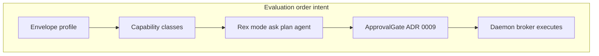

# Agent environment access policy (design hub)

Canonical **architecture-level** design for how Rex constrains **agent workloads** (especially development agents that run shell commands). **Not shipped** as a full capability broker until implementation lands; aligns with [ADR 0008](architecture/decisions/0008-dedicated-sidecar-control-plane-api.md) and [ADR 0009](architecture/decisions/0009-centralized-agent-approvals-and-checkpoints.md).

## Product stance

| Topic | Decision |
|-------|----------|
| **Mac-first dev agents** | **No** VM or container envelope as the default local path. |
| **Default envelope** | Supervised **`sandboxed_process`** (separate OS process + optional OS sandbox). |
| **Host reach** | **Brokered** through `rex-daemon` — no ambient filesystem or network in the guest. |
| **Strong VM/container isolation** | **Deferred** — server/Linux exploration only; see [AGENT_RUNTIME_ENVIRONMENT.md](AGENT_RUNTIME_ENVIRONMENT.md) deferred catalog. |

## Policy layers

| Layer | Owns |
|-------|------|
| **Envelope** | Process boundary, optional OS sandbox, resource caps. |
| **Capabilities** | What the guest may **request** (`fs.read`, `fs.write`, `exec.shell`, `net.fetch`). |
| **Mode** | Extension UX contract — [EXTENSION.md](EXTENSION.md). |
| **Approvals** | Daemon `ApprovalGate` for `agent` mode — [ADR 0009](architecture/decisions/0009-centralized-agent-approvals-and-checkpoints.md). |
| **Broker** | Daemon authorizes, executes, meters, logs — [ADR 0008](architecture/decisions/0008-dedicated-sidecar-control-plane-api.md). |

Trust model: sidecar **requests**; daemon **does not obey blind commands**. Anti-patterns (generic proxy, ambient `exec`) are listed in ADR 0008 — link there, do not duplicate the full table.

## Envelope profiles

| Profile | Isolation | Typical use |
|---------|-----------|-------------|
| **`sandboxed_process`** | Separate process + OS sandbox (Seatbelt / Landlock-class) | **Default target** for local dev agents. |
| **`process`** | Separate process, minimal extra sandbox | Prototyping, trusted plugins. |
| **`container` / `vm`** | Stronger boundary | **Not** Mac-first default; parked for server/fleet. |

## Capability classes (default-deny network)

| Capability | Default for dev `agent` mode | Notes |
|------------|------------------------------|-------|
| **`fs.read`** | Workspace + declared readonly roots | Broader read may prompt or deny. |
| **`fs.write`** | Workspace only | Protected paths always deny write. |
| **`exec.shell`** | Workspace `cwd`, bounded timeout/output | Host tools via broker so guest stays sandboxed. |
| **`net.fetch`** | **Deny** until policy grants | Allowlist domains when enabled. |

### Protected paths (deny write; read often restricted)

- `.git/config`, `.git/hooks/**`
- `**/.env`, `**/*.pem`, `**/*.key`
- `~/.ssh/**` (and similar credential stores)

## Development-agent usability

Isolation **must not** block normal repo workflows. The broker enables:

- `git`, `cargo`, `npm`, test runners under **workspace policy**
- Network only when operator or session policy allows (package registries)

If a capability is missing, the fix is a **scoped broker verb**, not punching a VM hole or granting ambient host access.

## Memory and sessions

| Kind | Owner |
|------|--------|
| **Chat transcript (UX)** | Extension / client |
| **Session scratch** | Sidecar process (ephemeral) |
| **Project memory (durable)** | `rex-daemon` when implemented — [LONG_TERM_MEMORY.md](LONG_TERM_MEMORY.md) |

Multi-agent work on one repo: **shared** facts and locks on the daemon; per-agent scratch in each sidecar.

## Related

- [SIDECAR_RUNTIME.md](SIDECAR_RUNTIME.md) — spawn, API, transport.
- [POLICY_ENGINE.md](POLICY_ENGINE.md) — daemon policy pipeline.
- [PLUGIN_ROADMAP.md](PLUGIN_ROADMAP.md) — phasing.
- [PURPOSE_AND_PRINCIPLES.md](PURPOSE_AND_PRINCIPLES.md) · [ARCHITECTURE_GUIDELINES.md](ARCHITECTURE_GUIDELINES.md)
