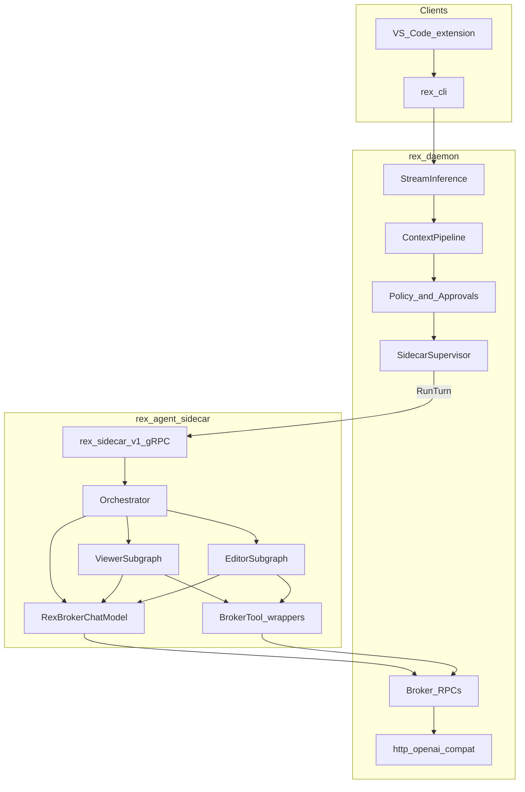

# Product agent delivery

**Status: Should program complete — `rex-agent` shipped; harness default unchanged.** **`rex-agent`** implements LangGraph ReAct with broker-only LLM and tools (**R018**). CI and harness still default to **`rex-sidecar-stub`**. Operator settings use **JSON config** ([CONFIGURATION.md](CONFIGURATION.md)). **Could** follow-ups only: **R016**, **R033**, **R036**, **R056**, **R055** — see [PRIORITIZATION.md](PRIORITIZATION.md#current-focus-queue-audit-2026-06-09).

**Current focus shifted** to LangFuse observability (**RC-LF1**, **RC-S6** Met) — [LANGFUSE_INTEGRATION.md](LANGFUSE_INTEGRATION.md), [LANGFUSE_DISCOVERY_ROADMAP.md](LANGFUSE_DISCOVERY_ROADMAP.md), [ECONOMICS_VALIDATION.md](ECONOMICS_VALIDATION.md).

## Problem

[MVP_SPEC.md](MVP_SPEC.md) describes a **basic development agent** whose reasoning lives in a daemon-supervised sidecar. v1.0 **RC-*** are **Met** on platform + **`rex-sidecar-stub`**, which uses one `BrokerInference` call and `__rex_*` prompt directives—not a product tool loop.

## Target architecture

**Shipped (**R018**):** monolithic LangGraph ReAct loop. **Target:** Orchestrator + **Viewer** + **Editor** subgraphs with `RexBrokerChatModel` and intra-turn compaction — canonical design [AGENT_GRAPH_ARCHITECTURE.md](AGENT_GRAPH_ARCHITECTURE.md), [ADR 0022](architecture/decisions/0022-viewer-editor-subagent-topology.md).



| Layer | Owns |
|-------|------|
| Extension / CLI | UX, NDJSON, approvals |
| Daemon | Context injection, policy, stream contract, HTTP to LLM, host execution |
| Python sidecar | Graph state, subagent routing, tool-loop logic, streaming text to daemon |
| LangGraph | Subgraph structure (Orchestrator/Viewer/Editor target), iteration limits |

**Capability contracts** (what the daemon assembles vs what the sidecar owns): [DEVELOPMENT_ASSISTANCE_CAPABILITIES.md](DEVELOPMENT_ASSISTANCE_CAPABILITIES.md) and [sidecars/rex-agent/DESIGN.md](../sidecars/rex-agent/DESIGN.md).

## Product agent (`rex-agent`)

| Item | Planned shape |
|------|----------------|
| Location | `sidecars/rex-agent/` in monorepo — [DESIGN.md](../sidecars/rex-agent/DESIGN.md) |
| Binary name | **`rex-agent`** (LangGraph is internal only) |
| LLM | **Broker-only** — `BrokerInference` via daemon; no direct OpenAI keys in sidecar |
| Tools | Broker RPCs: `fs.read`, `fs.list`, `fs.write`, `exec.shell` (mode-gated) |
| Modes | `ask` (no tools), `plan` (read/list), `agent` (read/list/write/exec) |
| Harness | **`rex-sidecar-stub`** stays for CI; switch via config or `REX_SIDECAR_*` |
| Python lint | **R025** — Ruff on `rex-agent` in CI — **Done** — [CI_QUALITY_GATES.md](CI_QUALITY_GATES.md) |

### One `RunTurn` flow (target)

1. Daemon calls `RunTurn(prompt, mode, model?)` with context-enriched prompt.
2. Sidecar selects graph by `mode`.
3. Graph runs: LLM → optional tools → LLM until no tool calls or `max_iterations`.
4. Sidecar streams `RunTurnChunk` to daemon; daemon passthrough to `rex.v1` clients.

## Platform enablers (R013)

**Status: implemented.** Additive proto and daemon changes before agent dogfood:

| Change | Why |
|--------|-----|
| **`BrokerListDir`** on `rex.v1` | Agent must explore workspace; `fs.read` alone is insufficient |
| **`RunTurnRequest.model`** | Extension `--model` should reach broker inference |
| **Sidecar stream passthrough** | Long graph runs need incremental chunks, not full-turn buffer |

## Unified CLI (R014)

**Status: implemented.** One **`rex`** binary replaces separate **`rex-cli`** and **`rex-daemon`** entrypoints for operators and the extension:

| Subcommand | Purpose |
|------------|---------|
| `rex daemon` | Run daemon (was `rex-daemon`) |
| `rex status` / `rex complete` | Client RPCs (was `rex-cli`) |
| `rex config` | `init`, `show`, `path`, `validate` |
| `rex proto` | `doctor`, `install`, `path` |
| `rex sidecar` | `list`, `init`, `doctor` |

Extension defaults: **`rex`** + `["daemon"]` for auto-start. Compatibility shims **`rex-cli`** / **`rex-daemon`** delegate to the same libraries with deprecation hints.

## JSON configuration (R015)

**Status: implemented.** Precedence (low → high): defaults → `$REX_ROOT/config.json` → `.rex/config.json` → CLI flags on `rex complete`.

Layout root: **`REX_ROOT`** (default `~/.rex`). Bootstrap with `rex config init`.

### Minimal example (illustrative)

```json
{
  "version": 1,
  "daemon": { "socket": "/tmp/rex.sock" },
  "sidecars": {
    "active": "agent",
    "required": true,
    "list": [
      { "name": "agent", "binary": "rex-agent", "enabled": true },
      { "name": "stub", "binary": "rex-sidecar-stub", "enabled": false }
    ]
  },
  "inference": {
    "openai_compat": {
      "base_url": "http://127.0.0.1:11434/v1",
      "model": "llama3.2"
    }
  },
  "workspace": { "root": "." },
  "agent": { "max_tool_steps": 12 }
}
```

### Proto layout (language-neutral)

```
$REX_ROOT/
  config.json
  proto/
    src/               # canonical .proto sources (repo also ships proto/)
    gen/               # flat generated stubs — path from `rex proto path`
```

- Generated stubs live at **`$REX_ROOT/proto/gen`** (flat layout; no per-sidecar `proto.python_gen_path`).
- **`rex proto install`** materializes stubs when `.proto` changes; use **`rex proto path`** to print the gen directory.

## Daemon prerequisites (R020–R022)

Prerequisites for **`rex-agent`** dogfood (**R017–R018** Done). Design: [DEVELOPMENT_ASSISTANCE_CAPABILITIES.md](DEVELOPMENT_ASSISTANCE_CAPABILITIES.md).

### R020 — Broker access policy completion

**Status: Done.** Completes [ADR 0013](architecture/decisions/0013-access-policy-broker-completion.md) after **R012** (RC-05 read/list protected paths).

| Outcome | Notes |
|---------|--------|
| Mode × capability matrix on all broker RPCs | `ask`/`plan` deny `fs.write` and `exec.shell` |
| Protected-path checks on `fs.write` / `exec.shell` | Same class as read/list |
| `max_tool_result_bytes` from JSON config | Align broker truncation with sidecar scratch (**T5**) |
| Structured deny + `broker.access_policy=` logs | Per capability |

### R021 — Turn correlation Phase 1b

**Status: Done.** Populate optional `turn_id` and `context_revision` on `RunTurn` ([sidecar.proto](../proto/rex/sidecar/v1/sidecar.proto)); correlate logs on stream and broker paths (`turn_id=`, `context_revision=`). C1 hook strips extension `File:`/`Selection:` trailers when retrieval runs. Sidecars forward `x-rex-turn-id` on broker metadata.

### R022 — Workspace binding (daemon)

**Status: Done.** Product path: fail-closed when `workspace.root` unset ([ADR 0011](architecture/decisions/0011-workspace-binding-and-turn-context-authority.md)); harness cwd fallback via `workspace.allow_cwd_fallback` or `REX_ALLOW_CWD_WORKSPACE` in [CONFIGURATION.md](CONFIGURATION.md). Extension supplies root under **R019**.

## R019 — Integration and E2E acceptance

**Status: Done.** Extension workspace binding, `client_hints` on CLI/daemon wire, operator checklist in [EXTENSION_LOCAL_E2E.md](EXTENSION_LOCAL_E2E.md#8-r019-acceptance--live-model-operator-not-ci), and extension operator alignment with **`rex-agent`** (JSON setup hints, default agent workspace overlay, NDJSON **`tool`**/**`step`** cards).

**Known gap:** none — plan-mode native tool loop on direct Ollama is covered by **`./scripts/verify_native_tools_live.sh`** ([NATIVE_TOOL_CALLING.md](NATIVE_TOOL_CALLING.md), [EXTENSION_LOCAL_E2E.md](EXTENSION_LOCAL_E2E.md) §8a). CI/stub paths still use interim JSON.

**Follow-up:** opt-in automated live Ollama smoke (`ask` + brokered read/policy) — **R039** — [ECONOMICS_VALIDATION.md](ECONOMICS_VALIDATION.md). Plan-mode tool-loop E2E is **R038** (separate track).

| Criterion | Evidence |
|-----------|----------|
| Extension sets `workspace.root` when auto-starting daemon | Primary `workspaceFolders[0]` |
| Extension workspace bind merges **`rex-agent`** + approvals | [extensions/rex-vscode/src/workspace/binding.ts](../extensions/rex-vscode/src/workspace/binding.ts); `rex config init` operator template |
| **C1:** thin `client_hints`; reduce duplicate selection-in-prompt | Document interim double-count until migrated |
| [EXTENSION_LOCAL_E2E.md](EXTENSION_LOCAL_E2E.md) with **live model** (not stub echo) | `ask`, `plan`, `agent` modes |
| Optional: refresh [MVP_SPEC.md](MVP_SPEC.md) stub vs product table | When product agent is proven |

## Multi-active sidecars (R016 — open decision, **Could**)

Roadmap target: **`sidecars.active[]`** with daemon **broadcast** of `RunTurn`. Only one process can bind a UDS path today—implementation options (derived socket per name vs future multiplexer) stay **undecided** until R016. **Defer until single-active host `rex-agent` is proven** ([ROADMAP.md](ROADMAP.md) — **Could**).

**Near-term multi-process path:** **R056** capability sidecar fleet (host + N feature sidecars) — [CAPABILITY_SIDECARS.md](CAPABILITY_SIDECARS.md). Does not broadcast prompts to multiple agents.

## Implementation order

**Should track Done.** Global priority queue: [ROADMAP.md — Next — prioritized queue](ROADMAP.md#next--prioritized-queue-audit-2026-06-09) · [PRIORITIZATION.md](PRIORITIZATION.md#current-focus-queue-audit-2026-06-09).

| ID | Theme | Priority |
|----|-------|----------|
| R013 | Platform enablers | Done |
| R014 | Unified `rex` CLI | Done |
| R015 | JSON config + proto install | Done |
| R020 | Broker access policy completion | Done |
| R021 | Turn correlation Phase 1b | Done |
| R022 | Workspace binding (daemon fail-closed) | Done |
| R017 | `rex-agent` scaffold | Done |
| R018 | LangGraph agent core | Done |
| R019 | Integration / E2E | Done |
| **R027** | Broker baseline hardening | **Done** |
| **R028** | Viewer/Editor subagents | **Done** |
| **R029** | Intra-turn state compaction | **Done** |
| **R034** | Raw delimited tool results | **Done** |
| **R037** | Plan mode planning tools | Done |
| **R030** | Diff-only writes | **Done** |
| **R031** | Task-aware read pruning | **Done** |
| **R032** | Token playbook + subagent metrics | **Done** |
| **R038** | Native broker tool calling | **Done** |
| **R044** | Operation feedback (live stream, ask research, CLI approval parity) | **Done** — [OPERATION_FEEDBACK.md](OPERATION_FEEDBACK.md) |
| **R057** | Parallel read-only tool batching (cross-mode) | **Done** — [AGENT_GRAPH_ARCHITECTURE.md](AGENT_GRAPH_ARCHITECTURE.md) |
| **R058** | Per-mode step caps + generic mode prompts | **Done** |
| **R059** | `workspace.search` broker tool | Open |
| **R060** | Deterministic ask init + loop circuit breaker | **Open** — [AGENT_GRAPH_ARCHITECTURE.md](AGENT_GRAPH_ARCHITECTURE.md#loop-optimization-r060r065) |
| **R061** | Exact-match tool cache | **Done** |
| **R062** | Prefix-safe compaction config | **Done** |
| **R063** | Soft cap Continue UX | **Done** |
| **R064** | Loop observability + golden prompts | **Done** |
| **R065** | Injected files manifest | **Done** |
| R016 | Multi-active broadcast | **Could** — rank **18** |
| **R036** | TRON static schema compression | **Could** — rank **16** |
| **R033** | MCP gRPC client | **Could** — rank **17** |

**Follow-up (observability, not agent program):** **R039** live smoke — [ECONOMICS_VALIDATION.md](ECONOMICS_VALIDATION.md).

## R038 — Native broker tool calling

**Status:** **Done** (**Should**). Hub: [NATIVE_TOOL_CALLING.md](NATIVE_TOOL_CALLING.md).

| Slice | Status |
|-------|--------|
| PR 1 — proto + daemon HTTP + `native_tools` | **Done** |
| PR 2 — sidecar native path + JSON fallback | **Done** |
| PR 3 — operator E2E script | **Done** — `./scripts/verify_native_tools_live.sh` |

**R033** rescoped to MCP gRPC client only (**Could**).

## Out of scope (this program)

- MCP catalog, multi-plugin fleets, Wasm sidecars
- Cross-turn checkpoint DB (Postgres/SQLite checkpointer)
- LangSmith Deployment / K8s as Rex substitute
- Rust rewrite of product agent

## Related

- [NATIVE_TOOL_CALLING.md](NATIVE_TOOL_CALLING.md) — **R038** native broker tool calling
- [AGENT_GRAPH_ARCHITECTURE.md](AGENT_GRAPH_ARCHITECTURE.md) — token-efficient graph target (**R027–R038**)
- [ADR 0023](architecture/decisions/0023-hybrid-agent-serialization-boundaries.md) — hybrid serialization boundaries
- [MVP_SPEC.md](MVP_SPEC.md) — Phase 1 architecture
- [SIDECAR_RUNTIME.md](SIDECAR_RUNTIME.md) — sidecar runtime hub
- [CONFIGURATION.md](CONFIGURATION.md) — settings policy
- [PLUGIN_ROADMAP.md](PLUGIN_ROADMAP.md) — plugin platform
- [ADR 0005](architecture/decisions/0005-rex-owns-sidecar-environment-not-agent-implementations.md) · [ADR 0008](architecture/decisions/0008-dedicated-sidecar-control-plane-api.md)
