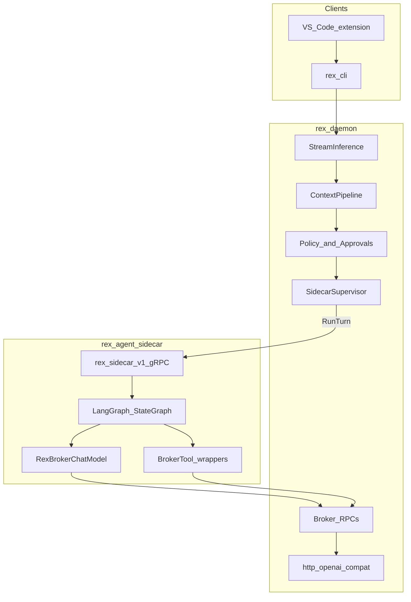

# Product agent delivery (planned)

**Status: planned — not shipped.** Today the supervised sidecar is **`rex-sidecar-stub`** (harness). Operator settings are **environment variables** only ([CONFIGURATION.md](CONFIGURATION.md)). Implementation order: [ROADMAP.md](ROADMAP.md) **R013–R019**.

## Problem

[MVP_SPEC.md](MVP_SPEC.md) describes a **basic development agent** whose reasoning lives in a daemon-supervised sidecar. v1.0 **RC-*** are **Met** on platform + **`rex-sidecar-stub`**, which uses one `BrokerInference` call and `__rex_*` prompt directives—not a product tool loop.

## Target architecture



| Layer | Owns |
|-------|------|
| Extension / CLI | UX, NDJSON, approvals |
| Daemon | Context injection, policy, stream contract, HTTP to LLM, host execution |
| Python sidecar | Graph state, mode routing, tool-loop logic, streaming text to daemon |
| LangGraph | Graph structure, iteration limits (implementation detail) |

## Product agent (`rex-agent`)

| Item | Planned shape |
|------|----------------|
| Location | `sidecars/rex-agent/` in monorepo |
| Binary name | **`rex-agent`** (LangGraph is internal only) |
| LLM | **Broker-only** — `BrokerInference` via daemon; no direct OpenAI keys in sidecar |
| Tools | Broker RPCs: `fs.read`, `fs.list`, `fs.write`, `exec.shell` (mode-gated) |
| Modes | `ask` (no tools), `plan` (read/list), `agent` (read/list/write/exec) |
| Harness | **`rex-sidecar-stub`** stays for CI; switch via config or `REX_SIDECAR_*` |

### One `RunTurn` flow (target)

1. Daemon calls `RunTurn(prompt, mode, model?)` with context-enriched prompt.
2. Sidecar selects graph by `mode`.
3. Graph runs: LLM → optional tools → LLM until no tool calls or `max_iterations`.
4. Sidecar streams `RunTurnChunk` to daemon; daemon passthrough to `rex.v1` clients.

## Platform enablers (R013)

Additive proto and daemon changes before agent dogfood:

| Change | Why |
|--------|-----|
| **`BrokerListDir`** on `rex.v1` | Agent must explore workspace; `fs.read` alone is insufficient |
| **`RunTurnRequest.model`** | Extension `--model` should reach broker inference |
| **Sidecar stream passthrough** | Long graph runs need incremental chunks, not full-turn buffer |

## Unified CLI (R014)

Replace separate **`rex-cli`** and **`rex-daemon`** binaries with one **`rex`** binary:

| Subcommand | Purpose |
|------------|---------|
| `rex daemon` | Run daemon (today: `rex-daemon`) |
| `rex status` / `rex complete` | Client RPCs (today: `rex-cli`) |
| `rex config` | `init`, `show`, `path`, `validate` |
| `rex proto` | `install`, `path`, `doctor` |
| `rex sidecar` | `list`, `init`, `doctor` |

Extension defaults move to **`rex`** + `["daemon"]` for auto-start when implemented.

## JSON configuration (R015)

**Target precedence** (low → high): defaults → `$REX_HOME/config.json` → `.rex/config.json` → **environment (CI override)** → CLI flags.

### Minimal example (illustrative)

```json
{
  "version": 1,
  "daemon": { "socket": "/tmp/rex.sock" },
  "sidecars": {
    "active": "agent",
    "required": true,
    "list": [
      { "name": "agent", "binary": "rex-agent", "enabled": true },
      { "name": "stub", "binary": "rex-sidecar-stub", "enabled": false }
    ]
  },
  "proto": { "gen_root": "~/.rex/proto/gen" },
  "inference": {
    "openai_compat": {
      "base_url": "http://127.0.0.1:11434/v1",
      "model": "llama3.2"
    }
  },
  "workspace": { "root": "." },
  "agent": { "max_tool_steps": 8 }
}
```

### Proto layout (language-neutral)

```
$REX_HOME/
  config.json
  proto/
    src/
    gen/
      python/          # {gen_root}/python — all Python sidecars share this path
```

- **`proto.gen_root`** only in config — not `proto.python_gen_path` per sidecar.
- **`rex proto install`** materializes stubs + updates config (maintainers run `rex proto generate` when `.proto` changes).

## Multi-active sidecars (R016 — open decision)

Roadmap target: **`sidecars.active[]`** with daemon **broadcast** of `RunTurn`. Only one process can bind a UDS path today—implementation options (derived socket per name vs future multiplexer) stay **undecided** until R016.

## Implementation order

See [ROADMAP.md — Next — product agent program](ROADMAP.md#next--product-agent-program).

| ID | Theme |
|----|-------|
| R013 | Platform enablers |
| R014 | Unified `rex` CLI |
| R015 | JSON config + proto install |
| R016 | Multi-active broadcast |
| R017 | `rex-agent` scaffold |
| R018 | LangGraph agent core |
| R019 | Integration / E2E |

## Out of scope (this program)

- MCP catalog, multi-plugin fleets, Wasm sidecars
- Cross-turn checkpoint DB (Postgres/SQLite checkpointer)
- LangSmith Deployment / K8s as Rex substitute
- Rust rewrite of product agent
- Bumping v1.0 **RC-*** until agent is proven (R019)

## Related

- [MVP_SPEC.md](MVP_SPEC.md) — Phase 1 architecture
- [SIDECAR_RUNTIME.md](SIDECAR_RUNTIME.md) — sidecar runtime hub
- [CONFIGURATION.md](CONFIGURATION.md) — settings policy
- [PLUGIN_ROADMAP.md](PLUGIN_ROADMAP.md) — plugin platform
- [ADR 0005](architecture/decisions/0005-rex-owns-sidecar-environment-not-agent-implementations.md) · [ADR 0008](architecture/decisions/0008-dedicated-sidecar-control-plane-api.md)
