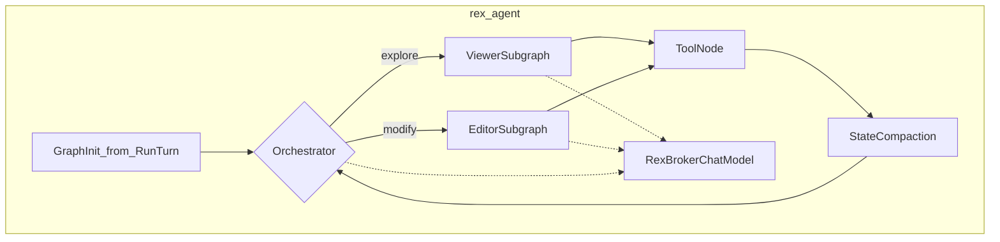

# Agent graph architecture (token-efficient sidecar)

## Purpose

Define the **target** LangGraph topology for `rex-agent`: Orchestrator plus **Viewer** and **Editor** subgraphs, broker-only inference, intra-turn scratch compaction, and diff-only writes. Shipped **R018** remains a monolithic ReAct loop until **R027–R032** land incrementally.

Aligns with [PURPOSE_AND_PRINCIPLES.md](PURPOSE_AND_PRINCIPLES.md): sidecar requests, daemon authorizes and executes ([ADR 0008](architecture/decisions/0008-dedicated-sidecar-control-plane-api.md)).

## Status

**Design accepted** — implementation phased **R027–R033** on [ROADMAP.md](ROADMAP.md#next--product-agent-program). Subagent topology: [ADR 0022](architecture/decisions/0022-viewer-editor-subagent-topology.md).

## Scope

**In:**

- Sidecar graph state, JSON tool protocol (`tool` / `args` / `final`), streaming UX, intra-turn token controls.
- Sidecar-local unified diff application before `BrokerWriteFile` (no proto change).
- Subagent transition logging for daemon stage correlation.

**Out:**

- Daemon `ContextPipeline` / lexical retrieval ([CONTEXT_EFFICIENCY.md](CONTEXT_EFFICIENCY.md)).
- Cross-turn checkpoint DB, LangSmith, Rust agent rewrite ([AGENT_DELIVERY_ROADMAP.md](AGENT_DELIVERY_ROADMAP.md)).
- Extension UX contract changes.
- Full MCP client (**R033**, [ADR 0016](architecture/decisions/0016-mcp-in-sidecar-envelope.md)).

## Boundaries

| Layer | Owns |
|-------|------|
| Daemon | `RunTurn.prompt`, policy, broker RPC, stream contract |
| Sidecar | Graph routing, scratch messages, parse recovery, diff patch, tool-loop caps |
| LangGraph | Subgraph wiring, iteration limits (implementation detail) |

`RunTurn.prompt` stays authoritative per turn ([DEVELOPMENT_ASSISTANCE_CAPABILITIES.md](DEVELOPMENT_ASSISTANCE_CAPABILITIES.md) **C3**); intra-turn scratch is ephemeral sidecar state.

## Interfaces (intent)

**AgentState** (evolving):

- `daemon_context` — immutable prefix from `RunTurn.prompt`
- `messages` — LangChain list with `add_messages` / `RemoveMessage`
- `mode`, `model`, `turn_id`
- `active_subagent` — `orchestrator` | `viewer` | `editor`
- `viewer_summary` — compact exploration artifact for Editor
- `tool_steps`, `tool_error_count`, `max_steps`
- `truncation_events` — broker `max_tool_result_bytes` hits

**JSON protocol** (Rex field names, backward compatible):

- Tool: `{"type":"tool","tool":"fs.read","args":{"path":"..."}}`
- Final: `{"type":"final","answer":"..."}`
- Diff write: `{"type":"tool","tool":"fs.write","args":{"path":"...","diff":"..."}}` — sidecar read→patch→full content→broker

**RexBrokerChatModel** (**R027**): `BaseChatModel` over `BrokerInference`; static prefix first (system, daemon context, tool schemas), volatile suffix last; stream buffer strips `{"type":"tool"` prefix; up to **3** parse retries via synthetic errors.

## Token budget playbook

| Rule | Milestone |
|------|-----------|
| Static prefix before volatile tool results (cache-friendly) | R027 |
| Dynamic tool disclosure: ask=none, plan=read/list, agent=all | R027, R032 |
| 25% suffix compaction trigger vs broker result budget | R029 |
| Viewer isolation — Editor without raw read dumps | R028 |
| Unified diff for edits; reject whole-file rewrite >50 lines | R030 |
| Read dedup + default `max_tool_steps=12` | R032 |
| Goal-hint pruning when read >100 lines (config-gated) | R031 (Could) |

## Target topology

## Phased milestones

| ID | Theme | MoSCoW |
|----|-------|--------|
| R027 | Broker baseline hardening | Should |
| R028 | Viewer/Editor subagents | Should |
| R029 | Intra-turn state compaction | Should |
| R030 | Diff-only writes | Should |
| R031 | Task-aware read pruning | Could |
| R032 | Token playbook + metrics | Should |
| R033 | Native tools + MCP client | Could |

Order: R027 → R028 → R029 → R030 → R032; R031 after R029 if needed; R033 Phase 2.

## Cross-links

- [AGENT_DELIVERY_ROADMAP.md](AGENT_DELIVERY_ROADMAP.md) — program table and target diagram
- [sidecars/rex-agent/DESIGN.md](../sidecars/rex-agent/DESIGN.md) — sidecar implementation notes
- [CONTEXT_EFFICIENCY.md](CONTEXT_EFFICIENCY.md) — economics matrix rows
- [CONFIGURATION.md](CONFIGURATION.md) — `agent.*` keys

## Bibliography

- SWE-Edit / patch-based code editing patterns (industry)
- SWE-Pruner — task-aware context pruning
- Prompt caching evaluation — static-prefix ordering
- LangGraph multi-agent and `RemoveMessage` compaction patterns
