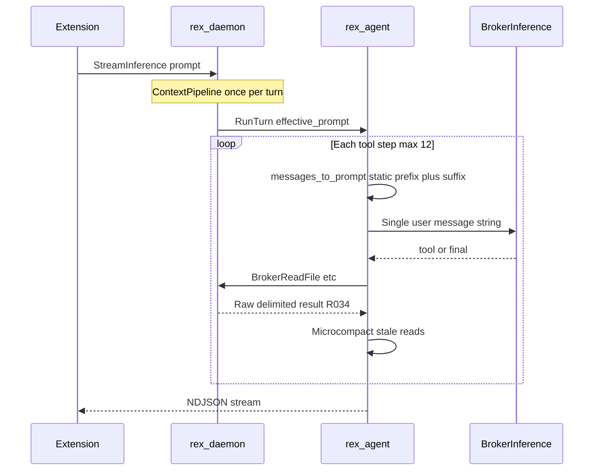
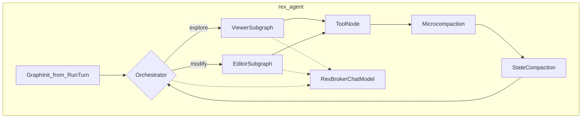

# Agent graph architecture (token-efficient sidecar)

## Purpose

Define the **target** LangGraph topology for `rex-agent`: Orchestrator plus **Viewer** and **Editor** subgraphs, broker-only inference, intra-turn scratch compaction, and diff-only writes. Shipped **R018** remains a monolithic ReAct loop until **R027–R033** land incrementally.

Aligns with [PURPOSE_AND_PRINCIPLES.md](PURPOSE_AND_PRINCIPLES.md): sidecar requests, daemon authorizes and executes ([ADR 0008](architecture/decisions/0008-dedicated-sidecar-control-plane-api.md)).

## Status

**Design accepted** — implementation phased **R027–R036** on [ROADMAP.md](ROADMAP.md#next--product-agent-program). Serialization boundaries: [ADR 0023](architecture/decisions/0023-hybrid-agent-serialization-boundaries.md). Subagent topology: [ADR 0022](architecture/decisions/0022-viewer-editor-subagent-topology.md).

## Scope

**In:**

- Sidecar graph state, JSON tool protocol (`tool` / `args` / `final`), streaming UX, intra-turn token controls.
- Sidecar-local unified diff application before `BrokerWriteFile` (no proto change).
- Subagent transition logging for daemon stage correlation.
- Hybrid wire formats per [ADR 0023](architecture/decisions/0023-hybrid-agent-serialization-boundaries.md) (**R034**, **R036**).

**Out:**

- Daemon `ContextPipeline` / lexical retrieval ([CONTEXT_EFFICIENCY.md](CONTEXT_EFFICIENCY.md)).
- Cross-turn checkpoint DB, LangSmith, Rust agent rewrite ([AGENT_DELIVERY_ROADMAP.md](AGENT_DELIVERY_ROADMAP.md)).
- Extension UX contract changes (unless open question Q3 resolves).
- Full MCP client (**R033**, [ADR 0016](architecture/decisions/0016-mcp-in-sidecar-envelope.md)) — follows **R038** native broker tools.

## Boundaries

| Layer | Owns |
|-------|------|
| Daemon | `RunTurn.prompt`, policy, broker RPC, stream contract, tool result shaping (**R034**) |
| Sidecar | Graph routing, scratch messages, parse recovery, diff patch, tool-loop caps, microcompaction |
| LangGraph | Subgraph wiring, iteration limits (implementation detail) |

`RunTurn.prompt` stays authoritative per turn ([DEVELOPMENT_ASSISTANCE_CAPABILITIES.md](DEVELOPMENT_ASSISTANCE_CAPABILITIES.md) **C3**); intra-turn scratch is ephemeral sidecar state.

## Cost model

| Cost bucket | When charged | Typical dominance (5–12 step agent task) |
|-------------|--------------|------------------------------------------|
| **Per-turn fixed** | Once per `RunTurn`: daemon `effective_prompt`, lexical `[context]`, layered assemblies | Moderate on medium repos; amortized over steps |
| **Per-step quadratic** | Each `BrokerInference`: full `messages_to_prompt()` re-sends static prefix + growing suffix | **Dominant** without vendor prefix cache (~90% input on steps 2–12) |
| **Tool result bulk** | Each read/exec appended to suffix; JSON wrapping adds overhead | High when reads are large; **R034** + microcompaction reduce |
| **Parse retries** | Up to 3 synthetic errors on malformed JSON tool lines | Non-trivial until **R038** native tools — [NATIVE_TOOL_CALLING.md](NATIVE_TOOL_CALLING.md) |

**Priority order for engineering levers:** prefix immutability (**R027**/**R032**) → microcompaction tier → raw delimited results (**R034**) → diff-only writes (**R030**) → optional TRON schema (**R036**) → native broker tools (**R038**) → MCP client (**R033**). Matrix detail: [CONTEXT_EFFICIENCY.md](CONTEXT_EFFICIENCY.md).



## Interfaces (intent)

**AgentState** (evolving):

- `daemon_context` — immutable prefix from `RunTurn.prompt`
- `messages` — LangChain list with `add_messages` / `RemoveMessage`
- `mode`, `model`, `turn_id`
- `active_subagent` — `orchestrator` | `viewer` | `editor`
- `viewer_summary` — compact exploration artifact for Editor
- `tool_steps`, `tool_error_count`, `max_steps`
- `truncation_events` — broker `max_tool_result_bytes` hits

**JSON protocol** (Rex field names, backward compatible until **R038** native path; interim fallback retained):

- Tool: `{"type":"tool","tool":"fs.read","args":{"path":"..."}}`
- Final: `{"type":"final","answer":"..."}`
- Diff write: `{"type":"tool","tool":"fs.write","args":{"path":"...","diff":"..."}}` — sidecar read→patch→full content→broker

**Tool results (R034 — shipped):** daemon returns markdown-delimited blocks, not JSON-wrapped stdout:

```text
<<TOOL_RESULT:fs.read>>
... file content ...
<<END>>
```

Truncation at **line boundaries** when exceeding `max_tool_result_bytes`.

**RexBrokerChatModel** (**R027**): `BaseChatModel` over `BrokerInference`; static prefix first (system, daemon context, tool schemas), volatile suffix last; stream buffer strips `{"type":"tool"` prefix; up to **3** parse retries via synthetic errors.

## Token budget playbook

| Rule | Milestone |
|------|-----------|
| **Prefix SHA-256 stable** across steps 1–12 within a turn (`[system]` + `daemon_context` unchanged) | R027, R032 |
| Static prefix before volatile tool results (cache-friendly) | R027 |
| Dynamic tool disclosure: ask=none, plan=read/list, agent=all | R027, R032 |
| **Microcompaction:** replace `fs.read` transcripts older than **2** steps with stubs; keep `viewer_summary` | R029 — **cancelled** (not implemented; prefix cache wins) |
| 25% suffix compaction trigger vs broker result budget (`RemoveMessage`) | R029 |
| **Raw delimited tool results** from daemon; no JSON wrap of file/shell stdout | R034 |
| Viewer isolation — Editor without raw read dumps | R028 |
| Unified diff for edits; reject whole-file rewrite >50 lines | R030 |
| Read dedup + default `max_tool_steps=12` | R032 |
| Parallel read-only tool batching; 1 step = 1 LLM round (**R057**) | R057 |
| Goal-hint pruning when read >100 lines (config-gated) | R031 Done |
| TRON-class static schema compression in daemon prefix | R036 (Could) |
| Ephemeral cache breakpoint at static/volatile seam | Could — [CACHING.md](CACHING.md) |

**Microcompaction vs R029:** R029’s byte-threshold `RemoveMessage` compacts the **suffix** when scratch exceeds 25% of broker budget. **Microcompaction** is a separate tier: before each LLM call, stale read messages become one-line stubs (`[File path read: N lines]`) while preserving exploration artifacts for Editor routing.

## Anti-patterns (explicit prohibition)

| Anti-pattern | Why prohibited |
|--------------|----------------|
| Sidecar-driven re-indexing during the tool loop | Daemon owns retrieval once per turn |
| Step-varying system prompt text | Destroys provider prefix cache |
| Whole-file `fs.write` for large files | Prefer str_replace / unified diff (**R030**) |
| JSON-wrapping file/shell stdout in tool results | Wastes tokens; truncation breaks JSON (**R034**) |
| Action-Input plain-text ReAct wrapping | Breaks NDJSON streaming contract |
| TOON/YAML/CBOR/NLT on generative wire | Rejected — [ADR 0023](architecture/decisions/0023-hybrid-agent-serialization-boundaries.md) |

## Recommendation matrix (Rex-scoped)

| Lever | Bucket | When to apply | Expected effect |
|-------|--------|---------------|-----------------|
| Prefix immutability + vendor cache | Must (design) | Every agent turn with 2+ steps | ~90% input savings on cached steps |
| Raw delimited results | Should | All broker tool returns to prompt | ~5–10% tokens; fewer truncation failures |
| Microcompaction tier | Should | Before each inference in long loops | **Cancelled** — mutates prefix; use deterministic init + exact-match cache (**R060–R061**) instead |
| Editor isolation + extension C1 | Should | Viewer/Editor topology | Cuts redundant reads in Editor |
| str_replace + linter PRM | Should (Phase 2) | Writes and fix loops | Fewer hallucinated repair iterations |
| TRON schema in prefix | Could | Large static tool schema in prefix | ~27% on schema portion |
| Native `tools[]` + strict outputs | Could (Phase 2) | After gateway normalization | `parse_retries` → 0 |

## Open questions (design stage)

| # | Question | Owner doc |
|---|----------|-----------|
| 1 | **Cache header owner:** LiteLLM gateway vs native daemon HTTP adapter for Anthropic `cache_control` / OpenAI automatic caching | [INFERENCE_GATEWAY.md](INFERENCE_GATEWAY.md), [ADAPTERS.md](ADAPTERS.md) |
| 2 | **Linter sandbox:** whether `AccessPolicy` permits compile/lint during tool loop or requires isolated runner | [AGENT_ACCESS_POLICY.md](AGENT_ACCESS_POLICY.md) |
| 3 | **NDJSON streaming:** whether raw delimited tool results require extension parser version bump | [EXTENSION.md](EXTENSION.md) |

## Target topology



## Phased milestones

| ID | Theme | MoSCoW |
|----|-------|--------|
| R027 | Broker baseline hardening | Done |
| R028 | Viewer/Editor subagents | Done |
| R029 | Intra-turn state compaction | Done |
| R034 | Raw delimited tool results | Done |
| R030 | Diff-only writes | Done |
| R032 | Token playbook + metrics | Done |
| R031 | Task-aware read pruning | Done |
| R038 | Native broker tool calling | **Should** — [NATIVE_TOOL_CALLING.md](NATIVE_TOOL_CALLING.md) |
| R036 | TRON static schema compression | Could |
| R033 | MCP gRPC client | Could |

**Program order:** R027 → R028 → R029 → **R034** → R030 → R032 → R031 → **R038** → R033; **R036** optional before R033.

## Loop optimization (R060–R065)

Follow-on program after **R057–R058** to reduce cap-terminal failures and improve token economics without breaking daemon/sidecar boundaries.

| ID | Theme | Status | Notes |
|----|-------|--------|-------|
| **R060** | Deterministic ask init + hybrid circuit breaker | **Done** | Pre-LLM `fs.read`/`fs.list`; `agent_loop_stuck` at 3 policy-deny rounds; `agent.deterministic_init_enabled` (default true) |
| **R061** | Exact-match tool result cache | **Done** | `(tool, args)` hash; duplicate intercept → no bill + error_count |
| **R062** | Prefix-safe compaction defaults | **Done** | `agent.compaction_enabled` default false; typed Rust config fields |
| **R063** | Soft cap Continue UX | **Done** | NDJSON `awaiting_continue`; `ContinueTurn` RPC; caps 15/25/25 |
| **R064** | Loop observability + golden prompts | **Done** | `cap_terminal` metrics; golden pytest suite |
| **R065** | `injected_files` manifest on `RunTurn` | **Done** | Daemon emits paths; sidecar skips redundant reads |

### Hybrid billing (R060+)

| Outcome | Bill step? | `tool_error_count` |
|---------|------------|-------------------|
| Tool success or exploratory failure | Yes | Reset to 0 |
| Parse / validation error | No | +1 |
| Policy / config denial (all failures in batch) | No | +1 |
| Exact duplicate `(tool, args)` (R061) | No | +1 per duplicate |
| Terminal at `tool_error_count >= 3` | — | Stable code `agent_loop_stuck` |

**Deterministic init (R060):** Ask mode entry node runs before first LLM when the prompt has no explicit file reference and README is not already in `daemon_context`. Bills one productive step; sets `workspace_explored`. Skips `fs.read` for paths listed in `RunTurnRequest.injected_files` (R065).

**Injected files manifest (R065):** Daemon `build_injected_files_manifest` derives paths from `active_file_path` and injected context markers; sidecar init and system prompt avoid redundant broker reads.

## Cross-links

- [AGENT_DELIVERY_ROADMAP.md](AGENT_DELIVERY_ROADMAP.md) — program table and target diagram
- [sidecars/rex-agent/DESIGN.md](../sidecars/rex-agent/DESIGN.md) — sidecar implementation notes
- [CONTEXT_EFFICIENCY.md](CONTEXT_EFFICIENCY.md) — economics matrix rows
- [ECONOMICS_VALIDATION.md](ECONOMICS_VALIDATION.md) — A/B metrics and prefix-hash CI
- [CONFIGURATION.md](CONFIGURATION.md) — `agent.*` keys

## Bibliography

- SWE-Edit / patch-based code editing patterns (industry)
- SWE-Pruner — task-aware context pruning
- Prompt caching evaluation — static-prefix ordering
- LangGraph multi-agent and `RemoveMessage` compaction patterns
- Deep research synthesis — [ADR 0023](architecture/decisions/0023-hybrid-agent-serialization-boundaries.md), techythings theme `rex-agent-token-economics`
