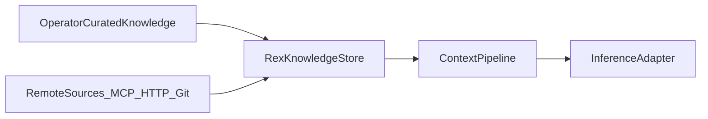
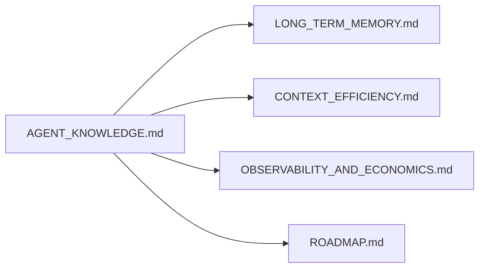

# Agent knowledge (design hub)

> Role: explanation | Status: design accepted | Audience: contributors | Read when: agent knowledge bundles
> Prefer: ## Purpose

This document is the **single source** for Rex **agent-oriented project knowledge**: curated reference material for AI sessions, alternatives to proliferating repo markdown, and how **remote** sources relate to MCP. Implementation today does **not** include a Rex knowledge store unless other docs explicitly say so.

See [DOCUMENTATION.md](DOCUMENTATION.md) for the **feature-area hub** convention. Other docs link here and avoid duplicating the bet list below.

## Purpose

- Give operators and contributors one place to discuss **where design and agent guidance should live**—in git, in Rex, or federated—without treating any option as shipped.
- Position Rex as a **policy-bound knowledge surface**: retrieval into the context pipeline stays **budgeted** and observable, aligned with [PURPOSE_AND_PRINCIPLES.md](PURPOSE_AND_PRINCIPLES.md) daemon-first economics.
- Separate **human canonical docs** ([DOCUMENTATION.md](DOCUMENTATION.md) hubs for **shipped** behavior) from **agent-optimized bundles** Rex may assemble or cache.

## Status

**partial** — v1 ships manifest `## Summary` inject via `KnowledgeRetrieval` stage ([ADR 0015](architecture/decisions/0015-agent-knowledge-bundles.md)). Full store, drift CLI, and MCP transport deferred.

## Scope

**In (this design stage):**

- Curated **project knowledge**: architecture intent, conventions, ADR summaries, onboarding for agents.
- **Versioned or scoped bundles** (workspace / project) with explicit revision ids for cache and drift rules.
- **Budgeted retrieval** under daemon policy into the context pipeline ([CONTEXT_EFFICIENCY.md](CONTEXT_EFFICIENCY.md)).
- **Remote documentation** options and trust boundaries (MCP resources, HTTP, git snapshots).
- **In-repo markdown strategy**: thin pointers vs full duplication.

**Out:**

- Replacing all of `docs/` or release criteria prose.
- Full **chat transcript** storage (extension / client UX).
- Unbounded “load entire repo into context” behavior.

## Boundaries

| Concern | Owner | Notes |
|---------|--------|--------|
| **Policy** (what may enter prompts, caps, audit) | `rex-daemon` | Same envelope as caches and retrieval gates — [ADR 0001](architecture/decisions/0001-daemon-owns-agent-orchestration-and-economics.md). |
| **Mechanism** (file layout, index, sync jobs) | Planned store + pipeline hook | Behind explicit seams; not in `rex.v1` until a versioned migration. |
| **Shipped product docs** | Git `docs/` hubs | Canonical for behavior operators rely on; agent bundles may **mirror** or **summarize**, not silently override. |
| **Long-term / project memory** | [LONG_TERM_MEMORY.md](LONG_TERM_MEMORY.md) | See boundary table below — different problem. |
| **MCP tools and resources** | Sidecar-first, brokered host access | [ADR 0008](architecture/decisions/0008-dedicated-sidecar-control-plane-api.md); formal MCP ADR when scheduled. |

### Boundary vs long-term memory

| Dimension | [LONG_TERM_MEMORY.md](LONG_TERM_MEMORY.md) | Agent knowledge (this hub) |
|-----------|---------------------------------------------|----------------------------|
| **Primary intent** | Reduce repeated work via **session-derived** and **extracted** signals | Stable **operator-curated** reference for design and agent behavior |
| **Typical content** | Episodic traces, semantic facts from usage, fingerprints | Architecture summaries, policies, conventions, ADR digests |
| **Volatility** | High — grows with sessions; compaction / forgetting | Lower — edited deliberately; versioned bundles |
| **Economics hook** | Same matrix — “project memory” row | Distinct row — “agent knowledge retrieval” in [CONTEXT_EFFICIENCY.md](CONTEXT_EFFICIENCY.md) |

Both may **feed** the same context pipeline stage; they must not share one undifferentiated blob.

## Problem framing (for later discussion)

| Signal | Repo markdown may be enough | Rex-held knowledge may help |
|--------|----------------------------|------------------------------|
| Many small rule files churning | Rare edits; small repo | Dozens of paths; duplicate guidance |
| Retrieval noise | Agents read one hub + ADRs | Every session re-reads overlapping rules |
| Remote / team wiki | Wiki is human-only | Agents need **governed** snapshots with revision ids |
| Offline / local-first | Git clone is sufficient | Want bundles without committing secrets or drafts |

**Pain threshold** (to measure later, not decided here): file count, rule churn rate, retrieval miss rate, tokens spent re-loading the same conventions.

## Architecture (intent)

- **Operator** edits via future CLI, file drop under `$REX_HOME`, or import from committed docs.
- **Remote** sources sync on schedule or on demand; daemon policy filters what may be retrieved per request.
- **Store** is not required to live in-process; sidecar-held catalog with daemon-brokered read remains an option.

## Design bets — uncommitted

Each row is a **hypothesis**, not a roadmap commitment.

| Bet | Sketch |
|-----|--------|
| **File bundle under Rex home** | `$REX_HOME/knowledge/` with manifest + chunks; sqlite or tantivy index for retrieval. |
| **Hybrid pointer in repo** | Single `AGENTS.md` (or similar) maps bundle id → Rex store; git stays the **pointer**, Rex holds payload. |
| **Sync from `docs/`** | Optional job imports hub sections; drift when git revision ≠ bundle revision. |
| **Sidecar catalog** | MCP or custom catalog in guest; daemon brokers reads with policy — [SIDECAR_RUNTIME.md](SIDECAR_RUNTIME.md). |
| **Layered prompts integration** | Knowledge bundles compose with planned system/project stack — [CONFIGURATION.md](CONFIGURATION.md). |
| **Economics logging** | `knowledge=` retrieval stage in `stream.metrics` (revision id, bytes/token estimate, hit/miss). |

## In-repo markdown strategy (options)

| Approach | Pros | Cons |
|----------|------|------|
| **Status quo** — rules and hubs in git | Reviewable, versioned with code | Proliferation; retrieval cost |
| **Thin pointer only** | One committed file per workspace | Requires Rex store operational |
| **Generated sync** | Git remains readable snapshot | Two sources of truth without drift rules |
| **Git-only, Rex indexes** | No second write path | Indexer must respect ignore and secrets |

**Drift rule (intent):** when bundle revision and git pointer disagree, daemon logs `knowledge=drift` and policy chooses fail-closed or prefer-git — **open decision**.

## Remote documentation

| Source | Role | Trust / refresh |
|--------|------|-----------------|
| **MCP resources** | Standard transport for tools + resources in sidecar | Brokered; resource URIs allowlisted — [ADR 0008](architecture/decisions/0008-dedicated-sidecar-control-plane-api.md) |
| **HTTP(S) snapshot** | Wiki or doc site export | TTL, TLS, optional offline cache under Rex home |
| **Git remote** | Pin branch or tag for doc subtree | Same as code supply chain; no live network at inference time if cached |
| **Internal API** | Future operator connector | Auth + scope per workspace |

**Local-first default** ([PURPOSE_AND_PRINCIPLES.md](PURPOSE_AND_PRINCIPLES.md)): remote fetch is **opt-in**; cached snapshots preferred for repeat retrieval.

## MCP: what it provides vs gaps Rex might fill

| MCP provides | Potential Rex additions (discussion) |
|--------------|--------------------------------------|
| Resource and tool discovery | **Curated corpora** with explicit bundle ids and ownership |
| Ad hoc fetch per session | **Token-budgeted** injection and ranking under daemon policy |
| Server-specific schemas | **Unified economics** logging for knowledge retrieval as a pipeline stage |
| Ecosystem of servers | **Revision-aware cache keys** (bundle id + content hash) |
| — | **Brokered policy** on which remote content may enter prompts (not only tools) |

MCP does not replace **human canonical** `docs/` hubs; it is one **transport** for remote material. A Rex-native knowledge broker remains an open fork (see open questions).

## Interfaces (intent-only)

Names for discussion — no proto or RPC definitions here.

| Name | Role |
|------|------|
| `KnowledgeBundle` | Scoped, versioned collection (metadata + chunks). |
| `KnowledgeRetrieval` | Context-pipeline stage: query → ranked chunks → budget pack. |
| `KnowledgeBroker` (optional) | Sidecar or daemon RPC to list/read bundles under policy. |
| `BundlePointer` | Committed repo file referencing bundle id + min revision. |

Stream and tool contracts stay stable until a deliberate `rex.v1` or sidecar API change elsewhere.

## Open questions → decided / deferred

| Question | Status | Decision / deferral |
|----------|--------|---------------------|
| Rex-native broker vs MCP-only? | **Decided** | Rex-native `KnowledgeBroker` / `KnowledgeRetrieval`; MCP optional transport ([ADR 0015](architecture/decisions/0015-agent-knowledge-bundles.md)) |
| Relationship to layered prompts? | **Decided** | Separate pipeline stages; prompts = rules, knowledge = corpora |
| Drift (bundle vs git pointer) | **Decided** | `fail-closed` in `agent`; `prefer-git` in `ask` |
| Single canonical store vs federated bundles? | **Deferred** | Start one bundle per workspace |
| Who edits knowledge? | **Deferred** | CLI / file drop first |
| Multi-workspace isolation? | **Deferred** | Separate bundle namespace per workspace root |

## Cross-links

| Doc | Relationship |
|-----|----------------|
| [LONG_TERM_MEMORY.md](LONG_TERM_MEMORY.md) | Session-derived memory — boundary above |
| [CONTEXT_EFFICIENCY.md](CONTEXT_EFFICIENCY.md) | Economics matrix — agent knowledge row |
| [ARCHITECTURE.md](ARCHITECTURE.md) | System views and interoperability |
| [ROADMAP.md](ROADMAP.md) | Parked theme — agent knowledge |
| [OBSERVABILITY_AND_ECONOMICS.md](historical/OBSERVABILITY_AND_ECONOMICS.md) | Metrics for knowledge retrieval stage |

