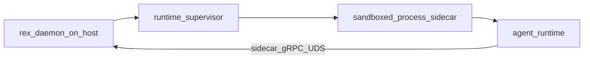

# Agent runtime environment (concepts)

This document is a **refinable explanation hub** for **host–guest transport options** and **deferred** strong-isolation backends. It is **not** a shipping checklist: implementation is incremental per [PURPOSE_AND_PRINCIPLES.md](PURPOSE_AND_PRINCIPLES.md).

**Mac-first product path:** supervised **process sidecar** + optional OS sandbox + daemon broker — see [SIDECAR_RUNTIME.md](SIDECAR_RUNTIME.md) and [AGENT_ACCESS_POLICY.md](AGENT_ACCESS_POLICY.md). **VM/container envelopes are not the default** for local development agents.

## Goals

- **`rex-daemon`** remains the **economics and stream authority** for clients ([ADR 0001](architecture/decisions/0001-daemon-owns-agent-orchestration-and-economics.md)).
- **Isolated runtimes** avoid **ambient** host access; work is **brokered** through the daemon ([ADR 0008](architecture/decisions/0008-dedicated-sidecar-control-plane-api.md)).
- **Agent implementations** are **swappable**; Rex owns **environment contract** and supervision ([ADR 0005](architecture/decisions/0005-rex-owns-sidecar-environment-not-agent-implementations.md)).

## Ownership model

| Layer | Owns |
|------|------|
| **`rex-daemon`** | Stream contract, modes, caches, pipelines, adapter selection, **policy** ([POLICY_ENGINE.md](POLICY_ENGINE.md)). |
| **Isolated environment** | Process boundary, optional OS sandbox, resource envelope, **authorized channel** to daemon. |
| **Agent runtime** | Reasoning graph, prompts, tool wiring inside the sandbox. |

## Mac-first envelope (product default)

| Profile | Status |
|---------|--------|
| **`sandboxed_process`** | **Target** — sidecar child on same kernel; gRPC over UDS to daemon. |
| **`process`** | Minimal supervision without full OS sandbox. |
| **`container` / `vm`** | **Deferred** — catalog below for server/fleet exploration only. |

## Communication (same kernel — Rex default)

| Situation | Transport |
|-----------|-----------|
| CLI ↔ `rex-daemon` | gRPC over UDS (`rex.v1`) |
| Sidecar ↔ `rex-daemon` (same Mac) | gRPC over **dedicated UDS** — [SIDECAR_RUNTIME.md](SIDECAR_RUNTIME.md) |

## Deferred: cross-kernel / server transport catalog

Use when a **future** deployment uses a VM or container with a **different kernel** than the daemon host. **Not** required for the Mac-first sidecar path.

| Option | When it fits | Notes |
|--------|----------------|-------|
| **Loopback TCP + port forward** | Guest ↔ host when a VM/runtime bridges networks | Restrict egress to daemon only. |
| **virtio-vsock** | Linux guest microVMs | Firecracker-style host↔guest ([vsock doc](https://github.com/firecracker-microvm/firecracker/blob/main/docs/vsock.md)). |
| **Apple Virtualization.framework** | macOS host ↔ Linux guest | Server/sketch paths only — **not** Rex Mac default. |
| **Kubernetes Agent Sandbox + gVisor/Kata** | Fleet/server | Not Mac-first. |

## End-to-end sketch (Mac-first)

## Non-goals

- **Firecracker on macOS** as the default local envelope (no KVM on Mac).
- Implying VM/supervisor code is **already shipped**.
- Replacing [PLUGIN_ROADMAP.md](PLUGIN_ROADMAP.md) or the dedicated hubs below.

## Related

- [SIDECAR_RUNTIME.md](SIDECAR_RUNTIME.md) · [AGENT_ACCESS_POLICY.md](AGENT_ACCESS_POLICY.md) · [POLICY_ENGINE.md](POLICY_ENGINE.md)
- [PLUGIN_ROADMAP.md](PLUGIN_ROADMAP.md) · [ARCHITECTURE.md](ARCHITECTURE.md)
- [ADR 0005](architecture/decisions/0005-rex-owns-sidecar-environment-not-agent-implementations.md) · [ADR 0008](architecture/decisions/0008-dedicated-sidecar-control-plane-api.md)
