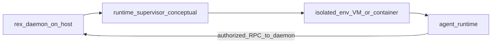

# Agent runtime environment (concepts)

This document is a **refinable explanation hub** for how REX can place **orchestrated agent workloads** in **isolated environments** and how they **communicate** with `rex-daemon`. It is **not** a shipping checklist: implementation is incremental and must follow [PURPOSE_AND_PRINCIPLES.md](PURPOSE_AND_PRINCIPLES.md) (study scope, no implied production SLAs, no fake “already shipped” isolation).

## Goals

- **`rex-daemon`** remains the **economics and stream authority** for clients (see [ADR 0001](architecture/decisions/0001-daemon-owns-agent-orchestration-and-economics.md)).
- **Isolated runtimes** exist so LLM-driven processes do not receive **ambient** host access; **real work** (files, processes, model calls the project cares about) is **brokered** through the daemon or an explicit, policy-bound path.
- **Agent implementations** (for example a Python graph) are **swappable**; REX does not need to own their source. REX **does** own the **environment contract** and **supervision** story—see [ADR 0005](architecture/decisions/0005-rex-owns-sidecar-environment-not-agent-implementations.md). The **brokered sidecar ↔ daemon integration surface** (separate from **`rex.v1`**) is [ADR 0008](architecture/decisions/0008-dedicated-sidecar-control-plane-api.md).

## Ownership model

| Layer | Owns |
|------|------|
| **`rex-daemon`** | Stream contract, modes, caches, pipelines, adapter selection, queues/cancellation hooks, **optimization policy** for context and routing ([CONTEXT_EFFICIENCY.md](CONTEXT_EFFICIENCY.md)). |
| **Isolated environment** | Resource envelope (CPU, memory, network posture), process boundary, **authorized channel** back to the daemon. |
| **Agent runtime** | Reasoning graph, prompts, tool wiring inside the allowed sandbox—**not** a second source of truth for REX economics. |

## Isolation depth (directional)

Isolation is a **spectrum**; depth should match **threat and blast-radius** goals: process + cgroups, Linux containers, **gVisor**-class syscall filtering, **microVMs** (stronger hardware-style boundary). On **macOS**, many developer paths use a **Linux VM** (for example via a container runtime) rather than running arbitrary workloads directly on the host kernel.

## Communication problem (same kernel vs host–guest)

| Situation | Typical transport |
|-----------|-------------------|
| Client and daemon on **one OS kernel** (CLI/extension ↔ `rex-daemon`) | **gRPC over Unix domain socket** (`rex.v1`) — already the default product path. |
| **Agent inside a VM/container**, daemon on the **host** | POSIX **UDS path inside the guest is not the same object** as a path on the host. Bridging requires **forwarded ports**, **virtio-vsock**, **virtio socket** devices, or a **dedicated proxy**—not “bind the same file path.” |
| **Agent and forwarder both inside the guest** | **gRPC over UDS** *inside* the guest is natural; the guest still needs one **outbound** path to the host daemon. |

**Practical default** for many stacks: **gRPC (or HTTP/2) over loopback TCP** from guest to a **known host address and port** (for example `host.docker.internal` patterns on Mac container setups). It is “network,” but often **only** loopback and **tighter** than arbitrary egress.

## Transport catalog (reference)

Use this table to compare options; pick based on platform support and threat model.

| Option | When it fits | Notes |
|--------|----------------|-------|
| **gRPC over UDS** | Same-kernel peers only | Low friction for local IPC on Unix-like systems; **not** a cross-VM substitute. |
| **Loopback TCP + port forward** | Guest ↔ host when bridging is handled by the VM/runtime | Ubiquitous tooling; restrict egress so only the daemon is reachable if that is the goal. |
| **virtio-vsock (`AF_VSOCK`)** | Linux guest microVMs (Firecracker, Kata-style paths) | Common **host–guest** channel; Firecracker documents **host AF_UNIX** bridging to **guest vsock** and connection handshaking ([Firecracker `vsock` doc](https://github.com/firecracker-microvm/firecracker/blob/main/docs/vsock.md)). |
| **ttrpc / structured RPC over vsock** | Tight control plane in the guest | Example pattern: [firecracker-containerd](https://github.com/firecracker-microvm/firecracker-containerd) agent listens on vsock. |
| **Apple Virtualization.framework** virtio socket | macOS **host** ↔ **Linux guest** without exposing WAN-shaped paths | Fits Apple Silicon **daemon-supervised VM** sketches ([Virtualization](https://developer.apple.com/documentation/virtualization)). |
| **Kubernetes Agent Sandbox + gVisor/Kata** | Fleet/server isolation later | Lifecycle separated from isolation backend ([Agent Sandbox / gVisor](https://agent-sandbox.sigs.k8s.io/docs/use-cases/gvisor-isolation/)); not Mac-first. |

Replacing **SSH** inside the guest with **vsock** for readiness and control appears in production-adjacent runners ([vm0 issue discussion](https://github.com/vm0-ai/vm0/issues/1163)).

## End-to-end sketch

- **Inside `isolated_env`:** use **UDS** between co-located peers if helpful.
- **Across host boundary:** use **vsock / virtio socket / forwarded TCP** per stack—not host UDS mounted into the guest as a universal fix.

## Non-goals (for this hub)

- Claim **Firecracker on macOS** (no KVM on Mac); separate **Linux server** patterns from **Mac developer** paths.
- Promise a **specific** shipped supervisor or image; those belong in specs when implemented.
- Replace [PLUGIN_ROADMAP.md](PLUGIN_ROADMAP.md): optional isolation remains **opt-in** until justified.

## Related

- [PURPOSE_AND_PRINCIPLES.md](PURPOSE_AND_PRINCIPLES.md) · [PLUGIN_ROADMAP.md](PLUGIN_ROADMAP.md) · [ARCHITECTURE.md](ARCHITECTURE.md) · [ADR 0005](architecture/decisions/0005-rex-owns-sidecar-environment-not-agent-implementations.md) · [ADR 0008](architecture/decisions/0008-dedicated-sidecar-control-plane-api.md)
