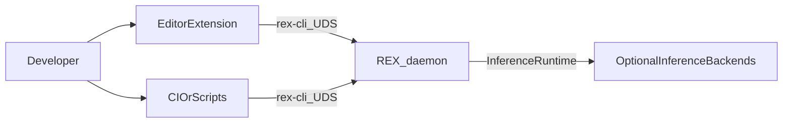
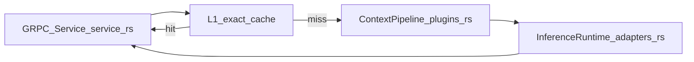
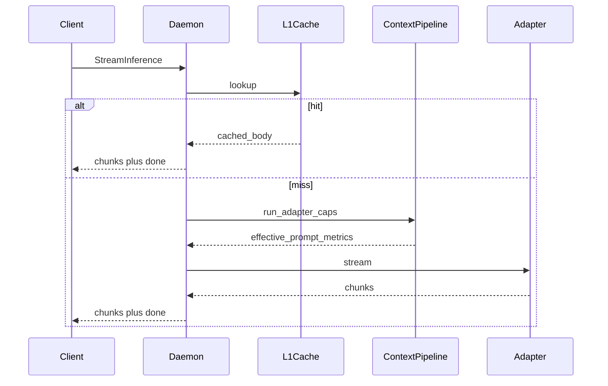

# REX Architecture

This document is the **software architecture description (SAD)** for REX: product goals, quality attributes, structural views, runtime behavior, security, and observability. Operational detail for inference adapters, caching keys, and pipeline contracts lives in [ADAPTERS.md](ADAPTERS.md), [CACHING.md](CACHING.md), and [CONTEXT_EFFICIENCY.md](CONTEXT_EFFICIENCY.md). **Architecture Decision Records** live under [architecture/decisions/](architecture/decisions/).

## Purpose

- Deliver a **REX-native development agent** (modes, policy, and future tool orchestration) so **cost and performance** stay under **daemon** control.
- Centralize **streaming inference**, **layered caching**, and **capability-aware context shaping** in [`rex-daemon`](../crates/rex-daemon).
- Keep **clients thin** (CLI, editor, scripts): one stable **gRPC** contract over **UDS** (`rex.v1`).
- Use **inference adapters** (mock, optional Cursor CLI, future MLX/HTTP) only as **backends**; they do not define REX’s agent product boundary. See [ADR 0001](architecture/decisions/0001-daemon-owns-agent-orchestration-and-economics.md).

## Goals and constraints

| Goal | Measurable signal (directional) |
|---|---|
| Cost visibility and control | Tokens or proxy cost per request logged or metered; routing decisions explicit in logs. |
| Latency-aware paths | End-to-end stream time; phased timings in daemon logs. |
| Reliable streaming | Exactly one terminal outcome per `StreamInference`; see [MVP_SPEC.md](MVP_SPEC.md). |

| Constraint | Status |
|---|---|
| Local-first transport | `implemented` — UDS default (`/tmp/rex.sock`). |
| Stable public API | `implemented` — protobuf in `proto/rex/v1/rex.proto`. |
| No remote listener in MVP | `implemented` — no TLS server in scope. |

## Quality attributes (ISO/IEC 25010 subset)

| Characteristic | Intent | How REX verifies (today / planned) |
|---|---|---|
| Performance efficiency | Bounded latency; avoid redundant model work. | UDS e2e tests; stream lifecycle logs; cache `hit`/`miss` ([CACHING.md](CACHING.md)). |
| **Cost / resource efficiency** | Minimize tokens and paid API use; route to appropriate backend. | Optimization matrix [CONTEXT_EFFICIENCY.md](CONTEXT_EFFICIENCY.md); routing **planned** (see [ADR 0004](architecture/decisions/0004-routing-daemon-first-optional-http-gateway.md)). |
| Reliability | Predictable terminals; recoverable startup races. | `crates/rex-daemon/tests/uds_e2e.rs`; CLI retry tests. |
| Security | Local trust boundary; bounded subprocess; path to approvals. | STRIDE-oriented notes under [Security viewpoint](#security-viewpoint). |
| Maintainability | Narrow seams: `InferenceRuntime`, `ContextPipeline`. | Crate layout below; ADRs for boundaries. |

## System context (C4 Level 1)



| Actor | Interaction |
|---|---|
| Developer | Uses IDE or terminal; owns approvals for guarded actions (extension modes). |
| Editor extension | Thin client; invokes `rex-cli`; does not embed the model runtime. |
| CI / automation | Uses mock adapter by default. |
| Optional backends | Mock process, subprocess **Cursor CLI**, future local MLX or HTTP/OpenAI-compat clients. |

**Trust boundary:** Assume **non-hostile local user**. The daemon must still handle **ambiguous subprocess behavior**, **timeouts**, and **misbehaving adapters** safely.

## Containers (C4 Level 2)

| Container | Responsibility | Status |
|---|---|---|
| `extensions/rex-vscode` | Chat UX, modes, approvals; shells out to CLI. | `implemented` — see [EXTENSION.md](EXTENSION.md). |
| `rex-cli` | UDS client; NDJSON façade for editors. | `implemented` |
| `rex-daemon` | Session authority: stream contract, pipeline, cache, adapters. | `implemented` core; routing/project-memory **planned** |
| Sidecar plugins (future) | Optional processes for isolation or foreign runtimes. | `planned` — [PLUGIN_ROADMAP.md](PLUGIN_ROADMAP.md) |

## Components inside `rex-daemon` (C4 Level 3)

| Component | Source (typical) | Role |
|---|---|---|
| gRPC service | `service.rs` | `StreamInference`, `GetSystemStatus`; orchestrates cache → pipeline → adapter. |
| L1 response cache | `l1_cache.rs` | Exact-match cache; **ask** mode only by policy. |
| Context pipeline | `plugins.rs` | `ContextPipeline`, token budget, prefix cache, behavioral prefilter. |
| Inference adapters | `adapters.rs` | `InferenceRuntime` trait; mock, `cursor-cli`. |
| Process lifecycle | `runtime.rs`, `main.rs` | Socket bind, shutdown, inference runtime selection. |
| Domain constants | `domain.rs` | Version and model placeholders. |

**Planned seams (not duplicate tables here):** explicit **InferenceRouter** policy layer; durable **project memory** ([LONG_TERM_MEMORY.md](LONG_TERM_MEMORY.md) — design bets); MCP-style tool interoperability. Trace in [CONTEXT_EFFICIENCY.md](CONTEXT_EFFICIENCY.md) matrix.



## Runtime behavior

**Happy path (`StreamInference`, cache miss):** Client sends request over UDS → service validates → L1 lookup → on miss, `ContextPipeline::run` (capability-aware) → `InferenceRuntime` streams chunks → daemon enforces terminal `done` or maps failure to terminal error.



**Cancellation / errors:** Preserve a single observable terminal NDJSON outcome on the CLI path (`done` or `error`). Daemon logs `stream.lifecycle` / `stream.terminal`. See [MVP_SPEC.md](MVP_SPEC.md).

## Data and state

| Data | Lifetime | Notes |
|---|---|---|
| Stream buffers | Ephemeral — per request. | Owned by goroutine/async task in daemon. |
| L1 cache entries | Ephemeral — in-process LRU. | Keying: [CACHING.md](CACHING.md). **`agent`** excluded — [ADR 0003](architecture/decisions/0003-layered-cache-agent-mode-policy.md). |
| Prefix cache segments | Ephemeral — pipeline | `plugins.rs`; TTL/bypass semantics in CONTEXT_EFFICIENCY. |
| Chat transcript | Extension / client | Not authoritative for REX policy. |
| **Project memory** (decisions, repo map fingerprints) | **planned** persistent store | Hub: [LONG_TERM_MEMORY.md](LONG_TERM_MEMORY.md). Out-of-chat; workspace-scoped; economics row in [CONTEXT_EFFICIENCY.md](CONTEXT_EFFICIENCY.md). |

## Security viewpoint (STRIDE-oriented)

| Concern | Mitigation / status |
|---|---|
| **Spoofing** on UDS | Local-only socket; filesystem permissions **implemented** expectation. |
| **Tampering** with daemon config env | Trusted operator model; doc dangerous env in [CONFIGURATION.md](CONFIGURATION.md). |
| **Repudiation** | Structured logs with `request_id`, `trace_id` **implemented**. |
| **Information disclosure** | Optional Cursor adapter sends prompt off-machine when enabled — operator choice. |
| **Denial of service** | Subprocess **timeouts**, bounded CLI retry **implemented**; future rate limits **planned**. |
| **Elevation** | Future: sandbox for tool execution; extension **approval** gates for mutations **implemented** in UX policy. |
| **Prompt injection** from repo | **planned** hardening: classifiers, allowlists; today: operator awareness. |

## Interoperability

| Mechanism | Status |
|---|---|
| `rex.v1` gRPC | `implemented` |
| NDJSON CLI contract | `implemented` — [EXTENSION.md](EXTENSION.md) |
| MCP (or equivalent) for tools | `planned` — see optimization matrix in [CONTEXT_EFFICIENCY.md](CONTEXT_EFFICIENCY.md) |
| HTTP OpenAI-compat via external gateway | `optional / deferred` — [ADR 0004](architecture/decisions/0004-routing-daemon-first-optional-http-gateway.md) |

## Observability

| Field / signal | Where | Purpose |
|---|---|---|
| `stream.request_id`, `trace_id` | Daemon stdout | Correlate with CLI / extension. |
| `inference_runtime` | Daemon | `mock` vs `cursor-cli`. |
| `l1_cache=hit|miss` | Daemon | Cache effectiveness. |
| `stream.lifecycle`, `stream.terminal`, `elapsed_ms` | Daemon | Latency and failure class. |
| **Routing decision id** | **planned** | After router lands. |
| **Estimated tokens / cost** | **planned** | Adapter metadata + pricing table. |

## Technology stack

| Topic | Decision |
|---|---|
| Primary platform | macOS on Apple Silicon |
| Runtime language | Rust |
| Protocol | gRPC |
| Transport | Unix Domain Socket (`/tmp/rex.sock`) |
| Inference | **Adapters** behind `InferenceRuntime`: **mock** default; **optional** Cursor CLI subprocess; future MLX / HTTP. Product **agent and economics** stay in daemon per ADR 0001. |

## Thin client, thick server

| Concern | Thin client | REX daemon |
|---|---|---|
| UX rendering | Owns | Does not own |
| Model / agent **policy** | Does not own | Owns (target); modes + future tool policy |
| Cost/routing policy | Does not own | Owns (target) |
| Streaming contract | Consumes | Produces |
| Inference backend selection | Does not own | Owns configuration of adapters |

## Plugin and sidecar model (summary)

**Default:** Core **routing, caching, budgets, metrics, and agent policy** stay **in-daemon**. **Sidecars** are for **optional** isolation, foreign language runtimes, or failure-contained features — see [PLUGIN_ROADMAP.md](PLUGIN_ROADMAP.md). Detailed sidecar lifecycle and phases are documented there only (avoid duplication with [MVP_SPEC.md](MVP_SPEC.md)).

## Protocol contract (summary)

| RPC | Type | Purpose |
|---|---|---|
| `GetSystemStatus` | Unary | Daemon metadata. |
| `StreamInference` | Server streaming | Chunks plus terminal semantics. |

## Configuration

Inference and cache policy today: defaults + **`REX_*` env**. Full catalog: [CONFIGURATION.md](CONFIGURATION.md).

## Reliability rules

- One socket owner; predictable lifecycle; stale socket cleanup on shutdown.
- Bounded buffering; clear errors on connection and stream failures.
- Subprocess adapters: mandatory timeouts — [ADAPTERS.md](ADAPTERS.md).

## Directory structure (canonical)

```text
.
├── proto/rex/v1/rex.proto
├── crates/
│   ├── rex-proto/
│   ├── rex-daemon/src/
│   │   ├── main.rs
│   │   ├── runtime.rs
│   │   ├── service.rs
│   │   ├── domain.rs
│   │   ├── adapters.rs
│   │   ├── plugins.rs
│   │   └── l1_cache.rs
│   └── rex-cli/src/
├── extensions/rex-vscode/
└── docs/
    ├── ARCHITECTURE.md
    └── architecture/decisions/
```

## Non-goals in this document

- Field-by-field proto reference — [MVP_SPEC.md](MVP_SPEC.md).
- Extension UX detail — [EXTENSION.md](EXTENSION.md).
- Cursor env catalog — [CONFIGURATION.md](CONFIGURATION.md).

## Related documents

- [CONTEXT_EFFICIENCY.md](CONTEXT_EFFICIENCY.md) — optimization lever matrix.
- [ADAPTERS.md](ADAPTERS.md) — adapter capabilities.
- [CACHING.md](CACHING.md) — L1 keys, bypass.
- [PLUGIN_ROADMAP.md](PLUGIN_ROADMAP.md) — optional sidecars.
- [architecture/decisions/](architecture/decisions/) — ADRs.
