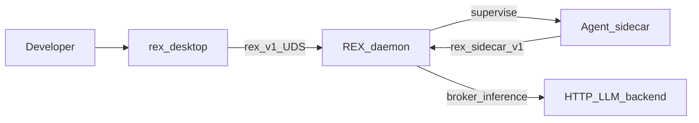
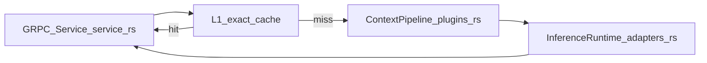
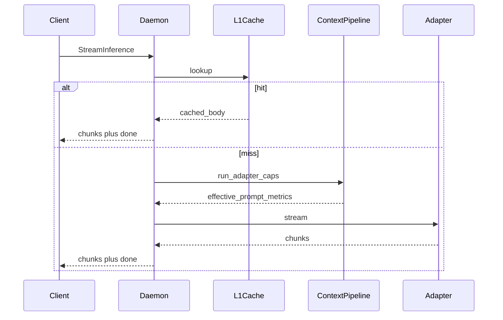

# REX Architecture

> Role: explanation | Status: active | Audience: contributors | Read when: system architecture overview
> Prefer: ## Purpose

## Summary

REX is a local AI runtime: `rex-daemon` owns streaming, policy, caches, and context shaping; thin clients (Tauri desktop webview, automation scripts) use gRPC over UDS. The product path is a supervised sidecar agent with brokered HTTP inference. Primary operator surface: **Tauri 2 desktop app** ([ADR 0042](architecture/decisions/0042-web-desktop-presentation-pivot.md), [WEB_UI_ARCHITECTURE.md](WEB_UI_ARCHITECTURE.md)).

This document is the **software architecture description (SAD)** for REX: product goals, quality attributes, structural views, runtime behavior, security, and observability. Operational detail for inference adapters, caching keys, and pipeline contracts lives in [ADAPTERS.md](ADAPTERS.md), [CACHING.md](CACHING.md), and [CONTEXT_EFFICIENCY.md](CONTEXT_EFFICIENCY.md). **Architecture Decision Records** live under [architecture/decisions/](architecture/decisions/).

## Purpose

- Deliver a **REX-native development agent** (modes, policy, and future tool orchestration) so **cost and performance** stay under **daemon** control.
- Centralize **streaming inference**, **layered caching**, and **capability-aware context shaping** in [`rex-daemon`](../crates/rex-daemon).
- Keep **clients thin** (desktop app): one stable **gRPC** contract over **UDS** (`rex.v1`).
- Run the **development agent** in a **supervised sidecar**; use **inference adapters** (HTTP OpenAI-compat, mock, legacy Cursor CLI) as **broker mechanisms** only. See [ADR 0001](architecture/decisions/0001-daemon-owns-agent-orchestration-and-economics.md), [MVP_SPEC.md](MVP_SPEC.md).

Canonical **purpose and principles**: [PURPOSE_AND_PRINCIPLES.md](PURPOSE_AND_PRINCIPLES.md).

**Policies and ownership** (bounded contexts, policy vs mechanism, documentation layering): [ARCHITECTURE_GUIDELINES.md](ARCHITECTURE_GUIDELINES.md).

## Isolated agent runtimes (conceptual)

**Mac-first path:** supervised **process sidecar** + optional OS sandbox + daemon broker — **required for MVP assistant** ([MVP_SPEC.md](MVP_SPEC.md)). Hubs: [SIDECAR_RUNTIME.md](SIDECAR_RUNTIME.md), [AGENT_ACCESS_POLICY.md](AGENT_ACCESS_POLICY.md), [POLICY_ENGINE.md](POLICY_ENGINE.md). **VM/container** envelopes are **not** the default. **Environment ownership** vs agent code: [ADR 0005](architecture/decisions/0005-rex-owns-sidecar-environment-not-agent-implementations.md). Sidecar ↔ daemon API: [ADR 0008](architecture/decisions/0008-dedicated-sidecar-control-plane-api.md). Supervisor, `rex.sidecar.v1`, and brokered inference/tools are **implemented** ([SIDECAR_RUNTIME.md](SIDECAR_RUNTIME.md), [MVP_SPEC.md](MVP_SPEC.md)).

## Goals and constraints

| Goal | Measurable signal (directional) |
|---|---|
| Cost visibility and control | Tokens or proxy cost per request logged or metered; routing decisions explicit in logs. |
| Latency-aware paths | End-to-end stream time; phased timings in daemon logs. |
| Reliable streaming | Exactly one terminal outcome per `StreamInference`; see [MVP_SPEC.md](MVP_SPEC.md). |

| Constraint | Status |
|---|---|
| Local-first transport | `implemented` — UDS default (`/tmp/rex.sock`). |
| Stable public API | `implemented` — protobuf in `proto/rex/v1/rex.proto`. |
| No remote listener in MVP | `implemented` — no TLS server in scope. |

## Quality attributes (ISO/IEC 25010 subset)

| Characteristic | Intent | How REX verifies (today / planned) |
|---|---|---|
| Performance efficiency | Bounded latency; avoid redundant model work. | UDS e2e tests; stream lifecycle logs; cache `hit`/`miss` ([CACHING.md](CACHING.md)). |
| **Cost / resource efficiency** | Minimize tokens and paid API use; route to appropriate backend. | Optimization matrix [CONTEXT_EFFICIENCY.md](CONTEXT_EFFICIENCY.md); minimal router **shipped** (`route=` logs); advanced routing still roadmap — [ADR 0004](architecture/decisions/0004-routing-daemon-first-optional-http-gateway.md). |
| Reliability | Predictable terminals; recoverable startup races. | `crates/rex-daemon/tests/uds_e2e.rs`; CLI retry tests. |
| Security | Local trust boundary; bounded subprocess; path to approvals. | STRIDE-oriented notes under [Security viewpoint](#security-viewpoint). |
| Maintainability | Narrow seams: `InferenceRuntime`, `ContextPipeline`. | Crate layout below; ADRs for boundaries. |

## System context (C4 Level 1)

| Actor | Interaction |
|---|---|
| Developer | Uses desktop app; owns approvals for guarded actions. |
| **Desktop app** | Thin client over UDS gRPC ([ADR 0042](architecture/decisions/0042-web-desktop-presentation-pivot.md)). |
| CI / harness | **Mock** runtime and/or stub sidecar — test paths only. |
| Agent sidecar | Reasoning loop + tool **requests**; daemon **brokers** inference and host reach. |
| HTTP LLM backend | OpenAI-compatible API invoked by daemon on sidecar’s behalf ([ADAPTERS.md](ADAPTERS.md)). |

**Trust boundary:** Assume **non-hostile local user**. The daemon must still handle **ambiguous subprocess behavior**, **timeouts**, and **misbehaving adapters** safely.

## Containers (C4 Level 2)

| Container | Responsibility | Status |
|---|---|---|
| `rex` | Unified entry: opens desktop; config/proto/sidecar helpers. | `implemented` |
| `rex-desktop` (`apps/rex-desktop`) | Electron shell: loads React UI, UDS proxy in main (W127). | `shipped` |
| `apps/rex-web` | React presentation client. | `implemented` |
| `rex-stream-ui` | Stream event projection for desktop shell. | `implemented` |
| `rex-config` | JSON config load/merge. | `implemented` |
| `rex-daemon` | Session authority: stream contract, pipeline, cache, broker; legacy shim binary. | `implemented` |
| `rex-sidecar-stub` | Harness sidecar (CI / `rex config init` default). | `implemented` |
| `rex-agent` | Product LangGraph sidecar — [sidecars/rex-agent/](../sidecars/rex-agent/). | `implemented` |
| Agent sidecar (generic) | Supervised **process** + `rex.sidecar.v1`; pluggable per [ADR 0005](architecture/decisions/0005-rex-owns-sidecar-environment-not-agent-implementations.md). | `implemented` — [SIDECAR_RUNTIME.md](SIDECAR_RUNTIME.md), [MVP_SPEC.md](MVP_SPEC.md) |

## Components inside `rex-daemon` (C4 Level 3)

| Component | Source (typical) | Role |
|---|---|---|
| gRPC service | `service.rs` | `StreamInference`, `GetSystemStatus`; orchestrates cache → pipeline → adapter. |
| L1 response cache | `l1_cache.rs` | Exact-match cache; **ask** mode only by policy. |
| Context pipeline | `plugins.rs` | `ContextPipeline`, token budget, prefix cache, behavioral prefilter. |
| Inference adapters | `adapters.rs`, `http_openai_compat.rs` | `InferenceRuntime`; **http-openai-compat**, mock, `cursor-cli`. |
| Process lifecycle | `runtime.rs`, `main.rs` | Socket bind, shutdown, inference runtime selection. |
| Domain constants | `domain.rs` | Version and model placeholders. |

**Planned seams (not duplicate tables here):** explicit **InferenceRouter** policy layer; durable **project memory** ([LONG_TERM_MEMORY.md](LONG_TERM_MEMORY.md) — design bets); MCP / tool interoperability **primarily in the isolated sidecar envelope**, with host reach **brokered** through the **sidecar ↔ daemon** API ([ADR 0008](architecture/decisions/0008-dedicated-sidecar-control-plane-api.md)); formal MCP ADR when implementation is scheduled — trace in [CONTEXT_EFFICIENCY.md](CONTEXT_EFFICIENCY.md) matrix.

## Runtime behavior

**Happy path (`StreamInference`, cache miss):** Client sends request over UDS → service validates → L1 lookup → on miss, `ContextPipeline::run` (capability-aware) → `InferenceRuntime` streams chunks → daemon enforces terminal `done` or maps failure to terminal error.

**Cancellation / errors:** Preserve a single observable terminal stream outcome (`done` or `error`). Daemon logs `stream.lifecycle` / `stream.terminal`. See [MVP_SPEC.md](MVP_SPEC.md).

## Data and state

Ownership of chat transcript, turn assembly (`TurnContext`), workspace binding, session scratch, project memory, and agent knowledge is defined in **[DEVELOPMENT_ASSISTANCE_CAPABILITIES.md](DEVELOPMENT_ASSISTANCE_CAPABILITIES.md)** (with ADRs 0011–0017). Ephemeral runtime artifacts: stream buffers and L1 cache per request ([CACHING.md](CACHING.md), [ADR 0003](architecture/decisions/0003-layered-cache-agent-mode-policy.md)); prefix cache segments in the context pipeline ([CONTEXT_EFFICIENCY.md](CONTEXT_EFFICIENCY.md)).

## Security viewpoint (STRIDE-oriented)

| Concern | Mitigation / status |
|---|---|
| **Spoofing** on UDS | Local-only socket; filesystem permissions **implemented** expectation. |
| **Tampering** with daemon config env | Trusted operator model; doc dangerous env in [CONFIGURATION.md](CONFIGURATION.md). |
| **Repudiation** | Structured logs with `request_id`, `trace_id` **implemented**. |
| **Information disclosure** | Optional Cursor adapter sends prompt off-machine when enabled — operator choice. |
| **Denial of service** | Subprocess **timeouts**, bounded CLI retry **implemented**; future rate limits **planned**. |
| **Elevation** | Access policy broker **implemented** (RC-05) — [AGENT_ACCESS_POLICY.md](AGENT_ACCESS_POLICY.md); `ApprovalGate` for `agent` mode — [ADR 0009](architecture/decisions/0009-centralized-agent-approvals-and-checkpoints.md); desktop approval UX **implemented**. |
| **Prompt injection** from repo | **planned** hardening: classifiers, allowlists; today: operator awareness. |

## Interoperability

| Mechanism | Status |
|---|---|
| `rex.v1` gRPC | `implemented` |
| Internal stream event contract | `implemented` — [STREAM_EVENTS.md](STREAM_EVENTS.md) |
| MCP (or equivalent) for tools | `planned` — **approved direction:** MCP stacks **primarily** in the **isolated sidecar**; host-affecting work **brokered** sidecar → daemon ([CONTEXT_EFFICIENCY.md](CONTEXT_EFFICIENCY.md) matrix). Remote doc resources vs Rex knowledge bundles: [AGENT_KNOWLEDGE.md](AGENT_KNOWLEDGE.md). Formal ADR when implementation is scheduled. |
| HTTP OpenAI-compat via LiteLLM (default API; opt-in managed gateway) | `accepted` design — [INFERENCE_GATEWAY.md](INFERENCE_GATEWAY.md), [ADR 0019](architecture/decisions/0019-inference-gateway-opt-in-litellm.md); external profile [ADR 0018](architecture/decisions/0018-gateway-first-multi-provider-inference.md) |
| Native Anthropic Messages API | `planned` — [ADAPTERS.md](ADAPTERS.md#direct-anthropic-messages-api-planned--secondary) |

## Observability

Full signal catalog, Rex-owned storage, bundled Grafana suite: [OBSERVABILITY_AND_ECONOMICS.md](historical/OBSERVABILITY_AND_ECONOMICS.md), [OBSERVABILITY_INTEGRATIONS.md](historical/OBSERVABILITY_INTEGRATIONS.md), [CONFIGURATION.md](CONFIGURATION.md#observability), [ADR 0010](architecture/decisions/0010-daemon-exports-observability-via-otel-and-sidecar-api.md), [ADR 0020](architecture/decisions/0020-otel-genai-semconv-with-rex-pipeline-metrics.md), [ADR 0021](architecture/decisions/0021-rex-owned-economics-store-byot-visualization.md), [ADR 0025](architecture/decisions/0025-dual-economics-store-engines.md), [ADR 0026](architecture/decisions/0026-rex-owned-storage-grafana-otel-datasource.md), [OBS_STORE_MMAP_FORMAT.md](historical/OBS_STORE_MMAP_FORMAT.md). Economics validation program: [ECONOMICS_VALIDATION.md](ECONOMICS_VALIDATION.md). Agent knowledge retrieval metrics (planned): [AGENT_KNOWLEDGE.md](AGENT_KNOWLEDGE.md).

| Field / signal | Where | Purpose |
|---|---|---|
| `stream.request_id`, `trace_id` | Daemon stdout | Correlate with CLI. |
| `inference_runtime` | Daemon | `mock` vs `cursor-cli`. |
| `l1_cache=hit|miss` | Daemon | Legacy cache effectiveness signal (emitted only for cacheable lookups). |
| `cache_decision=hit|miss_stored|bypass|uncacheable_mode` | Daemon | Per-request cache outcome covering bypass and ineligible modes (see [CACHING.md](CACHING.md) Metrics). |
| `stream.lifecycle`, `stream.terminal`, `elapsed_ms` | Daemon | Latency and failure class. |
| `approval=allow|deny|checkpoint` | Daemon | Agent-mode gate outcome ([ADR 0009](architecture/decisions/0009-centralized-agent-approvals-and-checkpoints.md)). |
| **`route=`**, **`decision_id=`** | Daemon logs | Minimal routing **implemented** (RC-09). |
| **Estimated tokens / cost** | **planned** | Adapter metadata + pricing table. |

## Technology stack

| Topic | Decision |
|---|---|
| Primary platform | macOS on Apple Silicon |
| Runtime language | Rust |
| Protocol | gRPC |
| Transport | Unix Domain Socket (`/tmp/rex.sock`) |
| Inference | **Broker adapters** (`http_openai_compat`, mock, legacy Cursor CLI). **Agent loop** in supervised **sidecar**; economics in daemon per [ADR 0001](architecture/decisions/0001-daemon-owns-agent-orchestration-and-economics.md). |

## Thin client, thick server

| Concern | Thin client | REX daemon |
|---|---|---|
| UX rendering | Owns | Does not own |
| Model / agent **policy** | Does not own | Owns modes, approvals, broker policy; **agent runtime** in sidecar |
| Cost/routing policy | Does not own | Owns (target) |
| Streaming contract | Consumes | Produces |
| Inference backend selection | Does not own | Owns configuration of adapters |

## Plugin and sidecar model (summary)

**Default:** Core **routing, caching, budgets, metrics, and agent policy** stay **in-daemon**. **Sidecars** are a **supervised process** on Mac (protobuf/UDS, optional OS sandbox, daemon broker) — **not** a VM default — [SIDECAR_RUNTIME.md](SIDECAR_RUNTIME.md), [AGENT_ACCESS_POLICY.md](AGENT_ACCESS_POLICY.md), [PLUGIN_ROADMAP.md](PLUGIN_ROADMAP.md), [ADR 0008](architecture/decisions/0008-dedicated-sidecar-control-plane-api.md).

## Protocol contract (summary)

| RPC | Type | Purpose |
|---|---|---|
| `GetSystemStatus` | Unary | Daemon metadata. |
| `StreamInference` | Server streaming | Chunks plus terminal semantics. |

## Configuration

Inference and cache policy today: JSON only (`$REX_ROOT/config.json`); sole product env var **`REX_ROOT`**. Catalog: [CONFIGURATION.md](CONFIGURATION.md).

## Reliability rules

- One socket owner; predictable lifecycle; stale socket cleanup on shutdown.
- Bounded buffering; clear errors on connection and stream failures.
- Subprocess adapters: mandatory timeouts — [ADAPTERS.md](ADAPTERS.md).

## Repository layout (summary)

| Area | Role |
|------|------|
| `proto/rex/v1/`, `proto/rex/sidecar/v1/` | `rex.v1` and sidecar gRPC contracts |
| `crates/rex/` | Unified CLI binary |
| `crates/rex-config/` | JSON configuration |
| `crates/rex-daemon/` | Daemon — components in [Components](#components-inside-rex-daemon-c4-level-3) |
| `crates/rex-cli/` | Client library (shim binary) |
| `crates/rex-sidecar-stub/` | Harness sidecar |
| `sidecars/rex-agent/` | Product Python sidecar |
| `` | Editor host |
| `docs/` | Architecture hubs and ADRs |

## Non-goals in this document

- Field-by-field proto reference — [MVP_SPEC.md](MVP_SPEC.md).
- Extension UX detail — [STREAM_EVENTS.md](STREAM_EVENTS.md).
- Cursor env catalog — [CONFIGURATION.md](CONFIGURATION.md).

## Related documents

- [CONTEXT_EFFICIENCY.md](CONTEXT_EFFICIENCY.md) — optimization lever matrix.
- [ADAPTERS.md](ADAPTERS.md) — adapter capabilities.
- [CACHING.md](CACHING.md) — L1 keys, bypass.
- [SIDECAR_RUNTIME.md](SIDECAR_RUNTIME.md) · [AGENT_ACCESS_POLICY.md](AGENT_ACCESS_POLICY.md) · [POLICY_ENGINE.md](POLICY_ENGINE.md)
- [PLUGIN_ROADMAP.md](PLUGIN_ROADMAP.md) — sidecar agent platform + brokered adapters.
- [architecture/decisions/0008-dedicated-sidecar-control-plane-api.md](architecture/decisions/0008-dedicated-sidecar-control-plane-api.md) — brokered sidecar ↔ daemon API.
- [architecture/decisions/](architecture/decisions/) — ADR index.
