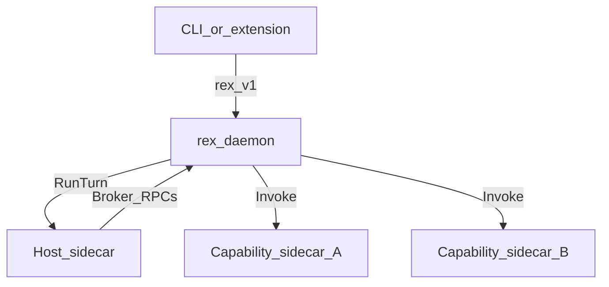

# Capability sidecars (design hub)

Canonical design for **host sidecars** (prompt + tool loop) and **capability sidecars** (callable features) supervised by `rex-daemon`. See [DOCUMENTATION.md](DOCUMENTATION.md) for hub conventions.

## Purpose

Rex sidecars are **general-purpose supervised processes**, not a single agent stack. One **host** sidecar receives turns and requests tools; **capability** sidecars expose features (web search, future plugins) that the daemon invokes after policy checks. This keeps the host sandboxed while allowing scoped network egress only where a feature requires it.

## Status

**Design accepted** — [ADR 0028](architecture/decisions/0028-host-and-capability-sidecar-fleet.md). **R056-1 shipped:** `rex.capability.v1` proto, `sidecars.capabilities[]` config, multi-process supervisor, `sidecars/capability-mock` Health stub. **Open:** capability router (**R056-2**), full mock `Invoke` (**R056-3**).

## Scope

### In (design)

- Role split: **host** vs **capability**
- New wire contract **`rex.capability.v1`** with `Invoke`
- Daemon supervises **1 host + 0..N capability** processes concurrently
- Capability registry: map `capability_id` (e.g. `web.search`) → sidecar entry
- Config intent: `sidecars.host`, `sidecars.capabilities[]`

### Out (this hub)

- Host multi-broadcast (`RunTurn` to multiple agents) — still deferred; see **R016** reframe below
- Replacing LiteLLM **inference gateway** with capability sidecars — gateway stays `inference.gateway.*`
- MCP lazy discovery — [ADR 0016](architecture/decisions/0016-mcp-in-sidecar-envelope.md)
- Capability invoke router and full reference sidecar `Invoke` path (R056-2, R056-3)

## Terminology

| Role | Purpose | Proto | Count |
|------|---------|-------|-------|
| **Host sidecar** | Receives enriched prompt; runs tool loop (`rex-agent`, `rex-sidecar-stub`, …) | `rex.sidecar.v1` — `RunTurn` | **1** when sidecar agent path is active |
| **Capability sidecar** | Provides callable features (SearXNG search, future) | **`rex.capability.v1`** — `Invoke` | **0..N** |

Both are **sidecar processes** (separate OS processes, plugin manifest, health probes). They differ by **`role`** and API surface.

## Boundaries



### Invariants

| Rule | Rationale |
|------|-----------|
| Host **never** calls capability sidecars directly | Policy, metering, economics stay in daemon |
| Capability sidecars **never** receive user prompts | Only structured `Invoke` from daemon |
| `rex.v1` stream authority unchanged | Clients talk to daemon only |
| Host sidecar: no ambient network | [ADR 0008](architecture/decisions/0008-dedicated-sidecar-control-plane-api.md) |
| Capability sidecar: **scoped egress** only for its feature | e.g. SearXNG upstream search |

### Contrast: inference gateway

[INFERENCE_GATEWAY.md](INFERENCE_GATEWAY.md) supervises LiteLLM under `inference.gateway.*` — **not** a sidecar slot. Capability sidecars follow the **sidecar plugin** manifest pattern (`sidecars.capabilities[]`) but use **`rex.capability.v1`**, not `RunTurn`.

## Interfaces (intent)

### `rex.capability.v1` (sketch)

| RPC | Purpose |
|-----|---------|
| `Health` | Supervision probe |
| `GetCapabilities` | Advertise `capability_ids` (e.g. `web.search`) |
| `Invoke` | Execute one capability call with JSON payload |

**Invoke request fields (intent):** `capability_id`, `method`, `payload_json`, `turn_id`, `mode`.

**Invoke response fields (intent):** `ok`, `content`, optional `error_code`.

Full message shapes live in [ADR 0028](architecture/decisions/0028-host-and-capability-sidecar-fleet.md).

### Config (intent)

```json
{
  "sidecars": {
    "host": "rex-agent",
    "capabilities": [
      {
        "name": "searxng",
        "role": "capability",
        "binary": "rex-searxng-capability",
        "socket": "/tmp/rex-cap-searxng.sock",
        "provides": ["web.search"],
        "enabled": false
      }
    ]
  }
}
```

**Migration note:** Shipped config uses `sidecars.active` for the host. Implementation should accept `sidecars.host` with fallback to `sidecars.active`.

### Daemon capability router (intent)

1. On `BrokerWebSearch` (or future broker verbs), evaluate [access policy](AGENT_ACCESS_POLICY.md).
2. Resolve provider sidecar from registry by `capability_id`.
3. Forward `Invoke`; format and truncate result to `broker.max_tool_result_bytes`.
4. Emit economics / structured logs (query hash, byte count, capability name).

## Relation to ADR 0017 and R016

[ADR 0017](architecture/decisions/0017-single-active-sidecar-phase-1.md) required a **single active sidecar** for Phase 1. This design **amends** that to **single active host** while allowing **N capability** sidecars.

**R016** (multi-active host broadcast) remains **deferred**. The near-term multi-process story is the **capability fleet**, not parallel agent graphs on one workspace.

## Prioritization

| Field | Value |
|-------|-------|
| **MoSCoW** | **Could** |
| **Roadmap** | **R056** — blocks **R055** web search implementation |
| **Rank** | After **LF-D01**; see [PRIORITIZATION.md](PRIORITIZATION.md) |

## Implementation slices (reference — not this doc PR)

| ID | Outcome |
|----|---------|
| **R056-1** | `rex.capability.v1` proto + config + N-process supervisor — **Done** |
| **R056-2** | Daemon capability router (registry, health, Invoke) |
| **R056-3** | Reference capability sidecar scaffold + CI mock |

## Cross-links

- [SIDECAR_RUNTIME.md](SIDECAR_RUNTIME.md) — host sidecar supervision (extend with pointer here)
- [WEB_SEARCH.md](WEB_SEARCH.md) — first capability consumer (`web.search` via SearXNG)
- [PLUGIN_ROADMAP.md](PLUGIN_ROADMAP.md) — **R056**
- [AGENT_ACCESS_POLICY.md](AGENT_ACCESS_POLICY.md) — capability gating
- [ADR 0005](architecture/decisions/0005-rex-owns-sidecar-environment-not-agent-implementations.md) — pluggable implementations
