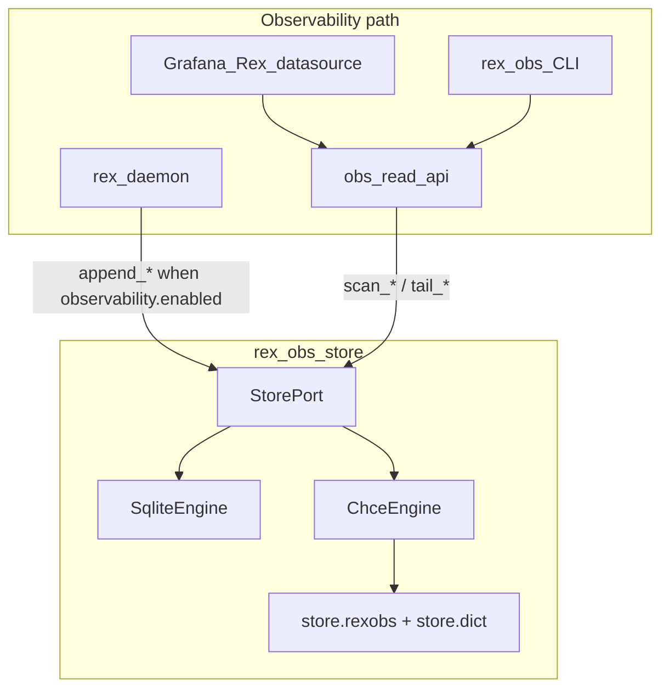
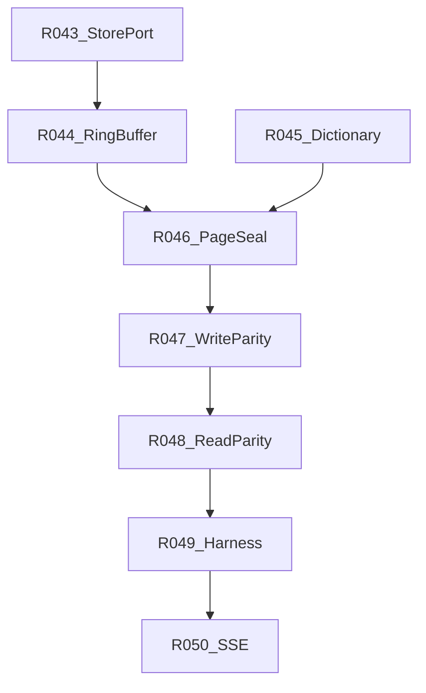

# CHCE observability store — delivery program

**Status:** **in progress** — **R043** `StorePort` + engine dispatch **shipped**; CHCE write/read parity (**R044–R049**) and **RC-S5** remain open. **Done** tracking: Must **RC-S4** (Program A) and **RC-S5** in [V1_0.md](V1_0.md) — both block the **`1.0.0` git tag**.

**Parent hub:** [OBSERVABILITY_AND_ECONOMICS.md](OBSERVABILITY_AND_ECONOMICS.md) · **Format reference:** [OBS_STORE_MMAP_FORMAT.md](OBS_STORE_MMAP_FORMAT.md) · **Main queue:** [ROADMAP.md](ROADMAP.md) **R043–R054**

CHCE is an **observability** feature: daemon economics telemetry persistence and Grafana read paths. It is **not** part of the sidecar agent program, long-term memory, or agent knowledge stores.

## Problem

[OBSERVABILITY_AND_ECONOMICS.md](OBSERVABILITY_AND_ECONOMICS.md) Phase **2b** calls for a macOS opt-in **mmap** engine alongside the shipped **SQLite** default ([ADR 0025](architecture/decisions/0025-dual-economics-store-engines.md)). CHCE spans multiple subsystems (`LiveRingBuffer`, `AppendCoordinator`, `ColumnarCodec`, `DictionaryManager`, `MmapPaginator`) and hub phases **2b / 6 / 7**. Ordered slices **R043–R054** live in [ROADMAP.md](ROADMAP.md) and [PRIORITIZATION.md](PRIORITIZATION.md#current-focus-queue-audit-2026-06-07).

## Prioritization (2026-06-07)

| Lane | Rank | Notes |
|------|------|-------|
| Global | **1** | **Must** — v1.0 blocked until Program A + **RC-S5** close |
| MoSCoW | **Must** Program A (**R043–R049**, **RC-S4**); **Must** Program B (**R050–R051**, **RC-S5**); **Could** Program C (**R052–R054**) |
| R-ICE | **75** (**R043**); **~65** avg Program A | High learning value; medium ease (multi-PR) |
| Next slice | **R043** — `StorePort` + engine dispatch | Closes start of **RC-S4** |

## Current state

| Layer | Status |
|-------|--------|
| SQLite `rex-obs-store` + read API + Grafana plugin | **shipped** (observability Phases 2–5 partial) |
| `observability.store.engine=mmap` | **dispatch shipped** (**R043**); write/read stub until **R047–R048** — [CONFIGURATION.md](CONFIGURATION.md) |
| CHCE on-disk + API design | **design documented** (2026-06-07) |
| `crates/rex-obs-store` mmap code | **R043** — `StorePort` + `ChceEngine` stub; hot path **R044+** |

## Target architecture

CHCE is an embedded library in [`crates/rex-obs-store`](../crates/rex-obs-store). The daemon **appends** stream economics at `stream.terminal`; the read API and Grafana datasource **query** via the same logical API as SQLite — not direct file access.

Byte layout, compression tiers, and zone maps: [OBS_STORE_MMAP_FORMAT.md](OBS_STORE_MMAP_FORMAT.md).

## Prerequisites

| Prerequisite | Status |
|--------------|--------|
| SQLite write path (`append_config`, `append_stream`) | **shipped** |
| Rex observability read API + `ObsQuery` filter shape | **shipped** — [OBS_READ_API.md](OBS_READ_API.md) |
| `observability.enabled` + dual-engine JSON keys | **documented** — [CONFIGURATION.md](CONFIGURATION.md) |
| Grafana Rex OTel datasource | **shipped** — [OBSERVABILITY_INTEGRATIONS.md](OBSERVABILITY_INTEGRATIONS.md) |

## Scope

**In:**

- macOS opt-in **`observability.store.engine: "mmap"`** (CHCE)
- Logical schema parity with SQLite (`config_snapshots`, `streams`, `runs`, `run_tasks`)
- Historical read parity for Grafana via existing read API
- Phase 6 SSE live tail (Program B)
- Phase 7 retention, v2 codecs, default-engine promotion gates (Program C)

**Out:**

- Sidecar agent runtime, tool loop, or graph state
- Long-term / project memory ([LONG_TERM_MEMORY.md](LONG_TERM_MEMORY.md))
- Agent knowledge bundles ([AGENT_KNOWLEDGE.md](AGENT_KNOWLEDGE.md))
- Linux mmap support (CI stays **sqlite** default)
- Making mmap the JSON default until promotion gates pass

## Boundaries

| Concern | Owner | Notes |
|---------|--------|--------|
| Telemetry ingest + store | `rex-daemon` + `rex-obs-store` | Hot-path append; non-blocking ring buffer |
| Read contract for UI | Rex observability read API | Grafana does not read store files |
| On-disk encoding | CHCE engine only when `engine=mmap` | SQLite path unchanged |
| Sidecar custom metrics | `SidecarObservabilityService` (Phase 6) | Separate from CHCE store engine; shares observability hub |
| Validation harness writes | [ECONOMICS_VALIDATION.md](ECONOMICS_VALIDATION.md) | **R039–R042**; may consume store output |

## Implementation order

One PR per row where feasible; merge-wait between slices. Canonical queue: [ROADMAP.md](ROADMAP.md).

### Program A — Phase 2b (historical read/write)

| Order | ID | Theme | Outcome | Priority |
|-------|-----|-------|---------|----------|
| 1 | **R043** | `StorePort` + engine dispatch | Trait over sqlite + mmap; `engine=mmap` on macOS selects CHCE; non-macOS → `store.engine_unsupported` | **Must** |
| 2 | **R044** | Hot-path ingest | Bounded `mpsc` + `LiveRingBuffer`; append returns &lt;1 ms; unit tests | **Must** |
| 3 | **R045** | Global dictionary | `DictionaryManager` + `store.dict`; categoricals → u16 ordinals | **Must** |
| 4 | **R046** | Page seal pipeline | `AppendCoordinator` + `ColumnarCodec` v1 + `MmapPaginator`; 16 KB pages, `F_BARRIERFSYNC`, CRC32, zone footers | **Must** |
| 5 | **R047** | Write API parity | `append_config` + `append_stream` on CHCE; daemon wired when `engine=mmap` | **Must** |
| 6 | **R048** | Historical read parity | `scan_streams_by_time` / `ObsQuery` same filter shape as SQLite; read API unchanged | **Must** |
| 7 | **R049** | Verification harness | Fixture parity (sqlite vs mmap aggregates); recovery fuzz; `rex obs doctor` mmap checks | **Must** |

### Program B — Phase 6 (live + traces)

| Order | ID | Theme | Outcome | Priority |
|-------|-----|-------|---------|----------|
| 8 | **R050** | SSE live tail | `tail_telemetry` + read API `GET /v1/metrics/stream` cursor merge — [OBS_READ_API.md](OBS_READ_API.md) | **Must** — **RC-S5** |
| 9 | **R051** | Sparse trace index + spans | `trace_id` / `turn_id` sidecar; `append_span` schema | **Must** — **RC-S5** |

### Program C — Phase 7 (optimization + promotion)

| Order | ID | Theme | Outcome | Priority |
|-------|-----|-------|---------|----------|
| 10 | **R052** | v2 codecs + benchmarks | ALP / FastLanes when v1 misses disk/latency targets | **Could** |
| 11 | **R053** | Retention + export | Time/file retention; Parquet export (CLI) | **Could** |
| 12 | **R054** | Default engine promotion | All promotion gates green; ADR 0025 amendment for JSON default | **Could** |

## Per-slice acceptance

### R043 — StorePort + engine dispatch

| Criterion | Evidence |
|-----------|----------|
| Single trait covers sqlite + mmap backends | `rex-obs-store` integration tests |
| `engine=mmap` on Linux returns `store.engine_unsupported` | Unit test + [ERROR_HANDLING.md](ERROR_HANDLING.md) code |
| SQLite path unchanged when `engine=sqlite` (default) | Existing store tests green |

### R044 — Hot-path ingest

| Criterion | Evidence |
|-----------|----------|
| Daemon append returns without waiting for page seal | Benchmark or timing test &lt;1 ms class |
| Ring buffer bounded; backpressure policy documented | Unit tests under load |

### R045 — Global dictionary

| Criterion | Evidence |
|-----------|----------|
| `store.dict` created under `$REX_ROOT/obs/` | File artifact test |
| Categorical columns use u16 ordinals per format spec | Round-trip encode/decode test |

### R046 — Page seal pipeline

| Criterion | Evidence |
|-----------|----------|
| Sealed pages are exactly 16 KB with `REXO` magic + zone footer | Layout test vs [OBS_STORE_MMAP_FORMAT.md](OBS_STORE_MMAP_FORMAT.md) |
| `F_BARRIERFSYNC` on seal (not `F_FULLFSYNC`) | Documented in CONFIGURATION + integration test hook |

### R047 — Write API parity

| Criterion | Evidence |
|-----------|----------|
| `append_config` + `append_stream` persist same logical fields as SQLite | Shared fixture records |
| Daemon selects CHCE when JSON `engine=mmap` on macOS | Daemon integration test |

### R048 — Historical read parity

| Criterion | Evidence |
|-----------|----------|
| `ObsQuery::query_streams` equivalent results sqlite vs mmap | Parity test on fixture dataset |
| Grafana read API needs no contract change | Existing read API tests pass against mmap backend |

### R049 — Verification harness

| Criterion | Evidence |
|-----------|----------|
| Aggregate rollups within tolerance vs SQLite | Harness test |
| Kill mid-append → truncate without prior commit loss | Recovery fuzz test |
| `rex obs doctor` reports mmap health | CLI smoke |

### R050–R054

Acceptance details deferred to slice PRs; **R054** requires all gates in [OBS_STORE_MMAP_FORMAT.md §Promotion gates](OBS_STORE_MMAP_FORMAT.md#promotion-gates-sqlite--mmap-default).

## Promotion gates (default engine flip)

All must pass before JSON default changes from `sqlite` to `mmap` (**R054**):

1. Harness parity — aggregates within tolerance vs SQLite
2. Recovery fuzz — kill mid-append; truncate without prior commit loss
3. macOS soak — dogfood without `store.recovery_failed`
4. Benchmarks — disk target met or v2 codecs shipped
5. Linux CI — remains sqlite-default; optional macOS alignment job

## CI and platform

| Environment | `observability.store.engine` |
|-------------|------------------------------|
| Linux CI | **`sqlite` only** — [CI.md](CI.md) |
| macOS dev | `sqlite` or **`mmap`** |
| Non-macOS + `mmap` | `store.engine_unsupported` |

## Out of scope (this program)

- [AGENT_DELIVERY_ROADMAP.md](AGENT_DELIVERY_ROADMAP.md) — sidecar agent graph and tool loop
- [LONG_TERM_MEMORY.md](LONG_TERM_MEMORY.md) — cross-turn memory store
- Extension NDJSON or `rex.v1` contract changes
- Required live LLM on PR checks (**RC-10**)

## Related

- [OBSERVABILITY_AND_ECONOMICS.md](OBSERVABILITY_AND_ECONOMICS.md) — observability suite hub
- [OBS_STORE_MMAP_FORMAT.md](OBS_STORE_MMAP_FORMAT.md) — columnar layout reference
- [OBS_READ_API.md](OBS_READ_API.md) — read API + SSE contract
- [ECONOMICS_VALIDATION.md](ECONOMICS_VALIDATION.md) — validation program (**R039–R042**)
- [CONFIGURATION.md](CONFIGURATION.md) — `observability.store.*`
- [ERROR_HANDLING.md](ERROR_HANDLING.md) — store error codes
- [ADR 0025](architecture/decisions/0025-dual-economics-store-engines.md) · [ADR 0027](architecture/decisions/0027-chce-columnar-mmap-engine.md)
