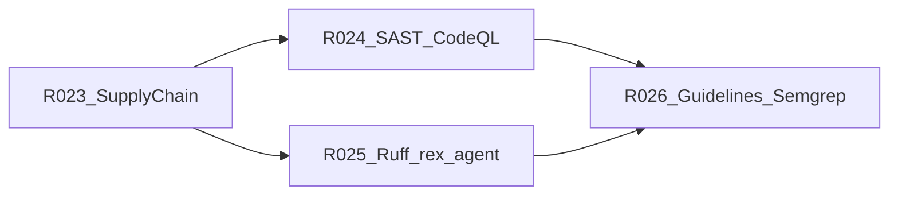

# CI quality and security gates (design hub)

This document is the **single source** for **planned** post-v1.0 CI gates that harden Rex for AI-assisted development: supply chain, security SAST, Python static analysis on `rex-agent`, and Rex-specific invariant checks. **Today’s shipped gates** remain documented in [CI.md](CI.md); nothing in this hub is implemented in CI until the corresponding **R023–R026** backlog item lands.

See [DOCUMENTATION.md](DOCUMENTATION.md) for the feature-area hub convention. [ROADMAP.md](ROADMAP.md) links here; avoid duplicating the phase table elsewhere.

## Purpose

- Close quality and security gaps that native linters do not cover (dependency advisories, security patterns, unlinted Python) without duplicating **clippy** or **ESLint**.
- Preserve [RC-10](V1_0.md) behavior: PR CI stays green without a live LLM; new jobs are additive and path-aware where practical.

AI-assisted changes often introduce contract drift, dependency bumps, and sidecar Python edits. This program tracks gates that catch those failures with high signal and manageable triage cost.

## Status

**planned** — roadmap registration only; implementation in engineering backlog **R023–R026**.

## Scope

**In:**

- Phased gates below, aligned with [PRIORITIZATION.md](PRIORITIZATION.md) (CI cost, blast radius).
- Path-aware CI consistent with [.github/workflows/ci.yml](../.github/workflows/ci.yml) (rust-verify / extension-verify / guidelines-verify model).
- Planned failure codes: `AUDIT_FAIL`, `SAST_FAIL`, `RUFF_FAIL` (to register in [CI.md](CI.md) when implemented).

**Out:**

- **SonarCloud / SonarQube** — overlaps clippy/ESLint; weaker Rust signal; high tuning cost (**Won’t (now)**).
- Global coverage percentage gates.
- Blocking `npm audit` on every PR (extension CI uses `npm ci --no-audit` today; repo-level Dependabot is the preferred path).
- Live LLM or cloud inference in PR CI.

## Boundaries

| Concern | Owner |
|---------|--------|
| Supply chain and security SAST | This program (**R023**, **R024**) |
| Product contracts (NDJSON error codes, protos) | [scripts/ci/guidelines/](scripts/ci/guidelines/) and [ERROR_HANDLING.md](ERROR_HANDLING.md) — extended in **R026** |
| Broker / access policy product behavior | Daemon tests and [AGENT_ACCESS_POLICY.md](AGENT_ACCESS_POLICY.md); optional Semgrep rules in **R026** |
| Baseline fmt/clippy/test/ESLint | [CI.md](CI.md) (unchanged) |

## Phased program

| Phase | ID | Bucket | What | Acceptance when Done |
|-------|-----|--------|------|----------------------|
| 1 | **R023** | **Should** | `cargo-audit` (+ optional `cargo-deny` licenses/bans); GitHub **Dependabot** for `Cargo.lock`, `package-lock.json`, pip | PR fails on configured critical Rust advisories; Dependabot config present; local commands documented in [DEPENDENCIES.md](DEPENDENCIES.md) |
| 2 | **R024** | **Should** | **CodeQL** workflow (Rust + JS + Python); start **advisory** or schedule-only if noise is high | CodeQL runs on `pull_request`; triage documented; does not duplicate clippy/ESLint as blocking style gates |
| 3 | **R025** | **Should** | **Ruff** on [sidecars/rex-agent/](../sidecars/rex-agent/) via [run_rex_agent_checks.sh](../scripts/ci/run_rex_agent_checks.sh) | Ruff check in sidecar CI path; dev deps in `pyproject.toml` |
| 4 | **R026** | **Could** | Extend [scripts/ci/guidelines/](../scripts/ci/guidelines/) + optional **Semgrep** for Rex invariants | At least 1–2 custom checks with tests; Semgrep optional if CodeQL + guidelines suffice |

### Prioritization (vs peers)

| Item | Bucket | Rank | Rationale |
|------|--------|------|-----------|
| R023 | Should | 1 | Safety, low noise, small blast radius |
| R024 | Should | 2 | Security; separate workflow; public GitHub repo enables CodeQL |
| R025 | Should | 3 | `rex-agent` growing; CI runs pytest only today |
| R026 | Could | 4 | Highest Rex-specific value; needs rule design |

May run **in parallel** with **RC-S2** (extension) or **R016** (Could) when CI capacity allows — different blast radii per [PRIORITIZATION.md](PRIORITIZATION.md).

## Won’t (now)

| Tool | Reason |
|------|--------|
| SonarCloud / SonarQube | Duplicates clippy/ESLint; weaker Rust analysis; ongoing quality-gate tuning |

## Interfaces (intent)

When implemented, new checks should follow the [CI observability standard](CI.md#ci-observability-standard-github-native-logs-first): grouped steps, `CI_SIGNAL`, job summary, failure artifacts. Register new low-cardinality codes in [CI.md](CI.md) failure taxonomy.

## Implementation notes (deferred)

Target touchpoints for implementers (not shipped):

| Phase | Likely paths |
|-------|----------------|
| R023 | `.github/dependabot.yml`, `scripts/ci/run_rust_verify.sh` or dedicated audit script, [DEPENDENCIES.md](DEPENDENCIES.md) |
| R024 | `.github/workflows/codeql.yml` (or equivalent) |
| R025 | [sidecars/rex-agent/pyproject.toml](../sidecars/rex-agent/pyproject.toml), [run_rex_agent_checks.sh](../scripts/ci/run_rex_agent_checks.sh) |
| R026 | [scripts/ci/guidelines/](../scripts/ci/guidelines/), optional `.semgrep/` rules |

Recommended implementation PR order: **R023 → R024 → R025 → R026**, each updating this hub **Status** and [CI.md](CI.md) when landed.

## Cross-links

- [CI.md](CI.md) — shipped gates and observability contract
- [ROADMAP.md](ROADMAP.md) — **R023–R026** engineering backlog
- [DEVELOPER_EXPERIENCE_GUIDE.md](DEVELOPER_EXPERIENCE_GUIDE.md) — local checks before PR
- [DEPENDENCIES.md](DEPENDENCIES.md) — toolchain and planned audit tooling
- [ERROR_HANDLING.md](ERROR_HANDLING.md) — error code catalog (guidelines sync)
- [AGENT_ACCESS_POLICY.md](AGENT_ACCESS_POLICY.md) — policy invariants for optional Semgrep
- [AGENT_DELIVERY_ROADMAP.md](AGENT_DELIVERY_ROADMAP.md) — **R025** and harness notes
