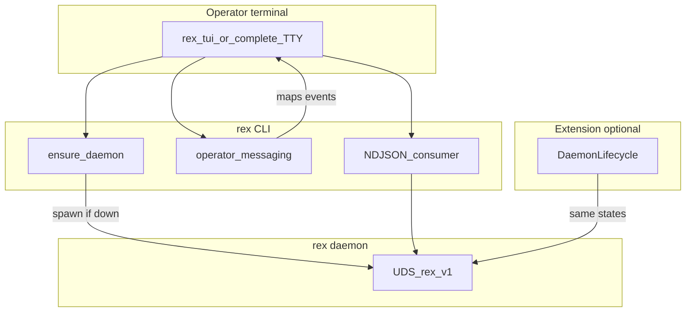

# CLI operator UX — design hub

**Status:** `partial` — **R071** implemented; **R072–R074** planned ([ROADMAP.md](ROADMAP.md)).

## Purpose

Give **terminal operators** a Rex experience that does not require a dedicated foreground **`rex daemon`** session. The CLI should **ensure the daemon when configured**, present a **full terminal UI** for interactive work, and surface **legible operator messaging** so users understand lifecycle and in-flight work—while preserving **`rex complete --format ndjson`** for the extension, CI, and scripts ([ADR 0007](architecture/decisions/0007-editor-extension-hybrid-transport-cli-and-grpc.md), [EXTENSION.md](EXTENSION.md)).

**Primary surface (target):** multi-pane TUI for **`rex tui`** and TTY **`rex complete`**. Plain text and NDJSON pipe modes remain for automation.

## Language policy

Describe **target experience and acceptance criteria in Rex terms only**. Do not name other CLIs or assistants as UX benchmarks in this hub or in R071–R074 PR text.

## Target experience

Operators working in a terminal should use Rex as a single command—not as a two-process babysitting workflow.

- **Daemon lifecycle:** probe UDS; when **`daemon.auto_start`** is enabled, spawn detached **`rex daemon`**, poll until ready, then proceed (extension-compatible states).
- **Terminal UI:** header (system health), activity timeline, streaming output, composer (prompt + mode), footer (keys and recovery).
- **Operator messaging (Must):** curated plain-language strings mapped from lifecycle phases and NDJSON events—the CLI analogue of the extension status bar and tool cards ([OPERATION_FEEDBACK.md](OPERATION_FEEDBACK.md)).
- **LLM narrator (Could):** optional short summaries of multi-step runs; off by default; never on the critical path for stream start.

## Scope

**In:**

- Extension-compatible daemon **ensure** semantics (probe → spawn → poll → ready / idle / unavailable).
- Detached daemon spawn with logs redirected (not the operator’s interactive terminal).
- Full TUI for interactive sessions on a TTY.
- Structured operator messaging catalog (lifecycle + stream events).
- Config and flags for auto-start, UI mode, readiness timeout, log path (design intent; schema lands in implementation PRs).
- Alignment table with extension **`DaemonLifecycle`** ([`extensions/rex-vscode/src/runtime/daemonLifecycle.ts`](../extensions/rex-vscode/src/runtime/daemonLifecycle.ts)).

**Out:**

- Replacing the extension webview with the CLI TUI.
- Node gRPC **`StreamInference`** in the extension.
- NDJSON wire-shape or daemon RPC changes for UX alone.
- macOS **`launchd`** / systemd user units (Could follow-up—“always-on daemon” tier).
- LLM narrator in the first implementation slice (**R074**).

## Current vs target gap

| Capability | Rex today | Target |
|------------|-----------|--------|
| Daemon start | Manual `rex daemon` in a stuck terminal | Opt-in auto-start; logs to file |
| Lifecycle feedback | `daemon_unavailable` error | Header: unavailable → starting → ready / idle |
| Stream progress | `--verbose` stderr lines; NDJSON pipe | TUI activity pane + messaging layer |
| Interactive session | `rex complete` plain text on TTY | **`rex tui`** + TTY-delegating **`complete`** |
| Extension parity | Extension auto-start only | Shared states + JSON **`daemon.auto_start`**; per-workspace sockets (**R075**) |
| Friendly status | Minimal | Structured copy (Must); optional narrator (Could) |

## Boundaries



| Layer | Owns |
|-------|------|
| TUI | Layout, keyboard, markdown pane, activity timeline, composer |
| CLI lifecycle | Probe, detached spawn, single-flight, readiness poll |
| Operator messaging | Event → human string mapping; optional narrator hook |
| CLI transport | Internal NDJSON consumer; pipe mode unchanged |
| Extension | Webview UX; optional **`rex.daemonAutoStart`**; NDJSON subprocess |
| Daemon / sidecar | Orchestration, streaming authority ([ADR 0001](architecture/decisions/0001-daemon-owns-agent-orchestration-and-economics.md)) |

## Extension compatibility

| Concern | Extension today | CLI design (aligned) |
|---------|-----------------|----------------------|
| Lifecycle states | `unavailable` → `starting` → `ready` \| `idle` | Same states in TUI header |
| Spawn command | `rex daemon` via **`rex.daemonBinaryPath`** | Same binary + subcommand |
| Readiness probe | `rex status` / unary status | Same RPC; default **10s** timeout (configurable) |
| Workspace | Writes **`.rex/config.json`** **`workspace.root`** on auto-start | Merged config; cwd / project rules — [CONFIGURATION.md](CONFIGURATION.md) |
| Process ownership | Kills **owned** child on deactivate | CLI-spawned daemon **stays running** after CLI exit |
| Concurrent spawn | Serialized **`ensureRunningInFlight`** | Equivalent single-flight in CLI |
| Transport | NDJSON subprocess | TUI consumes NDJSON internally; **`--format ndjson`** on pipes unchanged |
| Auto-start default | **`rex.daemonAutoStart`** default **on** | JSON **`daemon.auto_start`** default **on**; extension setting mirrors JSON when both set |

## Terminal UI layout

Multi-pane TUI (library TBD in implementation—evaluate **`ratatui`** + **`crossterm`** in **R073**).

| Pane | Content |
|------|---------|
| **Header / system strip** | Daemon readiness, uptime, active model, sidecar health, workspace root, trace id |
| **Activity** | Live **`activity`**, **`tool`**, **`step`**, **`plan`** timeline (extension tool-card analogue) |
| **Output** | Streaming markdown (rendered or raw toggle) |
| **Composer** | Prompt input, mode selector (`ask` / `plan` / `agent`), model override, cancel |
| **Footer** | Key hints, error recovery actions |

### Entry points (design)

| Command | When |
|---------|------|
| **`rex tui`** | Primary interactive shell |
| **`rex complete`** on TTY without **`--format ndjson`** | May delegate to TUI when **`cli.ui.enabled`** is **`auto`** |
| **`rex complete --format ndjson`** | Piped / CI / extension—no TUI ([ADR 0007](architecture/decisions/0007-editor-extension-hybrid-transport-cli-and-grpc.md)) |
| **`rex complete --no-ui`** / **`--format text`** | Script-style plain output on TTY |

### Keyboard intent (initial)

| Key | Action |
|-----|--------|
| Enter | Send prompt (composer focused) |
| Esc / Ctrl+C | Cancel active stream |
| Tab | Cycle mode (`ask` / `plan` / `agent`) |
| Ctrl+L | Clear output pane |
| ? | Toggle footer help |

Agent-mode approval uses the same TTY prompt contract as today ([OPERATION_FEEDBACK.md](OPERATION_FEEDBACK.md)); TUI may render it as a modal over the composer.

## Operator messaging catalog (Must)

Fixed copy mapped from lifecycle and NDJSON events. Wording may tune in implementation; **semantics** must stay stable for tests.

### Lifecycle (daemon ensure)

| State | Operator message |
|-------|------------------|
| Probe success | Ready — connected to Rex |
| Probe fail, auto-start off | Rex is not running. Enable **`daemon.auto_start`** or run **`rex daemon`** |
| Starting spawn | Starting Rex… |
| Poll waiting | Waiting for Rex to become ready… |
| Ready | Rex is ready |
| Timeout | Rex did not become ready within {timeout}s — see {log_path} |
| Spawn error | Could not start Rex: {reason} |

### Stream — `activity` phases

| `phase` | Operator message (template) |
|---------|----------------------------|
| `thinking` | Thinking… |
| `tool_running` | Running tools… |
| `broker_wait` | Waiting on broker… |
| `compacting` | Compacting context… |
| `preparing` | Preparing response… |
| (other) | {summary} if non-empty, else Working… |

### Stream — `tool` events

| `phase` | Operator message (template) |
|---------|----------------------------|
| `running` | {name}: {detail} |
| `completed` | {name} done |
| `failed` | {name} failed: {detail} |

### Stream — `step` / `plan`

| Event | Operator message (template) |
|-------|----------------------------|
| `step` | {summary} |
| `plan` | Plan: {title} |

### Terminal errors (reuse [ERROR_HANDLING.md](ERROR_HANDLING.md))

Map stable **`code`** values to one-line operator hints (for example **`sidecar_unavailable`** → “Sidecar is not running—check **`rex sidecar doctor`**”).

## LLM narrator (Could — R074)

Optional layer that summarizes a completed multi-tool turn in natural language.

- **Default:** off (**`cli.ui.narrator: false`**).
- **Trigger:** after terminal **`done`**, only when activity pane had more than N tool/step events (threshold TBD).
- **Model:** small/fast local or configured inference; must not block **`StreamInference`** start.
- **Non-goal:** replacing structured messaging or NDJSON events.

## Interfaces (intent)

### Configuration (planned — [CONFIGURATION.md](CONFIGURATION.md#cli-operator-ux-planned))

```json
{
  "daemon": {
    "socket": "/tmp/rex.sock",
    "auto_start": true,
    "ready_timeout_secs": 10,
    "log_path": "~/.rex/daemon.log"
  },
  "cli": {
    "ui": { "enabled": "auto", "narrator": false }
  }
}
```

Precedence: project **`.rex/config.json`** → **`$REX_ROOT/config.json`** → flags (**`--no-daemon-autostart`**, **`--no-ui`**).

| Key | Default | Purpose |
|-----|---------|---------|
| **`daemon.auto_start`** | **`true`** | CLI ensures daemon before client RPCs |
| **`daemon.ready_timeout_secs`** | `10` | Readiness poll budget |
| **`daemon.idle_shutdown_secs`** | **`300`** | Shutdown after seconds without work and without status contact; **`0`** disables |
| **`daemon.log_path`** | `~/.rex/daemon.log` | Detached daemon stdout/stderr |
| **`cli.ui.enabled`** | `"auto"` | `auto` \| `true` \| `false` — TUI on TTY |
| **`cli.ui.narrator`** | `false` | Optional LLM summaries (**R074**) |

Extension setting **`rex.daemonAutoStart`** should read/write the same effective value as **`daemon.auto_start`** when both are set (extension override wins for editor-only sessions—document in [EXTENSION_ROADMAP.md](EXTENSION_ROADMAP.md)).

### CLI flags (planned)

| Flag | Purpose |
|------|---------|
| **`--no-daemon-autostart`** | Fail fast with **`daemon_unavailable`** |
| **`--no-ui`** | Force plain text on TTY |

## Delivery items and acceptance

### R071 — CLI daemon auto-start

- When **`daemon.auto_start`** is true and socket is missing, CLI spawns detached **`rex daemon`** and polls **`GetSystemStatus`** until ready or timeout.
- Managed inference children (**`inference.omlx.mode: managed`** or **`inference.gateway.mode: managed`**) start during daemon boot before the socket binds; autostart success implies the managed child passed health when **`required`** is true.
- Single-flight: concurrent CLI invocations do not spawn duplicate daemons.
- CLI-spawned daemon survives CLI exit until idle shutdown budget elapses without clients or work; manual **`rex daemon`** in foreground still supported for debugging.
- Error messages reference **`daemon.log_path`** on spawn/timeout failures.

### R072 — Structured operator messaging

- Lifecycle and stream events render curated strings per catalog above.
- Messaging works in TUI activity pane and in plain **`--format text --verbose`** stderr (parity with today’s tool lines).
- No extra LLM calls.

### R073 — Full terminal UI

- **`rex tui`** opens multi-pane layout; TTY **`rex complete`** respects **`cli.ui.enabled`**.
- **`--format ndjson`** on non-TTY stdout unchanged; extension E2E unaffected.
- Cancel returns UI to idle; agent approval uses existing TTY / **`--approval-id`** contract.

### R074 — Optional LLM narrator (Could)

- Off by default; configurable via **`cli.ui.narrator`**.
- Post-turn summary only; does not alter NDJSON stream.

## Prioritization

| Item | MoSCoW | Notes |
|------|--------|-------|
| Design hub + ADR | **Should** | This document |
| R071 auto-start | **Should** | **Done** — default on; mirrors extension pattern |
| R072 messaging | **Must** (within program) | Required for “understand what Rex is doing” |
| R073 TUI | **Should** | Depends on R071, R072 |
| R074 narrator | **Could** | After TUI stable |

Rough rank: **Later** queue on [ROADMAP.md](ROADMAP.md)—after advisory ask-efficiency **R067–R070** unless terminal UX is explicitly prioritized; does not block **RC-LF1**.

## Open questions

- TUI library choice (**`ratatui`** vs alternatives) and markdown rendering strategy in terminal.
- Default TTY behavior: always TUI vs plain text until **`rex tui`** is explicit.
- Log rotation policy for **`daemon.log_path`**.
- Whether **`rex status`** should print friendly lifecycle copy when auto-start runs.

## Related

- [ADR 0035](architecture/decisions/0035-cli-operator-ux-daemon-lifecycle-and-terminal-ui.md) — accepted design decision
- [OPERATION_FEEDBACK.md](OPERATION_FEEDBACK.md) — NDJSON event catalog
- [EXTENSION_UX.md](EXTENSION_UX.md) — editor integrated UX (parallel surface)
- [EXTENSION_RELEASE.md](EXTENSION_RELEASE.md) — extension daemon auto-start
- [AGENT_DELIVERY_ROADMAP.md](AGENT_DELIVERY_ROADMAP.md) — client surfaces
- [CONFIGURATION.md](CONFIGURATION.md) — planned keys
- [ERROR_HANDLING.md](ERROR_HANDLING.md) — stable error codes
