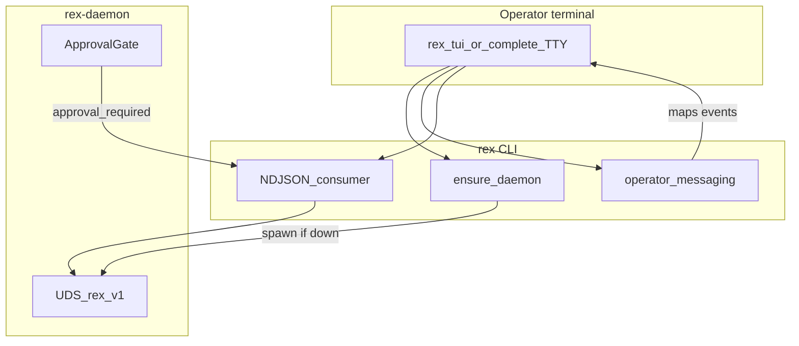
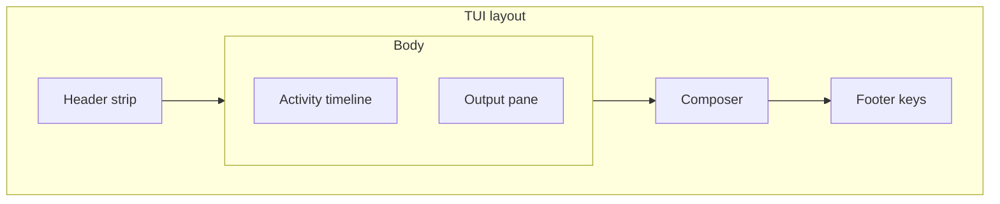

# CLI operator UX — design hub

**Status:** `design accepted` — **R071** / **R075** / **R072** / **R073** / **R080** / **R081** implemented; **R082** TUI design system ([TUI_DESIGN.md](TUI_DESIGN.md)); **R074** Could ([ROADMAP.md](ROADMAP.md)). Architecture: [ADR 0039](architecture/decisions/0039-terminal-harness-presentation-and-daemon-intelligence.md), [TERMINAL_HARNESS_ARCHITECTURE.md](TERMINAL_HARNESS_ARCHITECTURE.md).

## Purpose

Give **terminal operators** the **primary** Rex experience: a single command in a project directory provisions a per-workspace daemon and opens a responsive, keyboard-driven multi-pane workspace. The CLI **ensures the daemon when configured** and surfaces **legible operator messaging**. The TUI consumes the NDJSON event stream **internally** ([ADR 0038](architecture/decisions/0038-cli-ndjson-stream-transport.md), [NDJSON_STREAM.md](NDJSON_STREAM.md)).

**Primary surface:** multi-pane TUI via bare **`rex`** or **`rex tui`**. Public **`rex complete`** is removed.

## Language policy

Describe **target experience and acceptance criteria in Rex terms only**. Do not name other CLIs or assistants as UX benchmarks in this hub or in **R071–R082** PR text. Comparative landscape synthesis lives in the external research repository.

## North-star UX

Operators run **`cd ~/projects/my-app && rex`** (or **`rex tui`**) and enter an immersive terminal workspace without babysitting a foreground daemon session.

1. CLI derives workspace identity from cwd / **`workspace.root`** and probes the per-workspace UDS under **`$REX_ROOT/sockets/`** ([ADR 0036](architecture/decisions/0036-per-workspace-daemon-routing.md), **R075** Done).
2. When the socket is unresponsive and **`daemon.auto_start`** is on, CLI spawns a detached **`rex daemon`**, shows a loading state, and polls **`GetSystemStatus`** until the daemon is ready (context pipeline warmed, sidecar supervised).
3. TUI transitions to the primary layout: header, activity timeline, streaming output, composer, footer.
4. The operator interacts via keyboard; tool executions appear as timeline cards; destructive mutations pause for explicit approval routed through the daemon broker.
5. Session memory and diagnostics are assembled by the daemon context pipeline—the TUI is a deterministic projection of the NDJSON event stream.

## Target experience

- **Daemon lifecycle:** probe UDS → spawn if down → poll until ready / idle / unavailable.
- **Terminal UI:** header (system health, model, workspace), activity timeline, streaming markdown output, composer (prompt + mode), footer (keys and recovery).
- **Operator messaging (Must):** curated plain-language strings mapped from lifecycle phases and NDJSON events ([OPERATION_FEEDBACK.md](OPERATION_FEEDBACK.md)).
- **NDJSON parity:** core event-loop parsing matches the automation path; terminal-only enhancements (fuzzy search, mid-stream cancel) are additive.
- **LLM narrator (Could):** optional short summaries of multi-step runs; off by default; never on the critical path for stream start.

## Scope

**In:**

- Per-workspace daemon **ensure** semantics (probe → spawn → poll → ready / idle / unavailable).
- Detached daemon spawn with logs redirected (not the operator’s interactive terminal).
- Full TUI for interactive sessions on a TTY.
- Structured operator messaging catalog (lifecycle + stream events).
- Approval modals for guarded broker tools (`fs.write`, `exec.shell`, MCP).
- Config and flags for auto-start, UI mode, readiness timeout, log path, bypass modes (design intent; schema lands in implementation PRs).
- Alignment with NDJSON automation consumers ([NDJSON_STREAM.md](NDJSON_STREAM.md)).

**Out:**

- NDJSON wire-shape or daemon RPC changes for UX alone.
- macOS **`launchd`** / systemd user units (Could follow-up—“always-on daemon” tier).
- LLM narrator in the first implementation slice (**R074**).
- Daemon-owned LSP, git auto-commit, and FTS5 memory (**R076–R078** v2)—see [TERMINAL_HARNESS_ARCHITECTURE.md](TERMINAL_HARNESS_ARCHITECTURE.md).

## Current vs target gap

| Capability | Rex today | Target |
|------------|-----------|--------|
| Daemon start | Auto-start shipped (**R071**) | Done |
| Per-workspace routing | **R075** Done | Done |
| Lifecycle feedback | Compact glyphs; still thin chrome | Product design system ([TUI_DESIGN.md](TUI_DESIGN.md)); **R080** Done |
| Stream progress | Activity list + output in titled boxes | Chat-primary transcript + timeline; human phrases (**R080** Done) |
| Interactive session | Bare **`rex`** / **`rex tui`** (**R073**) | Done; presentation **R080** Done; motion **R081** Done; **`complete`** removed |
| Markdown output | Incremental **mdstream** path | Done |
| Tool approval | Modal present | Human-first copy per design system (**R080**) |
| Friendly status | Minimal structured copy | Progressive insight; optional narrator (**R074**) |
| Layout density | Dual titled boxes; partial responsive | Design system breakpoints (**R080** Done) |
| Motion | Blink caret / lone spinner (fails design bar) | Choreographed region effects (**R081** Done) |

## Boundaries



| Layer | Owns |
|-------|------|
| TUI | Layout, keyboard, markdown pane, activity timeline, composer, approval modals |
| CLI lifecycle | Probe, detached spawn, single-flight, readiness poll |
| Operator messaging | Event → human string mapping; optional narrator hook |
| CLI transport | Internal NDJSON consumer; pipe mode unchanged |
| Automation clients | NDJSON event contract consumed **internally** by the TUI ([NDJSON_STREAM.md](NDJSON_STREAM.md)) |
| Daemon / sidecar | Orchestration, streaming authority, broker policy ([ADR 0001](architecture/decisions/0001-daemon-owns-agent-orchestration-and-economics.md)) |

Technical detail: [TERMINAL_HARNESS_ARCHITECTURE.md](TERMINAL_HARNESS_ARCHITECTURE.md).

## Entry flow

| Step | Behavior |
|------|----------|
| 1 | Operator runs **`rex`** or **`rex tui`** in a project directory |
| 2 | CLI resolves **`workspace.root`** and workspace-scoped socket path |
| 3 | Probe UDS; on failure spawn detached daemon when **`daemon.auto_start`** is true |
| 4 | Poll **`GetSystemStatus`** until ready or timeout; show loading UI |
| 5 | Open multi-pane TUI; composer accepts first prompt |

## Terminal UI layout

Multi-pane grid optimized for wide terminals. Rendering stack: **`ratatui`** + **`crossterm`**; incremental markdown via **`mdstream`** ([ADR 0039](architecture/decisions/0039-terminal-harness-presentation-and-daemon-intelligence.md)).



| Pane | Content |
|------|---------|
| **Header** | Rex version, workspace path, active model, daemon/sidecar health, active LSP servers (v2), trace id |
| **Activity** | Live **`activity`**, **`tool`**, **`step`**, **`plan`** timeline |
| **Output** | Streaming markdown (incremental render; raw toggle optional) |
| **Composer** | Prompt input, mode indicator (`ask` / `plan` / `agent`), LTM indicator, sandbox mode |
| **Footer** | Key hints, error recovery actions |

### Entry points

| Command | When |
|---------|------|
| **`rex`** / **`rex tui`** | Sole interactive product entry |
| **`rex complete`** | **Removed** — use the TUI |

### Keyboard map

| Key | Action |
|-----|--------|
| Enter | Submit composer prompt |
| Esc | Cancel active stream turn (sends cancellation on control plane) |
| Ctrl+C (once) | Same as Esc—cancel current turn |
| Ctrl+C (twice) | Exit CLI |
| Tab | Cycle focus: Composer → Output → Activity |
| Shift+Tab | Cycle mode: `ask` → `plan` → `agent` |
| Ctrl+Y | Toggle permission bypass for non-destructive file mutations mid-session |
| Ctrl+M | Model picker overlay (updates inference route via gRPC) |
| Ctrl+R | Fuzzy search over session memory index (v2) |
| Ctrl+L | Clear output pane |
| ? | Toggle footer help |
| `/mode <name>` | Slash fallback for mode switch |

Mode **`ask`** enforces daemon policy that denies **`fs.write`** and **`exec.shell`**. Mode **`plan`** restricts broker to read-only and **`plan.save`**. Mode **`agent`** unlocks full mutative tools subject to approval policy.

## TUI design system (**R082**)

Canonical product design for **`rex tui`** presentation and motion: **[TUI_DESIGN.md](TUI_DESIGN.md)**.

| ID | Scope | Status |
|----|-------|--------|
| **R082** | Product design system (principles, tokens, layout, choreography, acceptance) | **Done** |
| **R080** | Layout + tokens implementation | **Done** |
| **R081** | Motion (region effects, flux hairlines) | **Done** |

Presentation and motion meet [TUI_DESIGN.md](TUI_DESIGN.md). Do not reintroduce blink-only cues or titled-box wireframe chrome.

Validate with `./scripts/install-cli.sh`, `rex tui`, and tuiwright MCP text snapshots (sequential frames must show **region** change). Headless NDJSON-replay adapter remains **Won't**.

## Tool approval UX

When the sidecar requests a host mutation, the daemon emits a **`tool`** event with **`approval_required`** status. The TUI:

1. Pauses output-pane auto-scroll.
2. Renders an interactive modal (activity overlay or dedicated pane).
3. For **`fs.write`**, shows a unified diff preview; operator navigates with arrow keys.
4. **`A`** (Approve) or **`D`** (Deny) transmits authorization to the daemon via unary gRPC—**not** client-side execution.
5. On approve, daemon **`ApprovalGate`** executes the mutation natively and resumes the stream.

TTY / **`--approval-id`** contract remains for non-TUI paths ([OPERATION_FEEDBACK.md](OPERATION_FEEDBACK.md)).

## Error recovery

| Condition | TUI behavior |
|-----------|--------------|
| **`daemon_unavailable`** | Preserve transcript; gray composer; footer: restart daemon or Esc to exit |
| **`sidecar_unavailable`** | Same retention; prompt sidecar recovery |
| **`workspace_mismatch`** | Show mismatch detail; retain visual state |

Auto-restart of a crashed daemon is attempted once with operator confirmation ([ADR 0039](architecture/decisions/0039-terminal-harness-presentation-and-daemon-intelligence.md)).

## Session model

| Capability | Behavior |
|------------|----------|
| New chat | Clean visual slate; daemon injects **`ProjectMemoryRetrieval`** from prior sessions (v2) |
| Resume | Load transcript from local storage; repopulate Activity and Output panes |
| Branch | Duplicate transcript to a chosen node; new correlation **`turn_id`** with daemon |

## NDJSON parity

The TUI operates as a **deterministic projection** of the NDJSON state machine ([TERMINAL_HARNESS_ARCHITECTURE.md](TERMINAL_HARNESS_ARCHITECTURE.md)). Core parsing and truncation of large tool outputs follow the internal stream contract ([NDJSON_STREAM.md](NDJSON_STREAM.md)).

## Operator messaging catalog (Must)

Fixed copy mapped from lifecycle and NDJSON events. Wording may tune in implementation; **semantics** must stay stable for tests.

### Lifecycle (daemon ensure)

| State | Operator message |
|-------|------------------|
| Probe success | Ready — connected to Rex |
| Probe fail, auto-start off | Rex is not running. Enable **`daemon.auto_start`** or run **`rex daemon`** |
| Starting spawn | Starting Rex… |
| Poll waiting | Waiting for Rex to become ready… |
| Ready | Rex is ready |
| Timeout | Rex did not become ready within {timeout}s — see {log_path} |
| Spawn error | Could not start Rex: {reason} |

### Stream — `activity` phases

| `phase` | Operator message (template) |
|---------|----------------------------|
| `thinking` | Thinking… |
| `tool_running` | Running tools… |
| `broker_wait` | Waiting on broker… |
| `compacting` | Compacting context… |
| `preparing` | Preparing response… |
| (other) | {summary} if non-empty, else Working… |

### Stream — `tool` events

| `status` / `phase` | Operator message (template) |
|---------|----------------------------|
| `running` | {name}: {detail} |
| `completed` | {name} done |
| `failed` | {name} failed: {detail} |
| `approval_required` | {name} needs approval |

### Stream — `step` / `plan`

| Event | Operator message (template) |
|-------|----------------------------|
| `step` | {summary} |
| `plan` | Plan: {title} |

### Terminal errors (reuse [ERROR_HANDLING.md](ERROR_HANDLING.md))

Map stable **`code`** values to one-line operator hints (for example **`sidecar_unavailable`** → “Sidecar is not running—check **`rex sidecar doctor`**”).

## LLM narrator (Could — R074)

Optional layer that summarizes a completed multi-tool turn in natural language.

- **Default:** off (planned key **`cli.ui.narrator`** — not in schema until **R074** ships).
- **Trigger:** after terminal **`done`**, only when activity pane had more than N tool/step events (threshold TBD).
- **Model:** small/fast local or configured inference; must not block **`StreamInference`** start.
- **Non-goal:** replacing structured messaging or NDJSON events.

## Interfaces (intent)

### Configuration (planned — [CONFIGURATION.md](CONFIGURATION.md#cli-operator-ux-planned))

```json
{
  "daemon": {
    "auto_start": true,
    "ready_timeout_secs": 10,
    "idle_shutdown_secs": 300,
    "log_path": "~/.rex/daemon.log"
  },
  "cli": {
    "ui": {
      "enabled": "auto",
      "sync_output": true
    }
  },
  "git": {
    "auto_commit_dirty": true
  }
}
```

Precedence: project **`.rex/config.json`** → **`$REX_ROOT/config.json`** → flags (**`--no-daemon-autostart`**, **`--no-ui`**).

| Key | Default | Purpose |
|-----|---------|---------|
| **`daemon.auto_start`** | **`true`** | CLI ensures daemon before client RPCs |
| **`daemon.ready_timeout_secs`** | `10` | Readiness poll budget |
| **`daemon.idle_shutdown_secs`** | **`300`** | Idle auto-shutdown (**R071b**); **`0`** disables |
| **`daemon.log_path`** | `~/.rex/daemon.log` | Detached daemon stdout/stderr |
| **`cli.ui.enabled`** | `"auto"` | `auto` \| `true` \| `false` — TUI on TTY |
| **`cli.ui.narrator`** | `false` | Planned (**R074**); not in schema yet |
| **`cli.ui.sync_output`** | `true` | Emit `?2026` synchronized output when terminal supports it |
| **`git.auto_commit_dirty`** | `true` | Daemon broker auto-commits dirty files before AI edits (**R077**) |


### CLI flags (planned)

| Flag | Purpose |
|------|---------|
| **`--no-daemon-autostart`** | Fail fast with **`daemon_unavailable`** |
| **`--no-ui`** | Force plain text on TTY |

## Delivery items and acceptance

### R071 — CLI daemon auto-start (Done)

- When **`daemon.auto_start`** is true and socket is missing, CLI spawns detached **`rex daemon`** and polls **`GetSystemStatus`** until ready or timeout.
- Managed inference children start during daemon boot before the socket binds when configured.
- Single-flight: concurrent CLI invocations do not spawn duplicate daemons.
- CLI-spawned daemon survives CLI exit until idle shutdown; manual **`rex daemon`** in foreground still supported.
- Error messages reference **`daemon.log_path`** on spawn/timeout failures.

### R072 — Structured messaging + NDJSON core (Phase 1)

- NDJSON **`TurnState`** consumer parses **`chunk`**, **`activity`**, **`tool`**, **`step`**, **`plan`**, **`done`**, **`error`** per [TERMINAL_HARNESS_ARCHITECTURE.md](TERMINAL_HARNESS_ARCHITECTURE.md).
- **`mdstream`** incremental markdown on stdout path: flicker-free streaming without full-buffer reparsing.
- Tool and activity events render as formatted operator lines interleaved with markdown.
- Lifecycle and stream events use curated strings per catalog above.
- Messaging works in plain **`--format text --verbose`** stderr before TUI chrome lands.
- Concurrent / out-of-order **`tool`** events keyed by **`tool_call_id`**.
- Cancel discards events for canceled **`turn_id`**.
- No extra LLM calls.

### R073 — Full terminal UI + approval modals (Phase 2–3)

- Bare **`rex`** / **`rex tui`** opens multi-pane **`ratatui`** layout; public **`rex complete`** is removed.
- Background tokio NDJSON consumer → **`mpsc`** → IMGUI draw loop; UI thread never blocks on I/O.
- **`--format ndjson`** on non-TTY stdout unchanged.
- Approval modals for **`fs.write`** / **`exec.shell`** with diff preview; keystrokes unblock daemon **`ApprovalGate`**.
- **`Shift+Tab`** mode switch; **`Ctrl+Y`** bypass toggle; **`?2026`** synchronized output when enabled.
- Cancel returns UI to idle; preserves TTY / **`--approval-id`** contract for automation.

### R074 — Optional LLM narrator (Could)

- Off by default; will be configurable via **`cli.ui.narrator`** when **R074** ships.
- Post-turn summary only; does not alter NDJSON stream.
- Narrator copy must follow progressive disclosure (no tool-tag spam in default UI).

### R082 — TUI product design system (docs)

- Canonical design: [TUI_DESIGN.md](TUI_DESIGN.md).
- Acceptance gate for presentation and motion implementation.

### R080 — TUI presentation (layout + tokens)

- Implement chat-primary layout, tokens, progressive insight per [TUI_DESIGN.md](TUI_DESIGN.md).
- Must pass design acceptance checklist (no code-like chrome, no wireframe overload).

### R081 — TUI motion

- Implement choreography table (tachyonfx region effects, flux hairlines) per [TUI_DESIGN.md](TUI_DESIGN.md).
- Mediocre blink fails review.

## Prioritization

| Item | MoSCoW | Notes |
|------|--------|-------|
| Design hub + ADR 0039 | **Must** | This document + [TERMINAL_HARNESS_ARCHITECTURE.md](TERMINAL_HARNESS_ARCHITECTURE.md) |
| R071 auto-start | **Should** | **Done** |
| R075 per-workspace | **Must** | **Done** |
| R072 messaging + NDJSON core | **Must** (program) | **Done** |
| R073 TUI + approvals | **Should** | **Done** |
| R082 TUI design system | **Should** | **Done** — [TUI_DESIGN.md](TUI_DESIGN.md) |
| R080 presentation | **Should** | **Done** |
| R081 motion | **Should** | **Done** |
| R074 narrator | **Could** | After R073; prefer after R080 disclosure rules |
| R076–R078 daemon intelligence | **Could** / **Later** | After TUI MVP |

**Current program focus:** [ROADMAP.md](ROADMAP.md) — TUI design system **R080–R081** Done; sole entry and CLI surface cleanup. LangFuse discovery unblocked for scheduling; **RC-LF1** remains **Not met**.

## Open questions

- Default TTY behavior: always TUI vs plain text until **`rex tui`** is explicit (recommend **`auto`**).
- Log rotation policy for **`daemon.log_path`**.
- Whether **`rex status`** should print friendly lifecycle copy when auto-start runs.
- Threshold N for narrator trigger (**R074**).

**Resolved** (see [ADR 0039](architecture/decisions/0039-terminal-harness-presentation-and-daemon-intelligence.md)): TUI framework **`ratatui`**; markdown **`mdstream`**; LSP in daemon; git pre-commit in broker; UDS gRPC + NDJSON automation parity.

## Related

- [TERMINAL_HARNESS_ARCHITECTURE.md](TERMINAL_HARNESS_ARCHITECTURE.md) — technical architecture spoke
- [ADR 0035](architecture/decisions/0035-cli-operator-ux-daemon-lifecycle-and-terminal-ui.md) — lifecycle + TUI intent
- [ADR 0038](architecture/decisions/0038-cli-ndjson-stream-transport.md) — NDJSON primary transport
- [ADR 0039](architecture/decisions/0039-terminal-harness-presentation-and-daemon-intelligence.md) — harness decisions
- [OPERATION_FEEDBACK.md](OPERATION_FEEDBACK.md) — NDJSON event catalog
- [NDJSON_STREAM.md](NDJSON_STREAM.md) — automation stream contract
- [AGENT_DELIVERY_ROADMAP.md](AGENT_DELIVERY_ROADMAP.md) — client surfaces
- [CONFIGURATION.md](CONFIGURATION.md) — planned keys
- [ERROR_HANDLING.md](ERROR_HANDLING.md) — stable error codes
