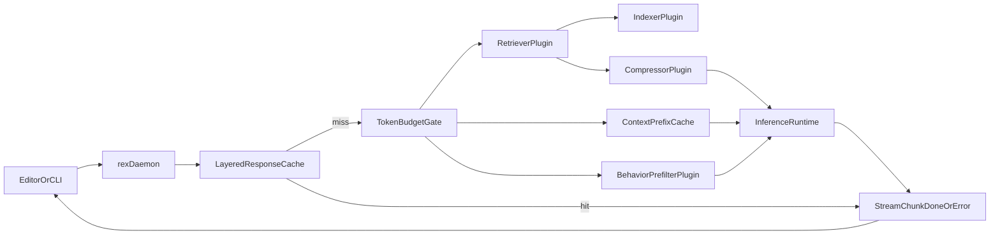

# Context Efficiency Architecture

This guide defines how REX reduces token usage and local compute for coding workflows.

**Hub:** Canonical **economics lever matrix** ([below](#economics-lever-matrix-rex-vs-product-techniques)) + system views in [ARCHITECTURE.md](ARCHITECTURE.md). **ADR** rationale: [architecture/decisions/](architecture/decisions/).

**Inference adapters:** pipeline stages are **not** one-size-fits-all. Each adapter (**HTTP OpenAI-compat**, mock harness, Cursor CLI legacy, or a future sidecar) declares `AdapterCapabilities` in `docs/ADAPTERS.md` so the daemon can skip or apply indexer, compressor, token budget, cache, and behavioral prefilter. **Cursor adapter profile (design default):** skip heavy lexical **context injection** and **token-budget truncation** of the user prompt; keep the **behavioral prefilter**; **mode-gated** response cache per `docs/CACHING.md`.

**Phase 1 product path:** **sidecar agent** + **brokered HTTP** — configure `inference.openai_compat` in JSON for the daemon broker ([CONFIGURATION.md](CONFIGURATION.md), [MVP_SPEC.md](MVP_SPEC.md)). Direct daemon HTTP without sidecar is harness-only. Legacy Cursor CLI: [PLUGIN_ROADMAP.md](PLUGIN_ROADMAP.md).

## Scope

- Add token budget controls before inference.
- Select and compress context primarily **inside `rex-daemon`**; delegate heavy experimentation to optional sidecars only when isolation dictates — [PLUGIN_ROADMAP.md](PLUGIN_ROADMAP.md).
- Keep `rex-daemon` responsible for transport and stream correctness.
- Keep generic byte compression as storage-only optimization.

## Economics lever matrix (REX vs product techniques)

Single authoritative mapping. **`Status`** reflects code or documented design intent.

| Technique | REX responsibility | Module / seam | Primary doc anchor | Status |
|-----------|-------------------|---------------|--------------------|--------|
| Model routing / escalation cascade | Daemon chooses backend + model hint before adapter | `routing::decide_route` (env today); logs `route=` | [ADR 0004](architecture/decisions/0004-routing-daemon-first-optional-http-gateway.md), [PLUGIN_ROADMAP.md](PLUGIN_ROADMAP.md) | **partial** (env hook) |
| Adaptive retrieval gate | Skip indexer for short prompts, `[[retrieve:off]]`, or focused-behavior snapshot; log `retrieval=ran\|skipped` | `plugins::should_skip_retrieval` | [CONFIGURATION.md](CONFIGURATION.md) prompt directives | **implemented** (heuristic) |
| Advisory intent retrieval (**R067**) | Force retrieval or fixed priority doc bundle when prompt matches advisory patterns (bypasses ≤48 char skip) | `plugins::advisory_intent` + `ContextPipeline` | This doc — [Advisory intent retrieval](#advisory-intent-retrieval-r067) | **planned** |
| Context compaction — verbatim-safe packing | Query-ranked extractive line packing (`compression_strategy=extractive_query`) | `ExtractiveContextCompressor` in `plugins.rs` | Responsibility map below | **implemented** (extractive) |
| Context compaction — learned / small-model | Optional compressor stage or sidecar ML | Context pipeline compressor hooks | Evidence-informed defaults | **planned** |
| Layered response cache — L1 exact | In-process LRU keyed by adapter, model, mode, schema, workspace | L1 cache + policy engine — [CACHING.md](CACHING.md), [POLICY_ENGINE.md](POLICY_ENGINE.md) | implemented (ask) |
| Layered cache — L2 semantic | Embedding similarity **ask-only** guarded | Planned | [CACHING.md](CACHING.md) | **planned** |
| Prefix / shared context reuse | TTL prefix cache segments in pipeline | `PrefixCache` in context pipeline | Responsibility map below | **partial** |
| Vendor KV / prompt cache hints | Depends on outbound API owning runtime | Adapter metadata future | [CACHING.md](CACHING.md#vendor-kv-and-prompt-cache-hints-planned) | **planned** |
| Web search query cache + per-turn dedup | Daemon L2 cache before capability invoke; cap queries per turn | `BrokerWebSearch` → capability sidecar | [WEB_SEARCH.md](WEB_SEARCH.md) | **planned** |
| LiteLLM Inference Gateway | One compat hop; opt-in managed or external URL | `http_openai_compat` + gateway | [INFERENCE_GATEWAY.md](INFERENCE_GATEWAY.md), [ADR 0019](architecture/decisions/0019-inference-gateway-opt-in-litellm.md) | **implemented** |
| Direct OpenAI API (secondary) | Same adapter, direct vendor URL | `http_openai_compat` | [ADAPTERS.md](ADAPTERS.md#http-openai-compatible-chatcompletions-profile-broker) | **documented** |
| Native Anthropic Messages API (secondary) | No compat hop; Messages wire | Planned `anthropic` runtime + broker dispatch | [ADAPTERS.md](ADAPTERS.md#direct-anthropic-messages-api-planned--secondary) | **planned** |
| Layered prompts (system/project stack) | Versioned assemblies to avoid duplicate client rules | Config + daemon assembly | [ADR 0012](architecture/decisions/0012-layered-prompt-assemblies.md), [CONFIGURATION.md](CONFIGURATION.md#layered-prompts-design-accepted) | **design accepted** |
| oMLX managed local inference (Mac) | Daemon-supervised oMLX; OpenAI-compat wire | `http_openai_compat` + `inference.omlx.*` injects `openai_compat.base_url` | [OMLX_INFERENCE.md](OMLX_INFERENCE.md), [ADR 0033](architecture/decisions/0033-omlx-managed-local-inference.md) | **planned** |
| In-daemon MLX inference adapter | Optional in-process broker backend (non-HTTP) | `InferenceRuntime` adapter seam | [ADAPTERS.md](ADAPTERS.md#in-daemon-mlx-path-deferred) | **planned** (deferred on Mac) |
| Batching / async doc jobs | Lower priority vs interactive latency | Future RPC/job | [ROADMAP.md](ROADMAP.md) | **planned** |
| Project memory — decisions + repo fingerprints | Reduce chat-history token pressure | `ProjectMemoryRetrieval` stage | [ADR 0014](architecture/decisions/0014-long-term-memory-boundary.md), [LONG_TERM_MEMORY.md](LONG_TERM_MEMORY.md) | **design accepted** |
| Agent knowledge retrieval | Curated design/agent reference; budgeted inject vs repo markdown sprawl | `KnowledgeRetrieval` stage | [ADR 0015](architecture/decisions/0015-agent-knowledge-bundles.md), [AGENT_KNOWLEDGE.md](AGENT_KNOWLEDGE.md) | **design accepted** |
| Economics validation harness | Prove token/cost deltas (paid API + local OSS) vs baseline | Benchmark / CI smoke | [ECONOMICS_VALIDATION.md](ECONOMICS_VALIDATION.md), [LANGFUSE_INTEGRATION.md](LANGFUSE_INTEGRATION.md) | **partial** (live smoke **R039** Met; LangFuse datasets **LF-F04** planned) |
| MCP / standard tool interoperability | MCP **primarily** in **isolated sidecar**; host reach **brokered**; lazy tool discovery | Sidecar envelope + daemon broker | [ADR 0016](architecture/decisions/0016-mcp-in-sidecar-envelope.md), [ADR 0008](architecture/decisions/0008-dedicated-sidecar-control-plane-api.md) | **design accepted** — implementation deferred |
| Human approvals + sandbox for tools | Extension modes today; daemon `ApprovalGate`; `AccessPolicy` broker | [ADR 0013](architecture/decisions/0013-access-policy-broker-completion.md), [AGENT_ACCESS_POLICY.md](AGENT_ACCESS_POLICY.md), [POLICY_ENGINE.md](POLICY_ENGINE.md), [ROADMAP.md](ROADMAP.md) **R020** | **implemented** — JSON `agent.approvals_enabled`; mode × capability matrix + write/exec (**R020** Done) |
| Intra-turn scratch compaction | Sidecar `RemoveMessage` + summarization after tool bursts | `rex-agent` graph compaction node | [AGENT_GRAPH_ARCHITECTURE.md](AGENT_GRAPH_ARCHITECTURE.md) | **implemented** — **R029** |
| Diff-only writes | Editor unified diff; sidecar read→patch→write before broker | `rex-agent` `fs.write` handler | [AGENT_GRAPH_ARCHITECTURE.md](AGENT_GRAPH_ARCHITECTURE.md) | **implemented** — **R030** |
| Subagent model cascade | Cheaper model hint for Viewer subgraph | `RunTurn.model` or sidecar config | [AGENT_GRAPH_ARCHITECTURE.md](AGENT_GRAPH_ARCHITECTURE.md) | **implemented** — **R028** |
| Sidecar read pruning | Goal-hint filter when read payload >100 lines | Post-`BrokerReadFile` sidecar stage | [AGENT_GRAPH_ARCHITECTURE.md](AGENT_GRAPH_ARCHITECTURE.md) | **implemented** — **R031** Done |
| Prefix immutability (SHA-256 contract) | Static `[system]` + `daemon_context` unchanged across tool steps in one turn | Sidecar `messages_to_prompt()` + daemon assembly | [AGENT_GRAPH_ARCHITECTURE.md](AGENT_GRAPH_ARCHITECTURE.md), [ADR 0023](architecture/decisions/0023-hybrid-agent-serialization-boundaries.md) | **implemented** — **R027**, **R032** |
| Raw delimited tool results | Daemon returns `<<TOOL_RESULT:tool>>` … `<<END>>`; line-boundary truncation | Broker RPC result shaping → sidecar prompt | [ADR 0023](architecture/decisions/0023-hybrid-agent-serialization-boundaries.md) | **implemented** — **R034** |
| Microcompaction tier | Replace stale `fs.read` transcripts (>2 steps) with stubs before each LLM call | Sidecar graph pre-inference hook | [AGENT_GRAPH_ARCHITECTURE.md](AGENT_GRAPH_ARCHITECTURE.md) | **cancelled** — prefix-cache cost; not implemented |
| TRON static schema compression | Compact repeated tool shapes in daemon-assembled prefix | `ContextPipeline` / turn assembly | [ADR 0023](architecture/decisions/0023-hybrid-agent-serialization-boundaries.md) | **design accepted** — **R036** (Could) |
| Vendor cache breakpoints | Ephemeral marker at static/volatile boundary | Gateway or HTTP adapter metadata | [CACHING.md](CACHING.md#prefix-immutability-and-cache-breakpoints-agent-turns) | **planned** (Could) |

**Cost dominance (agent turns):** per-step re-transmission of the static prefix typically dominates spend in 5–12 step loops; per-turn daemon assembly is fixed once. Engineering priority: prefix lock → microcompaction → raw results → diff-only writes → schema compression → native broker tools (**R038**) — [AGENT_GRAPH_ARCHITECTURE.md](AGENT_GRAPH_ARCHITECTURE.md#cost-model), [NATIVE_TOOL_CALLING.md](NATIVE_TOOL_CALLING.md).

## Evidence-informed defaults

- Treat context as a scarce budget and avoid over-packing prompts; long-context quality can degrade when relevant evidence is buried ([Lost in the Middle](https://aclanthology.org/2024.tacl-1.9/)).
- Prefer retrieve-on-demand over fixed retrieval for every query when adapter capabilities allow it ([Self-RAG](https://arxiv.org/abs/2310.11511)).
- Use query-aware compression so local models can handle more tasks within bounded token budgets ([LLMLingua](https://arxiv.org/abs/2310.05736)).

## Architecture flow



The cache and each pipeline stage can be **skipped** when the active adapter’s capabilities say so (for example, Cursor: skip most indexer or compressor context attached to the prompt, but run prefilter).

## Responsibility map

| Component | Responsibility |
|---|---|
| `rex-daemon` | Owns UDS/gRPC transport, lifecycle, final stream contract, and orchestration. |
| `LayeredResponseCache` (design) | L1 exact (and optional L2 semantic) cache in front of the inference adapter; see `docs/CACHING.md`. |
| `TokenBudgetGate` | Enforces prompt/context limits when the adapter opts in to REX context shaping. |
| `IndexerPlugin` | Maintains workspace-aware lexical index and ignore rules. |
| `RetrieverPlugin` | Selects top candidate context chunks deterministically. |
| `CompressorPlugin` | Applies extractive compression and token-budget packing. |
| `ContextPrefixCache` | Reuses stable context segments inside the REX context pipeline (today `PrefixCache` in the daemon) with TTL and bypass. |
| `BehaviorPrefilterPlugin` | Optionally suppresses low-value invocations using local behavior snapshots. |
| Sidecar agent runtime | Development agent loop, tool **intent** | **Implemented** — [SIDECAR_RUNTIME.md](SIDECAR_RUNTIME.md); v1.0 [RC-03](V1_0.md) |
| `InferenceRuntime` (broker) | **HTTP OpenAI-compat** when sidecar requests completion; mock (tests); MLX/Cursor CLI (legacy) | Broker **implemented**; sidecar routing **implemented** — [ADAPTERS.md](ADAPTERS.md) |

| Adapter (design) | REX context pipeline (default) |
|---|---|
| Mock / local MLX (future) | Full: budget gate, indexer, compressor, prefix cache, prefilter, then inference. |
| **Cursor CLI** (design) | **Prefilter on**; do **not** add heavy `[context]` from the lexical path on top of the user text; do **not** **truncate** the user prompt in the REX path before the CLI; response cache per mode in `docs/CACHING.md`. |

## Coding-first features

| Feature | Current behavior | Boundary |
|---|---|---|
| Workspace-scoped index | Uses lexical index with deterministic ranking and ignore filtering. | Sidecar-like plugin |
| Diff/hunk-aware packing | Supports compact context packing by selecting only relevant chunks. | Sidecar-like plugin |
| Symbol/structure chunking | Supports chunk-oriented retrieval contract; can evolve to AST-aware chunks later. | Sidecar-like plugin |
| Build/test diagnostics hint | Accepts diagnostics hint directives in prompt metadata. | Client input + sidecar-like plugin |
| Task-scoped context bundle | Supports bounded prompt context envelope (`prompt + [context]`). | Daemon orchestration |

## Current plugin contract

The daemon uses these contracts internally as sidecar seams:

- `TokenBudget`: max prompt tokens and max context tokens.
- `ContextRequest`: prompt, diagnostics hint, cache bypass flag, behavior snapshot.
- `PipelineResult`: effective prompt plus per-request metrics.
- `PipelineMetrics`: prompt tokens, context tokens, candidate/selected counts, truncation, cache status, behavior decision.

This contract lives in the daemon **context pipeline** module (`plugins`).

## Routing observability (RC-09)

Each `StreamInference` request logs a grep-friendly economics line at stream start:

```text
stream.request_id=… trace_id=… route=sidecar+http-openai-compat decision_id=dec-… inference_runtime=… stream.lifecycle=starting …
```

| Field | Meaning |
|-------|---------|
| `route=` | Resolved path label (`sidecar+<runtime>`, `harness_direct+<runtime>`, or `daemon_direct+<runtime>`) |
| `decision_id=` | Stable per-request id (`dec-{request_id}`) for correlating logs |

Broker RPCs log `broker.inference=*` and `broker.access_policy=*` separately.

### Planned per-turn economics fields (design)

Extend the stream-start line when stages ship ([OBSERVABILITY_AND_ECONOMICS.md](OBSERVABILITY_AND_ECONOMICS.md), [DEVELOPMENT_ASSISTANCE_CAPABILITIES.md](DEVELOPMENT_ASSISTANCE_CAPABILITIES.md)):

| Field | Meaning |
|-------|---------|
| `estimated_prompt_tokens=` | Heuristic after assembly |
| `estimated_context_tokens=` | Injected retrieval + knowledge + memory |
| `prompts=` | Layered assembly bytes / revision |
| `knowledge=` | Bundle revision, hit/miss, drift |
| `memory=` | LTM retrieval hit/miss |
| `retrieval=` | `ran` \| `skipped` \| `advisory_bundle` (R067) |

## Advisory intent retrieval (R067)

**Status:** planned — **Should**

### Problem

[`should_skip_retrieval`](../../crates/rex-daemon/src/plugins.rs) skips lexical retrieval when the prompt is ≤48 characters. Short advisory prompts such as “What should we do next?” (26 chars) receive empty `[context]` even when `docs/ROADMAP.md` and `docs/PRIORITIZATION.md` would answer the question.

### Decision

Add an **advisory intent** bypass before the length heuristic:

1. **Classifier:** `AdvisoryIntent` in `rex-daemon` (Rust source of truth). Sidecar mirrors patterns for R070 init gating only.
2. **Patterns (initial, case-insensitive):** `what should we do next`, `what's next`, `what to work on`, `priorities`, `roadmap`, `next step`.
3. **When matched:** force `retrieval=ran` via indexer **or** inject a **fixed priority bundle** (`docs/ROADMAP.md`, `docs/PRIORITIZATION.md`, `README.md`) within existing `context.max_context_tokens`.
4. **Config:** `context.advisory_intent_enabled` (default `true`) — see [CONFIGURATION.md](CONFIGURATION.md).

### Boundaries

| Layer | Owns |
|-------|------|
| Daemon | Intent match, bundle read, `[context]` assembly |
| Sidecar | Consumes enriched prompt; no duplicate retrieval |

### Acceptance

- Prompt “What should we do next?” yields non-empty context with roadmap/priority signals.
- Stream log includes `retrieval=ran` or `retrieval=advisory_bundle`.
- Non-advisory short prompts still skip retrieval (unchanged heuristic).

### Cross-links

- [PROJECT_CONTEXT_PATHS.md](PROJECT_CONTEXT_PATHS.md) — **R066** long-term pre-injection
- [AGENT_GRAPH_ARCHITECTURE.md](AGENT_GRAPH_ARCHITECTURE.md) — **R068**, **R070**

## Configuration examples

### Cache bypass

- Global bypass through environment variable:
  - `REX_CACHE_BYPASS=1`
- Per-request bypass directive inside prompt:
  - `[[cache:bypass]]`

### Diagnostics hint

- Add a diagnostics line to improve retrieval focus:
  - `[[diag: cargo test failed in runtime module]]`

### Behavior snapshot hint

- Add a focused typing hint to test behavioral prefilter path:
  - `[[behavior:focused]]`

### Retrieval gate

- Skip lexical retrieval for this request:
  - `[[retrieve:off]]`

## Local behavior telemetry defaults

### Defaults

- Keep behavior telemetry local.
- Do not persist raw code.
- Do not persist raw prompts.
- Emit coarse event categories only.

### Suggested event schema

| Field | Type | Example | Notes |
|---|---|---|---|
| `ts` | RFC3339 string | `2026-04-25T16:00:00Z` | Event timestamp |
| `typing_cadence_cpm` | integer | `280` | Characters per minute |
| `pause_events_last_minute` | integer | `2` | Coarse cognitive rhythm |
| `suggestion_requests_last_minute` | integer | `4` | Request pressure |
| `suppressed` | boolean | `false` | Prefilter result |
| `reason_code` | string | `focused-typing-window` | Stable categorical reason |

### Retention policy

- Use capped local storage (ring buffer or capped SQLite table).
- Rotate old entries automatically.
- Allow explicit user export for diagnostics.

## Multi-agent setup

When more than one agent can change this repository, follow the project **multi-agent collaboration** policy, plus any **global** multi-agent guardrails you keep in your own environment. Apply them at task start, before branch or stash actions, and at handoff.

## Verification checklist

- [ ] `cargo test -p rex-daemon` passes.
- [ ] Stream still ends with exactly one terminal event (`done` or `error`).
- [ ] Daemon logs include `stream.metrics` line per request.
- [ ] Cache reports `hit`, `miss_stored`, or `bypass`.
- [ ] Behavior prefilter path can be exercised with prompt directive.

## Out of scope for this phase

- Wasm plugin runtime hosting.
- Cross-process plugin supervision.
- ML-trained behavior model.
- Semantic retrieval reranking in production path.
