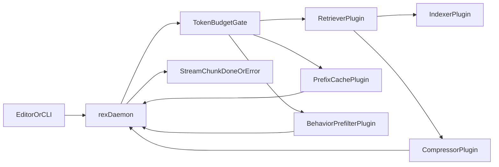

# Context Efficiency Architecture

This guide defines how REX reduces token usage and local compute for coding workflows.

## Scope

- Add token budget controls before inference.
- Select and compress context through sidecar-like plugins.
- Keep `rex-daemon` responsible for transport and stream correctness.
- Keep generic byte compression as storage-only optimization.

## Architecture flow

## Responsibility map

| Component | Responsibility |
|---|---|
| `rex-daemon` | Owns UDS/gRPC transport, lifecycle, final stream contract, and orchestration. |
| `TokenBudgetGate` | Enforces prompt/context limits before inference. |
| `IndexerPlugin` | Maintains workspace-aware lexical index and ignore rules. |
| `RetrieverPlugin` | Selects top candidate context chunks deterministically. |
| `CompressorPlugin` | Applies extractive compression and token-budget packing. |
| `PrefixCachePlugin` | Reuses stable prompt prefix context with TTL and bypass. |
| `BehaviorPrefilterPlugin` | Optionally suppresses low-value invocations using local behavior snapshots. |

## Coding-first features

| Feature | Current behavior | Boundary |
|---|---|---|
| Workspace-scoped index | Uses lexical index with deterministic ranking and ignore filtering. | Sidecar-like plugin |
| Diff/hunk-aware packing | Supports compact context packing by selecting only relevant chunks. | Sidecar-like plugin |
| Symbol/structure chunking | Supports chunk-oriented retrieval contract; can evolve to AST-aware chunks later. | Sidecar-like plugin |
| Build/test diagnostics hint | Accepts diagnostics hint directives in prompt metadata. | Client input + sidecar-like plugin |
| Task-scoped context bundle | Supports bounded prompt context envelope (`prompt + [context]`). | Daemon orchestration |

## Current plugin contract

The daemon uses these contracts internally as sidecar seams:

- `TokenBudget`: max prompt tokens and max context tokens.
- `ContextRequest`: prompt, diagnostics hint, cache bypass flag, behavior snapshot.
- `PipelineResult`: effective prompt plus per-request metrics.
- `PipelineMetrics`: prompt tokens, context tokens, candidate/selected counts, truncation, cache status, behavior decision.

This contract lives in `crates/rex-daemon/src/plugins.rs`.

## Configuration examples

### Cache bypass

- Global bypass through environment variable:
  - `REX_CACHE_BYPASS=1`
- Per-request bypass directive inside prompt:
  - `[[cache:bypass]]`

### Diagnostics hint

- Add a diagnostics line to improve retrieval focus:
  - `[[diag: cargo test failed in runtime module]]`

### Behavior snapshot hint

- Add a focused typing hint to test behavioral prefilter path:
  - `[[behavior:focused]]`

## Local behavior telemetry defaults

### Defaults

- Keep behavior telemetry local.
- Do not persist raw code.
- Do not persist raw prompts.
- Emit coarse event categories only.

### Suggested event schema

| Field | Type | Example | Notes |
|---|---|---|---|
| `ts` | RFC3339 string | `2026-04-25T16:00:00Z` | Event timestamp |
| `typing_cadence_cpm` | integer | `280` | Characters per minute |
| `pause_events_last_minute` | integer | `2` | Coarse cognitive rhythm |
| `suggestion_requests_last_minute` | integer | `4` | Request pressure |
| `suppressed` | boolean | `false` | Prefilter result |
| `reason_code` | string | `focused-typing-window` | Stable categorical reason |

### Retention policy

- Use capped local storage (ring buffer or capped SQLite table).
- Rotate old entries automatically.
- Allow explicit user export for diagnostics.

## Multi-agent setup

Use these guardrails when more than one agent can change this repository:

- Project rule: `.cursor/rules/multi-agent-collaboration.mdc`
- Global rule: `~/.cursor/rules/multi-agent-collaboration-global.mdc`
- Global skill: `~/.cursor/skills/multi-agent-collab-guardrails/SKILL.md`

Apply the guardrails at task start, before branch or stash actions, and at handoff.

## Verification checklist

- [ ] `cargo test -p rex-daemon` passes.
- [ ] Stream still ends with exactly one terminal event (`done` or `error`).
- [ ] Daemon logs include `stream.metrics` line per request.
- [ ] Cache reports `hit`, `miss_stored`, or `bypass`.
- [ ] Behavior prefilter path can be exercised with prompt directive.

## Out of scope for this phase

- Wasm plugin runtime hosting.
- Cross-process plugin supervision.
- ML-trained behavior model.
- Semantic retrieval reranking in production path.
