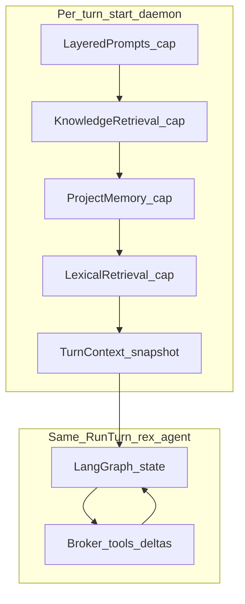
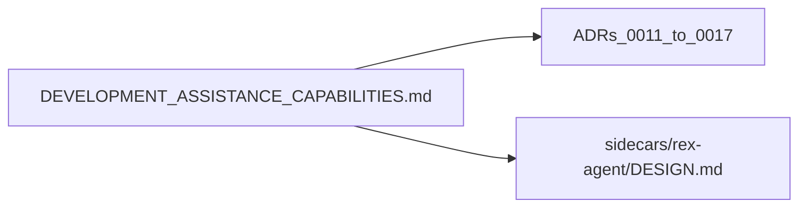

# Development assistance capabilities (design hub)

**Status:** **design accepted** — interfaces and ADRs 0011–0017 record decisions; implementation follows [ROADMAP.md](ROADMAP.md) **R015–R019**.

Canonical **integrator** for what REX owns when assisting software development with a supervised agent (`rex-agent`). Economics levers and the full matrix live in [CONTEXT_EFFICIENCY.md](CONTEXT_EFFICIENCY.md); this hub owns **ownership**, **turn contract**, **budget pipeline**, and **conflict resolutions**.

See [DOCUMENTATION.md](DOCUMENTATION.md) for hub conventions. Align with [PURPOSE_AND_PRINCIPLES.md](PURPOSE_AND_PRINCIPLES.md) and [ADR 0001](architecture/decisions/0001-daemon-owns-agent-orchestration-and-economics.md).

## Purpose

- Give `rex-agent` and client authors one place for **who owns what** (daemon vs sidecar vs extension).
- Define **`TurnContext`** and workspace binding so context is not only opaque prompt strings.
- Treat **tokens and local compute** as a **budgeted resource** with measurable stages (remote APIs and on-device inference).

## Scope

**In:**

- Stream/mode policy, context pipeline, broker sandbox, turn assembly, layered prompts (design), LTM and knowledge (design), MCP posture (design).
- Phase 1 wire shape: enriched `RunTurn.prompt` string; Phase 1b optional proto fields (see [Turn contract](#turn-contract)).

**Out:**

- LangGraph graph structure (sidecar implementation detail).
- Implementing LTM stores, semantic L2, MLX, or OS Seatbelt sandbox (backlog).
- Breaking `rex.v1` NDJSON for the extension.

## Ownership matrix

| Capability | Owner | Phase |
|------------|-------|-------|
| Stream contract, modes, L1 response policy | `rex-daemon` | 1 — shipped / extend |
| Workspace root + broker sandbox | Daemon resolves; client **supplies** root | 1 — design accepted; **R015** impl |
| Lexical retrieval + compression | Daemon `ContextPipeline` | 1 — shipped |
| Layered system/project prompts | Daemon assembly | 1 — design accepted; 2 — impl |
| Editor selection / chat transcript | Extension / client UX | 1 |
| Graph state, tool loop | `rex-agent` sidecar | 1 — **R018** |
| Session scratch (tool outputs, partial plans) | Sidecar ephemeral | 1 — design accepted |
| Turn/session correlation ids | Daemon issues; clients echo | 1 — design accepted |
| Durable project memory | Daemon store + pipeline stage | 2 — [ADR 0014](architecture/decisions/0014-long-term-memory-boundary.md) |
| Agent knowledge bundles | Daemon `KnowledgeRetrieval` stage | 2 — [ADR 0015](architecture/decisions/0015-agent-knowledge-bundles.md) |
| MCP tools/resources | Sidecar guest; host via broker | 2 — [ADR 0016](architecture/decisions/0016-mcp-in-sidecar-envelope.md) |

Trust model: sidecar **requests**; daemon **authorizes, assembles context, executes broker actions, meters, logs** ([ADR 0008](architecture/decisions/0008-dedicated-sidecar-control-plane-api.md)).

## Phase 1 vs Phase 2

| Phase | Deliverable |
|-------|-------------|
| **1 (now)** | `TurnContext` logical model; workspace binding rules ([ADR 0011](architecture/decisions/0011-workspace-binding-and-turn-context-authority.md)); policy/prompt ADRs; `rex-agent` DESIGN; extension sets `REX_WORKSPACE_ROOT` (**R019**) |
| **1b** | Additive `turn_id`, `context_revision` on `rex.sidecar.v1.RunTurnRequest` (optional fields) |
| **2** | Layered prompt impl; `ProjectMemoryRetrieval`; `KnowledgeRetrieval`; MCP profile; multi-root workspace (optional ADR amendment) |

## Context budget pipeline

Assembly runs **once per `StreamInference` / `RunTurn` start** (not per LLM step inside the sidecar graph). Stages share a single budget ([ADR 0012](architecture/decisions/0012-layered-prompt-assemblies.md)).

**Default budget split (design default, overridable in R015 config):**

| Stage | Default share of `REX_MAX_CONTEXT_TOKENS` | Truncation priority |
|-------|------------------------------------------|---------------------|
| Layered prompts | 25% | Trim last (after retrieval) |
| Knowledge retrieval | 15% | Third |
| Project memory | 10% | Second |
| Lexical retrieval | 50% | First |

**Truncation rule:** When over budget, reduce **lexical** chunks first, then **memory**, then **knowledge**; never drop **system** slice of layered prompts without explicit operator config.

## Design principles (economics)

1. **Budget before send** — `TokenBudgetGate` when the adapter opts in ([ADAPTERS.md](ADAPTERS.md)).
2. **Retrieve, don’t preload** — Default skip lexical retrieval for short/focused turns; client hints are path/range, not full files.
3. **Assemble once per turn start** — Daemon merges stages; sidecar owns intra-turn graph state.
4. **Measure every stage** — Log `prompt_tokens`, `context_tokens`, `retrieval=`, `memory=`, `knowledge=`, `prompts=` (planned fields in [CONTEXT_EFFICIENCY.md](CONTEXT_EFFICIENCY.md)).
5. **Stable broker, lazy tools** — Host via `Broker*` RPCs; MCP deferred tool discovery ([ADR 0016](architecture/decisions/0016-mcp-in-sidecar-envelope.md)).
6. **Mode-aware economics** — `ask` may use L1; `agent` never caches responses ([ADR 0003](architecture/decisions/0003-layered-cache-agent-mode-policy.md)); approvals before expensive tool chains.

## Turn contract

### TurnContext (logical model)

Daemon-assembled snapshot at turn start. Not yet a separate proto message in Phase 1; fields are reflected in logs and the enriched prompt string.

| Field | Description |
|-------|-------------|
| `workspace_root` | Absolute path; daemon-resolved ([ADR 0011](architecture/decisions/0011-workspace-binding-and-turn-context-authority.md)) |
| `workspace_fingerprint` | Hash for cache keys (path + optional git HEAD) |
| `effective_user_prompt` | Post-directive, pre-`[context]` user text |
| `injected_context` | Bounded chunks + `PipelineMetrics` snapshot |
| `layered_prompt_revision` | Assembly version when layered prompts ship |
| `context_revision` | Hash of all injected stages (for L1 when retrieval ran) |
| `mode`, `model`, `approval_id` | From `StreamInference` / `RunTurn` |
| `request_id`, `turn_id` | Daemon-issued correlation (Phase 1b proto optional) |
| `client_hints` | Optional: active file path, selection **range** — not full file bodies by default |

### RunTurn mapping

| Phase | Wire format |
|-------|-------------|
| **1** | `RunTurnRequest.prompt` = serialized effective turn (user + layered prefix + `[context]` suffix) |
| **1b** | Add optional `turn_id`, `context_revision` on [sidecar.proto](../proto/rex/sidecar/v1/sidecar.proto) |

### Non-goals

- Daemon does **not** store full chat transcript ([AGENT_ACCESS_POLICY.md](AGENT_ACCESS_POLICY.md)).
- Sidecar does **not** access host FS/network except via daemon broker.
- Initial daemon context does **not** forbid broker `fs.read` for **deltas** after edits (see conflict **C2** below).

### Workspace binding (summary)

- Config: `workspace.root` in `.rex/config.json` / env (**R015**).
- Extension: set `REX_WORKSPACE_ROOT` to primary `workspaceFolders[0]` when spawning daemon (**R019**).
- Product path: **fail-closed** if root unset; cwd fallback only with `REX_ALLOW_CWD_WORKSPACE=1` (harness/CI) — [ADR 0011](architecture/decisions/0011-workspace-binding-and-turn-context-authority.md).
- Multi-root: Phase 1 uses primary folder only; log `workspace.warning=multi_root` when `folders.length > 1`.

## Interfaces (intent)

| Name | Role |
|------|------|
| `TurnContext` | Daemon-assembled per-turn snapshot (this hub) |
| `ContextBudgetAllocator` | Splits `REX_MAX_*_TOKENS` across pipeline stages |
| `LayeredPromptAssembly` | `system → project → mode` merge ([ADR 0012](architecture/decisions/0012-layered-prompt-assemblies.md)) |
| `AccessPolicy` | Broker allow/deny ([ADR 0013](architecture/decisions/0013-access-policy-broker-completion.md)) |
| `ProjectMemoryRetrieval` | LTM pipeline stage ([ADR 0014](architecture/decisions/0014-long-term-memory-boundary.md)) |
| `KnowledgeRetrieval` | Curated bundle stage ([ADR 0015](architecture/decisions/0015-agent-knowledge-bundles.md)) |
| `KnowledgeBundle` / `BundlePointer` | Versioned corpora; repo `AGENTS.md` pointer |

No new `rex.v1` RPCs for LTM/knowledge until a deliberate versioned migration.

## Conflict register

Hard conflicts (**C***) and resolutions recorded in ADRs.

| ID | Tension | Resolution |
|----|---------|------------|
| **C1** | Thin `client_hints` vs extension embedding full selection in prompt | Migrate extension to hints (**R019**); until then document **double-count risk**; daemon may strip duplicate `File:/Selection:` blocks when `context_revision` set |
| **C2** | Retrieve-on-demand vs agent `fs.read` tools | Daemon injects **initial** snapshot; broker tools for **deltas** only |
| **C3** | Assemble once vs LangGraph multi-step loop | **Once per turn start**; intra-turn state in sidecar scratch |
| **C4** | No daemon transcript vs LTM ingestion | LTM ingests **exported events** / extracted facts, not UI transcript DB |
| **C5** | Large layered prompts vs retrieval/memory/knowledge | `ContextBudgetAllocator` with stage caps (table above) |
| **C6** | Git Copilot-style files vs Rex bundles | Single ingestion path per source; dedupe by content hash ([ADR 0015](architecture/decisions/0015-agent-knowledge-bundles.md)) |
| **C7** | Drift `fail-closed` (agent) vs `prefer-git` (ask) | Intentional per-mode policy |
| **C8** | Fail-closed workspace vs cwd fallback | Product: require root; harness: `REX_ALLOW_CWD_WORKSPACE=1` |
| **C9** | Single `REX_WORKSPACE_ROOT` vs multi-root IDE | Phase 1 primary folder only |
| **C10** | MCP in sidecar vs broker-only host | Host effects map to broker verbs only ([ADR 0016](architecture/decisions/0016-mcp-in-sidecar-envelope.md)) |
| **C11** | KnowledgeBroker vs MCP resources | One `KnowledgeRetrieval` stage; MCP is transport profile |

**Soft tensions:** **T1** L1 key includes `assembly_revision` + `context_revision`; **T2** prefix cache allowed for agent with workspace fingerprint; **T3** hard context cap (no silent Aider-style overflow); **T4** Cursor adapter may skip lexical inject per capabilities; **T5** scratch and broker share `max_tool_result_bytes`; **T6** LTM compaction ≠ per-turn extractive pack; **T7** `plan` mode off L1 like `agent` ([CACHING.md](CACHING.md)).

## Boundaries: memory vs knowledge vs prompts

| Dimension | Layered prompts | Agent knowledge | Long-term memory |
|-----------|-----------------|-----------------|------------------|
| Content | System/project/mode rules | Operator-curated reference | Session-derived facts |
| Volatility | Low; versioned | Low; bundle revision | High; compaction |
| Stage order | First | Second | Third |
| Hubs | [CONFIGURATION.md](CONFIGURATION.md), ADR 0012 | [AGENT_KNOWLEDGE.md](AGENT_KNOWLEDGE.md), ADR 0015 | [LONG_TERM_MEMORY.md](LONG_TERM_MEMORY.md), ADR 0014 |

## Market benchmark (abbreviated)

| Pattern | Gap | REX choice |
|---------|-----|------------|
| Client-assembled mega-prompts (Cursor, Windsurf) | Opaque token spend | Daemon meters and caps each stage |
| Reactive compaction (Claude Code) | Lossy late summarization | Proactive pipeline + future LTM facts |
| MCP tool schema dump | 10K–55K tokens/turn overhead | Broker verbs + lazy MCP ([ADR 0016](architecture/decisions/0016-mcp-in-sidecar-envelope.md)) |
| Mem0-style memory | Separate policy layer | Daemon `ProjectMemoryRetrieval` under same budget |

## Cross-links

| Doc | Relationship |
|-----|----------------|
| [AGENT_DELIVERY_ROADMAP.md](AGENT_DELIVERY_ROADMAP.md) | `rex-agent` target architecture |
| [CONTEXT_EFFICIENCY.md](CONTEXT_EFFICIENCY.md) | Economics matrix |
| [POLICY_ENGINE.md](POLICY_ENGINE.md) | Policy vs mechanism |
| [AGENT_ACCESS_POLICY.md](AGENT_ACCESS_POLICY.md) | Memory/session ownership |
| [architecture/decisions/README.md](architecture/decisions/README.md) | ADRs 0011–0017 |

