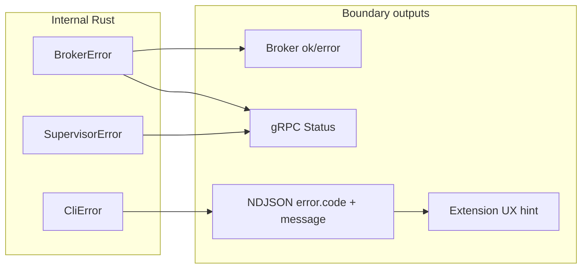

# Error handling


> Role: reference | Status: active | Audience: contributors | Read when: error codes and messages
> Prefer: ## Error code catalog

Canonical hub for **how Rex surfaces failures** across daemon, CLI, extension, sidecar, broker, and plugins. Wire shapes for the editor path live in [STREAM_EVENTS.md](STREAM_EVENTS.md); this document defines **principles**, **message quality**, **code taxonomy**, and **CI enforcement**.

## Purpose and audiences

| Audience | Use this doc to |
|----------|-----------------|
| **Operators / extension users** | Understand what failed and what to try next (via CLI NDJSON and UI messages). |
| **Integrators** | Emit and consume stable `error.code` values on the NDJSON stream path. |
| **Contributors** | Author errors at layer boundaries; review PRs for actionable, non-leaking messages. |

Product errors are **not** the same as CI failure codes (`FMT_FAIL`, `GUIDELINES_FAIL`, …) — see [CI.md](CI.md).

## Principles

Adapted from [AIP-193](https://google.aip.dev/193), [gRPC error handling](https://grpc.io/docs/guides/error/), and [RFC 9457](https://www.rfc-editor.org/rfc/rfc9457):

1. **Two channels** — Every user-facing failure exposes a stable **code** (machine) and a **message** (human). Do not encode classification only in prose.
2. **Actionable messages** — Brief formula: **what failed → why/context → next step**. No crate names, stack traces, or internal type names on operator paths.
3. **Audience split**
 - **User/operator path** (NDJSON stdout, extension UI): plain language and recovery steps; link to setup docs when helpful.
 - **Developer/debug path** (daemon logs, CLI `--trace-id`): may include socket paths and `source` chains — never secrets or full sensitive file contents.
4. **Memorable codes** — `snake_case` words, not UUIDs. Use domain prefixes for broker/policy (`protected_path`) when codes leave the NDJSON stream taxonomy.
5. **Test codes, not prose** — Contracts and CI validate **code identity** and terminal outcomes; message wording may improve without breaking clients.
6. **Boundary policy** — Convert internal errors **once** at each boundary: daemon → gRPC, CLI → NDJSON, extension → UI hints.



## Message authoring guide

### Template (user/operator path)

> **[Component]** failed to **[action]**. **[Context]**. **[Next step]**.

### Good examples

**NDJSON (CLI → extension):**

> Sidecar is required for agent mode but is not running. Enable `sidecars` in `$REX_ROOT/config.json` (harness: `rex-sidecar-stub`; product: `rex-agent`) and run `rex`. See [SIDECAR_RUNTIME.md](SIDECAR_RUNTIME.md).

**Daemon unavailable (`CliError`):**

> Daemon is unavailable at /tmp/rex.sock; run `rex`.

**Broker policy deny:**

> Access denied: path is protected by workspace policy (`protected_path`). Choose a file inside the workspace root.

### Bad examples (do not ship on user paths)

| Bad | Why |
|-----|-----|
| `SupervisorError: sidecar spawn failed: No such file or directory (os error 2)` | Leaks Rust type and OS errno without recovery steps. |
| `access policy denied (protected_path): /Users/.../secrets.env` | Exposes full host path; embeds code only in prose. |
| `[broker.inference error: connection refused]` inside stream **text** | Looks like success; not a terminal structured error. |
| `Something went wrong` | No code, no action. |

### Forbidden patterns (user paths)

- Raw `Debug` / `{err:?}` output
- Embedding broker or sidecar failures in **chunk text** instead of terminal `error` or gRPC status
- Bare `io::Error` or `tonic::Status` strings without conversion at the boundary

## Layer matrix

| Surface | Required fields | Transport | Owner |
|---------|-----------------|-----------|-------|
| NDJSON terminal | `event`, `code`, `message` | CLI stdout | `rex-cli` emits; consumers parse per [STREAM_EVENTS.md](STREAM_EVENTS.md) |
| gRPC stream failure | gRPC status code + message (+ Rex code in metadata when available) | UDS `rex.v1` | `rex-daemon` |
| Broker unary | `ok`, `error` string today; **`code` target** for policy denies | `rex.v1` broker RPCs | `rex-daemon` |
| Sidecar stream | Structured terminal error or RPC status — **not** inline stream text | `rex.sidecar.v1` | Sidecar + daemon — [ADR 0008](architecture/decisions/0008-dedicated-sidecar-control-plane-api.md) |
| CI signals | `CI_SIGNAL` / `fail_code` | GitHub Actions | [CI.md](CI.md) — not product errors |

## Error code catalog (NDJSON stream)

**Machine-readable source:** [`fixtures/guidelines/error_codes.yaml`](../fixtures/guidelines/error_codes.yaml) — CI validates this file against this table and NDJSON fixtures. Update **yaml and this table together** when adding a stream code. Codes are the stream-contract catalog for the TUI and fixtures.

| Code | Meaning | Retry | Owner | Message template (operator-facing) |
|------|---------|-------|-------|----------------------------------|
| `daemon_unavailable` | Daemon not reachable | Yes | cli | Daemon is unavailable at {socket}; run `rex`. |
| `workspace_not_configured` | Process cwd unavailable | No | cli | Run `rex` from a valid project directory; check filesystem permissions on cwd. |
| `workspace_mismatch` | Daemon bound to a different workspace | No | cli | Restart the daemon for this workspace; another project may be using a global daemon. |
| `sidecar_unavailable` | Sidecar required but missing or unhealthy | No | cli | Sidecar is required but unavailable: {detail}. Enable sidecar supervision and ensure the sidecar binary is on PATH. |
| `inference_config` | Inference backend not configured | No | cli | Inference runtime not configured: {detail}. Edit JSON `inference.openai_compat` per [CONFIGURATION.md](CONFIGURATION.md). |
| `stream_timeout` | No stream activity within window | Yes | cli | Timed out waiting for daemon stream chunk after {seconds}s. |
| `stream_interrupted` | Mid-flight transport failure | Yes | cli | Daemon interrupted the stream before completion. |
| `stream_incomplete` | Stream ended without terminal marker | No | cli | Daemon stream ended without completion marker. |
| `approval_required` | Execution blocked pending approval | No | cli | Approval required; pass `--approval-id` after user confirms. |
| `unknown` | Uncategorized | No | cli | Inspect daemon and CLI logs; classify with a stable code when root cause is known. |

### Broker / policy codes (not NDJSON stream codes)

Documented for broker responses and future structured fields; **not** in `error_codes.yaml` today.

| Code | Meaning | Layer |
|------|---------|-------|
| `protected_path` | Path blocked by workspace policy | daemon broker |
| `path_empty` | Empty path on fs operation | daemon broker |
| `plan_save_denied` | `plan.save` not allowed in current mode | daemon broker |
| `plan_path_invalid` | `plan.save` path outside `.rex/plans/*.md` or malformed | daemon broker |
| `session_title_failed` | LLM title refresh failed (daemon log; non-fatal to operator) | daemon |

### CLI session resume (pre-TUI exit codes)

Documented for `rex --continue` / `rex --last`; surfaced as CLI stderr before alternate screen. **Not** in `error_codes.yaml` today.

| Code | Meaning | Layer |
|------|---------|-------|
| `no_session_to_continue` | No eligible closed session (empty history or all open / missing logs) | cli |
| `all_sessions_open` | `--last` only: history exists but every entry is locked | cli |
| `session_not_found` | Selected id has no restorable log | cli |
| `session_lock_failed` | Could not acquire PID lock after selection | cli |
| `session_title_failed` | LLM title refresh failed (daemon log; non-fatal to operator) | daemon |

## Economics store codes (removed)

Rex-owned `rex-obs-store` and `rex obs` were removed (**LF-R01**). Historical store error codes and the `store_error_codes.yaml` catalog are superseded by [LANGFUSE_INTEGRATION.md](LANGFUSE_INTEGRATION.md). OTLP export degrades to stdout-only when the endpoint is missing or misconfigured (`obs.export=degraded` log line).

## Known gaps (current codebase)

These are **documented inconsistencies**; fixing them is follow-up work, not required to comply with message guidelines when touching unrelated code.

| Gap | Current behavior | Guideline target |
|-----|------------------|------------------|
| gRPC → NDJSON mapping | CLI classifies some `FailedPrecondition` errors by **message substring** | Stable Rex code in gRPC metadata; CLI maps by code |
| Approval deny / checkpoint | Often surfaces as NDJSON `unknown` | Dedicated stream or broker codes |
| Sidecar stub broker failures | Embedded as `[broker.* error: …]` in stream **text** | Terminal structured error or gRPC status |
| Broker proto | `ok` + `error` string only | Add `code` field; keep message human-readable |
| Extension heuristics | `errorTaxonomy.ts` substring fallbacks when CLI omits `code` | Prefer CLI `code`; shrink heuristics over time |
| `docs/STREAM_EVENTS.md` table | Was missing setup codes | Synced with this catalog — link here for full detail |

## Security and redaction

- Do **not** return secrets, tokens, or full contents of protected files in user-facing messages.
- Policy denies: name the **policy code** and operation; avoid echoing sensitive paths beyond what the user already supplied.
- Debug logs may include more context when correlated with CLI **`--trace-id`** — see [CONFIGURATION.md](CONFIGURATION.md).

## Review checklist (error-related PRs)

- [ ] User-path message follows the template; no internal type names.
- [ ] Stable **code** present at the boundary (NDJSON `error.code` for stream terminals).
- [ ] Exactly **one** terminal `done` or `error` per NDJSON request path.
- [ ] New stream codes added to `error_codes.yaml` and this table.
- [ ] Fixtures updated under [`fixtures/stream_events/`](../fixtures/stream_events/) when wire shape changes.
- [ ] `./scripts/ci/run_guidelines_verify.sh` passes locally when codes or fixtures change.

## Adding a new NDJSON stream error

1. Add row to [`fixtures/guidelines/error_codes.yaml`](../fixtures/guidelines/error_codes.yaml) and the catalog table above.
2. Map the code where the stream consumer surfaces it (for example `rex-stream-ui` operator messaging).
3. Add or extend NDJSON fixture + conformance tests.
4. Run `./scripts/ci/run_guidelines_verify.sh`.

## CI enforcement

**Script:** [`scripts/ci/run_guidelines_verify.sh`](../scripts/ci/run_guidelines_verify.sh)

Runs executable checks under [`scripts/ci/guidelines/`](../scripts/ci/guidelines/). On failure, CI emits `CI_SIGNAL code=GUIDELINES_FAIL` — see [CI.md](CI.md).

**Checks** (R026 shipped):

| Script | Guideline source | Rule |
|--------|------------------|------|
| `check_error_codes.sh` | This catalog + [STREAM_EVENTS.md](STREAM_EVENTS.md) | `error_codes.yaml` ↔ docs ↔ NDJSON error fixtures |
| `check_ndjson_terminal.sh` | [STREAM_EVENTS.md](STREAM_EVENTS.md) | Each `fixtures/stream_events/*.ndjson` has exactly one terminal event |
| `check_ndjson_plan_contract.sh` | [PLANNING_TOOLS.md](PLANNING_TOOLS.md) | `plan` events include `index`, `phase`, `title`, `detail`; phases are `draft` \| `clarify` \| `ready` |
| `check_broker_policy_codes.sh` | Broker table above | `broker_error_codes.yaml` ↔ docs ↔ `access_policy.rs` |

**Extensibility** — add sibling scripts (same job, no new workflow):

| Script (future) | Guideline source | Example rule |
|-----------------|------------------|--------------|
| `check_doc_hub_index.sh` | [DOCUMENTATION.md](DOCUMENTATION.md) | Every major `docs/*.md` hub listed in [README.md](README.md) |
| `check_no_home_paths.sh` | Project policy | No editor home paths in committed files |

Run locally before PRs that touch error codes or guidelines:

```bash
./scripts/ci/run_guidelines_verify.sh
```

## Related docs

- [STREAM_EVENTS.md](STREAM_EVENTS.md) — NDJSON wire contract and bootstrap flow
- [DEVELOPER_EXPERIENCE_GUIDE.md](DEVELOPER_EXPERIENCE_GUIDE.md) — quality gates and review checklist
- [MVP_SPEC.md](MVP_SPEC.md) — RC-08 sidecar-missing clear error
- [ADR 0008](architecture/decisions/0008-dedicated-sidecar-control-plane-api.md) — sidecar structured errors
- [ADR 0009](architecture/decisions/0009-centralized-agent-approvals-and-checkpoints.md) — approval deny semantics
- [POLICY_ENGINE.md](POLICY_ENGINE.md) — structured policy denies (planned)
