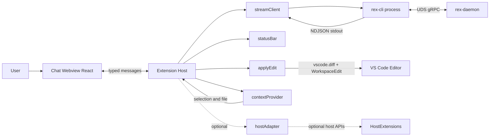
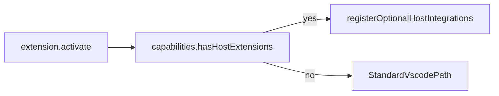
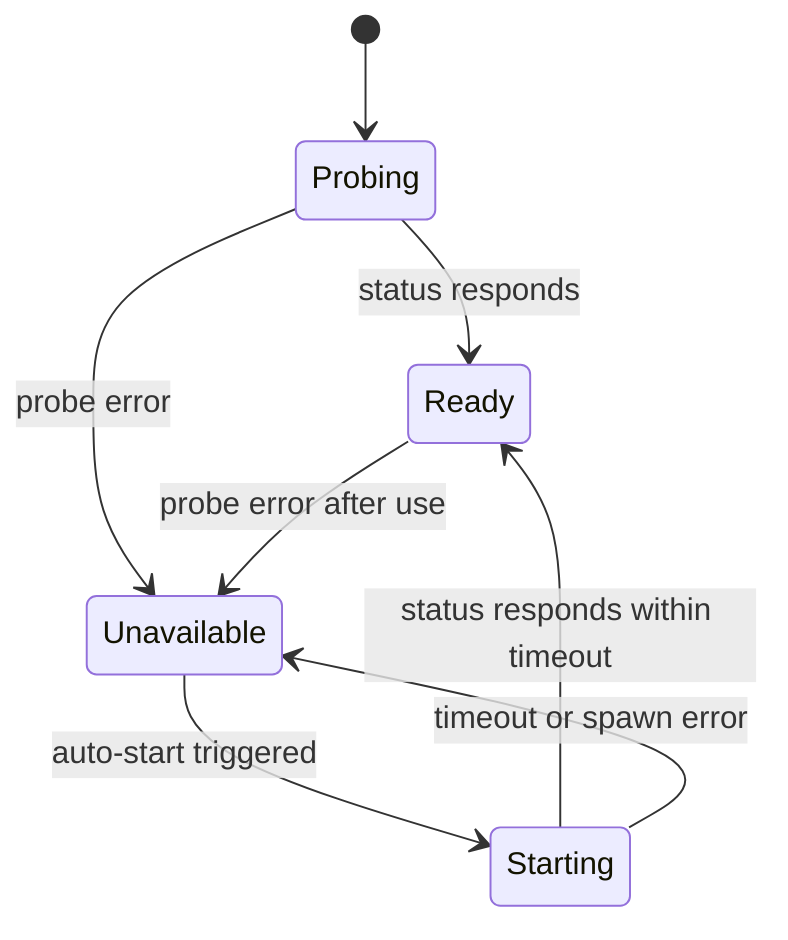

# Extension Architecture

This document defines the internal architecture of the REX editor extension. For scope and phasing, see [`docs/EXTENSION_ROADMAP.md`](EXTENSION_ROADMAP.md).

## Goals

- Keep the extension thin over the stable CLI boundary.
- Run cleanly in compatible editor hosts from a single source tree.
- Provide mode-driven chat UX (`ask`, `plan`, `agent`) with deterministic guardrails.
- Isolate host-specific features behind runtime capability detection.
- Preserve a clear path to future guarded multi-file orchestration without redesigning core message contracts.

## Layering

The module layout mirrors REX's thin-client rule: thin entry, responsibilities split by concern.

| Layer | Responsibility |
|---|---|
| `src/extension.ts` | Activation, command wiring. Stays minimal. |
| `src/runtime/` | Talk to `rex-cli` and `rex-daemon`. |
| `src/ui/` | Host-side view hosts and user-facing actions. |
| `src/editor/` | Collect editor context, manage virtual documents. |
| `src/platform/` | Detect editor capabilities and wire optional host APIs. |
| `src/config/` | Typed access to user settings. |
| `src/shared/` | Types and message contracts shared with the webview. |
| `webview/` | React application for the chat side panel. |

## Component diagram

## Transport contract

- Transport is `rex-cli` invoked as a child process with `--format ndjson`.
- Contract: one JSON object per stdout line with exactly one terminal event (`done` or `error`).
- See the extension contract document for authoritative event schema details.
- The extension parses markdown and extracts code blocks client-side. The CLI contract does not change.

## Typed message bus

The extension host and webview communicate through discriminated unions defined in `src/shared/messages.ts`.

Host to webview:

| Event | Payload | Purpose |
|---|---|---|
| `streamStarted` | `{ id }` | A new assistant message stream begins. |
| `streamChunk` | `{ id, text }` | Appended to the current assistant message. |
| `streamDone` | `{ id }` | Terminal success marker for the stream. |
| `streamError` | `{ id, message }` | Terminal failure marker with human-readable message. |
| `daemonState` | `{ state, detail? }` | Daemon state change for header indicators. |
| `modeState` | `{ mode, policy }` | Current mode and guardrail policy. |
| `approvalRequested` | `{ id, scope, title, detail }` | Approval checkpoint before guarded operations. |
| `executionStep` | `{ id, phase, summary }` | Timeline state for guarded execution flow. |

Webview to host:

| Event | Payload | Purpose |
|---|---|---|
| `submitPrompt` | `{ id, prompt, context? }` | Request a new completion. |
| `cancelStream` | `{ id }` | Request cancellation of an in-flight stream. |
| `applyCodeBlock` | `{ id, language, code, granularity }` | Request Apply-to-file with diff preview. |
| `insertCodeBlock` | `{ code }` | Insert at active editor cursor. |
| `copyCodeBlock` | `{ code }` | Write to clipboard. |
| `setMode` | `{ mode }` | Update active mode (`ask`/`plan`/`agent`). |
| `approvalDecision` | `{ id, approved }` | Resolve a pending approval request. |

## Mode orchestrator

The extension host owns one mode orchestrator that applies deterministic behavior by mode:

| Mode | Execution policy | Mutation policy |
|---|---|---|
| `ask` | No execution approval required. | Mutations blocked. |
| `plan` | No execution approval required. | Approval required before mutation actions. |
| `agent` | Approval required before execution starts. | Approval required before mutation actions. |

The orchestrator is the single authority for mode checks. UI components consume policy state from the host rather than implementing separate policy logic.

## Apply-to-file flow

1. Webview sends `applyCodeBlock` with the block content and target granularity (`file` or `selection`).
2. Host registers a virtual document under scheme `rex-proposal:` using a `TextDocumentContentProvider`.
3. Host invokes the `vscode.diff` command with `left = current file or selection`, `right = rex-proposal:<id>`.
4. Chat renders `Accept` and `Reject`.
5. Accept applies via `WorkspaceEdit`. Reject discards and closes the diff.

Granularities:

- `file`: replace the full active document.
- `selection`: replace the current selection range.

## Capability detection

`src/platform/capabilities.ts` probes optional host-specific APIs without throwing.

## Daemon lifecycle

- Default: user runs `rex-daemon` manually. Extension detects state via `rex-cli status` and reflects it in the status bar.
- Opt-in: `rex.daemonAutoStart = true` lets the extension spawn `rex-daemon`, poll readiness, and tear down on `deactivate()`.
- Lifecycle states surfaced to the UI: `ready`, `starting`, `unavailable`.

## Settings

| Key | Default | Purpose |
|---|---|---|
| `rex.cliPath` | `rex-cli` | Resolvable path for `rex-cli` (PATH lookup if unset). |
| `rex.daemonBinaryPath` | `rex-daemon` | Resolvable path for `rex-daemon` when auto-start is enabled. |
| `rex.daemonAutoStart` | `false` | Enables extension-managed daemon lifecycle. |

## Reliability and security

- Strict CSP in the webview with a per-load nonce. No remote asset loads.
- Clipboard writes happen through the host; code blocks never reach untrusted URLs.
- No telemetry or analytics.
- Long output goes to `OutputChannel("REX")`; no toast spam.

## Observability

- `OutputChannel("REX")` for lifecycle events (spawn, probe, timeout, shutdown).
- Structured log lines mirror the CLI style so users can correlate host and child events.

## Packaging

- `esbuild` produces two bundles: extension host (`dist/extension.js`) and webview (`dist/webview.js`).
- Host bundle excludes React; only the webview bundle ships React and UI dependencies.
- `.vsix` built via `vsce package`; published to Open VSX via `ovsx publish` in PR 3.

## Non-goals (current architecture phase)

- Multi-file coordinated edits (deferred to follow-up architecture phase).
- Autonomous mutation flows without explicit approval checkpoints.
- Inline ghost-text completions.
- Direct Node gRPC over UDS transport.

## Related documents

- [ARCHITECTURE.md](ARCHITECTURE.md): REX system architecture.
- [`docs/EXTENSION_ROADMAP.md`](EXTENSION_ROADMAP.md): phased delivery plan.
