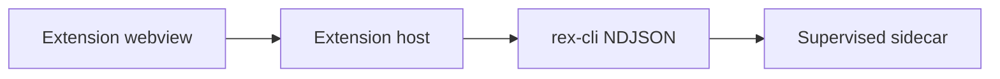

# Extension UX — design hub

**Status:** `planned` (implementation tracked in [EXTENSION_ROADMAP.md](EXTENSION_ROADMAP.md) as **E-UX01…E-UX11**).

## Purpose

Improve Rex’s **thin-client** extension so operators can dogfood from the IDE with **integrated editor+agent UX**: editor-adjacent chat, rich composer context, persisted sessions, tool visibility, and reviewable edits—while keeping **`rex complete --format ndjson`** as the primary transport ([ADR 0007](architecture/decisions/0007-editor-extension-hybrid-transport-cli-and-grpc.md), [EXTENSION.md](EXTENSION.md)).

**Primary surface:** custom React webview (webview-first). Native VS Code Chat Participant is **out of scope** unless a future ADR supersedes that choice. Editor portability and hybrid install paths: [EXTENSION.md](EXTENSION.md), [EXTENSION_ROADMAP.md](EXTENSION_ROADMAP.md) hybrid strategy.

## Language policy

Describe **target experience and acceptance criteria in Rex terms only**. Do not name other editors, assistants, or extensions as UX benchmarks in this hub or in E-UX PR text. Platform facts may cite official VS Code extension APIs and guidelines.

## Target experience

Operators working in a supported editor should experience AI as part of the editing flow, not only as a distant activity-bar panel.

- **Layout:** chat beside the code (secondary sidebar when the host supports it; activity-bar fallback on older hosts; optional full editor-tab panel).
- **Composer:** attach workspace file and symbol context, run slash commands, send terminal selections into chat.
- **Sessions:** workspace-scoped threads that survive window reload.
- **Agent visibility:** expandable tool and step cards when the host receives structured execution events.
- **Edits:** inline edit on selection through the existing virtual-doc apply path; batch multi-file review when multiple proposals exist.
- **Keyboard:** shortcuts to focus chat, send, cancel, and clear without leaving the editor flow.

## Scope

**In:**

- Layout: secondary sidebar (VS Code ≥1.106) with activity-bar fallback; optional editor-tab panel.
- Webview quality: theme tokens, narrow-width layout, accessibility.
- Composer: @-style file/symbol context, slash commands, terminal selection attach.
- Sessions: workspace-scoped persistence and restore.
- Agent UX: expandable tool/step cards from structured host messages; inline edit on selection; multi-file diff review when proposals exist.

**Out:**

- Ghost-text tab completions.
- Bespoke workspace embedding / indexing servers for @-mentions.
- MCP orchestration inside the extension (deferred per [EXTENSION_ROADMAP.md](EXTENSION_ROADMAP.md)).
- Node gRPC `StreamInference` in the extension.
- Parallel multi-agent orchestration UI.

## Current vs target gap

| Capability | Rex today | Target |
|------------|-----------|--------|
| Chat placement | Activity bar only | Secondary sidebar + editor panel |
| Streaming markdown | Shipped | Keep |
| Apply | Native diff tab | Keep; add multi-file batch review |
| Context | File + selection chip | @-picker (files, symbols) |
| Sessions | In-memory | Workspace persistence |
| Tool UI | Execution timeline | Expandable tool/step cards |
| Inline edit | Context-menu prefill | Inline edit on selection |
| Keyboard UX | Few shortcuts | Focus / send / cancel / clear shortcuts |

## Boundaries

| Layer | Owns |
|-------|------|
| Webview | Presentation, composer, sessions UI, tool cards, apply UX |
| Host | VS Code APIs, context pickers, virtual docs, approvals |
| `rex-cli` NDJSON | Stream transport, terminal events, `--mode`, `--approval-id` |
| Sidecar / daemon | Reasoning, tool execution, multi-file proposals |

## Interfaces (intent)

- **NDJSON:** keep `chunk` / `done` / `error`. Optional additive kinds (`step`, `tool`) require [fixtures/ndjson_contract/](../fixtures/ndjson_contract/) updates and [ERROR_HANDLING.md](ERROR_HANDLING.md) catalog entries when they carry error semantics.
- **Host ↔ webview:** extend [`messages.ts`](../extensions/rex-vscode/src/shared/messages.ts) additively (sessions, extra context chips, tool cards). Existing handlers remain backward compatible.
- **Context attachment:** prompt trailers and client hints follow the pattern in [`context.ts`](../extensions/rex-vscode/src/editor/context.ts).

## Delivery items and acceptance

### E-UX01 — Secondary sidebar chat

- Register chat webview in `viewsContainers.secondarySidebar` when VS Code ≥1.106.
- Activity-bar container remains when secondary sidebar is unavailable (`when` context).
- Stream, apply, cancel-to-idle unchanged ([RC-S2](V1_0.md)).

### E-UX02 — Open REX in Editor

- Command opens `createWebviewPanel` using the same webview bundle and message bus as the sidebar view.

### E-UX03 — Webview theme / a11y / narrow width

- All colors from `--vscode-*` tokens; composer usable at ~320px; respect reduced-motion preferences.

### E-UX04 — Keybindings + walkthrough

- Keybindings: focus chat, cancel stream, clear chat, open editor panel.
- Get Started walkthrough step documents layout and shortcuts.

### E-UX05 — Persisted sessions

- Workspace-scoped session list; restore active thread after window reload; clear chat respects session model.

### E-UX06 — @-style context picker

- Composer `@` opens QuickPick for workspace files and document symbols; attachments show as chips; no custom index server.

### E-UX07 — Composer slash commands

- `/ask`, `/plan`, `/agent`, `/clear` in composer; normal prompts unaffected.

### E-UX08 — Terminal selection → REX

- Terminal context menu sends selection into chat as attachable context.

### E-UX09 — Tool / step cards

- Expandable cards when host emits structured tool/step events (reuse or extend `executionStep`); graceful empty state otherwise.

### E-UX10 — Inline edit on selection

- Command + keybinding: selection → short prompt → stream → virtual doc → existing apply path; mode approvals enforced.

### E-UX11 — Multi-file diff review

- When multiple file proposals exist, batch review with per-file accept/reject; single-file path unchanged.

## Prioritization

| Group | MoSCoW | Items |
|-------|--------|-------|
| Layout + polish | **Should** | E-UX01–04 |
| Composer + context | **Should** | E-UX05–08 |
| Agent visualization | **Could** | E-UX09–11 |

## Cross-links

- [EXTENSION_ROADMAP.md](EXTENSION_ROADMAP.md) — phased rows **E-UX01…E-UX11**
- [EXTENSION.md](EXTENSION.md) — NDJSON contract and component layout
- [EXTENSION_LOCAL_E2E.md](EXTENSION_LOCAL_E2E.md) — operator verification
- [ROADMAP.md](ROADMAP.md) — program navigation
- [PURPOSE_AND_PRINCIPLES.md](PURPOSE_AND_PRINCIPLES.md) — thin client, daemon-first
