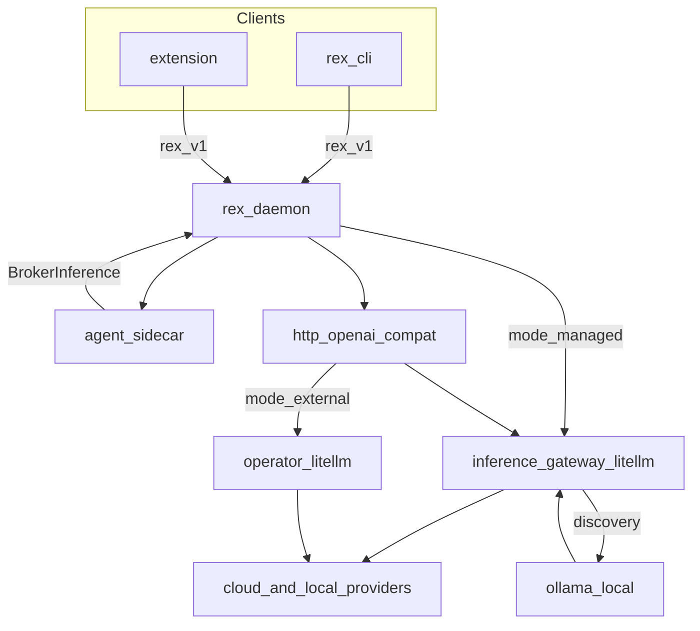
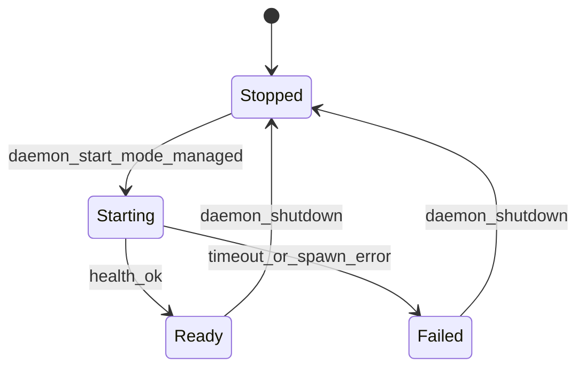

# Inference Gateway

**Status:** **implemented** — [ADR 0019](architecture/decisions/0019-inference-gateway-opt-in-litellm.md). Daemon supervisor + `rex gateway init|doctor` + `$REX_ROOT/gateway/` templates.

Canonical design for Rex’s **opt-in, daemon-controlled** LiteLLM (OpenAI-compat) server. Related: [ADAPTERS.md](ADAPTERS.md), [CONFIGURATION.md](CONFIGURATION.md#inference-gateway-design), [ADR 0018](architecture/decisions/0018-gateway-first-multi-provider-inference.md) (protocol adapter), [SIDECAR_RUNTIME.md](SIDECAR_RUNTIME.md) (agent sidecar — separate feature).

## Purpose

Operators who enable the gateway get multi-provider inference (Anthropic, OpenAI, local Ollama) through **one** OpenAI-compat URL Rex controls — without running LiteLLM in a separate terminal and without placing the gateway in the **agent sidecar** slot.

## Three layers (do not conflate)

| Layer | Meaning |
|-------|---------|
| **Default API** | Rex documents **LiteLLM-shaped** OpenAI-compat (`http_openai_compat` → gateway) as the normal multi-provider HTTP path. |
| **Built-in capability** | Rex ships how to start LiteLLM (command, config template, health probe). |
| **Opt-in activation** | The LiteLLM process runs only when `inference.gateway.mode` is `managed`. |

## Scope

### In

- Daemon lifecycle when `mode: managed` (spawn, health, stop).
- Config block `inference.gateway.*` (not `sidecars.*`).
- Loopback `base_url` injection for `http_openai_compat` when managed.
- Gateway directory `$REX_ROOT/gateway/` (template + gitignored secrets).
- Modes: `managed`, `external`, `disabled`.
- **Ollama model discovery** on the gateway model list (via LiteLLM — [Ollama discovery](#ollama-local-model-discovery)).
- Optional native `anthropic` runtime remains a separate roadmap item ([ADAPTERS.md](ADAPTERS.md#direct-anthropic-messages-api-planned--secondary)).

### Out

- `rex.sidecar.v1` plugin or `sidecars.list` entry.
- LiteLLM inside the `rex-daemon` process (embed/FFI).
- Dedicated `litellm` `InferenceRuntime` id (same wire as `http_openai_compat`).
- Sidecar-held cloud provider keys.

## Why not a sidecar

| Constraint | Implication |
|------------|-------------|
| Sidecar API is `RunTurn` + agent semantics | Gateway is not an agent |
| [ADR 0017](architecture/decisions/0017-single-active-sidecar-phase-1.md): one active sidecar | Gateway would displace `rex-agent` |
| Sidecar health is gRPC on UDS | LiteLLM is HTTP |
| Broker security | Provider keys belong in gateway config, not the agent envelope |

Rex adds **inference gateway supervision** on the daemon — same lifecycle *idea* as the sidecar supervisor, **different** config and contract.

## Architecture



## Responsibilities

| Owner | Responsibility |
|-------|----------------|
| **Gateway child** | `POST /v1/chat/completions` (+ SSE); `GET /v1/models`; route by `model` |
| **`rex-daemon`** | When `managed`: spawn/stop, health, inject loopback URL, surface errors |
| **`http_openai_compat`** | HTTP client to effective `base_url` |
| **Agent sidecar** | `BrokerInference` only |
| **Operator** | Opt in to `managed`; maintain `$REX_ROOT/gateway/.env`; or use `external` / `disabled` |

## Configuration (design contract)

Control uses **`inference.gateway.mode`** only (`disabled` | `external` | `managed`).

| Field | Default | Meaning |
|-------|---------|---------|
| `inference.gateway.mode` | `disabled` | Whether Rex spawns the gateway |
| `inference.gateway.port` | `4000` | Loopback port when `managed` |
| `inference.gateway.config_path` | `$REX_ROOT/gateway/config.yaml` | LiteLLM proxy config |
| `inference.gateway.command` | `litellm` on PATH | Spawn command override |
| `inference.gateway.startup_timeout_secs` | `30` | Health wait budget |
| `inference.gateway.required` | `true` when `managed` | Daemon ready blocked if child fails |
| `inference.gateway.allow_url_override` | `false` | Allow non-empty `openai_compat.base_url` to override injection |
| `inference.gateway.ollama.enabled` | `true` when `managed` | Include Ollama wildcard in template |
| `inference.gateway.ollama.api_base` | `http://127.0.0.1:11434` | Ollama URL for LiteLLM |
| `inference.gateway.ollama.discovery` | `true` | `check_provider_endpoint: true` in template |
| `inference.gateway.ollama.discovery_on_ready` | `true` | Optional daemon `GET /v1/models` after health |

### Effective `base_url`

| `gateway.mode` | `openai_compat.base_url` |
|----------------|----------------------------|
| `disabled` | Operator sets (e.g. direct Ollama) |
| `external` | Operator sets (team LiteLLM URL) |
| `managed` | Daemon sets `http://127.0.0.1:{port}/v1` unless override allowed and set |

**CI defaults:** `inference.runtime: mock`, `gateway.mode: disabled` — no Python on implicit daemon start.

Env mirrors (intent): see [CONFIGURATION.md](CONFIGURATION.md#inference-gateway-design).

## Lifecycle (`managed`)



| Phase | Behavior |
|-------|----------|
| Daemon start | Spawn gateway; load `$REX_ROOT/gateway/.env` |
| Health | HTTP ready within `startup_timeout_secs` |
| Ready | Broker uses injected URL; optional model-list warm |
| Daemon stop | Kill child; wait for exit |

**v1:** no auto-restart on gateway crash — log and fail when `required`.

## Request path

1. Client → `rex.v1` `StreamInference` → daemon.
2. Daemon → sidecar `RunTurn` (or harness).
3. Sidecar → `BrokerInference` → daemon.
4. Daemon → `http_openai_compat` → gateway URL.
5. Gateway → upstream provider.

No new `rex.v1` or `rex.sidecar.v1` RPCs.

## Ollama local model discovery

### Requirement

When `mode: managed`, the gateway **includes locally available Ollama models** in `GET /v1/models` alongside cloud aliases — one catalog for `rex complete --model` and operators.

### Mechanism

Use LiteLLM [model discovery](https://docs.litellm.ai/docs/proxy/model_discovery): `check_provider_endpoint: true` with an `ollama/*` wildcard entry. Rex does **not** poll Ollama for inference; the gateway process owns discovery.

### Default template (intent)

```yaml
model_list:
  - model_name: ollama/*
    litellm_params:
      model: ollama/*
      api_base: http://127.0.0.1:11434

litellm_settings:
  check_provider_endpoint: true
```

Add Anthropic/OpenAI entries in the same `model_list` driven by `$REX_ROOT/gateway/.env`.

### Behavior

| Event | Outcome |
|-------|---------|
| `GET {gateway}/v1/models` | Merged cloud + discovered `ollama/...` ids |
| Ollama offline | Gateway may still start; Ollama ids absent; cloud works if configured |
| Models change in Ollama | Next `/v1/models` reflects tags |

**Non-goal:** Fail gateway startup solely because Ollama is down.

### Minimum LiteLLM version

Use a LiteLLM proxy release that supports `check_provider_endpoint` and `ollama/*` expansion on `/v1/models` (verify with `litellm --version` after `pip install 'litellm[proxy]'`).

## Packaging (design bet)

| Bet | Choice |
|-----|--------|
| Binary | Upstream `litellm` or `python -m litellm` on PATH |
| LiteLLM light | Minimal `config.yaml` + `.env.example` under `$REX_ROOT/gateway/` |
| Dependencies | [DEPENDENCIES.md](DEPENDENCIES.md) (implementation) |

## Secrets

| Secret | Location |
|--------|----------|
| `ANTHROPIC_API_KEY`, `OPENAI_API_KEY`, … | `$REX_ROOT/gateway/.env` (gitignored) |
| Rex `config.json` | No cloud provider keys |

## Failure modes

| Condition | `required: true` | Notes |
|-----------|------------------|-------|
| `litellm` missing | Daemon start error | |
| Port in use | Start error | |
| Health timeout | Start error | |
| Ollama unreachable | Gateway starts | No local models in list |
| Provider 401/403 | Broker `provider_auth` | [ADAPTERS.md](ADAPTERS.md#broker-provider-errors-intent) |
| Unknown model | Broker `provider_model` | |

Logs (intent): `gateway.lifecycle=…`, `gateway.health=…`, `gateway.ollama.discovery=ok|empty|unreachable`, `gateway.models.count=N`.

## Operator profiles

| Profile | `gateway.mode` | Runtime |
|---------|----------------|---------|
| Multi-provider (opt-in) | `managed` | `http-openai-compat` |
| Team gateway | `external` | `http-openai-compat` |
| Direct Ollama only | `disabled` | `http-openai-compat` |
| CI / tests | `disabled` | `mock` |

## Live validation (planned)

Gateway-path smoke reuses **R038** scenarios with `inference.openai_compat.base_url` pointing at the managed or external gateway — **R040** on [ROADMAP.md](ROADMAP.md); hub [ECONOMICS_VALIDATION.md](ECONOMICS_VALIDATION.md).

## Related

- [ADR 0019](architecture/decisions/0019-inference-gateway-opt-in-litellm.md)
- [LiteLLM — Anthropic](https://docs.litellm.ai/docs/providers/anthropic)
- [LiteLLM — Model discovery](https://docs.litellm.ai/docs/proxy/model_discovery)
