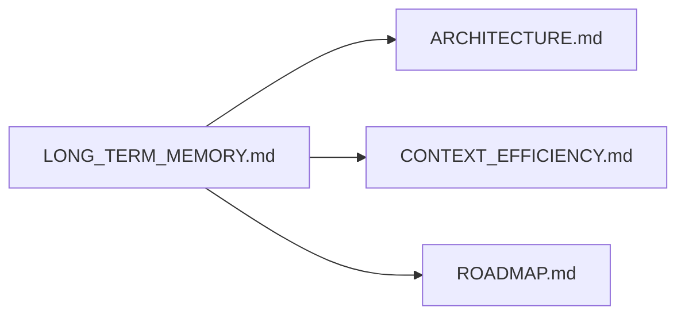

# Long-term memory (design hub)

This document is the **single source** for Rex **long-term / project memory** as a **design bet**: hypothesis-level capabilities, optimization-first intent, and interface boundaries. Implementation today does **not** include a durable daemon memory store unless other docs explicitly say so.

See [DOCUMENTATION.md](DOCUMENTATION.md) for the **feature-area hub** convention. Other docs link here and avoid duplicating the bet list below.

## Purpose

- Give readers one place for **what Rex might build** around memory without treating it as a commitment.
- Keep **economics visible**: memory serves **optimization** first (net tokens and repeated work), not recall alone.

## Positioning

[`rex-daemon`](../crates/rex-daemon/) remains the economics and policy envelope for agent workloads ([ADR 0001](architecture/decisions/0001-daemon-owns-agent-orchestration-and-economics.md)). **Chat transcript** lives with the extension or client for UX; durable **project memory** (schemas, tooling, persistence) sits on the Rex side once implemented. Until then, references in architecture and roadmap stay **planned**.

## Vision (optimization-first)

Long-term memory should **reduce net cost**: fewer redundant tokens spent re-deriving the same workspace facts; less repeated file or decision discovery; retrieval that stays **bounded** (small payloads into the prompt, clear caps); observable signals such as retrieval hit-rate and cost-per-turn. Tie this lever to [CONTEXT_EFFICIENCY.md](CONTEXT_EFFICIENCY.md): project memory belongs in the same economics framing as compaction, caches, and routing—not as unlimited context stuffing.

## Design bets — uncommitted

Each row is a **hypothesis**, not roadmap commitment.

| Bet | Sketch |
|-----|--------|
| **Scopes and isolation** | Workspace-bound or project-bound stores with explicit visibility (user vs workspace vs tenant). |
| **Episodic vs semantic vs procedural** | Episodic: what happened in sessions; semantic: durable facts/preferences; procedural: repeatable workflows or policies. |
| **Ingestion** | Extract signals from transcripts and tooling output; optional structured imports (decisions files, fingerprints). |
| **Storage and index** | File or `sqlite`; optional vector or structured graph retrieval depending on workload evidence. |
| **Retrieval modes** | Narrow queries, rerank, maybe graph or entity-aware paths; always budgeted. |
| **Temporal consistency** | Validity over time, contradictions, and “as of” reads without silent lossy overwrites. |
| **Compaction and forgetting** | Summaries, decay, caps to avoid unbounded store and prompt bloat. |
| **Safety, retention, privacy** | Redaction, retention policy, operator control over export/delete. |
| **Evaluation hooks** | Bench or metrics for recall quality vs token cost (future). |

## Interfaces (intent-only)

A future design keeps **stream and tool contracts** stable: memory **feeds** the context pipeline under daemon policy; it does not replace [ADAPTERS.md](ADAPTERS.md) or client NDJSON. No new public RPC or proto here until a spec change lands elsewhere.

## Cross-links (hub pattern)

This file is the **canonical** bet list. [ARCHITECTURE.md](ARCHITECTURE.md) and [CONTEXT_EFFICIENCY.md](CONTEXT_EFFICIENCY.md) keep **one-line** pointers and status; they do not restate the full table above.

