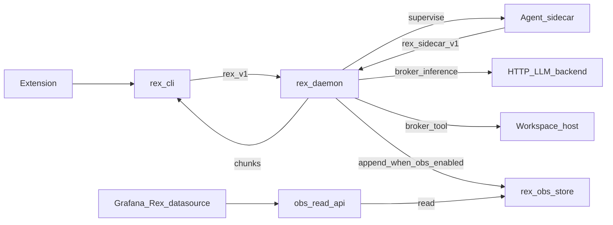

# Phase 1 product architecture

**Scope and shape** for the first REX product path (daemon-supervised sidecar, brokered HTTP, thin extension). **Done** is defined only in **[V1_0.md](V1_0.md)** (`RC-*` release criteria)—not in this file.

## Product goals

- Deliver a **basic development agent** in the VS Code/Cursor extension whose **reasoning and runtime live in a daemon-supervised sidecar** — not in the extension and not as “daemon calls the model directly.”
- Keep the extension a **thin client**: modes, approvals, apply/insert, streaming via **`rex complete`** NDJSON ([EXTENSION.md](EXTENSION.md), [ADR 0007](architecture/decisions/0007-editor-extension-hybrid-transport-cli-and-grpc.md)).
- **`rex-daemon`** supervises the sidecar, **brokers** inference (OpenAI-compatible HTTP) and **at least one host tool** (`fs.read` recommended), and remains **stream- and policy-authoritative** for `rex.v1`.
- **`StreamInference`** for assistant work is **fulfilled through the sidecar**; the daemon maps chunks to the existing NDJSON contract.
- Make daemon economics **measurable and operable** via the **observability suite**: Rex-owned **`rex-obs-store`** (SQLite today; **CHCE mmap** on macOS per [CHCE_ROADMAP.md](CHCE_ROADMAP.md)), loopback **read API**, bundled **Grafana** + Rex OTel datasource, and **`rex obs up`** — [OBSERVABILITY_AND_ECONOMICS.md](OBSERVABILITY_AND_ECONOMICS.md), [ADR 0021](architecture/decisions/0021-rex-owned-economics-store-byot-visualization.md), [ADR 0026](architecture/decisions/0026-rex-owned-storage-grafana-otel-datasource.md).
- Keep **dogfooding** `rex` from the IDE as the success narrative.

## Stub vs product agent

| | **Shipped today** | **Operator checklist (not “planned product”)** |
|---|---|---|
| Sidecar binary | **`rex-sidecar-stub`** — harness/CI default; `__rex_*` directives | **`rex-agent`** — LangGraph ReAct (**R017–R018** Done); enable via JSON or extension overlay |
| Product sidecar | **`rex-agent`** shipped under `sidecars/rex-agent/` | Live-model proof via [EXTENSION_LOCAL_E2E.md](EXTENSION_LOCAL_E2E.md) §8 |
| CLI | Unified **`rex`** binary (**R014**); **`rex-cli`/`rex-daemon` shims** | — |
| Config | JSON config + `rex config` (**R015**); `rex config init` defaults **stub** | Product path: set `sidecars.active` to **`rex-agent`** or use **`rex.productAgentConfig`** |
| Daemon broker policy | Mode × capability matrix; protected paths (**R020** Done) | — |
| Turn correlation | `turn_id` / `context_revision` on RunTurn (**R021** Done) | — |
| Workspace binding | Fail-closed daemon; extension supplies root (**R022**, **R019** Done) | — |
| Extension defaults | **`rex.productAgentConfig`** default **true** merges **`rex-agent`** + **`agent.approvals_enabled`** on auto-start | Manual JSON still supported |
| v1.0 **RC-*** | **Met** (stub + product paths) | Live HTTP backend for IDE dogfood — [EXTENSION_LOCAL_E2E.md](EXTENSION_LOCAL_E2E.md); plan/agent **tool loop** — **R038** **Done** — [NATIVE_TOOL_CALLING.md](NATIVE_TOOL_CALLING.md) |
| Observability suite | **Partial** — SQLite store, read API, `rex obs up`, Grafana plugin (**RC-S3**) | **CHCE mmap** Program A (**R043–R049**, **RC-S4**); Phase 6 sidecar API + SSE (**RC-S5**); live smoke (**R039–R040**, **RC-S6**) — [OBSERVABILITY_AND_ECONOMICS.md](OBSERVABILITY_AND_ECONOMICS.md), [CHCE_ROADMAP.md](CHCE_ROADMAP.md) |

## Architecture

Hub detail: [SIDECAR_RUNTIME.md](SIDECAR_RUNTIME.md), [AGENT_ACCESS_POLICY.md](AGENT_ACCESS_POLICY.md), [OBSERVABILITY_AND_ECONOMICS.md](OBSERVABILITY_AND_ECONOMICS.md), [ADR 0008](architecture/decisions/0008-dedicated-sidecar-control-plane-api.md).

## v1.0 closure (observability Must rows)

**v1.0 not Met** until **RC-S3–RC-S5** close in [V1_0.md](V1_0.md): observability baseline (**RC-S3**), **CHCE mmap** Program A (**R043–R049**, **RC-S4**), and Phase 6 sidecar API + SSE (**R050–R051**, **RC-S5**). Opt-in live validation (**R039–R042**, **RC-S6** Should) follows without blocking the tag.

After v1.0, converge **routing, compaction, caches, metering, and richer tool/MCP loops** in **`rex-daemon`** and the sidecar envelope ([ADR 0001](architecture/decisions/0001-daemon-owns-agent-orchestration-and-economics.md)). Durable memory and multi-plugin fleets stay on the roadmap ([LONG_TERM_MEMORY.md](LONG_TERM_MEMORY.md), [PLUGIN_ROADMAP.md](PLUGIN_ROADMAP.md), [ROADMAP.md](ROADMAP.md) **Later**).

## In scope (Phase 1 shape)

| Item | Definition |
|---|---|
| Daemon | `/tmp/rex.sock`; `rex.v1`; policy, broker, sidecar supervisor. |
| CLI | Unified **`rex`**; NDJSON; `--mode` / `--model` on `complete` (shim: `rex-cli`). |
| **Sidecar agent** | One supervised process; agent stack pluggable per [ADR 0005](architecture/decisions/0005-rex-owns-sidecar-environment-not-agent-implementations.md). |
| **`rex.sidecar.v1`** | Control plane distinct from `rex.v1` — verbs in [SIDECAR_RUNTIME.md](SIDECAR_RUNTIME.md). |
| **Brokered inference** | Daemon runs HTTP OpenAI-compat adapter on sidecar request ([CONFIGURATION.md](CONFIGURATION.md), [ADAPTERS.md](ADAPTERS.md)). |
| **Brokered tool** | At least **`fs.read`** (or bounded **`exec.shell`** if chosen at implementation) — [AGENT_ACCESS_POLICY.md](AGENT_ACCESS_POLICY.md). |
| Extension | Modes, approvals, apply/insert, cancel, status — [EXTENSION.md](EXTENSION.md). |
| Policy seams | L1 (**`ask`** only), `PolicyEngine`, `ApprovalGate`; context pipeline. |
| **Observability JSON** | `observability.enabled`, `observability.store.engine` (`sqlite` default; `mmap` macOS opt-in), optional OTLP export — [CONFIGURATION.md](CONFIGURATION.md#observability). |
| **`rex-obs-store`** | Rex-owned economics DB under `$REX_ROOT/obs/` — **SQLite shipped**; **CHCE mmap** (`store.rexobs` + `store.dict`) per [CHCE_ROADMAP.md](CHCE_ROADMAP.md) **R043–R054**. |
| **Observability read API** | Loopback HTTP historical query — [OBS_READ_API.md](OBS_READ_API.md); Grafana reads via Rex OTel datasource, not store files or PromQL. |
| **`rex obs` CLI** | `up` / `serve` / `down` / `doctor` / `catalog` — local suite bootstrap — [OBSERVABILITY_INTEGRATIONS.md](OBSERVABILITY_INTEGRATIONS.md). |
| **Bundled Grafana** | Rex OTel datasource plugin + default dashboard provisioning; operator supplies Grafana binary. |
| **Economics validation** | Opt-in live Ollama smoke + run manifests — design [ECONOMICS_VALIDATION.md](ECONOMICS_VALIDATION.md); implementation **R039–R042** (**RC-S6**). |

## Observability suite (Phase 1 shape)

Canonical hub: [OBSERVABILITY_AND_ECONOMICS.md](OBSERVABILITY_AND_ECONOMICS.md). **Done** status for **RC-S3–RC-S6** lives in [V1_0.md](V1_0.md)—not here.

| Phase | Deliverable | Status |
|-------|-------------|--------|
| **0** | Stdout economics grep; observability off in JSON | **shipped** |
| **2** | SQLite store write path + core OTLP export | **partial** |
| **2b** | **CHCE mmap** engine (macOS opt-in) — [CHCE_ROADMAP.md](CHCE_ROADMAP.md) | **planned** (**RC-S4**) |
| **3–5** | Read API, Grafana plugin, **`rex obs up`** | **partial** (**RC-S3**) |
| **6** | `SidecarObservabilityService` + SSE live tail | **planned** (**RC-S5**) |
| **7** | Retention, v2 codecs, default-engine promotion (**R052–R054**) | **planned** (**Could**) |

**Store engines** ([ADR 0025](architecture/decisions/0025-dual-economics-store-engines.md), [ADR 0027](architecture/decisions/0027-chce-columnar-mmap-engine.md)):

| Engine | Path | Platform |
|--------|------|----------|
| **`sqlite`** | `obs/store.sqlite` | macOS, Linux CI (default) |
| **`mmap`** (CHCE) | `obs/store.rexobs` + `store.dict` | macOS opt-in only |

## Out of scope (Phase 1 shape)

- Multi-plugin fleets, Wasm, VM-default envelope.
- Full MCP catalog in sidecar.
- Extension Node `StreamInference`.
- **Product** path that treats in-process HTTP/mock as the agent (harness/CI only).
- Apple MLX, remote TLS listener, on-disk `rex config`, durable LTM store.
- Required **OpenTelemetry Collector**, **Prometheus**, **Loki**, or **Tempo** for the Rex product UI path.
- Grafana **direct file** or **PromQL** access to economics data (UI uses Rex read API only).
- Dedicated observability-only sidecar process.
- **CHCE mmap** as JSON default before **R054** promotion gates.
- Prompt or file body storage in the economics DB.

## Protocol requirements (`rex.v1`)

| RPC | Type | Requirement |
|---|---|---|
| `GetSystemStatus` | Unary | Version, uptime, active model id (broker backend when configured). |
| `StreamInference` | Server streaming | Chunks + terminal `done` or mapped error → NDJSON `error`. |

Assistant modes are **fulfilled through the sidecar path** on the product path; see [V1_0.md](V1_0.md) **RC-03**.

## Sidecar control plane (minimum)

Documented in [SIDECAR_RUNTIME.md](SIDECAR_RUNTIME.md). Illustrative verbs:

| Verb | Purpose |
|------|---------|
| `Health` / `GetCapabilities` | Supervision and feature flags |
| `RunTurn` | One agent turn; stream text deltas to daemon |
| Brokered inference | Sidecar requests completion; daemon invokes HTTP adapter |
| Brokered tool | At least **`fs.read`** recommended |

## Brokered HTTP (not “daemon = agent”)

- JSON: `inference.openai_compat` in `$REX_ROOT/config.json` — [CONFIGURATION.md](CONFIGURATION.md) (legacy `REX_OPENAI_COMPAT_*` env ignored with warning).
- Daemon **`http_openai_compat`** module is the **broker implementation** when the sidecar (or harness) requests inference.
- Operator profiles: Ollama, LM Studio, OpenAI API — [ADAPTERS.md](ADAPTERS.md).

## CLI expectations

| Command shape | Expected behavior |
|---|---|
| `rex status` | Status from `GetSystemStatus`. |
| `rex complete "<prompt>" --format ndjson --mode <ask\|plan\|agent>` | Forwards to daemon; product path uses sidecar per **RC-03**. |

## Extension consumer contract

[EXTENSION.md](EXTENSION.md). The extension **depends on** a healthy sidecar-backed assistant; it does not embed the agent runtime.

## Degraded / harness paths

| Path | Use |
|------|-----|
| `REX_INFERENCE_RUNTIME=mock` | CI, `uds_e2e` |
| Direct in-process HTTP without sidecar | Migration and tests only — **not** product acceptance (**RC-03**) |

When sidecar is required but absent, clients must get a **clear error**, not silent fallback that looks like success (**RC-08**).

## Operator verification (supports RC-02 / RC-03)

Use when validating the local path; release-criteria status is tracked in **[V1_0.md](V1_0.md)**.

**Preflight:** [`scripts/verify_mvp_local.sh`](../scripts/verify_mvp_local.sh) — build, Rust/extension CI gates, and **product-path smoke** ([CI.md](CI.md)).

### Automated evidence (CI / local preflight)

Covered by `cargo test -p rex-daemon mvp_product_path` (also run from `verify_mvp_local.sh`):

- [x] Build workspace (via preflight script).
- [x] Sidecar health under daemon supervision (stub spawn + health).
- [x] `StreamInference` **agent** mode uses sidecar **`BrokerInference`** → daemon HTTP (loopback fixture in CI; live JSON `inference.openai_compat` for operator dogfood).
- [x] Brokered **`fs.read`** via prompt `__rex_read:<file>` under `REX_WORKSPACE_ROOT`.
- [x] Required sidecar missing → clear **sidecar** error at daemon startup (no silent success).

### Operator-only (live HTTP backend)

Required for IDE dogfood after preflight passes. Use a running OpenAI-compatible server (Ollama, LM Studio, etc.) — see [EXTENSION_LOCAL_E2E.md](EXTENSION_LOCAL_E2E.md):

- [ ] `rex config init` then edit JSON (`inference.openai_compat`, `sidecars`) — [EXTENSION_LOCAL_E2E.md](EXTENSION_LOCAL_E2E.md) §3.
- [ ] Start **`rex daemon`**; confirm sidecar health in logs.
- [ ] Extension: **agent** mode send (real model text), cancel, apply with approval.
- [ ] Stop daemon; confirm sockets cleaned up.

### Observability (supports RC-S3; optional until suite enabled)

When `observability.enabled: true` in merged JSON — [OBSERVABILITY_INTEGRATIONS.md](OBSERVABILITY_INTEGRATIONS.md):

- [ ] `rex obs doctor` — store path and read API reachable.
- [ ] `rex obs up` — Grafana opens with Rex OTel datasource; default dashboards load.
- [ ] Complete one agent turn; confirm stream economics appear in read API / Grafana (SQLite engine).
- [ ] (Future **RC-S4**) With `observability.store.engine: "mmap"` on macOS, repeat write/read parity checks per [CHCE_ROADMAP.md](CHCE_ROADMAP.md).

### Additional hooks

`sidecar_roundtrip.rs`, supervisor in `rex-daemon`, `broker.rs` unit tests, NDJSON conformance fixtures, extension contract tests.

## Related

- [V1_0.md](V1_0.md) — **done** definition (**RC-***, **RC-S***)
- [AGENT_DELIVERY_ROADMAP.md](AGENT_DELIVERY_ROADMAP.md) — product agent program (partial — shipped)
- [OBSERVABILITY_AND_ECONOMICS.md](OBSERVABILITY_AND_ECONOMICS.md) — observability suite hub
- [CHCE_ROADMAP.md](CHCE_ROADMAP.md) — Rex-owned mmap database program
- [ECONOMICS_VALIDATION.md](ECONOMICS_VALIDATION.md) — live validation harness
- [ROADMAP.md](ROADMAP.md) — work queue
- [ARCHITECTURE.md](ARCHITECTURE.md) — system architecture
