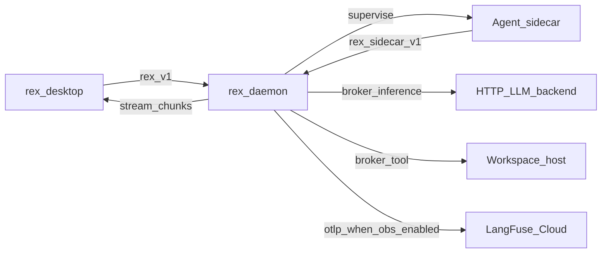

# Phase 1 product architecture

> Role: explanation | Status: active | Audience: contributors | Read when: Phase 1 product scope
> Prefer: ## Purpose

**Scope and shape** for the first REX product path (daemon-supervised sidecar, brokered HTTP, desktop thin client). **Done** is defined only in **[V1_0.md](V1_0.md)** (`RC-*` release criteria)—not in this file.

## Product goals

- Deliver a **basic development agent** via the **desktop app** whose **reasoning and runtime live in a daemon-supervised sidecar** — not in the client and not as “daemon calls the model directly.”
- Keep the **presentation client thin**: modes, approvals, streaming via UDS gRPC `StreamInference` ([WEB_UI_ARCHITECTURE.md](WEB_UI_ARCHITECTURE.md), [ADR 0042](architecture/decisions/0042-web-desktop-presentation-pivot.md)).
- **`rex-daemon`** supervises the sidecar, **brokers** inference (OpenAI-compatible HTTP) and **at least one host tool** (`fs.read` recommended), and remains **stream- and policy-authoritative** for `rex.v1`.
- **`StreamInference`** for assistant work is **fulfilled through the sidecar**; the daemon maps chunks to the desktop stream projection (`rex-stream-ui`).
- Make daemon economics **measurable and operable** via **LangFuse Cloud** (daemon OTLP export + Cloud UI) — [LANGFUSE_INTEGRATION.md](LANGFUSE_INTEGRATION.md), [LANGFUSE_DISCOVERY_ROADMAP.md](LANGFUSE_DISCOVERY_ROADMAP.md). Legacy Rex store/Grafana code cancelled (**LF-R01**).
- Keep **dogfooding** from the desktop app as the success narrative.

## Stub vs product agent

| | **Shipped today** | **Operator checklist (not “planned product”)** |
|---|---|---|
| Sidecar binary | **`rex-sidecar-stub`** — harness/CI default; `__rex_*` directives | **`rex-agent`** — LangGraph ReAct (**R017–R018** Done); default via `rex config init` and install scripts |
| Product sidecar | **`rex-agent`** shipped under `sidecars/rex-agent/` | Live-model proof via [OPERATOR_UX.md](OPERATOR_UX.md) |
| Entry | Unified **`rex`** opens desktop (**R014**) | — |
| Config | JSON config + `rex config` (**R015**); `rex config init` writes **rex-agent** + mock web search | Edit **`inference.openai_compat`** for live backend |
| Daemon broker policy | Mode × capability matrix; protected paths (**R020** Done) | — |
| Turn correlation | `turn_id` / `context_revision` on RunTurn (**R021** Done) | — |
| Workspace binding | Fail-closed daemon; CLI/config supplies root (**R022** Done) | — |
| v1.0 **RC-*** | **Met** (stub + product paths) | Live HTTP backend for desktop dogfood — [OPERATOR_UX.md](OPERATOR_UX.md); plan/agent **tool loop** — **R038** **Done** — [NATIVE_TOOL_CALLING.md](NATIVE_TOOL_CALLING.md) |
| Observability | **Not met** — **RC-LF1** LangFuse Cloud export (**LF-F01**); discovery **LF-D01** | Live smoke (**R039–R040**, **RC-S6** **Met**) — [LANGFUSE_INTEGRATION.md](LANGFUSE_INTEGRATION.md), [ECONOMICS_VALIDATION.md](ECONOMICS_VALIDATION.md) |

## Architecture

Hub detail: [SIDECAR_RUNTIME.md](SIDECAR_RUNTIME.md), [AGENT_ACCESS_POLICY.md](AGENT_ACCESS_POLICY.md), [LANGFUSE_INTEGRATION.md](LANGFUSE_INTEGRATION.md), [ADR 0008](architecture/decisions/0008-dedicated-sidecar-control-plane-api.md).

## v1.0 closure (observability Must row)

**v1.0 not Met** until **RC-LF1** closes in [V1_0.md](V1_0.md): LangFuse Cloud receives Rex economics export (**LF-F01**). Opt-in live validation (**RC-S6** **Met**).

After v1.0, converge **routing, compaction, caches, metering, and richer tool/MCP loops** in **`rex-daemon`** and the sidecar envelope ([ADR 0001](architecture/decisions/0001-daemon-owns-agent-orchestration-and-economics.md)). Durable memory and multi-plugin fleets stay on the roadmap ([LONG_TERM_MEMORY.md](LONG_TERM_MEMORY.md), [PLUGIN_ROADMAP.md](PLUGIN_ROADMAP.md), [ROADMAP.md](ROADMAP.md) **Later**).

## In scope (Phase 1 shape)

| Item | Definition |
|---|---|
| Daemon | `/tmp/rex.sock`; `rex.v1`; policy, broker, sidecar supervisor. |
| Desktop | Tauri + React operator UI; bare **`rex`** entry ([OPERATOR_UX.md](OPERATOR_UX.md)). |
| **Sidecar agent** | One supervised process; agent stack pluggable per [ADR 0005](architecture/decisions/0005-rex-owns-sidecar-environment-not-agent-implementations.md). |
| **`rex.sidecar.v1`** | Control plane distinct from `rex.v1` — verbs in [SIDECAR_RUNTIME.md](SIDECAR_RUNTIME.md). |
| **Brokered inference** | Daemon runs HTTP OpenAI-compat adapter on sidecar request ([CONFIGURATION.md](CONFIGURATION.md), [ADAPTERS.md](ADAPTERS.md)). |
| **Brokered tool** | At least **`fs.read`** (or bounded **`exec.shell`** if chosen at implementation) — [AGENT_ACCESS_POLICY.md](AGENT_ACCESS_POLICY.md). |
| Desktop consumer | Modes, approvals, cancel, status in web UI — [WEB_UI_DESIGN.md](WEB_UI_DESIGN.md). |
| Policy seams | L1 (**`ask`** only), `PolicyEngine`, `ApprovalGate`; context pipeline. |
| **Observability JSON** | `observability.enabled`, `observability.otlp` (LangFuse Cloud endpoint when **LF-F01** lands) — [CONFIGURATION.md](CONFIGURATION.md#observability). |
| **LangFuse Cloud** | Primary observability UI and persistence — [LANGFUSE_INTEGRATION.md](LANGFUSE_INTEGRATION.md). Operator LangFuse account when observability enabled. |
| **Economics validation** | Opt-in live Ollama smoke + run manifests — design [ECONOMICS_VALIDATION.md](ECONOMICS_VALIDATION.md); implementation **R039–R042** (**RC-S6**). |

## Observability (Phase 1 shape)

Canonical hub: [LANGFUSE_INTEGRATION.md](LANGFUSE_INTEGRATION.md). **Done** status for **RC-LF1** and **RC-S6** lives in [V1_0.md](V1_0.md)—not here.

| Phase | Deliverable | Status |
|-------|-------------|--------|
| **0** | Stdout economics grep; observability off in JSON | **shipped** |
| **1** | LangFuse discovery (**LF-D01–LF-D10**) | **active** |
| **2** | Daemon OTLP → LangFuse Cloud (**LF-F01**, **RC-LF1**) | **planned** |
| **3** | LiteLLM / sidecar / validation features (**LF-F02–LF-F07**) | **planned** |

Rex-owned store, read API, Grafana suite, and CHCE (**R043–R054**) are **cancelled** — [OBSERVABILITY_AND_ECONOMICS.md](historical/OBSERVABILITY_AND_ECONOMICS.md) (historical).

## Out of scope (Phase 1 shape)

- Multi-plugin fleets, Wasm, VM-default envelope.
- Full MCP catalog in sidecar.
- Node gRPC streaming clients.
- **Product** path that treats in-process HTTP/mock as the agent (harness/CI only).
- Apple MLX, remote TLS listener, on-disk `rex config`, durable LTM store.
- Self-hosted LangFuse on Mac as default (Cloud recommended — [LANGFUSE_INTEGRATION.md](LANGFUSE_INTEGRATION.md)).
- Rex-owned observability store and bundled Grafana (cancelled).
- Prompt or file body storage in observability export (metadata-only default).

## Protocol requirements (`rex.v1`)

| RPC | Type | Requirement |
|---|---|---|
| `GetSystemStatus` | Unary | Version, uptime, active model id (broker backend when configured). |
| `StreamInference` | Server streaming | Chunks + terminal `done` or mapped error. |

Assistant modes are **fulfilled through the sidecar path** on the product path; see [V1_0.md](V1_0.md) **RC-03**.

## Sidecar control plane (minimum)

Documented in [SIDECAR_RUNTIME.md](SIDECAR_RUNTIME.md). Illustrative verbs:

| Verb | Purpose |
|------|---------|
| `Health` / `GetCapabilities` | Supervision and feature flags |
| `RunTurn` | One agent turn; stream text deltas to daemon |
| Brokered inference | Sidecar requests completion; daemon invokes HTTP adapter |
| Brokered tool | At least **`fs.read`** recommended |

## Brokered HTTP (not “daemon = agent”)

- JSON: `inference.openai_compat` in `$REX_ROOT/config.json` — [CONFIGURATION.md](CONFIGURATION.md).
- Daemon **`http_openai_compat`** module is the **broker implementation** when the sidecar (or harness) requests inference.
- Operator profiles: Ollama, LM Studio, OpenAI API — [ADAPTERS.md](ADAPTERS.md).

## Desktop expectations

| Surface | Expected behavior |
|---|---|
| Bare `rex` | Opens desktop; daemon auto-starts; session flags `--continue`, `--last`, `--debug`. |
| Composer submit | Forwards prompt to daemon `StreamInference`; product path uses sidecar per **RC-03**. |

## Stream event vocabulary (internal)

Fixture-backed event names (`chunk`, `done`, `tool`, …) consumed by `rex-stream-ui` for desktop projection — see [fixtures/stream_events/](../fixtures/stream_events/). Not a public subprocess API.

## Degraded / harness paths

| Path | Use |
|------|-----|
| `inference.runtime: "mock"` in test `config.json` | CI, `uds_e2e` |
| Direct in-process HTTP without sidecar | Migration and tests only — **not** product acceptance (**RC-03**) |

When sidecar is required but absent, clients must get a **clear error**, not silent fallback that looks like success (**RC-08**).

## Operator verification (supports RC-02 / RC-03)

Use when validating the local path; release-criteria status is tracked in **[V1_0.md](V1_0.md)**.

**Preflight:** [`scripts/verify_mvp_local.sh`](../scripts/verify_mvp_local.sh) — build, Rust/sidecar CI gates, and **product-path smoke** ([CI.md](CI.md)).

### Automated evidence (CI / local preflight)

Covered by `cargo test -p rex-daemon mvp_product_path` (also run from `verify_mvp_local.sh`):

- [x] Build workspace (via preflight script).
- [x] Sidecar health under daemon supervision (stub spawn + health).
- [x] `StreamInference` **agent** mode uses sidecar **`BrokerInference`** → daemon HTTP (loopback fixture in CI; live JSON `inference.openai_compat` for operator dogfood).
- [x] Brokered **`fs.read`** via prompt `__rex_read:<file>` under `workspace.root`.
- [x] Required sidecar missing → clear **sidecar** error at daemon startup (no silent success).

### Operator-only (live HTTP backend)

Required for desktop dogfood after preflight passes. Use a running OpenAI-compatible server (Ollama, LM Studio, etc.) — see [OPERATOR_UX.md](OPERATOR_UX.md):

- [ ] `rex config init` then edit JSON (`inference.openai_compat`, `sidecars`).
- [ ] Build `apps/rex-web` and run **`rex`**; submit a prompt in agent mode; confirm real model text in transcript.
- [ ] Cancel mid-stream; confirm error feedback in the UI.
- [ ] Quit app; confirm sockets cleaned up when daemon idle policy applies.

### Observability (supports **RC-LF1**; optional until LangFuse export enabled)

When `observability.enabled: true` and LangFuse OTLP configured (**LF-F01**) — [LANGFUSE_INTEGRATION.md](LANGFUSE_INTEGRATION.md):

- [ ] LangFuse Cloud project created; API keys in env (not committed JSON).
- [ ] Complete one agent turn; confirm economics metadata appears in LangFuse trace UI.

### Additional hooks

`sidecar_roundtrip.rs`, supervisor in `rex-daemon`, `broker.rs` unit tests, `rex-stream-ui` fixture conformance, ui-verify harness.

## Related

- [V1_0.md](V1_0.md) — **done** definition (**RC-***, **RC-S***)
- [AGENT_DELIVERY_ROADMAP.md](AGENT_DELIVERY_ROADMAP.md) — product agent program (partial — shipped)
- [LANGFUSE_INTEGRATION.md](LANGFUSE_INTEGRATION.md) — LangFuse observability hub
- [LANGFUSE_DISCOVERY_ROADMAP.md](LANGFUSE_DISCOVERY_ROADMAP.md) — discovery queue
- [ECONOMICS_VALIDATION.md](ECONOMICS_VALIDATION.md) — live validation harness
- [ROADMAP.md](ROADMAP.md) — work queue
- [ARCHITECTURE.md](ARCHITECTURE.md) — system architecture
