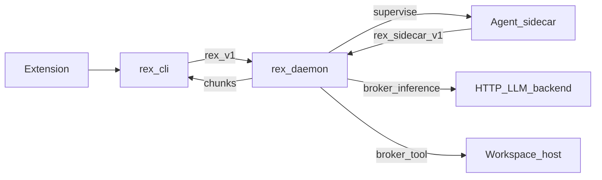

# REX MVP Spec (Phase 1)

This document defines the first shippable slice for REX.

## MVP goal

- Deliver a **basic development agent** in the VS Code/Cursor extension whose **reasoning and runtime live in a daemon-supervised sidecar** — not in the extension and not as “daemon calls the model directly.”
- Keep the extension a **thin client**: modes, approvals, apply/insert, streaming via **`rex-cli`** NDJSON ([EXTENSION.md](EXTENSION.md), [ADR 0007](architecture/decisions/0007-editor-extension-hybrid-transport-cli-and-grpc.md)).
- **`rex-daemon`** supervises the sidecar, **brokers** inference (OpenAI-compatible HTTP) and **at least one host tool** (`fs.read` recommended), and remains **stream- and policy-authoritative** for `rex.v1`.
- **`StreamInference`** for assistant work is **fulfilled through the sidecar**; the daemon maps chunks to the existing NDJSON contract.
- Keep **dogfooding** `rex` from the IDE as the success narrative.

## Architecture (Phase 1)

Hub detail: [SIDECAR_RUNTIME.md](SIDECAR_RUNTIME.md), [AGENT_ACCESS_POLICY.md](AGENT_ACCESS_POLICY.md), [ADR 0008](architecture/decisions/0008-dedicated-sidecar-control-plane-api.md).

## Product direction (beyond Phase 1)

Converge **routing, compaction, caches, metering, and richer tool/MCP loops** in **`rex-daemon`** and the sidecar envelope ([ADR 0001](architecture/decisions/0001-daemon-owns-agent-orchestration-and-economics.md)). Phase 1 proves **supervision + broker + IDE loop**; durable memory and multi-plugin fleets stay on the roadmap ([LONG_TERM_MEMORY.md](LONG_TERM_MEMORY.md), [PLUGIN_ROADMAP.md](PLUGIN_ROADMAP.md)).

## Shipping state (docs vs code)

| Area | Phase 1 intent | Today |
|------|----------------|-------|
| Transport (UDS, gRPC, NDJSON) | Must | **Implemented** |
| Extension agent UX (modes, approvals, apply) | Must | **Implemented** (extension-side policy) |
| **`--mode` / `--model` on extension → CLI → daemon** | Must | **Implemented** |
| **Brokered HTTP adapter** (daemon mechanism) | Must | **Implemented** (`http_openai_compat`) — used as **broker backend**, not as “the agent” |
| **Sidecar supervision** (0 or 1 process) | Must | **Implemented** |
| **`rex.sidecar.v1` + reference sidecar** | Must | **Implemented** (`rex-sidecar-stub`) |
| **`StreamInference` via sidecar** | Must | **Implemented** (harness: `REX_SIDECAR_HARNESS=direct`) |
| **Brokered tool** (`fs.read` MVP default) | Must | **Implemented** (`BrokerReadFile`, stub `__rex_read:` directive) |
| Daemon approval context from extension | Should | **Implemented** (`approval_id` / `--approval-id`) |
| Direct daemon HTTP/mock **without sidecar** | Harness only | **Implemented** (CI, migration) |

## In scope

| Item | Definition |
|---|---|
| Daemon | `/tmp/rex.sock`; `rex.v1`; policy, broker, sidecar supervisor. |
| CLI | `rex-cli`; NDJSON; `--mode` / `--model` on `complete`. |
| **Sidecar agent** | One supervised process; agent stack pluggable per [ADR 0005](architecture/decisions/0005-rex-owns-sidecar-environment-not-agent-implementations.md). |
| **`rex.sidecar.v1`** | Control plane distinct from `rex.v1` — MVP verbs in [SIDECAR_RUNTIME.md](SIDECAR_RUNTIME.md). |
| **Brokered inference** | Daemon runs HTTP OpenAI-compat adapter on sidecar request ([CONFIGURATION.md](CONFIGURATION.md), [ADAPTERS.md](ADAPTERS.md)). |
| **Brokered tool** | At least **`fs.read`** (or bounded **`exec.shell`** if chosen at implementation) — [AGENT_ACCESS_POLICY.md](AGENT_ACCESS_POLICY.md). |
| Extension | Modes, approvals, apply/insert, cancel, status — [EXTENSION.md](EXTENSION.md). |
| Policy seams | L1 (**`ask`** only), `PolicyEngine`, `ApprovalGate`; context pipeline. |

## Out of scope

- Multi-plugin fleets, Wasm, VM-default envelope.
- Full MCP catalog in sidecar.
- Extension Node `StreamInference`.
- **Product** path that treats in-process HTTP/mock as the agent (harness/CI only).
- Apple MLX, remote TLS listener, on-disk `rex config`, durable LTM store.

## Protocol requirements (`rex.v1`)

Unchanged client contract:

| RPC | Type | Requirement |
|---|---|---|
| `GetSystemStatus` | Unary | Version, uptime, active model id (broker backend when configured). |
| `StreamInference` | Server streaming | Chunks + terminal `done` or mapped error → NDJSON `error`. |

Implementation note: MVP **fulfillment** of `StreamInference` for assistant modes moves to the **sidecar path**; see shipping state table.

## Sidecar control plane (MVP minimum)

Documented in [SIDECAR_RUNTIME.md](SIDECAR_RUNTIME.md). Illustrative verbs:

| Verb | Purpose |
|------|---------|
| `Health` / `GetCapabilities` | Supervision and feature flags |
| `RunTurn` | One agent turn; stream text deltas to daemon |
| Brokered inference | Sidecar requests completion; daemon invokes HTTP adapter |
| Brokered tool | One capability for MVP (`fs.read` recommended) |

## Brokered HTTP (not “daemon = agent”)

- Env: `REX_OPENAI_COMPAT_*` — [CONFIGURATION.md](CONFIGURATION.md).
- Daemon **`http_openai_compat`** module is the **broker implementation** when the sidecar (or harness) requests inference.
- Operator profiles: Ollama, LM Studio, OpenAI API — [ADAPTERS.md](ADAPTERS.md).

## CLI expectations

| Command shape | Expected behavior |
|---|---|
| `rex-cli status` | Status from `GetSystemStatus`. |
| `rex-cli complete "<prompt>" --format ndjson --mode <ask\|plan\|agent>` | Forwards to daemon; MVP product path uses sidecar when implemented. |

## Extension consumer contract (MVP)

[EXTENSION.md](EXTENSION.md). The extension **depends on** a healthy sidecar-backed assistant; it does not embed the agent runtime.

## Degraded / harness paths

| Path | Use |
|------|-----|
| `REX_INFERENCE_RUNTIME=mock` | CI, `uds_e2e` |
| Direct in-process HTTP without sidecar | Migration and tests only — **not** MVP product acceptance |

When sidecar is required but absent, clients must get a **clear error**, not silent fallback that looks like success.

## Success criteria

1. Sidecar starts under daemon supervision and passes health.
2. `rex-cli complete --format ndjson --mode agent` streams text **from a sidecar turn** (logs: sidecar + broker).
3. At least one **brokered tool** succeeds (e.g. read a workspace file referenced in the prompt).
4. Extension: routine session in `plan`/`agent` (send, cancel, apply) with sidecar + HTTP configured.
5. Sidecar absent → explicit failure on product path.
6. Transport/NDJSON invariants preserved ([EXTENSION.md](EXTENSION.md)).
7. CI green with **stub sidecar** / mock harness — no live LLM on default PR jobs.

### Success criteria to evidence

| Criterion | Evidence | Status |
|---|---|---|
| 1 Sidecar health | `sidecar_roundtrip.rs`; supervisor in `rex-daemon` | **Implemented** |
| 2 Sidecar turn + stream | `rex.sidecar.v1` `RunTurn`; product-path `StreamInference` | **Implemented** |
| 3 Brokered tool | `broker.rs` tests; stub `__rex_read:` directive | **Implemented** |
| 4 Extension E2E | [EXTENSION_LOCAL_E2E.md](EXTENSION_LOCAL_E2E.md); `--approval-id` when `REX_AGENT_APPROVALS=1` | **Implemented** (operator path) |
| 5 Degraded error | Clear failure when sidecar required but unavailable | **Implemented** |
| 6 NDJSON | `rex-cli`, extension tests | **Implemented** |
| 7 CI | [CI.md](CI.md); `REX_SIDECAR_HARNESS=direct` for harness | **Implemented** |

## Manual validation checklist

**Preflight:** [`scripts/verify_mvp_local.sh`](../scripts/verify_mvp_local.sh) ([CI.md](CI.md)).

- [ ] Configure `REX_OPENAI_COMPAT_*` and `REX_SIDECAR_*` ([CONFIGURATION.md](CONFIGURATION.md)).
- [ ] Build: `cargo build --workspace`.
- [ ] Start `rex-daemon` (spawns or attaches sidecar per config).
- [ ] Confirm sidecar health (logs or status).
- [ ] `rex-cli complete "hello" --format ndjson --mode agent` — chunks from **sidecar path**.
- [ ] Prompt that triggers **brokered `fs.read`** — verify file content in response.
- [ ] Extension: **agent** mode send, cancel, apply with approval.
- [ ] Stop daemon; sockets cleaned up.
- [ ] With sidecar disabled, product path fails with clear message.

Repository layout: [ARCHITECTURE.md](ARCHITECTURE.md).
