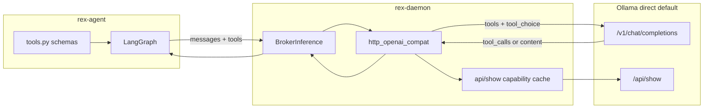

# Native broker tool calling (design hub)

**Diátaxis role:** explanation — how Rex routes agent tool loops through provider-native `tools[]` / `tool_calls` on `BrokerInference`.

**Status:** `complete` — **R038** shipped (daemon + sidecar + operator E2E script).

**Related:** [ADR 0023](architecture/decisions/0023-hybrid-agent-serialization-boundaries.md) (generative format target) · [ADAPTERS.md](ADAPTERS.md) · [CONFIGURATION.md](CONFIGURATION.md) · [AGENT_GRAPH_ARCHITECTURE.md](AGENT_GRAPH_ARCHITECTURE.md) · [EXTENSION_LOCAL_E2E.md](EXTENSION_LOCAL_E2E.md)

## Purpose

Rex’s product agent (`rex-agent`) today asks models to emit tool calls as **JSON in plain text** because `BrokerInference` is `prompt` → `text` only and `http_openai_compat` posts a single user message with **no `tools` field**. Ollama and other OpenAI-compat backends already support native `tools` / `tool_calls` on the same endpoint.

**R038** adds additive broker wire for structured messages and tools, daemon forwarding and SSE parsing, and sidecar routing from real `tool_calls` — with a validated interim JSON fallback for mock CI (**RC-10**). This unblocks reliable live-model plan/agent turns documented in [EXTENSION_LOCAL_E2E.md](EXTENSION_LOCAL_E2E.md) §8 and closes the honest gap in **R019** acceptance.

## Product defaults (locked for R038)

| Default | Value | Notes |
|---------|-------|-------|
| **`inference.openai_compat.native_tools`** | **`auto`** | Tri-state: `auto` \| `true` \| `false`. Schema default; omit field → `auto`. |
| **Inference route for agent tool calling** | **Direct Ollama** | `inference.openai_compat.base_url`: `http://127.0.0.1:11434/v1`. Daemon `http_openai_compat` → Ollama `/v1/chat/completions` and `/api/show` on the **same host** — no LiteLLM hop for R038 acceptance or operator dogfood. |
| **Gateway** | Opt-in only | `inference.gateway.mode: managed` / external LiteLLM remains for multi-provider; **not** the reference path for native tool calling or live E2E proof. |

## Scope

**In:**

- Additive `BrokerInference` wire: structured `messages[]`, `tools[]`; response `tool_calls[]` + `content` + `protocol` (`native` \| `interim` \| `interim_fallback`).
- Daemon `http_openai_compat`: forward OpenAI-shaped `tools` / `tool_choice`; parse streaming `delta.tool_calls`; Ollama `/api/show` capability cache.
- Config tri-state `inference.openai_compat.native_tools` (default **`auto`**); per-step native→interim fallback.
- Sidecar: native path when broker supports it; interim JSON-in-text fallback for mock CI.
- **Acceptance:** plan-mode tool loop (read known fixture file → final answer) passes against live **direct** Ollama; documented in [EXTENSION_LOCAL_E2E.md](EXTENSION_LOCAL_E2E.md).

**Out (stay on R033 / later):**

- MCP gRPC client and lazy MCP discovery — [ADR 0016](architecture/decisions/0016-mcp-in-sidecar-envelope.md).
- PR-blocking live LLM in CI — [CI_QUALITY_GATES.md](CI_QUALITY_GATES.md); economics live smoke remains **R039–R042** — [ECONOMICS_VALIDATION.md](ECONOMICS_VALIDATION.md).
- Deprecating JSON-in-text entirely (follow-up after R038 ships).

## Boundaries



**Not in default path:** LiteLLM gateway (`:4000`) — optional; higher interim-fallback likelihood documented in [INFERENCE_GATEWAY.md](INFERENCE_GATEWAY.md).

| Concern | Owner |
|---------|--------|
| Tool schemas (`fs.read`, `fs.list`, …) | Sidecar `tools.py` |
| HTTP `tools[]` / `tool_calls` | Daemon `http_openai_compat.rs` |
| Broker RPC contract | `proto/rex/v1/rex.proto` |
| Access policy on tool **execution** | Daemon broker — [ADR 0013](architecture/decisions/0013-access-policy-broker-completion.md) (unchanged) |
| MCP ecosystem tools | **R033** (deferred) |

## Protocol selection

Rex makes **two separate decisions** each tool-loop step. Do not conflate them.

### 1. Whether tools are in play (Rex — policy)

| Input | Rule | Result |
|-------|------|--------|
| `RunTurn.mode` | `tools_for_mode(mode)` in sidecar `tools.py` | `ask` → no tools; `plan` → read/list/plan.save; `agent` → full broker set |
| Subagent | Viewer/Editor masks further | e.g. Viewer never gets write/exec |

When the allowed set is **empty**, Rex never attaches `tools[]`, never embeds JSON tool instructions, and expects a plain final answer only.

### 2. Tool vs final (model — ReAct)

On each `BrokerInference`, the **provider** chooses (native: structured `tool_calls`; interim: `{"type":"tool",...}` or `{"type":"final",...}` in text). The graph branches on tool vs final in `llm.py`; **R038** feeds that branch from real `tool_calls` instead of parsed JSON.

### 3. Native API vs interim wire (Rex — capability gate)

**Hybrid model:** prefer native when route and model support it; keep validated fallback for gateways, old models, and CI mock.

| Value | Behavior |
|-------|----------|
| `auto` (**default**) | Probe direct Ollama `/api/show`; try native when `capabilities` includes `tools`; per-step interim fallback on failure |
| `true` | Always native when mode allows tools (operator override) |
| `false` | Always interim JSON-in-text (mock CI, forced legacy) |

`mock` / `cursor-cli` runtimes: **always interim** regardless of config (**RC-10**).

**Direct Ollama in `auto`:** capability probe and R038 E2E use `base_url` pointing at Ollama (`127.0.0.1:11434`). Non-Ollama `base_url` in `auto`: skip `/api/show` probe → try native once → interim fallback on failure.

#### Dynamic gate (`auto`) — daemon-owned, cached per model

| Layer | Signal | How |
|-------|--------|-----|
| **Model capability** | Ollama `POST /api/show` → `capabilities` contains `"tools"` | Daemon probes on first `BrokerInference` per `(base_url, model)`; in-process cache for daemon lifetime |
| **Outcome** | Usable `tool_calls` or `finish_reason=tool_calls` | If tools sent and response is prose-only / parse fails → **one** interim retry same step |
| **Static override** | `native_tools: true/false` | Operator wins over probe |

**Fail-closed fallback (one retry per step):** stable code `native_tools_unsupported` when provider 4xx, SSE lacks `tool_calls` deltas after tools sent, or assembled response is empty. Sidecar re-issues same step on interim path; log `protocol=interim_fallback`.

#### Response routing in sidecar

| `BrokerInferenceResponse` | Graph action |
|---------------------------|--------------|
| `tool_calls` non-empty | Route to tools node (`llm.py` branch) |
| `content` only, parseable interim JSON | Existing `parse_model_output` path |
| `content` only, plain text | Final answer (`ask` mode or model skipped tools) |

## Interfaces (intent)

Proto additions (additive; keep `prompt` during migration):

- `ChatMessage { role, content }`
- `ToolSpec { name, description, parameters_json }` (OpenAI function shape)
- `ToolCall { id, name, arguments_json }`
- `BrokerInferenceResponse`: `repeated ToolCall tool_calls` + `string content` + `protocol` enum

Config (R015 JSON):

```json
"inference": {
  "runtime": "http-openai-compat",
  "openai_compat": {
    "base_url": "http://127.0.0.1:11434/v1",
    "model": "qwen2.5-coder:7b",
    "native_tools": "auto"
  }
}
```

Omit `native_tools` → schema default **`auto`**.

## E2E acceptance (operator; not PR CI)

After [EXTENSION_LOCAL_E2E.md](EXTENSION_LOCAL_E2E.md) prerequisites (direct Ollama, `rex-agent` active):

1. **Plan mode:** prompt that reads a known workspace fixture via `fs.read` and returns a final answer citing file content — **without** `parse_retries` on the native path (`protocol=native` in daemon logs).
2. **Agent mode:** at least one brokered read under workspace root; denied read on protected path still fails closed.
3. Config uses default `native_tools: auto` (or omitted); `base_url` is direct Ollama, not gateway.

Automated script: [`scripts/verify_native_tools_live.sh`](../scripts/verify_native_tools_live.sh) (`REX_LIVE_LLM=1`; opt-in, not PR CI). Economics live smoke (**R039–R042**) covers `ask` NDJSON + brokered read/policy only — not plan-mode tool loop.

## Prioritization

| ID | Bucket | Rationale |
|----|--------|-----------|
| **R038** | **Should** | Unblocks live E2E; implements ADR 0023 generative row for Ollama/direct compat |
| **R033** (rescoped) | **Could** | MCP orthogonal; follows stable native tool path |

Pointer: [PRIORITIZATION.md](PRIORITIZATION.md).

## Implementation slices (merge-wait between each)

| Slice | Scope | Acceptance |
|-------|-------|------------|
| **R038 PR 1** | Proto + daemon HTTP + `/api/show` cache + `native_tools` tri-state | **Done** — `./scripts/ci/run_rust_verify.sh` |
| **R038 PR 2** | Sidecar native path + JSON fallback | **Done** — `./scripts/ci/run_rex_agent_checks.sh` |
| **R038 PR 3** | Operator E2E script + EXTENSION_LOCAL_E2E update | **Done** — `REX_LIVE_LLM=1 ./scripts/verify_native_tools_live.sh` |

## Cross-links

- [ROADMAP.md](ROADMAP.md) — **R038** row; **R033** MCP-only
- [AGENT_DELIVERY_ROADMAP.md](AGENT_DELIVERY_ROADMAP.md) — program order; R019 gap
- [sidecars/rex-agent/DESIGN.md](../sidecars/rex-agent/DESIGN.md) — sidecar wire contract
- [ADAPTERS.md](ADAPTERS.md) — `native_tool_calling` capability row
- [CONFIGURATION.md](CONFIGURATION.md) — `native_tools` default and examples
- [MVP_SPEC.md](MVP_SPEC.md) — stub vs product tool-loop gap
- [ADR 0023](architecture/decisions/0023-hybrid-agent-serialization-boundaries.md) — generative format milestone **R038**
