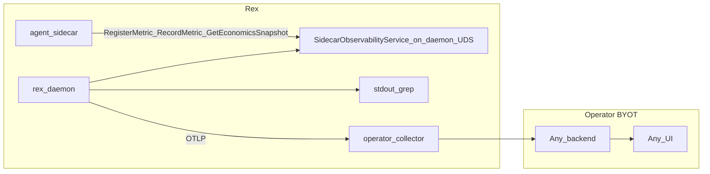

# Observability and economics validation (design hub)

This document is the **single source** for Rex **observability beyond stdout grep** and a **validation program** to test whether Rex reduces token and compute cost for paid APIs and local open-source models. Implementation today is **stdout metrics only** unless other docs say otherwise.

See [DOCUMENTATION.md](DOCUMENTATION.md) for the **feature-area hub** convention.

**Decision record:** [ADR 0010](architecture/decisions/0010-daemon-exports-observability-via-otel-and-sidecar-api.md) · **Operator how-to:** [OBSERVABILITY_INTEGRATIONS.md](OBSERVABILITY_INTEGRATIONS.md)

## Purpose

- Make daemon economics **measurable and operable**: operators visualize cache, routing, and pipeline decisions in **their chosen UI** (Grafana, Datadog, observr, etc.) — not a Rex-owned dashboard monolith.
- Export via **vendor-neutral OTLP** from `rex-daemon`; sidecars produce custom metrics **through the daemon observability API**.
- Define how to **validate** Rex value: baseline vs Rex-enabled runs across local and remote inference backends.
- Extend the signal vocabulary in [ARCHITECTURE.md](ARCHITECTURE.md#observability) without duplicating the full [CONTEXT_EFFICIENCY.md](CONTEXT_EFFICIENCY.md) lever matrix.

## Status

**design documented** — [ADR 0010](architecture/decisions/0010-daemon-exports-observability-via-otel-and-sidecar-api.md) accepted; this hub, integrations guide, and cross-links capture intent. OTLP export, `SidecarObservabilityService`, CLI helpers, and reference integration configs are **planned / not shipped** in code.

## Scope

**In:**

- **Signal catalog** (implemented + planned) shared by stdout, OTLP, and operator dashboards.
- **Daemon OTLP export** when `REX_OBS_ENABLED=1` — **planned**.
- **`SidecarObservabilityService`** on **daemon UDS** (`REX_DAEMON_SOCKET`) — `RegisterMetric`, `RecordMetric`, `GetEconomicsSnapshot`, `ReportResourceStats` — **planned**.
- **Economics validation program**: scenarios, metrics, success criteria.
- **BYOT integrations** — patterns documented in [OBSERVABILITY_INTEGRATIONS.md](OBSERVABILITY_INTEGRATIONS.md); no Rex-managed stack.

**Out:**

- Rex-managed metric databases, collectors, or dashboard servers.
- Dedicated observability-only sidecar or export sidecar.
- Hosted SaaS billing or mandatory cloud telemetry.
- Live LLM calls on every PR ([CI.md](CI.md) stays mock/self-contained by default).

## Boundaries

| Concern | Owner | Notes |
|---------|--------|--------|
| **Emitting stable labels + OTLP export** | `rex-daemon` | OpenTelemetry SDK; background export must not block streams — **planned**. |
| **Sidecar custom metrics** | Sidecar via **`SidecarObservabilityService`** on daemon UDS → daemon OTLP | Primary path; optional direct sidecar OTLP for SDK-equipped runtimes — **planned**. |
| **Storage, query, UI** | Operator tooling | Collector, TSDB, Grafana, vendor SaaS — [OBSERVABILITY_INTEGRATIONS.md](OBSERVABILITY_INTEGRATIONS.md). |
| **Lever definitions** | [CONTEXT_EFFICIENCY.md](CONTEXT_EFFICIENCY.md) | This hub references rows; does not duplicate the matrix. |
| **Agent knowledge retrieval metrics** | [AGENT_KNOWLEDGE.md](AGENT_KNOWLEDGE.md) | Future `knowledge=` stage — cross-link only. |

## Architecture



- **Phase 0 (today):** grep daemon stdout.
- **Phase 1+ (planned):** daemon OTLP export + `SidecarObservabilityService`; operator connects collector and UI.

### Rejected patterns

| Pattern | Why rejected |
|---------|--------------|
| Rex-managed observability stack (bundled Grafana/VM + `rex-cli obs up`) | Operators choose tooling; Rex emits OTLP only. |
| Dedicated observability sidecar | Extra supervised process; duplicates collector role. |
| Builtin **export** sidecar | Extra hop; conflicts with 0-or-1 agent sidecar model — [ADR 0010](architecture/decisions/0010-daemon-exports-observability-via-otel-and-sidecar-api.md). |
| Extension-embedded metrics dashboard | Reuse OSS UI via BYOT. |

## Sidecar observability API (planned)

**`SidecarObservabilityService`** on the **daemon UDS** (`REX_DAEMON_SOCKET`) — distinct from the sidecar control-plane socket. See [SIDECAR_RUNTIME.md](SIDECAR_RUNTIME.md).

| RPC | Purpose |
|-----|---------|
| `RegisterMetric` | Declare custom metric (name, type, allowed labels) |
| `RecordMetric` | Emit data point; exported as `rex.sidecar.custom.*` via daemon OTLP |
| `GetEconomicsSnapshot` | Bounded recent economics for in-agent decisions (not time-series query) |
| `ReportResourceStats` | Optional self-reported CPU/memory/runtime stats |

## Signal catalog

Canonical vocabulary for grep, OTLP, and dashboards. **Implemented** fields exist in daemon stdout today unless marked **planned**.

### Stream and lifecycle

| Signal | Status | Meaning |
|--------|--------|---------|
| `stream.request_id` | implemented | Per-request id |
| `trace_id` | implemented | Correlation with CLI / extension |
| `stream.lifecycle` | implemented | e.g. `starting`, terminal phases |
| `stream.terminal` | implemented | Outcome class at end of stream |
| `elapsed_ms` | implemented | Request duration |
| `inference_runtime` | implemented | Active adapter label |
| `route=` | implemented | Path label — see [CONTEXT_EFFICIENCY.md](CONTEXT_EFFICIENCY.md#routing-observability-rc-09) |
| `decision_id=` | implemented | `dec-{request_id}` for log correlation |

### Cache

| Signal | Status | Meaning |
|--------|--------|---------|
| `cache_decision=` | implemented | `hit`, `miss_stored`, `bypass`, `uncacheable_mode` |
| `l1_cache=` | implemented | Legacy; cacheable lookups only — [CACHING.md](CACHING.md) |

### Context pipeline (`stream.metrics`)

| Signal | Status | Meaning |
|--------|--------|---------|
| `prompt_tokens` | implemented | Estimated prompt size |
| `context_tokens` | implemented | Selected context tokens |
| `candidates` / `selected` | implemented | Retrieval candidate counts |
| `truncated` | implemented | Context truncated flag |
| `cache` | implemented | Pipeline cache status string |
| `behavior` | implemented | Prefilter decision |
| `retrieval` | implemented | `ran` or `skipped` |
| `compression_strategy` | implemented | e.g. `extractive_query` |

### Agent policy and broker

| Signal | Status | Meaning |
|--------|--------|---------|
| `approval=` | implemented | `allow`, `deny`, `checkpoint` — [ADR 0009](architecture/decisions/0009-centralized-agent-approvals-and-checkpoints.md) |
| `broker.inference=*` | implemented | Sidecar broker inference RPC |
| `broker.access_policy=*` | implemented | Broker policy outcomes |

### Planned (OTLP + API)

| Signal / capability | Meaning |
|--------|---------|
| `rex.*` OTel instruments | Stable names — [OBSERVABILITY_INTEGRATIONS.md](OBSERVABILITY_INTEGRATIONS.md) |
| Sidecar `rex.sidecar.custom.*` | Via `SidecarObservabilityService` |
| **Estimated tokens / cost** | Adapter metadata + optional pricing table |
| `knowledge=` | Agent knowledge retrieval — [AGENT_KNOWLEDGE.md](AGENT_KNOWLEDGE.md) |
| OTLP logs and traces | Phase after metrics |
| `obs.export=degraded` | Stdout signal when OTLP export fails |

### Example grep (phase 0)

```bash
rg 'cache_decision=' /path/to/daemon.log
rg 'stream.metrics' /path/to/daemon.log
```

## Economics validation program

**Goal:** evidence that Rex levers reduce **net tokens**, **latency**, or **estimated cost** vs a baseline, for both **paid APIs** and **local OSS** backends ([CONFIGURATION.md](CONFIGURATION.md) `REX_OPENAI_COMPAT_*`).

### Scenarios

| Scenario | Baseline | Rex-enabled |
|----------|----------|-------------|
| **Short ask** | Adapter only; retrieval off or N/A | Adaptive retrieval + cache |
| **Code context ask** | Full prompt without compaction | Extractive compaction + prefix cache |
| **Agent turn** | Sidecar loop without cache | L1 policy + approvals logged |
| **Paid API** | Remote OpenAI-compat | Same + `cache_decision=` and `stream.metrics` |
| **Paid API via LiteLLM** | Gateway to Anthropic/OpenAI | Same Rex signals; attribute spend and upstream errors in **LiteLLM** logs — [INFERENCE_GATEWAY.md](INFERENCE_GATEWAY.md) |
| **Local OSS** | Ollama / LM Studio | Same; emphasize compute time + token estimates |

### Success metrics (hypotheses — not thresholds yet)

| Metric | Notes |
|--------|--------|
| Δ prompt + context tokens | Rex-enabled vs baseline on fixed fixture prompts |
| Cache hit ratio | Ask mode; agent mode expected uncacheable |
| p50 / p95 `elapsed_ms` | Regression guard when adding stages |
| Cost per successful turn | When pricing metadata exists |

## Rex vs third-party responsibilities

| Responsibility | Rex | Third party / operator |
|----------------|-----|------------------------|
| Stable metric names + OTLP export | yes (planned) | — |
| `SidecarObservabilityService` | yes (planned) | — |
| Stdout economics grep | yes (today) | — |
| Collector, storage, UI | — | yes |
| Reference dashboard JSON | examples in docs only | import into your Grafana |

## Phasing

| Phase | Deliverable | Status |
|-------|-------------|--------|
| **0** | Stdout + grep recipes | **implemented** |
| **1** | Design docs + ADR 0010 + integrations guide | **design documented** (this PR) |
| **2** | Sidecar observability proto + daemon OTLP predefined metrics | planned — see [ROADMAP.md](ROADMAP.md) |
| **3** | `SidecarObservabilityService` implementation + BYOT examples | planned |
| **4** | CI OTLP smoke (mock adapter) | planned |
| **5** | OTLP logs/traces | planned |

## Resolved questions

| Question | Resolution |
|----------|------------|
| Push vs pull? | **Push (OTLP)** primary; optional Prometheus scrape deferred unless requested. |
| Daemon vs export sidecar? | **Daemon exports directly** — [ADR 0010](architecture/decisions/0010-daemon-exports-observability-via-otel-and-sidecar-api.md). |
| Sidecar custom metrics? | **`SidecarObservabilityService`** on **daemon UDS** — not sidecar UDS. |
| Default observability stack? | **None** — BYOT via [OBSERVABILITY_INTEGRATIONS.md](OBSERVABILITY_INTEGRATIONS.md). |

## Open questions

| Question | Why it matters |
|----------|----------------|
| PII in logs and traces? | Prompt snippets must stay out by default |
| Correlate daemon + sidecar in one trace? | OTLP trace propagation design |

## Cross-links

| Doc | Relationship |
|-----|----------------|
| [OBSERVABILITY_INTEGRATIONS.md](OBSERVABILITY_INTEGRATIONS.md) | BYOT operator recipes |
| [ARCHITECTURE.md](ARCHITECTURE.md) | SAD observability table |
| [SIDECAR_RUNTIME.md](SIDECAR_RUNTIME.md) | Sidecar → daemon observability flow |
| [CONTEXT_EFFICIENCY.md](CONTEXT_EFFICIENCY.md) | Lever matrix |
| [ROADMAP.md](ROADMAP.md) | Parked theme |
| [CI.md](CI.md) | No live LLM on PRs |
