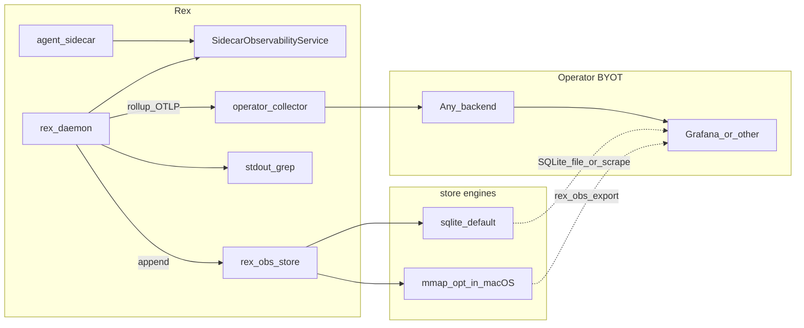
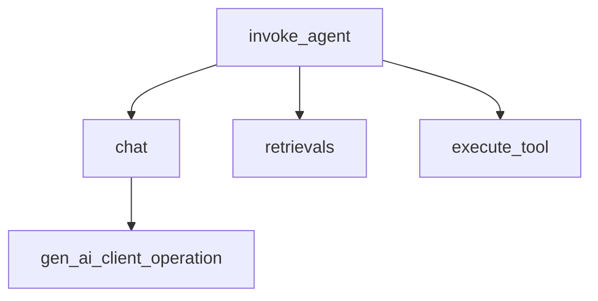

# Observability and economics validation (design hub)

This document is the **single source** for Rex **observability beyond stdout grep** and how it connects to the **economics validation program**. Implementation today is **stdout metrics only** unless other docs say otherwise.

See [DOCUMENTATION.md](DOCUMENTATION.md) for the **feature-area hub** convention.

**Decision records:** [ADR 0010](architecture/decisions/0010-daemon-exports-observability-via-otel-and-sidecar-api.md) · [ADR 0020](architecture/decisions/0020-otel-genai-semconv-with-rex-pipeline-metrics.md) · [ADR 0021](architecture/decisions/0021-rex-owned-economics-store-byot-visualization.md) · [ADR 0025](architecture/decisions/0025-dual-economics-store-engines.md) · **Mmap format:** [OBS_STORE_MMAP_FORMAT.md](OBS_STORE_MMAP_FORMAT.md) · **Validation program:** [ECONOMICS_VALIDATION.md](ECONOMICS_VALIDATION.md) · **Operator how-to:** [OBSERVABILITY_INTEGRATIONS.md](OBSERVABILITY_INTEGRATIONS.md)

## Configuration surface

Rex observability is controlled only by merged JSON: **`observability.enabled`** and related keys in [CONFIGURATION.md](CONFIGURATION.md). Optional bootstrap env **`REX_ROOT`** selects the layout directory. There are no `REX_OBS_*` product environment variables.

## Purpose

- Make daemon economics **measurable and operable**: operators visualize cache, routing, and pipeline decisions in **their chosen UI** (Grafana, Datadog, observr, etc.) — Rex does not run those UIs.
- Persist economics under **`$REX_ROOT`** when observability is enabled; export via **OTLP** and optional Prometheus scrape.
- Link to the **validation program** for proving cost savings without unacceptable quality loss — [ECONOMICS_VALIDATION.md](ECONOMICS_VALIDATION.md).
- Extend the signal vocabulary in [ARCHITECTURE.md](ARCHITECTURE.md#observability) without duplicating the full [CONTEXT_EFFICIENCY.md](CONTEXT_EFFICIENCY.md) lever matrix.

## Status

**design documented** — ADRs 0010, 0020, 0021, 0025 accepted in docs; OTLP, `rex-obs-store` (dual engines), `SidecarObservabilityService`, and `rex obs` helpers are **planned / not shipped** in code.

## Scope

**In:**

- **Signal catalog** (implemented + planned) shared by stdout, OTLP, store, and dashboards.
- **Daemon OTLP export** when `observability.enabled: true` — **planned**.
- **`rex-obs-store`** under `$REX_ROOT` when observability enabled — **SQLite default**, **mmap opt-in** (macOS) — **planned** — [ADR 0025](architecture/decisions/0025-dual-economics-store-engines.md), [OBS_STORE_MMAP_FORMAT.md](OBS_STORE_MMAP_FORMAT.md).
- **`SidecarObservabilityService`** on **daemon UDS** (`daemon.socket` in config) — **planned**.
- **BYOT visualization** — [OBSERVABILITY_INTEGRATIONS.md](OBSERVABILITY_INTEGRATIONS.md).

**Out:**

- Rex **supervising** collector, TSDB, or Grafana processes.
- Dedicated observability-only sidecar.
- Prompt or file body storage in the economics DB.
- Live LLM calls on every PR ([CI.md](CI.md)).

## Boundaries

| Concern | Owner | Notes |
|---------|--------|--------|
| **Merged JSON + OTLP export** | `rex-daemon` | `observability` section — **planned**. |
| **Local economics persistence** | `rex-obs-store` | Enabled with `observability.enabled: true` — [ADR 0021](architecture/decisions/0021-rex-owned-economics-store-byot-visualization.md). |
| **Sidecar custom metrics** | Sidecar via **`SidecarObservabilityService`** on daemon UDS | **planned**. |
| **Visualization backends** | Operator | Grafana, Datadog, Phoenix — BYOT. |
| **Lever definitions** | [CONTEXT_EFFICIENCY.md](CONTEXT_EFFICIENCY.md) | Cross-link only. |
| **Validation program** | [ECONOMICS_VALIDATION.md](ECONOMICS_VALIDATION.md) | Benchmarks, TOST, cadence. |

## Architecture



- **Phase 0 (today):** grep daemon stdout; `observability.enabled` false or omitted.
- **Phase 1 (design documented):** hubs, ADRs, validation program.
- **Phase 2+ (planned):** store + OTLP + sidecar observability API.

### Rejected patterns

| Pattern | Why rejected |
|---------|--------------|
| Rex **supervising** Grafana/VM/collector | Operators run visualization; Rex persists and exports. |
| Dedicated observability sidecar | Extra process; duplicates collector role. |
| Builtin **export** sidecar | Conflicts with 0-or-1 agent sidecar — [ADR 0010](architecture/decisions/0010-daemon-exports-observability-via-otel-and-sidecar-api.md). |
| `REX_OBS_*` env configuration | Product settings are JSON-only — [CONFIGURATION.md](CONFIGURATION.md). |

## Sidecar observability API (planned)

**`SidecarObservabilityService`** on the **daemon UDS** (`daemon.socket` in merged config) — distinct from the sidecar control-plane socket. See [SIDECAR_RUNTIME.md](SIDECAR_RUNTIME.md).

| RPC | Purpose |
|-----|---------|
| `RegisterMetric` | Declare custom metric (name, type, allowed labels) |
| `RecordMetric` | Emit data point; exported as `rex.sidecar.custom.*` |
| `GetEconomicsSnapshot` | Bounded recent economics (not time-series query) |
| `ReportResourceStats` | Optional CPU/memory self-report |

## Signal catalog

Canonical vocabulary for grep, OTLP, store, and dashboards. **Implemented** fields exist in daemon stdout today unless marked **planned**.

### Stream and lifecycle

| Signal | Status | Meaning |
|--------|--------|---------|
| `stream.request_id` | implemented | Per-request id |
| `trace_id` | implemented | Correlation with CLI / extension |
| `stream.lifecycle` | implemented | e.g. `starting`, terminal phases |
| `stream.terminal` | implemented | Outcome class at end of stream |
| `elapsed_ms` | implemented | Request duration |
| `inference_runtime` | implemented | Active adapter label |
| `route=` | implemented | Path label — [CONTEXT_EFFICIENCY.md](CONTEXT_EFFICIENCY.md#routing-observability-rc-09) |
| `decision_id=` | implemented | `dec-{request_id}` for log correlation |

### Cache

| Signal | Status | Meaning |
|--------|--------|---------|
| `cache_decision=` | implemented | `hit`, `miss_stored`, `bypass`, `uncacheable_mode` |
| `l1_cache=` | implemented | Legacy; cacheable lookups only — [CACHING.md](CACHING.md) |

### Context pipeline (`stream.metrics`)

| Signal | Status | Meaning |
|--------|--------|---------|
| `prompt_tokens` | implemented | Estimated prompt size |
| `context_tokens` | implemented | Selected context tokens |
| `candidates` / `selected` | implemented | Retrieval candidate counts |
| `truncated` | implemented | Context truncated flag |
| `cache` | implemented | Pipeline cache status string |
| `behavior` | implemented | Prefilter decision |
| `retrieval` | implemented | `ran` or `skipped` |
| `compression_strategy` | implemented | e.g. `extractive_query` |

### Agent policy and broker

| Signal | Status | Meaning |
|--------|--------|---------|
| `approval=` | implemented | `allow`, `deny`, `checkpoint` — [ADR 0009](architecture/decisions/0009-centralized-agent-approvals-and-checkpoints.md) |
| `broker.inference=*` | implemented | Sidecar broker inference RPC |
| `broker.access_policy=*` | implemented | Broker policy outcomes |

### Planned (OTLP + store + API)

| Signal / capability | Meaning |
|--------|---------|
| `cached_tokens` | Provider-reported cached input tokens per inference — agent-turn economics — [ECONOMICS_VALIDATION.md](ECONOMICS_VALIDATION.md#agent-turn-ab-protocol-design) |
| `prefix_hash` | SHA-256 of static prompt prefix before each sidecar inference step — prefix immutability CI — [AGENT_GRAPH_ARCHITECTURE.md](AGENT_GRAPH_ARCHITECTURE.md), [CACHING.md](CACHING.md#prefix-immutability-and-cache-breakpoints-agent-turns) |
| `parse_retries` | Count of JSON tool-line parse recovery attempts — interim protocol until **R033** — [ADR 0023](architecture/decisions/0023-hybrid-agent-serialization-boundaries.md) |
| `tokens_in_total` | Aggregate input tokens per turn or step rollup — validation harness |
| `gen_ai.client.*` | OTel GenAI semconv — [ADR 0020](architecture/decisions/0020-otel-genai-semconv-with-rex-pipeline-metrics.md) |
| `rex.*` / `rex.pipeline.*` | Pipeline attribution — [OBSERVABILITY_INTEGRATIONS.md](OBSERVABILITY_INTEGRATIONS.md) |
| Sidecar `rex.sidecar.custom.*` | Via `SidecarObservabilityService` |
| `config_snapshot_id` | FK to deduplicated config row in store |
| `knowledge=` | Agent knowledge retrieval — [AGENT_KNOWLEDGE.md](AGENT_KNOWLEDGE.md) |
| OTLP logs and traces | After metrics phase |
| `obs.export=degraded` | Stdout when OTLP export fails |

## Trace model (planned)



Correlation: `trace_id`, `stream.request_id`, future `turn_id` on **span attributes only** — not metric labels ([ADR 0020](architecture/decisions/0020-otel-genai-semconv-with-rex-pipeline-metrics.md)).

## rex-obs-store (planned)

Active when **`observability.enabled: true`** in merged JSON ([ADR 0021](architecture/decisions/0021-rex-owned-economics-store-byot-visualization.md), [ADR 0025](architecture/decisions/0025-dual-economics-store-engines.md)). Engine: **`observability.store.engine`** — default **`sqlite`**; opt-in **`mmap`** on macOS only.

### Store engines

| Engine | Default path | Platform | Format doc |
|--------|--------------|----------|------------|
| **`sqlite`** | `obs/store.sqlite` | macOS, Linux CI | SQL schema (ADR 0021) |
| **`mmap`** | `obs/store.rexobs` | **macOS only** | [OBS_STORE_MMAP_FORMAT.md](OBS_STORE_MMAP_FORMAT.md) |

Shared **logical** tables/records (encoding differs by engine):

| Table / record | Purpose |
|----------------|---------|
| `config_snapshots` | Content-hash `id`; canonical economics-relevant config JSON once |
| `streams` | Per-request economics; `snapshot_id` FK |
| `runs` | Validation harness run metadata |
| `run_tasks` | Per-task outcomes |

**Write path:** append on `stream.terminal`; harness on run complete. Non-blocking on the inference hot path.

**Read paths (planned):** `rex obs compare|export|rollup`; Prometheus scrape; OTLP rollups. Grafana: [OBSERVABILITY_INTEGRATIONS.md](OBSERVABILITY_INTEGRATIONS.md) bridges A–D (bridge C = **sqlite only**).

## Economics validation program

Scenarios, benchmarks, statistical gates, run manifests, and local-OSS thresholds: **[ECONOMICS_VALIDATION.md](ECONOMICS_VALIDATION.md)**.

### Example grep (phase 0)

```bash
rg 'cache_decision=' /path/to/daemon.log
rg 'stream.metrics' /path/to/daemon.log
```

## Rex vs third-party responsibilities

| Responsibility | Rex | Third party / operator |
|----------------|-----|------------------------|
| `observability` JSON + store schema | yes (planned) | — |
| OTLP + `gen_ai.*` / `rex.*` export | yes (planned) | — |
| `SidecarObservabilityService` | yes (planned) | — |
| Stdout economics grep | yes (today) | — |
| Collector, Grafana, fleet TSDB | — | yes (operator-run) |

## Phasing

| Phase | Deliverable | Status |
|-------|-------------|--------|
| **0** | Stdout + grep; observability off in JSON | **implemented** |
| **1** | Design hubs, ADRs 0010/0020/0021, validation program | **design documented** |
| **2** | OTLP + `gen_ai.*`/`rex.*` + store write path (**sqlite** engine) | planned |
| **2b** | **mmap** store engine (macOS opt-in) | planned — after Phase 2 sqlite path |
| **3** | `SidecarObservabilityService` + rollup export | planned |
| **4** | CI OTLP smoke (mock adapter) | planned |
| **5** | `rex obs` CLI, Prometheus scrape, retention | planned |
| **6** | OTLP logs/traces; eval harness | planned |

## Resolved questions

| Question | Resolution |
|----------|------------|
| Push vs pull? | **OTLP push** primary; optional Prometheus scrape from rollups. |
| Rex configuration? | **`observability` in merged JSON**; `REX_ROOT` only bootstrap env. |
| Local economics DB? | **Yes when observability enabled** — ADR 0021; not a fleet TSDB. |
| Sidecar custom metrics? | **`SidecarObservabilityService`** on daemon UDS. |
| Default visualization stack? | **None** — BYOT. |

## Open questions

| Question | Why it matters |
|----------|----------------|
| PII in logs and traces? | Prompt snippets must stay out by default |
| Correlate daemon + sidecar in one trace? | OTLP trace propagation design |

## Cross-links

| Doc | Relationship |
|-----|----------------|
| [ECONOMICS_VALIDATION.md](ECONOMICS_VALIDATION.md) | Validation program |
| [OBSERVABILITY_INTEGRATIONS.md](OBSERVABILITY_INTEGRATIONS.md) | BYOT recipes |
| [CONFIGURATION.md](CONFIGURATION.md) | `observability` JSON keys |
| [ARCHITECTURE.md](ARCHITECTURE.md) | SAD observability |
| [SIDECAR_RUNTIME.md](SIDECAR_RUNTIME.md) | Sidecar flow |
| [CONTEXT_EFFICIENCY.md](CONTEXT_EFFICIENCY.md) | Lever matrix |
| [OBS_STORE_MMAP_FORMAT.md](OBS_STORE_MMAP_FORMAT.md) | Mmap on-disk format + format decision |
| [ROADMAP.md](ROADMAP.md) | Implementation queue |
| [CI.md](CI.md) | No live LLM on PRs |
