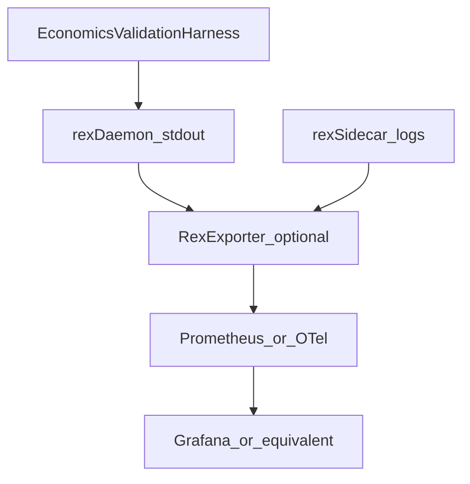
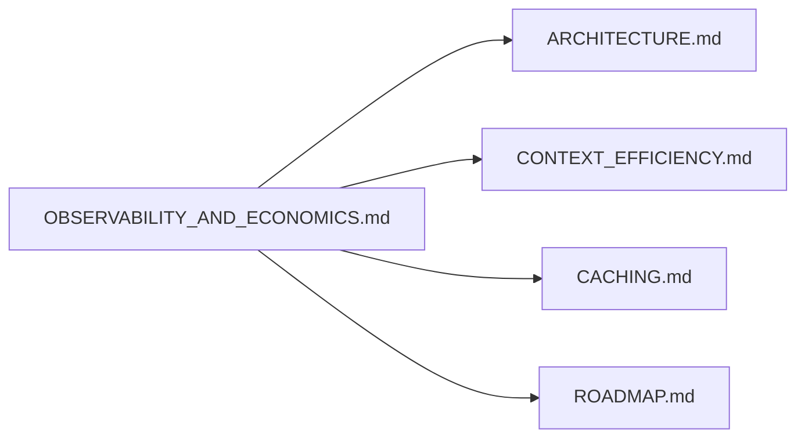

# Observability and economics validation (design hub)

This document is the **single source** for Rex **observability beyond stdout grep** and a **validation program** to test whether Rex reduces token and compute cost for paid APIs and local open-source models. Implementation today is **stdout metrics only** unless other docs say otherwise.

See [DOCUMENTATION.md](DOCUMENTATION.md) for the **feature-area hub** convention.

## Purpose

- Make daemon economics **measurable and operable**: operators can see cache, routing, and pipeline decisions in a **UI** built from third-party open-source tools—not a bespoke Rex-only dashboard monolith.
- Define how to **validate** Rex value: baseline (adapter-only) vs Rex-enabled runs across local and remote inference backends.
- Extend the signal vocabulary in [ARCHITECTURE.md](ARCHITECTURE.md#observability) without duplicating the full [CONTEXT_EFFICIENCY.md](CONTEXT_EFFICIENCY.md) lever matrix.

## Status

**planned** — design bet. Exporter, reference dashboards, and benchmark harness are not shipped.

## Scope

**In (this design stage):**

- **Signal catalog** (implemented + planned) shared by logs, future exporters, and dashboards.
- **Economics validation program**: scenarios, metrics, success criteria.
- **OSS reference architectures** (options, not a single mandated stack).
- **Phasing** from grep → exporter → dashboards → CI smoke.

**Out:**

- Hosted SaaS billing or mandatory cloud telemetry.
- Replacing stdout grep before an exporter exists.
- Live LLM calls on every PR ([CI.md](CI.md) stays mock/self-contained by default).

## Boundaries

| Concern | Owner | Notes |
|---------|--------|--------|
| **Emitting stable labels** | `rex-daemon` (and sidecar logs later) | Vocabulary aligned with [CACHING.md](CACHING.md) and `CacheDecisionState` in `policy.rs`. |
| **Storage, query, UI** | Third-party OSS (Prometheus, Grafana, Loki, Jaeger, etc.) | Rex does not own long-term metric DBs in the default story. |
| **Lever definitions** | [CONTEXT_EFFICIENCY.md](CONTEXT_EFFICIENCY.md) matrix | This hub references rows; does not duplicate the matrix body. |
| **Agent knowledge retrieval metrics** | [AGENT_KNOWLEDGE.md](AGENT_KNOWLEDGE.md) | Future `knowledge=` stage — cross-link only. |

## Architecture (intent)



- **Phase 0:** operators grep daemon stdout (today).
- **Phase 1+:** optional Rex exporter scrapes or receives push; OSS stack provides UI.

## Signal catalog

Canonical vocabulary for grep, exporters, and dashboards. **Implemented** fields exist in daemon stdout today unless marked **planned**.

### Stream and lifecycle

| Signal | Status | Meaning |
|--------|--------|---------|
| `stream.request_id` | implemented | Per-request id |
| `trace_id` | implemented | Correlation with CLI / extension |
| `stream.lifecycle` | implemented | e.g. `starting`, terminal phases |
| `stream.terminal` | implemented | Outcome class at end of stream |
| `elapsed_ms` | implemented | Request duration |
| `inference_runtime` | implemented | Active adapter label |
| `route=` | implemented | Path label — see [CONTEXT_EFFICIENCY.md](CONTEXT_EFFICIENCY.md#routing-observability-rc-09) |
| `decision_id=` | implemented | `dec-{request_id}` for log correlation |

### Cache

| Signal | Status | Meaning |
|--------|--------|---------|
| `cache_decision=` | implemented | `hit`, `miss_stored`, `bypass`, `uncacheable_mode` — prefer over legacy `l1_cache=` |
| `l1_cache=` | implemented | Legacy; cacheable lookups only — [CACHING.md](CACHING.md) |

### Context pipeline (`stream.metrics`)

| Signal | Status | Meaning |
|--------|--------|---------|
| `prompt_tokens` | implemented | Estimated prompt size |
| `context_tokens` | implemented | Selected context tokens |
| `candidates` / `selected` | implemented | Retrieval candidate counts |
| `truncated` | implemented | Context truncated flag |
| `cache` | implemented | Pipeline cache status string |
| `behavior` | implemented | Prefilter decision |
| `retrieval` | implemented | `ran` or `skipped` |
| `compression_strategy` | implemented | e.g. `extractive_query` |

### Agent policy and broker

| Signal | Status | Meaning |
|--------|--------|---------|
| `approval=` | implemented | `allow`, `deny`, `checkpoint` — [ADR 0009](architecture/decisions/0009-centralized-agent-approvals-and-checkpoints.md) |
| `broker.inference=*` | implemented | Sidecar broker inference RPC |
| `broker.access_policy=*` | implemented | Broker policy outcomes |

### Planned

| Signal | Meaning |
|--------|---------|
| **Estimated tokens / cost** | Adapter metadata + optional pricing table — [ARCHITECTURE.md](ARCHITECTURE.md#observability) |
| `knowledge=` | Agent knowledge retrieval stage — [AGENT_KNOWLEDGE.md](AGENT_KNOWLEDGE.md) |
| Sidecar trace spans | OpenTelemetry correlation daemon ↔ sidecar |

### Example grep (phase 0)

```bash
# Cache outcomes for a session
rg 'cache_decision=' /path/to/daemon.log

# Per-request economics line
rg 'stream.metrics' /path/to/daemon.log
```

## Economics validation program

**Goal:** evidence that Rex levers reduce **net tokens**, **latency**, or **estimated cost** vs a baseline, for both **paid APIs** and **local OSS** backends ([CONFIGURATION.md](CONFIGURATION.md) `REX_OPENAI_COMPAT_*`).

### Scenarios

| Scenario | Baseline | Rex-enabled |
|----------|----------|-------------|
| **Short ask** | Adapter only; retrieval off or N/A | Adaptive retrieval + cache |
| **Code context ask** | Full prompt without compaction | Extractive compaction + prefix cache |
| **Agent turn** | Sidecar loop without cache | L1 policy + approvals logged |
| **Paid API** | Remote OpenAI-compat | Same + `cache_decision=` and `stream.metrics` |
| **Local OSS** | Ollama / LM Studio | Same; emphasize compute time + token estimates |

### Dimensions to compare

| Dimension | Source lever (matrix) |
|-----------|------------------------|
| Prompt / context tokens | Token budget, compressor, retrieval gate |
| Cache hit rate | L1 (and future L2) — [CACHING.md](CACHING.md) |
| Retrieval skipped | `[[retrieve:off]]`, heuristics |
| Route label | `route=` — routing / sidecar path |
| End-to-end latency | `elapsed_ms` |
| Estimated cost | **planned** pricing table |

### Success metrics (hypotheses — not thresholds yet)

| Metric | Notes |
|--------|--------|
| Δ prompt + context tokens | Rex-enabled vs baseline on fixed fixture prompts |
| Cache hit ratio | Ask mode; agent mode expected uncacheable |
| p50 / p95 `elapsed_ms` | Regression guard when adding stages |
| Cost per successful turn | When pricing metadata exists |

### Harness ownership (open)

| Option | Fit |
|--------|-----|
| Manual operator scripts | Fast learning; not CI-gated |
| `rex-daemon` integration tests with mock adapter | CI-safe; no live LLM — [CI.md](CI.md) |
| Dedicated benchmark crate or `scripts/` tool | Repeatable fixtures; optional nightly live LLM job |

**Ownership is not decided in this hub** — pick after a spike.

## OSS UI stack (options, uncommitted)

Rex should integrate with common local-first stacks; **no default stack is selected**.

| Layer | OSS options | Rex role |
|-------|-------------|----------|
| **Metrics** | Prometheus scrape; OpenTelemetry metrics | Optional `/metrics` or OTel exporter |
| **Dashboards** | Grafana | Reference dashboard JSON (future) |
| **Logs** | Loki, Vector | Ship stdout; structured parse of `key=value` tokens |
| **Traces** | Jaeger, Grafana Tempo | OTel from daemon + sidecar when instrumented |

**Local-first install story (intent):** document a compose example in a follow-up spike—not committed in this documentation slice.

## Rex vs third-party responsibilities

| Responsibility | Rex | Third party |
|----------------|-----|-------------|
| Define stable metric/log field names | yes | — |
| Emit per-request economics on stdout | yes (today) | — |
| Long-term retention | optional local helper | yes (default) |
| Dashboards and alerting | reference only | yes |
| Validation fixtures and reports | harness (future) | — |

## Phasing

| Phase | Deliverable | Depends on |
|-------|-------------|------------|
| **0** | This hub + grep recipes | Current daemon logs |
| **1** | Metrics/log exporter (design + impl PR) | Stable signal catalog |
| **2** | Reference Grafana (or equivalent) dashboard | Phase 1 |
| **3** | CI smoke on mock metrics | [CI.md](CI.md) policy — no live LLM on PRs |

## Open questions

| Question | Why it matters |
|----------|----------------|
| Push vs pull metrics? | Daemon lifecycle vs operator setup |
| PII in logs and traces? | Prompt snippets must stay out by default |
| Dashboard in extension vs standalone? | UX vs reuse of OSS UI |
| Correlate daemon + sidecar in one trace? | Multi-process debugging |

## Cross-links

| Doc | Relationship |
|-----|----------------|
| [ARCHITECTURE.md](ARCHITECTURE.md) | SAD observability table — pointer here |
| [CONTEXT_EFFICIENCY.md](CONTEXT_EFFICIENCY.md) | Lever matrix + `stream.metrics` |
| [CACHING.md](CACHING.md) | `cache_decision=` vocabulary |
| [AGENT_KNOWLEDGE.md](AGENT_KNOWLEDGE.md) | Future `knowledge=` metrics |
| [ROADMAP.md](ROADMAP.md) | Parked theme — observability suite |
| [CI.md](CI.md) | No live LLM on PRs |


