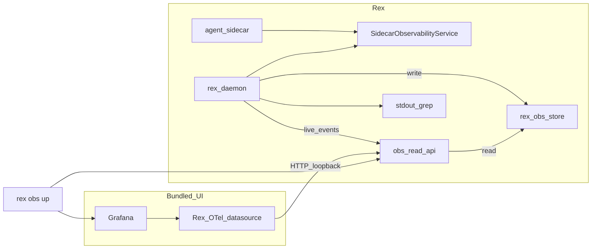
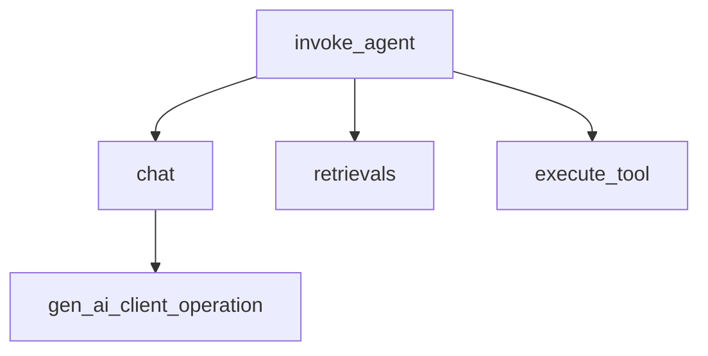

# Observability and economics validation (design hub)

This document is the **single source** for Rex **observability beyond stdout grep** and how it connects to the **economics validation program**. **partial** — Phase 2 write path + Phase 3–5 read API, Grafana Rex OTel datasource plugin, and `rex obs` CLI **implemented**; mmap engine and sidecar observability API remain **planned**.

See [DOCUMENTATION.md](DOCUMENTATION.md) for the **feature-area hub** convention.

**Decision records:** [ADR 0010](architecture/decisions/0010-daemon-exports-observability-via-otel-and-sidecar-api.md) · [ADR 0020](architecture/decisions/0020-otel-genai-semconv-with-rex-pipeline-metrics.md) · [ADR 0021](architecture/decisions/0021-rex-owned-economics-store-byot-visualization.md) · [ADR 0025](architecture/decisions/0025-dual-economics-store-engines.md) · [ADR 0026](architecture/decisions/0026-rex-owned-storage-grafana-otel-datasource.md) · [ADR 0027](architecture/decisions/0027-chce-columnar-mmap-engine.md) · **CHCE format:** [OBS_STORE_MMAP_FORMAT.md](OBS_STORE_MMAP_FORMAT.md) · **Validation program:** [ECONOMICS_VALIDATION.md](ECONOMICS_VALIDATION.md) · **Local suite how-to:** [OBSERVABILITY_INTEGRATIONS.md](OBSERVABILITY_INTEGRATIONS.md)

## Configuration surface

Rex observability is controlled only by merged JSON: **`observability.enabled`** and related keys in [CONFIGURATION.md](CONFIGURATION.md). Optional bootstrap env **`REX_ROOT`** selects the layout directory. There are no `REX_OBS_*` product environment variables.

## Purpose

- Make daemon economics **measurable and operable** with **Rex-owned storage** as system of record and **bundled Grafana** as the default UI ([ADR 0026](architecture/decisions/0026-rex-owned-storage-grafana-otel-datasource.md)).
- Persist OpenTelemetry-shaped telemetry (`gen_ai.*`, `rex.*`) under **`$REX_ROOT`** when observability is enabled; serve **historical and realtime** reads via a **Rex observability read API** — not PromQL, LogQL, or TraceQL against operator-managed TSDBs.
- Provide **one Rex command** (`rex obs up`) to start the local suite with **default preset dashboards**; operators install Rex only (vendored Grafana kit).
- Link to the **validation program** for proving cost savings without unacceptable quality loss — [ECONOMICS_VALIDATION.md](ECONOMICS_VALIDATION.md).
- Extend the signal vocabulary in [ARCHITECTURE.md](ARCHITECTURE.md#observability) without duplicating the full [CONTEXT_EFFICIENCY.md](CONTEXT_EFFICIENCY.md) lever matrix.

## Status

**partial** — Phase 2–5 shipped: SQLite `rex-obs-store`, read API, Grafana plugin skeleton, `rex obs` CLI. **CHCE mmap engine** (Phase 2b) and **SSE live tail** (Phase 6) are **design documented** — [ADR 0027](architecture/decisions/0027-chce-columnar-mmap-engine.md), [OBS_STORE_MMAP_FORMAT.md](OBS_STORE_MMAP_FORMAT.md). Sidecar observability API remains **planned**.

## Scope

**In:**

- **Signal catalog** (implemented + planned) shared by stdout, OTLP, store, read API, and Grafana dashboards.
- **Daemon OTLP export** when `observability.enabled: true` and `observability.otlp.endpoint` is set — **implemented** (core `rex.*` + `gen_ai.client.operation.duration` instruments); store-only + `obs.export=degraded` when endpoint omitted.
- **`rex-obs-store`** under `$REX_ROOT` when observability enabled — **SQLite implemented**; **CHCE mmap** (macOS opt-in) — **design documented**, implementation Phase 2b — [ADR 0025](architecture/decisions/0025-dual-economics-store-engines.md), [ADR 0027](architecture/decisions/0027-chce-columnar-mmap-engine.md), [OBS_STORE_MMAP_FORMAT.md](OBS_STORE_MMAP_FORMAT.md). Grafana does **not** read store files directly.
- **Rex observability read API** (loopback HTTP; historical query) — **implemented**; **SSE live subscribe** — **planned** Phase 6 — [OBS_READ_API.md](OBS_READ_API.md).
- **Bundled Grafana** + **Rex OTel datasource plugin** + **default dashboard JSON** — **partial** (plugin + templates; operator supplies Grafana binary).
- **`rex obs up`** — start read API, Grafana, provisioning — **implemented** — [OBSERVABILITY_INTEGRATIONS.md](OBSERVABILITY_INTEGRATIONS.md).
- **`SidecarObservabilityService`** on **daemon UDS** (`daemon.socket` in config) — **planned**.

**Out:**

- Required **OpenTelemetry Collector**, **Prometheus**, **Loki**, or **Tempo** for the product UI path.
- PromQL / LogQL / TraceQL as the Rex product read contract.
- Dedicated observability-only sidecar.
- Prompt or file body storage in the economics DB.
- Live LLM calls on every PR ([CI.md](CI.md)).

## Boundaries

| Concern | Owner | Notes |
|---------|--------|--------|
| **Merged JSON + ingest** | `rex-daemon` | `observability` section — [CONFIGURATION.md](CONFIGURATION.md). |
| **Telemetry storage (system of record)** | `rex-obs-store` | [ADR 0021](architecture/decisions/0021-rex-owned-economics-store-byot-visualization.md), [ADR 0026](architecture/decisions/0026-rex-owned-storage-grafana-otel-datasource.md). |
| **Historical + realtime reads for UI** | Rex observability read API | Loopback; historical **implemented**; SSE live tail **planned** (Phase 6). |
| **Chart UI** | Bundled Grafana + Rex datasource | **partial** — `rex obs up` + plugin; vendor binary operator-provided. |
| **Sidecar custom metrics** | Sidecar via **`SidecarObservabilityService`** on daemon UDS | **planned**; OTel SDKs in sidecar are clients of daemon ingest only. |
| **Optional fleet interop** | Operator backends via OTLP export | **Could** — not product UI path. |
| **Lever definitions** | [CONTEXT_EFFICIENCY.md](CONTEXT_EFFICIENCY.md) | Cross-link only. |
| **Validation program** | [ECONOMICS_VALIDATION.md](ECONOMICS_VALIDATION.md) | Benchmarks, TOST, cadence. |

## Architecture



**Read contract:** Grafana’s Rex datasource calls the **Rex read API** (OTel-shaped metrics, traces, logs). This is **not** PromQL, LogQL, or TraceQL against Prometheus, Loki, or Tempo.

- **Phase 0:** grep daemon stdout; `observability.enabled` false or omitted.
- **Phase 2 (partial):** store write path; optional OTLP interop export.
- **Phase 3–5 (partial):** read API, Grafana plugin, `rex obs up` — shipped.
- **Phase 2b / 6 (planned):** CHCE mmap engine; SSE live tail + sidecar observability API.

### Rejected patterns

| Pattern | Why rejected |
|---------|--------------|
| **Collector + TSDB + Grafana** as required product path | Rex owns storage and read API; no operator TSDB installs — [ADR 0026](architecture/decisions/0026-rex-owned-storage-grafana-otel-datasource.md). |
| Grafana **SQLite file** or **Prometheus scrape** bridges | UI reads Rex API, not store files or PromQL. |
| Dedicated observability sidecar | Extra process; duplicates ingest authority — [ADR 0010](architecture/decisions/0010-daemon-exports-observability-via-otel-and-sidecar-api.md). |
| Builtin **export** sidecar | Conflicts with 0-or-1 agent sidecar. |
| `REX_OBS_*` env configuration | Product settings are JSON-only — [CONFIGURATION.md](CONFIGURATION.md). |

### Deferred (Could)

| Pattern | Notes |
|---------|--------|
| **OTLP export** to operator fleet backends | Optional interop when `observability.otlp.endpoint` is set; not bundled Grafana UI path. |
| External BYOT UIs (Datadog, cloud Grafana) | Replication/export only; see [OBSERVABILITY_INTEGRATIONS.md](OBSERVABILITY_INTEGRATIONS.md) appendix. |

## Interfaces (intent)

| Surface | Role | Status |
|---------|------|--------|
| **Rex read API** | Loopback HTTP: catalog, query streams, rollups, live SSE | **implemented** (SSE deferred) — [OBS_READ_API.md](OBS_READ_API.md) |
| **Rex Grafana OTel datasource** | Grafana plugin → read API; OTel field mapping | **implemented** — `integrations/grafana-rex-otel/` |
| **`rex obs up`** | Start read API + Grafana + provisioning; open `http://127.0.0.1:<port>` | **implemented** |
| **Provisioning paths** | `$REX_ROOT/obs/grafana/provisioning/` (datasources, dashboards) | **implemented** via `templates/obs/` copy |
| **`SidecarObservabilityService`** | Daemon UDS ingest for sidecar metrics | planned |

## Sidecar observability API (planned)

**`SidecarObservabilityService`** on the **daemon UDS** (`daemon.socket` in merged config) — distinct from the sidecar control-plane socket. See [SIDECAR_RUNTIME.md](SIDECAR_RUNTIME.md).

| RPC | Purpose |
|-----|---------|
| `RegisterMetric` | Declare custom metric (name, type, allowed labels) |
| `RecordMetric` | Emit data point; exported as `rex.sidecar.custom.*` |
| `GetEconomicsSnapshot` | Bounded recent economics (not time-series query) |
| `ReportResourceStats` | Optional CPU/memory self-report |

## Signal catalog

Canonical vocabulary for grep, OTLP, store, and dashboards. **Implemented** fields exist in daemon stdout today unless marked **planned**.

### Stream and lifecycle

| Signal | Status | Meaning |
|--------|--------|---------|
| `stream.request_id` | implemented | Per-request id |
| `trace_id` | implemented | Correlation with CLI / extension |
| `stream.lifecycle` | implemented | e.g. `starting`, terminal phases |
| `stream.terminal` | implemented | Outcome class at end of stream |
| `elapsed_ms` | implemented | Request duration |
| `inference_runtime` | implemented | Active adapter label |
| `route=` | implemented | Path label — [CONTEXT_EFFICIENCY.md](CONTEXT_EFFICIENCY.md#routing-observability-rc-09) |
| `decision_id=` | implemented | `dec-{request_id}` for log correlation |

### Cache

| Signal | Status | Meaning |
|--------|--------|---------|
| `cache_decision=` | implemented | `hit`, `miss_stored`, `bypass`, `uncacheable_mode` |
| `l1_cache=` | implemented | Legacy; cacheable lookups only — [CACHING.md](CACHING.md) |

### Context pipeline (`stream.metrics`)

| Signal | Status | Meaning |
|--------|--------|---------|
| `prompt_tokens` | implemented | Estimated prompt size |
| `context_tokens` | implemented | Selected context tokens |
| `candidates` / `selected` | implemented | Retrieval candidate counts |
| `truncated` | implemented | Context truncated flag |
| `cache` | implemented | Pipeline cache status string |
| `behavior` | implemented | Prefilter decision |
| `retrieval` | implemented | `ran` or `skipped` |
| `compression_strategy` | implemented | e.g. `extractive_query` |

### Agent policy and broker

| Signal | Status | Meaning |
|--------|--------|---------|
| `approval=` | implemented | `allow`, `deny`, `checkpoint` — [ADR 0009](architecture/decisions/0009-centralized-agent-approvals-and-checkpoints.md) |
| `broker.inference=*` | implemented | Sidecar broker inference RPC |
| `broker.access_policy=*` | implemented | Broker policy outcomes |

### Planned (OTLP + store + API)

| Signal / capability | Meaning |
|--------|---------|
| `cached_tokens` | Provider-reported cached input tokens per inference — agent-turn economics — [ECONOMICS_VALIDATION.md](ECONOMICS_VALIDATION.md#agent-turn-ab-protocol-design) |
| `prefix_hash` | SHA-256 of static prompt prefix before each sidecar inference step — prefix immutability CI — [AGENT_GRAPH_ARCHITECTURE.md](AGENT_GRAPH_ARCHITECTURE.md), [CACHING.md](CACHING.md#prefix-immutability-and-cache-breakpoints-agent-turns) |
| `parse_retries` | Count of JSON tool-line parse recovery attempts — interim protocol until **R038** native tools — [NATIVE_TOOL_CALLING.md](NATIVE_TOOL_CALLING.md), [ADR 0023](architecture/decisions/0023-hybrid-agent-serialization-boundaries.md) |
| `tokens_in_total` | Aggregate input tokens per turn or step rollup — validation harness |
| `gen_ai.client.*` | OTel GenAI semconv — [ADR 0020](architecture/decisions/0020-otel-genai-semconv-with-rex-pipeline-metrics.md) |
| `rex.*` / `rex.pipeline.*` | Pipeline attribution — [OBSERVABILITY_INTEGRATIONS.md](OBSERVABILITY_INTEGRATIONS.md) |
| Sidecar `rex.sidecar.custom.*` | Via `SidecarObservabilityService` |
| `config_snapshot_id` | FK to deduplicated config row in store |
| `knowledge=` | Agent knowledge retrieval — [AGENT_KNOWLEDGE.md](AGENT_KNOWLEDGE.md) |
| OTLP logs and traces | After metrics phase |
| `obs.export=degraded` | Stdout when OTLP export fails |

## Trace model (planned)



Correlation: `trace_id`, `stream.request_id`, future `turn_id` on **span attributes only** — not metric labels ([ADR 0020](architecture/decisions/0020-otel-genai-semconv-with-rex-pipeline-metrics.md)).

## rex-obs-store

Active when **`observability.enabled: true`** in merged JSON ([ADR 0021](architecture/decisions/0021-rex-owned-economics-store-byot-visualization.md), [ADR 0025](architecture/decisions/0025-dual-economics-store-engines.md), [ADR 0026](architecture/decisions/0026-rex-owned-storage-grafana-otel-datasource.md), [ADR 0027](architecture/decisions/0027-chce-columnar-mmap-engine.md)). Engine: **`observability.store.engine`** — default **`sqlite`**; opt-in **`mmap`** (CHCE) on macOS only. **System of record** — UI reads via Rex read API, not direct file or TSDB queries.

### Store engines

| Engine | Default path | Platform | Format doc |
|--------|--------------|----------|------------|
| **`sqlite`** | `obs/store.sqlite` | macOS, Linux CI | SQL schema (ADR 0021) |
| **`mmap`** (CHCE) | `obs/store.rexobs` + `store.dict` | **macOS only** | [OBS_STORE_MMAP_FORMAT.md](OBS_STORE_MMAP_FORMAT.md) |

### CHCE architecture (mmap engine)

When `engine=mmap`, the store uses the **Custom Hybrid Columnar-mmap Engine** ([ADR 0027](architecture/decisions/0027-chce-columnar-mmap-engine.md)):

- **Hot path:** daemon → bounded `mpsc` → `LiveRingBuffer` (&lt;1 ms return).
- **Seal path:** `AppendCoordinator` transposes rows to columns → `ColumnarCodec` → 16 KB pages in `store.rexobs`.
- **Reads:** zone-map skip + column projection; `trace_id` / `turn_id` via sparse index.
- **Live tail (Phase 6):** broadcast channel → read API SSE — see [OBS_READ_API.md](OBS_READ_API.md).

### Programmatic API (intent)

| Operation | Method | Status |
|-----------|--------|--------|
| Write config | `append_config` | SQLite shipped; CHCE planned |
| Write stream | `append_stream` | SQLite shipped; CHCE planned |
| Time scan | `scan_streams_by_time` / `ObsQuery::query_streams` | Historical shipped |
| Rollup | `rollup_metrics_by_label` | Planned |
| Live tail | `tail_telemetry` | Planned Phase 6 |

Shared **logical** tables/records (encoding differs by engine):

| Table / record | Purpose |
|----------------|---------|
| `config_snapshots` | Content-hash `id`; canonical economics-relevant config JSON once |
| `streams` | Per-request economics; `snapshot_id` FK |
| `runs` | Validation harness run metadata |
| `run_tasks` | Per-task outcomes |

**Write path:** append on `stream.terminal`; harness on run complete. Non-blocking on the inference hot path.

**Read paths:** Rex observability read API (primary for Grafana) — **implemented** for historical query; `rex obs compare|export|rollup` CLI — planned. Bundled Grafana: [OBSERVABILITY_INTEGRATIONS.md](OBSERVABILITY_INTEGRATIONS.md).

## Economics validation program

Scenarios, benchmarks, statistical gates, run manifests, and local-OSS thresholds: **[ECONOMICS_VALIDATION.md](ECONOMICS_VALIDATION.md)**.

### Example grep (phase 0)

```bash
rg 'cache_decision=' /path/to/daemon.log
rg 'stream.metrics' /path/to/daemon.log
```

## Rex vs third-party responsibilities

| Responsibility | Rex | Third party / operator |
|----------------|-----|------------------------|
| `observability` JSON + store schema | yes | — |
| Telemetry storage (system of record) | yes — `rex-obs-store` | — |
| Read API + bundled Grafana + default dashboards | yes (partial — SSE live deferred) | — |
| `SidecarObservabilityService` | yes (planned) | — |
| Stdout economics grep | yes (today) | — |
| Optional OTLP replication to fleet backends | yes (optional) | receiver when interop enabled |

## Phasing

| Phase | Deliverable | Status |
|-------|-------------|--------|
| **0** | Stdout + grep; observability off in JSON | **implemented** |
| **1** | Design hubs, ADRs, validation program | **design documented** |
| **2** | Store write path + bounded OTLP export (**sqlite** engine) | **partial** (sqlite + core OTLP shipped; sidecar signals pending) |
| **2b** | **CHCE mmap** store engine (macOS opt-in) | **design documented** — [CHCE_ROADMAP.md](CHCE_ROADMAP.md), [ADR 0027](architecture/decisions/0027-chce-columnar-mmap-engine.md) |
| **3** | Rex observability read API (loopback) | **implemented** — [OBS_READ_API.md](OBS_READ_API.md) |
| **4** | Bundled Grafana kit + Rex OTel datasource + default dashboards | **partial** — plugin + provisioning templates; vendor binary operator-provided |
| **5** | **`rex obs up`** (one command local suite) | **implemented** — `rex obs serve|up|down|doctor|catalog` |
| **6** | `SidecarObservabilityService` + SSE live feed (CHCE `LiveRingBuffer`) | planned |
| **7** | `rex obs` CLI helpers, retention, eval harness | planned |

## Resolved questions

| Question | Resolution |
|----------|------------|
| System of record? | **`rex-obs-store`** under `$REX_ROOT` — ADR 0021, ADR 0026. |
| How does Grafana get data? | **Rex read API** via Rex OTel datasource — not PromQL/Loki/Tempo. |
| Rex configuration? | **`observability` in merged JSON**; `REX_ROOT` only bootstrap env. |
| Default visualization? | **Bundled Grafana** + preset dashboards — `rex obs up`. |
| Sidecar custom metrics? | **`SidecarObservabilityService`** on daemon UDS. |
| Optional fleet interop? | **OTLP export** when `observability.otlp.endpoint` set — **Could**; not UI path. |

## Open questions

| Question | Why it matters |
|----------|----------------|
| PII in logs and traces? | Prompt snippets must stay out by default |
| Correlate daemon + sidecar in one trace? | OTLP trace propagation design |

## Cross-links

| Doc | Relationship |
|-----|----------------|
| [ECONOMICS_VALIDATION.md](ECONOMICS_VALIDATION.md) | Validation program |
| [OBSERVABILITY_INTEGRATIONS.md](OBSERVABILITY_INTEGRATIONS.md) | Bundled Grafana suite + optional interop |
| [CONFIGURATION.md](CONFIGURATION.md) | `observability` JSON keys |
| [ARCHITECTURE.md](ARCHITECTURE.md) | SAD observability |
| [SIDECAR_RUNTIME.md](SIDECAR_RUNTIME.md) | Sidecar flow |
| [CONTEXT_EFFICIENCY.md](CONTEXT_EFFICIENCY.md) | Lever matrix |
| [OBS_STORE_MMAP_FORMAT.md](OBS_STORE_MMAP_FORMAT.md) | Mmap on-disk format + format decision |
| [CHCE_ROADMAP.md](CHCE_ROADMAP.md) | CHCE delivery program (**R043–R054**) |
| [ROADMAP.md](ROADMAP.md) | Implementation queue |
| [CI.md](CI.md) | No live LLM on PRs |
