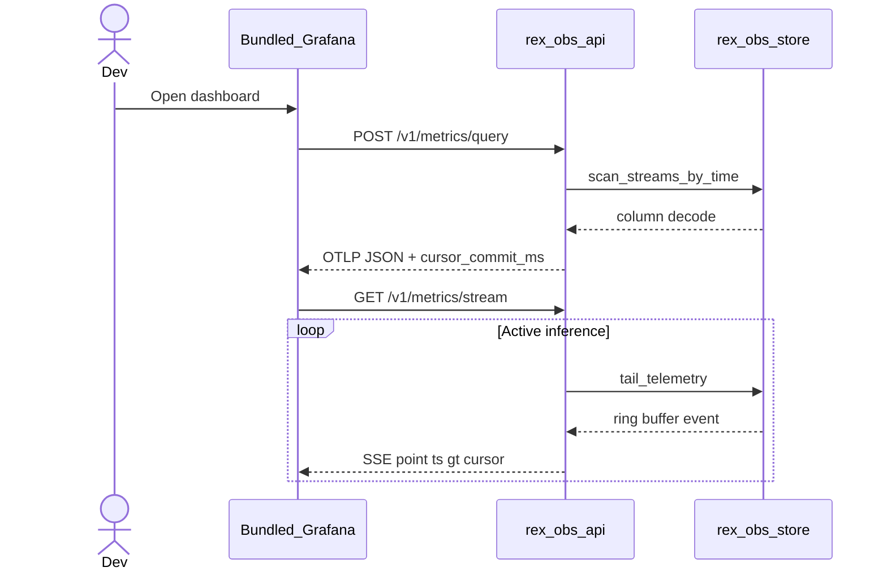

# Rex observability read API

**Diátaxis role:** reference — loopback HTTP contract for Rex-owned economics storage.

**Status:** **implemented** — historical query (SQLite engine); **SSE live tail planned** (Phase 6, CHCE engine) — [ADR 0027](architecture/decisions/0027-chce-columnar-mmap-engine.md).

**Hub:** [OBSERVABILITY_AND_ECONOMICS.md](OBSERVABILITY_AND_ECONOMICS.md) · **Integrations:** [OBSERVABILITY_INTEGRATIONS.md](OBSERVABILITY_INTEGRATIONS.md) · **ADRs:** [0026](architecture/decisions/0026-rex-owned-storage-grafana-otel-datasource.md), [0027](architecture/decisions/0027-chce-columnar-mmap-engine.md)

## Purpose

Expose **engine-agnostic** historical queries over logical `streams` records as **OpenTelemetry-shaped JSON** for the Rex Grafana OTel datasource. Grafana does not read store files or SQL.

When CHCE mmap ships, the read API also exposes a **live SSE tail** that merges with historical responses without duplicate points.

## Bind

- Config: `observability.read_api.listen` (default `127.0.0.1:9470`)
- **Loopback only** — non-loopback hosts fail `rex config validate`

## Endpoints

| Method | Path | Response | Status |
|--------|------|----------|--------|
| `GET` | `/health` | `{ "status": "ok", "service": "rex-obs-read-api" }` | implemented |
| `GET` | `/v1/catalog` | `{ "instruments": [ … InstrumentCatalogEntry … ] }` | implemented |
| `POST` | `/v1/metrics/query` | OTLP-style `{ "resourceMetrics": [ … ] }` | implemented |
| `GET` | `/v1/metrics/stream` | SSE stream of OTLP data points | **planned** Phase 6 |

### Metrics query body

```json
{
  "start_ms": 0,
  "end_ms": 9999999999999,
  "instruments": ["rex.stream.requests"],
  "labels": { "terminal": "done" }
}
```

Historical responses include a **`cursor_commit_ms`** field (design) — the latest sealed timestamp in mmap/SQLite — for SSE merge.

Fixture: [fixtures/obs_read_api/metrics_query_request.json](../fixtures/obs_read_api/metrics_query_request.json).

### Live stream (SSE) — planned

**Query parameters:**

| Param | Required | Purpose |
|-------|----------|---------|
| `cursor_commit_ms` | yes | From prior `POST /v1/metrics/query`; SSE yields only points with `ts > cursor_commit_ms` |
| `instruments` | no | Filter instrument names (comma-separated) |

**Response:** `text/event-stream` — each event is a JSON OTLP data point.

**Merge semantics:**

1. Grafana loads historical data via `POST /v1/metrics/query` → receives `cursor_commit_ms`.
2. Grafana opens `GET /v1/metrics/stream?cursor_commit_ms=…`.
3. Read API subscribes to CHCE `LiveRingBuffer` broadcast (or polls SQLite tail until CHCE ships).
4. Client drops events where `timestamp_ms <= cursor_commit_ms`.

The Rex Grafana datasource sets `"streaming": true` in `plugin.json` when this endpoint ships.



## CLI

```bash
rex obs serve    # read API only
rex obs catalog  # instrument list
rex obs doctor   # config + TCP health
rex obs up       # read API + Grafana provisioning
```

## Error codes

| Code | When |
|------|------|
| `obs.read_api.bind_failed` | Invalid or non-loopback bind |
| `obs.read_api.query_invalid` | Malformed JSON query body |
| `obs.read_api.stream_invalid` | Missing or invalid SSE cursor (planned) |

## Related

- [CONFIGURATION.md — Observability](CONFIGURATION.md#observability)
- [OBS_STORE_MMAP_FORMAT.md](OBS_STORE_MMAP_FORMAT.md) — CHCE read path
- [ADR 0020](architecture/decisions/0020-otel-genai-semconv-with-rex-pipeline-metrics.md) — instrument names
