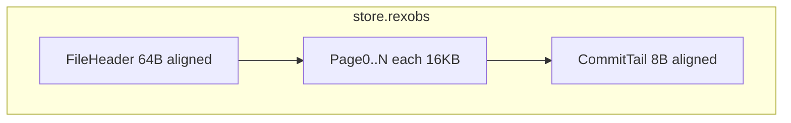

# Apple Silicon mmap economics store — on-disk format (reference)

**Diátaxis role:** reference — physical layout and format decision for `observability.store.engine: "mmap"`.

**Status:** **design documented** — not implemented in `rex-obs-store` yet.

**Hub:** [OBSERVABILITY_AND_ECONOMICS.md](OBSERVABILITY_AND_ECONOMICS.md) · **ADR:** [0025](architecture/decisions/0025-dual-economics-store-engines.md) · **SQLite default:** [ADR 0021](architecture/decisions/0021-rex-owned-economics-store-byot-visualization.md)

## Purpose

Define the **mmap opt-in** on-disk format for local economics persistence on **macOS Apple Silicon**, including why this format was chosen over alternatives, how it maps to the shared logical schema, and what is deferred to a **v2** compression track.

## Scope

**In:** format decision matrix, mmap v1 container + record encoding, durability, compression tiers, logical record types, signal mapping, comparison vs SQLite, promotion gates, CI boundaries.

**Out:** Rust implementation, zstd dictionary training automation, block defragmentation/compaction, making mmap the default engine.

## Format decision

Three independent layers drive “binary store” proposals; Rex scores **whole approaches**, not “binary = one answer.”

| # | Candidate | Ingest (hot path) | Rollup read | Disk (1M streams, design target) | Migrations | macOS durability | Engineering cost | Verdict |
|---|-----------|-------------------|-------------|-----------------------------------|------------|------------------|------------------|---------|
| 1 | **SQLite** (`store.engine=sqlite`, default) | ~2 ms class | SQL decode + B-tree | ~15–20 MB | **Low** (`ALTER TABLE`) | WAL + fsync | **Low** | **Default engine** — Phase 2 |
| 2 | Tuned SQLite only (no second engine) | ~1–2 ms | Same | ~12–18 MB | Low | Same | Low | **Reject** — forfeits mmap zero-copy rollup goals |
| 3 | **mmap v1 — musli-zerocopy + zstd** (chosen for mmap) | &lt;0.1 ms class (append to mapped RAM) | Incremental validate queried slices | ~4–8 MB (no Gorilla v1) | **High** (`format_version` + struct layouts) | Append + CRC + `F_FULLFSYNC` | **Medium–high** | **Chosen for `engine=mmap`** |
| 4 | mmap + full custom binary (Gorilla + bit dictionaries) | &lt;0.05 ms class | Zero-copy + dense streams | ~2–4 MB | Very high | Same as (3) | **Very high** | **v2 optimization** — only if (3) benchmarks fail targets |
| 5 | Embedded mmap KV (redb / LMDB) | ~0.1–0.5 ms | KV fetch + value decode | ~8–15 MB | Medium (KV schema) | Engine-native | Medium | **Reject for v1** — B-tree overhead; less control over Apple page alignment |
| 6 | Append NDJSON | ~0.5 ms+ parse | Full scan / parse | Large | Low | Line-delimited + fsync | Low | **Reject** — export/debug only |
| 7 | Parquet / Arrow IPC primary file | Batch-oriented | Excellent for analytics | Varies | Medium | File replace | Medium | **Reject** — hot path is per-`stream.terminal` append; use for **`rex obs export`** |

**Chosen mmap v1:** **(3)** append-only memory-mapped file, **16 KB** page alignment, typed records via **musli-zerocopy**, **zstd** for `config_snapshots` (trained dictionary) and optional per-page payload compression, **CRC32** block envelopes, **no Gorilla** in v1.

**Rationale:** Delivers mmap + incremental validation without owning a bit-packed time-series codec on day one. **(4)** remains documented below as **v2** if measured disk or ingest gaps vs SQLite exceed promotion thresholds.

## File identity

| Field | Value |
|-------|--------|
| Default path (under `$REX_ROOT`) | `obs/store.rexobs` |
| Magic (bytes 0–3) | `REXO` (0x52 0x45 0x58 0x4F) |
| `format_version` (u16 LE, bytes 4–5) | `1` for mmap v1 |
| `endianness` | **Little-endian** for all multi-byte integers |
| Config mirror | `observability.store.format_version` in merged JSON must match file header for writes |

## Container layout (mmap v1)

### File header (64 bytes, 16 KB aligned first page)

| Offset | Field | Type | Notes |
|--------|-------|------|-------|
| 0 | `magic` | [u8; 4] | `REXO` |
| 4 | `format_version` | u16 LE | Must match config |
| 6 | `header_size` | u16 LE | `64` |
| 8 | `page_size` | u32 LE | `16384` |
| 12 | `created_at_unix_ms` | u64 LE | File creation |
| 20 | `dict_path_offset` | u64 LE | Optional external zstd dict path hash/id — **v1 may embed dict in sidecar file** `obs/store.dict` |
| 28 | `reserved` | [u8; 36] | Zero |

### Pages (16 KB each)

Each page is **exactly 16384 bytes**. The OS maps them on Apple Silicon **16 KB** boundaries to reduce TLB friction on unified memory.

| Page region | Purpose |
|-------------|---------|
| `page_header` | `page_index` (u32), `record_count` (u16), `flags` (u16), `payload_crc32` (u32) |
| `dict_slot` | Optional inline categorical dictionary for strings used in this page (`route`, `cache_decision`, `terminal`, …) |
| `records` | Concatenated musli-encoded records; padded to 128-byte boundaries **within the page** for sequential rollup scans |
| `padding` | Zero fill to 16 KB |

**128-byte padding rule:** Each record’s stored size is rounded up to the next **128-byte** boundary when the record type is marked `rollup_hot` in the schema table (stream economics rows). Cold records (harness metadata) may use 16-byte alignment only.

### Blocks and commit tail

Within a page, one or more **blocks** may be stored:

| Block field | Type | Notes |
|-------------|------|-------|
| `block_len` | u32 LE | Payload length excluding this header |
| `block_type` | u16 LE | `1`=records, `2`=snapshot blob |
| `payload` | [u8; block_len] | musli bytes or zstd-compressed blob |
| `crc32` | u32 LE | IEEE CRC32 over `block_type` + `payload` |

**Commit tail** (file end, 8-byte aligned):

| Field | Type | Notes |
|-------|------|-------|
| `committed_byte_len` | u64 LE | Total valid file length; monotonic |

**Write order (durability):** append blocks into the mmap region → `msync(MS_SYNC)` on touched pages → update `committed_byte_len` → **`F_FULLFSYNC`** on the file descriptor (macOS). Readers use `committed_byte_len` as the snapshot boundary; they never read beyond it.

**Recovery:** On daemon start, if `committed_byte_len` &gt; file size or CRC checks fail on the last block, **scan backward** page-by-page for the last valid `payload_crc32` / block CRC, set `committed_byte_len` to that offset, **truncate** the file. Surface `store.recovery_failed` if truncation cannot find a valid boundary (see [ERROR_HANDLING.md](ERROR_HANDLING.md)).

## Record encoding (mmap v1)

Records are **musli-zerocopy** layouts (field names at design level; Rust types live in `rex-obs-store` when implemented).

### Shared types

| Type | Fields (design) | Notes |
|------|-----------------|-------|
| `SnapshotId` | 32-byte content hash | Same id as SQLite `config_snapshots.id` |
| `CategoricalRef` | `dict_id: u8`, `ordinal: u8` | Points at page inline dict |
| `TimestampMs` | u64 LE | Wall clock ms at `stream.terminal` |

### Logical records (parity with SQLite)

| Record | Key fields | SQLite table |
|--------|------------|--------------|
| `ConfigSnapshotRecord` | `id: SnapshotId`, `zstd_payload`, `raw_len` | `config_snapshots` |
| `StreamEconomicsRecord` | `snapshot_id`, `request_id`, `trace_id`, `terminal` (CategoricalRef), `route`, `cache_decision`, `elapsed_ms`, token fields, pipeline fields | `streams` |
| `RunRecord` | `run_id`, `scenario`, `started_at`, `config_snapshot_id`, … | `runs` |
| `RunTaskRecord` | `run_id`, `task_id`, `outcome`, metrics, … | `run_tasks` |

### Signal mapping (stdout → store)

Columns persisted on `StreamEconomicsRecord` (from [OBSERVABILITY_AND_ECONOMICS.md](OBSERVABILITY_AND_ECONOMICS.md)):

| Stdout / signal | Stored field |
|-----------------|--------------|
| `stream.request_id` | `request_id` |
| `trace_id` | `trace_id` |
| `stream.terminal` | `terminal` (categorical) |
| `elapsed_ms` | `elapsed_ms` |
| `route=` | `route` (categorical) |
| `cache_decision=` | `cache_decision` (categorical) |
| `stream.metrics` token fields | `prompt_tokens`, `context_tokens`, … |
| `config_snapshot_id` | `snapshot_id` FK |
| Planned: `cached_tokens`, `prefix_hash`, `parse_retries` | same names when OTLP phase lands |

## Compression tiers

### v1 (required / optional)

| Data | v1 approach |
|------|-------------|
| `config_snapshots` | **Zstd with trained dictionary** (~100 KB dict from sample configs); dictionary file `obs/store.dict` or embedded reload hook; built offline via `zdict` / `from_samples` — daemon reload on startup |
| Per-page record batch | **Optional zstd** on `block_type=1` payload when page is sealed |
| Time-ordered integers inside records | Plain musli integers in v1 |

### v2 (optimization track — not v1)

| Data | v2 approach |
|------|-------------|
| Timestamps, token counters per stream | **Gorilla / delta-of-delta** bit packing (~1.37 B/metric design goal) |
| Categorical strings | **4/8-bit** ordinals only (strip inline dict duplication across pages) |

Promote v2 only when benchmarks on **1M synthetic streams** show v1 disk or ingest misses documented targets vs SQLite by more than the maintenance budget allows.

## Read path

- Map file read-only with `memmap2`.
- Read `committed_byte_len` (atomic load, acquire).
- For `rex obs rollup` / in-process dashboards: **incremental musli validation** on touched pages only — do **not** validate the full file at open (contrast with full-archive `rkyv` validation cost).
- Export: optional **Parquet/Arrow/JSON** via `rex obs export` — not the primary mmap container.

## Concurrency

| Role | Model |
|------|--------|
| Writer | Single daemon thread via `mpsc`; only writer extends `committed_byte_len` |
| Readers | Lock-free; read `committed_byte_len` before parsing pages |
| Ordering | Writer publishes tail length with release semantics after `F_FULLFSYNC` |

## Comparison (engines)

| Attribute | mmap v1 (this spec) | Tuned SQLite (default) | Full custom binary (v2 track) |
|-----------|----------------------|-------------------------|-------------------------------|
| Ingest latency | &lt;0.1 ms class append | ~2 ms class | &lt;0.05 ms class |
| Rollup query | Incremental musli slice | SQL + row decode | Zero-copy dense |
| Disk (1M streams) | ~4–8 MB target | ~15–20 MB | ~2–4 MB |
| Migrations | `format_version` + layouts | `ALTER TABLE` | Multi-layout + codecs |
| Grafana UI path | Rex read API + datasource | Rex read API + datasource | Rex read API + datasource |
| CI | macOS tests | Linux + macOS | macOS + fuzz |

## Promotion gates (default `engine` flip sqlite → mmap)

All must pass before changing the JSON default:

1. **Harness parity** — [ECONOMICS_VALIDATION.md](ECONOMICS_VALIDATION.md) scenarios produce equivalent aggregates on sqlite vs mmap within defined tolerance.
2. **Recovery** — fuzz tests: kill daemon mid-append; recovery truncates to last CRC without data loss on prior commits.
3. **macOS soak** — local dogfood with `engine=mmap` for N sessions without `store.recovery_failed`.
4. **Benchmarks** — 1M synthetic `streams`: mmap v1 meets disk target OR v2 is implemented and validated.
5. **Linux CI** — remains **sqlite-only**; no requirement to run mmap on `ubuntu-latest`.

## Operational

| Topic | Policy |
|-------|--------|
| `F_FULLFSYNC` | On every `stream.terminal` store commit (configurable batching is **Could** later) |
| Max file size | Hook via `observability.store.retention` (planned in hub Phase 5) — truncate/archive TBD |
| Defragmentation | **Deferred** — append-only may grow; compaction is follow-up design |

## CI and platform

| Environment | `store.engine` |
|-------------|----------------|
| Linux CI (`ubuntu-latest`) | **`sqlite` only** |
| macOS dev / optional CI job | `sqlite` or **`mmap`** |
| Non-macOS + `mmap` | Fail closed: `store.engine_unsupported` |

## Cross-links

| Doc | Relationship |
|-----|----------------|
| [OBSERVABILITY_AND_ECONOMICS.md](OBSERVABILITY_AND_ECONOMICS.md) | Parent hub |
| [CONFIGURATION.md](CONFIGURATION.md) | `observability.store.*` keys |
| [OBSERVABILITY_INTEGRATIONS.md](OBSERVABILITY_INTEGRATIONS.md) | Bundled Grafana suite |
| [ERROR_HANDLING.md](ERROR_HANDLING.md) | Planned store error codes |
| [ROADMAP.md](ROADMAP.md) | Implementation queue |
