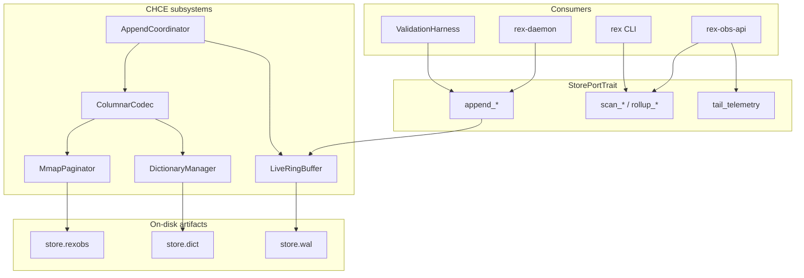
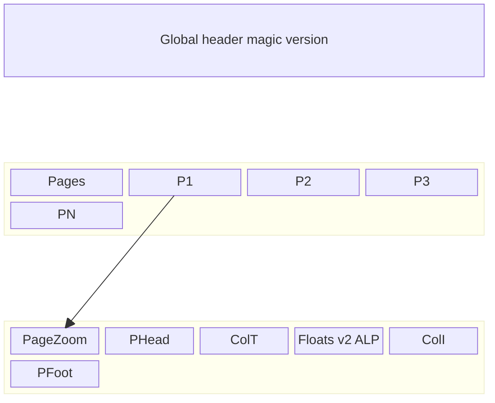

# CHCE — columnar-mmap observability store (reference)

**Diátaxis role:** reference — physical layout and engine design for `observability.store.engine: "mmap"`.

**Status:** **design documented** — CHCE architecture per deep research (2026-06-07); not implemented in `rex-obs-store` yet.

**Hub:** [OBSERVABILITY_AND_ECONOMICS.md](OBSERVABILITY_AND_ECONOMICS.md) · **ADRs:** [0025](architecture/decisions/0025-dual-economics-store-engines.md), [0027](architecture/decisions/0027-chce-columnar-mmap-engine.md) · **SQLite default:** [ADR 0021](architecture/decisions/0021-rex-owned-economics-store-byot-visualization.md)

## Purpose

Define the **Custom Hybrid Columnar-mmap Engine (CHCE)** — the mmap opt-in system of record for local economics persistence on **macOS Apple Silicon**. Covers architecture, on-disk layout, compression tiers, programmatic API, durability, and promotion gates.

## Scope

**In:** CHCE subsystems, columnar 16 KB pages, file artifacts, schema parity with SQLite, read/write/live API catalog, recovery, format evolution, benchmarks, CI boundaries.

**Out:** Rust implementation, v2 ALP/Gorilla codecs, Parquet export automation, making mmap the default engine.

## Requirements traceability

| ID | Requirement | This doc section | Status |
|----|-------------|------------------|--------|
| R-01 | Rex-owned engine; not SQLite/TSDB as system of record | Purpose, ADR 0027 | Design met |
| R-02 | OTel `gen_ai.*` + `rex.*` persistence | OTel mapping | Design met |
| R-03 | No prompt/file body storage | Invariants | Design met |
| R-04 | Hot-path non-blocking append | Threading, write API | Design met |
| R-05 | Programmatic API only | API catalog | Design met |
| R-06 | Grafana historical via OTLP JSON | Read path | Design met |
| R-07 | Grafana real-time visualization | Live tail (Phase 6) | Design met |
| R-08 | Minimize disk usage | Byte budget, compression | Design met |
| R-09 | Config snapshot dedup + FK | Logical model | Design met |
| R-10 | Harness `runs` / `run_tasks` | Logical model | Design met |
| R-11 | Future traces/spans | Deferred Phase 6 | Planned |
| R-12 | Apple Silicon 16 KB pages | Container layout | Design met |
| R-13 | Crash recovery + `format_version` | Durability | Design met |
| R-14 | Linux CI testability | CI and platform | Design met |
| R-15 | Retention + Parquet export | Deferred Phase 7 | Planned |

## Architecture

CHCE is an embedded Rust library in `crates/rex-obs-store` with no standalone daemon.

### Subsystem responsibilities

| Subsystem | Responsibility | Inputs | Outputs |
|-----------|----------------|--------|---------|
| **LiveRingBuffer** | Absorb hot-path writes; source of truth for recent telemetry | `StreamEconomicsRecord` | In-memory column slices for API reads |
| **AppendCoordinator** | Drain ring when ~15 KB accumulated; transpose rows → columns | Row records | Columnar arrays |
| **ColumnarCodec** | Apply per-column compression (v1: dict, TSZ, bit-pack) | Column vectors | Compressed payloads |
| **DictionaryManager** | Global categorical string → u16 ordinals | Strings | `store.dict` mappings |
| **MmapPaginator** | 16 KB page mapping, headers, CRC32, `F_BARRIERFSYNC` | Compressed batches | Sealed pages in `store.rexobs` |

### Threading

| Role | Model |
|------|--------|
| **Writers (producers)** | Daemon inference loop sends to bounded `mpsc` channel; returns in &lt;1 ms |
| **Writer (consumer)** | Single background thread seals pages and updates `committed_byte_len` (Release) |
| **Readers** | Lock-free; load `committed_byte_len` (Acquire) before parsing |
| **Live tail** | `tokio::sync::broadcast` from `LiveRingBuffer` to read API SSE (Phase 6) |

## Logical data model

Programmatic structs only — no SQL DDL. Shared logical schema with SQLite ([ADR 0025](architecture/decisions/0025-dual-economics-store-engines.md)).

### ConfigSnapshotRecord

| Field | Type | Notes |
|-------|------|-------|
| `snapshot_id` | `[u8; 32]` | SHA-256 of canonical economics JSON — PK |
| `payload` | Zstd-compressed bytes | Dictionary-trained on sample configs |
| `created_at_ms` | u64 | First-seen timestamp |

### StreamEconomicsRecord

Persisted at `stream.terminal`. **`trace_id` and `turn_id` stored in sparse secondary index**, not in dense metric columns ([ADR 0027](architecture/decisions/0027-chce-columnar-mmap-engine.md)).

### Schema parity matrix

Maps [`StreamEconomicsRecord`](../crates/rex-obs-store/src/record.rs) fields to CHCE column groups.

| Field | Column group | Encoding (v1) | Encoding (v2) |
|-------|--------------|---------------|---------------|
| `snapshot_id` | FK column | 32-byte hash or dict ref | RLE when static per session |
| `request_id` | Integer | Bit-packed u64 | FastLanes |
| `trace_id` | **Sparse index** | UUID sidecar | Same |
| `turn_id` | **Sparse index** | String hash sidecar | Same |
| `terminal` | Categorical | u16 dict ordinal | RLE on ordinal column |
| `route` | Categorical | u16 dict ordinal | RLE |
| `cache_decision` | Categorical (nullable) | u16; `0` = null | RLE |
| `decision_id` | Categorical | u16 dict ordinal | RLE |
| `inference_runtime` | Categorical | u16 dict ordinal | RLE |
| `mode` | Categorical | u16 dict ordinal | RLE |
| `model` | Categorical | u16 dict ordinal | RLE |
| `elapsed_ms` | Integer metric | Plain u64 in v1 | ALP (v2) |
| `chunks_sent` | Integer | Bit-packed u64 | FastLanes |
| `prompt_tokens` | Integer | Bit-packed u64 | FastLanes |
| `context_tokens` | Integer | Bit-packed u64 | FastLanes |
| `context_candidates` | Integer | Bit-packed u64 | FastLanes |
| `context_selected` | Integer | Bit-packed u64 | FastLanes |
| `context_truncated` | Boolean | 1-bit column | Bit-pack |
| `retrieval` | Categorical | u16 dict ordinal | RLE |
| `compression_strategy` | Categorical | u16 dict ordinal | RLE |
| `cached_tokens` | Integer (optional) | Nullable bit-pack | FastLanes |
| `prefix_hash` | Sparse / optional | Hash sidecar when set | Same |
| `parse_retries` | Integer (optional) | Nullable bit-pack | FastLanes |
| `created_at_ms` | Timestamp | TSZ delta-of-delta | Gorilla/TSZ v2 |

### Other logical records

| Record | SQLite table | Notes |
|--------|--------------|-------|
| `RunRecord` | `runs` | Harness metadata — cold columnar layout |
| `RunTaskRecord` | `run_tasks` | Per-task outcomes |

### Invariants

- **Write-once** — no row UPDATE/DELETE; retention truncates by time/file only.
- **FK ordering** — `ConfigSnapshotRecord` sealed before any `StreamEconomicsRecord` referencing its `snapshot_id`.
- **Privacy** — no prompt bodies, completion text, or file paths in store structs.

### OTel instrument mapping

| OTel instrument | Source fields | Grafana use |
|-----------------|---------------|-------------|
| `rex.stream.requests` | Count of stream records | Sum by terminal, route, model |
| `gen_ai.client.operation.duration` | `elapsed_ms` | Histogram / average latency |
| `rex.context.prompt_tokens` | `prompt_tokens` | Rate / sum over bins |
| `rex.cache.decisions` | `cache_decision` | Discrete counts |

## Programmatic API catalog

No SQL or PromQL. Strongly typed trait on `rex-obs-store`.

### Write operations

| Method | Record(s) | Hot path? |
|--------|-----------|-----------|
| `append_config` | `ConfigSnapshotRecord` | Yes — bloom dedup O(1) |
| `append_stream` | `StreamEconomicsRecord` | Yes — `mpsc` dispatch &lt;1 ms |
| `append_run` | `RunRecord` | No — harness batch |
| `append_run_task` | `RunTaskRecord` | No — harness batch |
| `append_span` | Trace span tree | Phase 6 — planned |

### Read operations

| Method | Complexity target | Consumer |
|--------|-------------------|----------|
| `scan_streams_by_time(from, to, filter)` | O(log P + K) via zone maps | `rex-obs-api` |
| `rollup_metrics_by_label(labels, window)` | O(C) column projection | `rex obs rollup` (planned) |
| `fetch_config_by_id(hash)` | O(1) hash index | `rex obs doctor` |

Aligns with existing [`ObsQuery::query_streams`](crates/rex-obs-store/src/query.rs) for SQLite; mmap implements the same logical filter shape.

### Live operations (Phase 6)

| Method | Mechanism |
|--------|-----------|
| `tail_telemetry(cursor)` | Async stream from broadcast channel; merge with historical per [OBS_READ_API.md](OBS_READ_API.md) |

## Index and access paths

**Primary sort:** `created_at_ms` — append-only physical order.

| Structure | Purpose |
|-----------|---------|
| **Zone maps** | 64 B `ZONE_FOOTER` per page: `min_ts`, `max_ts`, record count, bloom of `snapshot_id` |
| **Dictionary filters** | Resolve label string → ordinal; SIMD scan ordinal column |
| **Sparse trace index** | `trace_id` / `turn_id` → page offset for debug correlation |
| **Config hash index** | In-memory `snapshot_id` → file offset |

Rollups are **read-time projection** over column vectors — no continuous pre-aggregation at v1 volumes.

## On-disk layout

### File inventory

| File | Purpose | Rotation |
|------|---------|----------|
| `obs/store.rexobs` | Active mmap telemetry | Roll at **256 MB** → `store_{unix_ms}.rexobs` |
| `obs/store.dict` | Global categorical dictionary | Rarely rotated (~10 MB cap) |
| `obs/store.wal` | Ring buffer spill for in-flight records | 16 MB overwrite ring |

Default paths under `$REX_ROOT`; override via `observability.store.path` when `engine=mmap`.

### File identity

| Field | Value |
|-------|--------|
| Magic (bytes 0–3) | `REXO` (0x52 0x45 0x58 0x4F) |
| `format_version` (u16 LE) | `1` for CHCE v1 |
| `page_size` | `16384` (16 KB — Apple Silicon VM pages) |
| Endianness | Little-endian |

### 16 KB block layout

Each sealed page is exactly **16384 bytes**.

| Offset | Size | Field | Notes |
|--------|------|-------|-------|
| 0x0000 | 4 | `MAGIC` | `REXO` |
| 0x0004 | 2 | `FORMAT_VER` | u16 LE |
| 0x0006 | 2 | `PAGE_SIZE` | `16384` |
| 0x0008 | 8 | `BLOCK_SEQ` | Monotonic block ID |
| 0x0010 | 4 | `CRC32_PAYLOAD` | IEEE CRC32 over compressed columns |
| 0x0014 | 44 | Padding | Align header to 64 B |
| 0x0040 | &lt;16300 | `DATA_PAYLOAD` | Columnar compressed batches |
| 0x3FC0 | 64 | `ZONE_FOOTER` | min_ts, max_ts, counts, bloom |

### Commit tail

| Field | Type | Notes |
|-------|------|-------|
| `committed_byte_len` | u64 LE | Valid file length; monotonic |

**Write order:** append sealed 16 KB page → `msync` touched pages → update `committed_byte_len` (Release) → **`F_BARRIERFSYNC`** on fd ([ADR 0027](architecture/decisions/0027-chce-columnar-mmap-engine.md)).

**Recovery:** Map file; read backward from EOF; validate `CRC32_PAYLOAD`; on torn page, set `committed_byte_len` to last valid block start; `ftruncate`. Surface `store.recovery_failed` if no valid boundary ([ERROR_HANDLING.md](ERROR_HANDLING.md)).

## Compression strategy

### v1 (Phase 2b ship)

| Data | Codec |
|------|-------|
| `config_snapshots` | Zstd with trained dictionary (`store.dict`) |
| Categorical columns | Global u16 dictionary |
| `created_at_ms` | TSZ delta-of-delta |
| Integer token fields | Bit-packed baseline |
| `elapsed_ms` | **Uncompressed** u64 (v1 speed) |
| Per-page payload | Optional Zstd on full column batch when sealing |

### v2 (Phase 7 optimization)

| Data | Codec |
|------|-------|
| `elapsed_ms` | ALP (`vortex-alp`) |
| Timestamps | Gorilla/TSZ refinement |
| Integer columns | FastLanes bit-packing |

### Byte budget (design target)

| Scale | Target |
|-------|--------|
| 100K streams | ~1.35 MB |
| 1M streams | &lt;8 MB stretch goal |

Requires trace_id externalized, dictionary ordinals, columnar codecs, and RLE on static categoricals.

## Benchmarks and acceptance criteria

| Benchmark | Target | Method |
|-----------|--------|--------|
| 1M synthetic append | &lt;100 ms wall | Drain mpsc queue |
| Hot `append_stream` | &lt;1 ms | Apple Silicon daemon path |
| Crash recovery | 0 logical corruption | `kill -9` mid-write; clean boot |
| Disk measurement | &lt;8 MB / 1M streams | `du` on `store.rexobs` |
| Linux ELF alignment | 16384 | `check_elf_alignment.sh` with `-Wl,-z,max-page-size=16384` |

Register harness parity with SQLite in [ECONOMICS_VALIDATION.md](ECONOMICS_VALIDATION.md).

## Format evolution

| Version | Changes | Reader behavior |
|---------|---------|-----------------|
| v1 | Dict + TSZ + Zstd snapshots; floats plain | Native parse |
| v2 | ALP float columns | Branch on `FORMAT_VER`; lazy promotion on read |

Incompatible `format_version` → `store.format_version_unsupported`.

## Comparison vs SQLite default

| Attribute | CHCE (this spec) | SQLite interim |
|-----------|------------------|----------------|
| Ingest latency | &lt;1 ms class | ~2 ms class |
| Disk (1M streams) | &lt;8 MB target | ~15–20 MB |
| Rollup read | Column projection + zone skip | SQL + row decode |
| Migrations | `format_version` + layouts | `ALTER TABLE` |
| Grafana path | Rex read API | Rex read API |

## Promotion gates (sqlite → mmap default)

All must pass before JSON default changes ([ADR 0025](architecture/decisions/0025-dual-economics-store-engines.md)):

1. Harness parity — aggregates within tolerance vs SQLite
2. Recovery fuzz — kill mid-append; truncate without prior commit loss
3. macOS soak — dogfood without `store.recovery_failed`
4. Benchmarks — disk target met or v2 codecs shipped
5. Linux CI — remains sqlite-default; optional mmap alignment job on macOS

## CI and platform

| Environment | `store.engine` |
|-------------|----------------|
| Linux CI | **`sqlite` only** |
| macOS dev | `sqlite` or **`mmap`** |
| Non-macOS + `mmap` | `store.engine_unsupported` |

## Implementation phases (design map)

| CHCE phase | Hub phase | Scope |
|------------|-----------|-------|
| MVP engine | **2b** | Ring buffer, columnar v1, historical read |
| Live + traces | **6** | SSE tail, span schema |
| Compression v2 | **7** | ALP, retention, Parquet export |

## Cross-links

| Doc | Relationship |
|-----|----------------|
| [OBSERVABILITY_AND_ECONOMICS.md](OBSERVABILITY_AND_ECONOMICS.md) | Parent hub |
| [OBS_READ_API.md](OBS_READ_API.md) | Read API + SSE contract |
| [CONFIGURATION.md](CONFIGURATION.md) | `observability.store.*` |
| [ECONOMICS_VALIDATION.md](ECONOMICS_VALIDATION.md) | Benchmarks + harness |
| [ERROR_HANDLING.md](ERROR_HANDLING.md) | Store error codes |
| [ROADMAP.md](ROADMAP.md) | Implementation queue |
