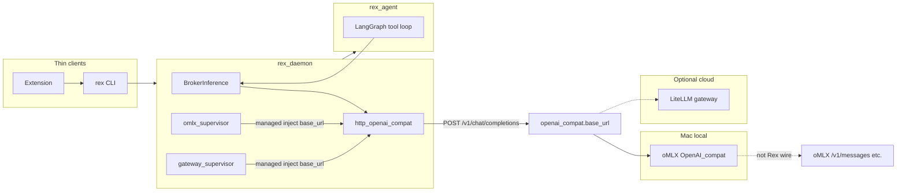

# oMLX local inference

**Status:** `planned` — [ADR 0033](architecture/decisions/0033-omlx-managed-local-inference.md). Future: daemon supervisor + `rex omlx init|doctor` + `$REX_ROOT/omlx/` templates.

Canonical design for Rex’s **managed, daemon-controlled** [oMLX](https://github.com/jundot/omlx) server on **Apple Silicon** — OpenAI Chat Completions wire only. Related: [ADAPTERS.md](ADAPTERS.md), [INFERENCE_GATEWAY.md](INFERENCE_GATEWAY.md) (multi-provider cloud), [NATIVE_TOOL_CALLING.md](NATIVE_TOOL_CALLING.md), [AGENT_GRAPH_ARCHITECTURE.md](AGENT_GRAPH_ARCHITECTURE.md), [SIDECAR_RUNTIME.md](SIDECAR_RUNTIME.md) (agent sidecar — separate feature).

## Single broker API

Rex exposes **one** inference wire to the sidecar: **OpenAI Chat Completions** via `http_openai_compat` (`POST …/chat/completions`, SSE `choices[].delta.content`).

| Rule | Meaning |
|------|---------|
| **Rex wire** | OpenAI Chat Completions only. Sidecar never calls oMLX `/v1/messages` or any Anthropic-shaped Rex runtime for oMLX. |
| **oMLX multi-API is upstream** | Anthropic Messages, embeddings, rerank, and LM Studio–style model directories are **operator/oMLX configuration** — not Rex adapter surfaces. |
| **Managed oMLX = gateway pattern** | `inference.omlx.*` is **lifecycle** (spawn, health, stop). When `mode: managed`, daemon **injects** `inference.openai_compat.base_url` → `http://127.0.0.1:{omlx.port}/v1` (default **8000**). No separate “oMLX API” from Rex’s view. |
| **Mutual exclusion** | At most **one** managed URL injector: `inference.omlx.mode: managed` **xor** `inference.gateway.mode: managed`. Config validation error if both. |
| **No provider profile selector** | `inference.provider_profile` is **not** part of the oMLX broker contract. Operator presets may live in fixtures as a cheat sheet only. |

## Purpose

Operators on Mac who enable **managed oMLX** get **local MLX inference** optimized for **long-context development-agent** workloads (tiered KV cache, continuous batching) through the **same** `inference.openai_compat.base_url` Rex already uses for `http_openai_compat` — without a new `InferenceRuntime` per vendor and without placing oMLX in the **agent sidecar** slot.

**Product fit:** Rex is Mac-first ([PURPOSE_AND_PRINCIPLES.md](PURPOSE_AND_PRINCIPLES.md)); the development agent re-sends a stable prefix on every tool-loop step ([AGENT_GRAPH_ARCHITECTURE.md](AGENT_GRAPH_ARCHITECTURE.md#cost-model)). oMLX’s SSD-backed KV cache and long-prefix TTFT profile compose with Rex prefix immutability (**R027**/**R032**).

## Three layers (do not conflate)

| Layer | Meaning |
|-------|---------|
| **Broker URL** | `inference.openai_compat.base_url` — the only URL `http_openai_compat` uses |
| **Built-in capability** | Rex ships spawn command, health probe, template dir under `$REX_ROOT/omlx/` |
| **Activation** | `managed` \| `external` \| `disabled` on `inference.omlx.*` — lifecycle only; managed mode **injects** `openai_compat.base_url` |

**Cloud multi-provider** remains the **LiteLLM gateway** path ([INFERENCE_GATEWAY.md](INFERENCE_GATEWAY.md)). oMLX is the **Mac local MLX lifecycle** path — not a replacement for gateway cloud routing.

## Scope

### In

- Daemon lifecycle when `inference.omlx.mode: managed` (spawn, health, stop).
- Config block `inference.omlx.*` (not `sidecars.*`).
- Loopback `openai_compat.base_url` injection when managed (see [effective URL](#effective-openai_compatbase_url)).
- Operator directory `$REX_ROOT/omlx/` (template + gitignored local overrides).
- Modes: `managed` (primary Mac profile), `external`, `disabled`.
- Mutual-exclusion validation with managed gateway.
- Operator sizing guidance for long-context dev agent (model class vs unified memory).
- Future opt-in live E2E proof (parallel to Ollama §8a in [EXTENSION_LOCAL_E2E.md](EXTENSION_LOCAL_E2E.md)).

### Out

- `rex.sidecar.v1` plugin or `sidecars.list` entry.
- oMLX inside the `rex-daemon` process (embed / FFI).
- Dedicated `omlx` `InferenceRuntime` id (same wire as `http_openai_compat`).
- oMLX **Anthropic Messages API** (`/v1/messages`) via Rex — Anthropic compatibility is **oMLX-internal**; Rex stays OpenAI Chat Completions only.
- `inference.provider_profile` as broker API selector.
- LiteLLM template routing to oMLX (optional follow-up; **direct oMLX** preferred for long-context agent).
- PR-blocking live oMLX on every CI run.
- In-daemon MLX FFI on Mac (deferred — [ADAPTERS.md § In-daemon MLX](ADAPTERS.md#in-daemon-mlx-path-deferred)).

## Why not a sidecar

| Constraint | Implication |
|------------|-------------|
| Sidecar API is `RunTurn` + agent semantics | oMLX is an HTTP inference server, not an agent |
| [ADR 0017](architecture/decisions/0017-single-active-sidecar-phase-1.md): one active sidecar | oMLX would displace `rex-agent` |
| Sidecar health is gRPC on UDS | oMLX is HTTP on loopback |
| Broker security | Model weights and MLX runtime stay in the inference child process |

Rex adds **oMLX supervision** on the daemon — same lifecycle *idea* as the gateway supervisor, **different** config block; both inject the **same** `openai_compat.base_url`.

## Architecture



| Concern | Owner |
|---------|--------|
| Agent loop, tool schemas | `rex-agent` sidecar |
| `BrokerInference`, policy, stream contract | `rex-daemon` |
| HTTP `tools[]` / `tool_calls` | `http_openai_compat` (generic) |
| oMLX process lifecycle | **omlx supervisor** (design parallel to gateway supervisor) |
| Tool execution policy | Daemon broker — unchanged |

## Effective `openai_compat.base_url`

Rex resolves the **single** broker URL in this order. Rows 2 and 3 are **mutually exclusive** by config validation — not competing primaries.

| Priority | Condition | Effective `openai_compat.base_url` |
|----------|-----------|-----------------------------------|
| 1 | `openai_compat.base_url` set and managed `allow_url_override` (gateway or oMLX) allows explicit override | Configured URL |
| 2 | `inference.omlx.mode: managed` | `http://127.0.0.1:{omlx.port}/v1` (default port **8000**) |
| 3 | `inference.gateway.mode: managed` | `http://127.0.0.1:{gateway.port}/v1` ([CONFIGURATION.md](CONFIGURATION.md)) |
| 4 | Otherwise | Configured `openai_compat.base_url` or broker error at request time |

**Validation:** If both `inference.omlx.mode: managed` and `inference.gateway.mode: managed`, config load **fails** with a clear error.

**Agent tool-loop guidance:** prefer **managed or direct oMLX** over gateway + oMLX hop — same lesson as direct Ollama in [NATIVE_TOOL_CALLING.md](NATIVE_TOOL_CALLING.md).

## Interfaces (intent)

### Config block `inference.omlx`

| Key | Default (intent) | Purpose |
|-----|------------------|---------|
| `mode` | `disabled` (global); **`managed`** in Mac operator profile doc | `managed` \| `external` \| `disabled` |
| `port` | `8000` | Loopback listen port |
| `command` | `omlx` or `~/.omlx/bin/omlx` | Spawn argv[0] |
| `model_dir` | operator path | MLX weights directory (may reuse LM Studio layout) |
| `model` | — | Default model id injected into `openai_compat.model` when unset |
| `health_path` | `/v1/models` or `/health` | Readiness probe |
| `discovery_on_ready` | `true` | Optional `GET /v1/models` warm after health |
| `allow_url_override` | `false` | When `managed`, allow non-empty `openai_compat.base_url` to win (mirror gateway) |

Full field table: [CONFIGURATION.md](CONFIGURATION.md#inference-omlx-design).

### CLI operator surface (future)

| Command | Purpose |
|---------|---------|
| `rex omlx init` | Materialize `$REX_ROOT/omlx/` template |
| `rex omlx doctor` | Preflight: binary, port, model dir, health |

## Native tools + long context

| Topic | Design stance |
|-------|----------------|
| Wire | OpenAI `tools[]` / `tool_calls` only — [ADR 0023](architecture/decisions/0023-hybrid-agent-serialization-boundaries.md) |
| `native_tools` | Under `inference.openai_compat.native_tools`; when effective URL is oMLX loopback, default forward tools (implementation PR 3) |
| Interim JSON fallback | Retained when provider rejects tools or parse fails — [NATIVE_TOOL_CALLING.md](NATIVE_TOOL_CALLING.md) |
| Prefix immutability | Rex sidecar unchanged; oMLX SSD KV cache amortizes static prefix across tool steps |
| Gateway for agent tools | **Discouraged** — extra hop and normalization risk |
| Vendor cache breakpoints | Planned [CACHING.md](CACHING.md) work — follow-up enabler for oMLX + Rex prefix seam |

### Native tools behavior (intent)

| Effective `base_url` target | `native_tools: auto` behavior | Agent reference path |
|-----------------------------|------------------------------|----------------------|
| oMLX loopback (`:8000`) | Forward tools; oMLX declares OpenAI tool support | **Primary Mac local** (this hub) |
| Ollama loopback (`:11434`) | Probe `POST /api/show` for `tools` capability | Secondary / CI E2E today |
| LiteLLM gateway loopback (`:4000`) | Forward tools; higher interim-fallback risk | Multi-provider cloud |
| Other OpenAI-compat URL | Forward tools; operator responsibility | `custom` / direct |

## Operator profiles

### Mac development agent (long context)

| RAM (unified) | Suggested model class | Notes |
|---------------|----------------------|-------|
| 16 GB | 7B coder | Tight; short tool loops |
| 32 GB | 7B–14B coder | Comfortable daily dev |
| **48 GB** | **~32B coder** (e.g. Qwen2.5-Coder 32B class) | Sweet spot: ~19 GB weights + KV headroom |
| 64 GB+ | 32B–70B | oMLX recommended comfort tier |

**Avoid:** running largest available model (e.g. 70B at ~42 GB) on 48 GB machines for multi-step agent loops — leaves insufficient KV budget.

### Example managed config (intent)

```json
{
  "inference": {
    "runtime": "http-openai-compat",
    "omlx": {
      "mode": "managed",
      "port": 8000,
      "model": "qwen2.5-coder-32b"
    },
    "openai_compat": {
      "native_tools": "auto"
    }
  }
}
```

When `omlx.mode` is `managed`, Rex injects `openai_compat.base_url` → `http://127.0.0.1:8000/v1` before broker requests.

## Prioritization

| Bucket | Rank | Rationale |
|--------|------|-----------|
| **Should** (Mac local inference) | After v1.0 observability Must (**RC-LF1**) | [V1_0.md](V1_0.md) excludes MLX from v1.0 promise; high value for Mac dogfood |
| MoSCoW pointer | [PRIORITIZATION.md](PRIORITIZATION.md) | Long-context dev agent on Apple Silicon |

## Implementation slices (planning only)

| Slice | Concern | Unlocks |
|-------|---------|---------|
| **PR 1** | Hub + ADR 0033 + roadmap/docs (single-API correction) | This document |
| PR 2 | `inference.omlx` config schema + supervisor + extend `resolve_effective_openai_compat_base_url` + mutual-exclusion validate | Managed spawn |
| PR 3 | oMLX `native_tools` defaults under `openai_compat` (no profile registry) | Mac dogfood tools |
| PR 4 | `rex omlx init\|doctor` + `$REX_ROOT/omlx/` templates | Operator DX |
| PR 5 | Opt-in live E2E script + [EXTENSION_LOCAL_E2E.md](EXTENSION_LOCAL_E2E.md) §8b | Dogfood proof |

## Cross-links

- [ADAPTERS.md](ADAPTERS.md) — protocol adapter + external server defaults
- [INFERENCE_GATEWAY.md](INFERENCE_GATEWAY.md) — cloud multi-provider (orthogonal managed child)
- [NATIVE_TOOL_CALLING.md](NATIVE_TOOL_CALLING.md) — broker tool wire
- [CONTEXT_EFFICIENCY.md](CONTEXT_EFFICIENCY.md) — economics matrix row
- [ROADMAP.md](ROADMAP.md) — Later **Could** row
- [PLUGIN_ROADMAP.md](PLUGIN_ROADMAP.md) — broker adapter phase
- [ADR 0033](architecture/decisions/0033-omlx-managed-local-inference.md)
- [ADR 0018](architecture/decisions/0018-gateway-first-multi-provider-inference.md), [ADR 0019](architecture/decisions/0019-inference-gateway-opt-in-litellm.md), [ADR 0023](architecture/decisions/0023-hybrid-agent-serialization-boundaries.md)
