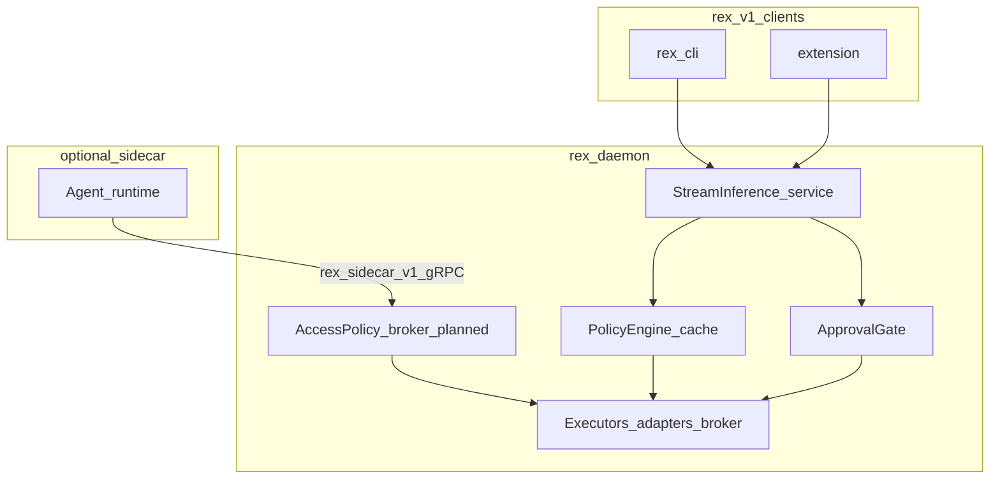

# Policy engine (design hub)

How **`rex-daemon`** centralizes **policy** (what must hold) separate from **mechanism** (how it is enforced). Covers **shipped** seams today, including the **access-policy broker** for sidecar tool RPCs (RC-05 Met).

## Policy vs mechanism

| Policy (daemon-owned) | Mechanism (behind seams) |
|----------------------|---------------------------|
| Cache eligibility by mode | LRU in `l1_cache.rs` |
| Agent approval decisions | `ApprovalGate` in `approvals.rs` |
| Future: capability allow/deny | OS sandbox, subprocess spawn, gRPC broker |
| Stream terminal semantics | `service.rs` wiring |

See [ARCHITECTURE_GUIDELINES.md](ARCHITECTURE_GUIDELINES.md) for the split.

## Runtime placement

## Shipped today

| Seam | Module | Policy outcome |
|------|--------|----------------|
| **Cache / mode** | `policy.rs` — `PolicyEngine`, `decide`, `CacheDecision` | `ask` L1 lookup; `agent` uncacheable; bypass flags — [ADR 0003](architecture/decisions/0003-layered-cache-agent-mode-policy.md), [CACHING.md](CACHING.md). |
| **Agent approvals** | `approvals.rs` — `ApprovalGate` | Opt-in `REX_AGENT_APPROVALS`; default `AlwaysAllow`; `Checkpoint` returns failed-precondition (blocks stream) — [ADR 0009](architecture/decisions/0009-centralized-agent-approvals-and-checkpoints.md). |
| **Access policy (broker)** | `access_policy.rs` — `evaluate_fs_read` | Centralized deny before `fs.read` host execution — **RC-05** / **R012** |

**Ordering rule (shipped):** pipeline resolution → **cache decision** → runtime invocation. Tests lock this ordering.

**MVP target ordering (assistant path):** envelope / access policy → **broker** (inference + tools) → **stream** to `rex.v1` clients. Sidecar requests never bypass daemon policy ([MVP_SPEC.md](MVP_SPEC.md)).

## Planned evaluation pipeline

Single conceptual path per request (sidecar and in-daemon adapters converge on daemon authority):

| Step | Check |
|------|--------|
| 1 | Normalize mode / request context |
| 2 | `ApprovalGate` when `agent` |
| 3 | **Access policy** — capability classes — [AGENT_ACCESS_POLICY.md](AGENT_ACCESS_POLICY.md) |
| 4 | Cache policy (`PolicyEngine`) |
| 5 | Route to **in-daemon adapter** or **sidecar** |
| 6 | Execute; log **resolved** identity for economics |

Sidecar **intent** (model tier, tool RPC) is not sufficient for cache keys or spend attribution — **daemon-resolved execution** wins per [ADR 0008](architecture/decisions/0008-dedicated-sidecar-control-plane-api.md).

## Access policy broker (design accepted)

| Responsibility | Owner |
|----------------|--------|
| Evaluate `fs.*` / `exec.*` / `net.*` requests from sidecar API | Daemon `AccessPolicy` — [ADR 0013](architecture/decisions/0013-access-policy-broker-completion.md) |
| Run approved actions on host | Executor layer (subprocess, scoped FS) |
| Deny with structured errors | Same surface as gRPC policy errors |

Does **not** replace `ApprovalGate` — approvals are human/UX gates; access policy is **technical allow/deny**.

**Implementation:** **R012** shipped protected-path checks for `fs.read` / `fs.list` (**RC-05**). **R020** (Done) completes ADR 0013: mode × capability matrix, protected paths on `fs.write` / `exec.shell`, and `max_tool_result_bytes` from JSON config. See [ROADMAP.md](ROADMAP.md) engineering backlog **R020**.

## Extension and CLI

- **Approval UX** stays in the extension — [EXTENSION.md](EXTENSION.md).
- Clients supply **approval context** to the daemon when enforcement is on; daemon decides.
- `rex-cli` and extension share one gate — [ADR 0009](architecture/decisions/0009-centralized-agent-approvals-and-checkpoints.md).

## Related

- [AGENT_ACCESS_POLICY.md](AGENT_ACCESS_POLICY.md) · [SIDECAR_RUNTIME.md](SIDECAR_RUNTIME.md)
- [ARCHITECTURE.md](ARCHITECTURE.md) · [CONTEXT_EFFICIENCY.md](CONTEXT_EFFICIENCY.md)
- [V1_0.md](V1_0.md) — **RC-05** AccessPolicy broker criterion
- [ROADMAP.md](ROADMAP.md) — **R012** (Done), **R020** (Done)
