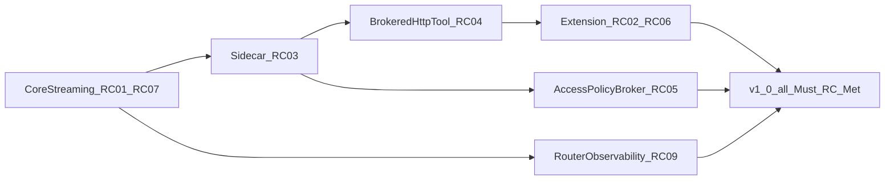

# Roadmap

**Purpose:** track **post-v1.0** **Should** / **Could** work and closure of **Should** release criteria (**RC-S***) in **[V1_0.md](V1_0.md)**. Must **RC-*** remain canonical in that hub. [PURPOSE_AND_PRINCIPLES.md](PURPOSE_AND_PRINCIPLES.md) states intent; [MVP_SPEC.md](MVP_SPEC.md) is Phase 1 **architecture and scope** (no separate completion status). [PRIORITIZATION.md](PRIORITIZATION.md) describes MoSCoW bucketing and light R-ICE scoring.

**Version:** workspace **`1.0.0`** — all Must **RC-*** in [V1_0.md](V1_0.md) are **Met**.

## Release criteria status

Canonical definitions and evidence: **[V1_0.md](V1_0.md)**. Update status there first, then this mirror.

| ID | Status |
|----|--------|
| RC-01 | Met |
| RC-02 | Met |
| RC-03 | Met |
| RC-04 | Met |
| RC-05 | Met |
| RC-06 | Met |
| RC-07 | Met |
| RC-08 | Met |
| RC-09 | Met |
| RC-10 | Met |

### Should criteria (not blocking `1.0.0`)

| ID | Status | Notes |
|----|--------|-------|
| RC-S1 | Met | Extension `rex.modelId` → `--model` — [EXTENSION_ROADMAP.md](EXTENSION_ROADMAP.md) |
| RC-S2 | Met | Long-session extension stress — cancel returns UI to idle |

## Theme order (dependency mental model)



## Now — v1.0 Must criteria closed

All Must **RC-*** rows in [V1_0.md](V1_0.md) are **Met**. Follow-up work is **Should** / **Could** / **Later** below.

| Priority | What / why | RC-* | Notes |
|----------|------------|------|-------|
| **Should** | CI quality gates (R023–R026 shipped) | [CI_QUALITY_GATES.md](CI_QUALITY_GATES.md) | Optional follow-up: `cargo-deny`, Semgrep |
| **Should** | Stream/log polish beyond baseline | RC-07 (Met) | Optional hardening only |

## Next — product agent program

Canonical design: **[AGENT_DELIVERY_ROADMAP.md](AGENT_DELIVERY_ROADMAP.md)**. Default supervised sidecar for CI/harness is **`rex-sidecar-stub`**; **`rex-agent`** ships LangGraph ReAct (**R018** Done) on the gRPC scaffold (**R017** Done). **Target graph:** Viewer/Editor subagents — [AGENT_GRAPH_ARCHITECTURE.md](AGENT_GRAPH_ARCHITECTURE.md).

**Priority rationale:** **R013–R022**, **R017–R019**, **R027–R032**, **R034**, and **R037** are **Done**. **RC-S2** is **Met**. **R023–R026** are **Done**. Next **Could** product follow-up: **R016** / **R031** / **R033** / **R036**. Serialization design: [ADR 0023](architecture/decisions/0023-hybrid-agent-serialization-boundaries.md).

| Order | Theme | ID | Outcome |
|-------|-------|-----|---------|
| 1 | Doc truth (stub vs product) | — | Hubs state planned agent; stub = harness; JSON config primary ([CONFIGURATION.md](CONFIGURATION.md)) |
| 2 | Platform enablers | **R013** | Done — `BrokerListDir`, `RunTurn.model`, stream passthrough |
| 3 | Unified `rex` CLI | **R014** | Done — single `rex` binary; subcommands |
| 4 | Config + proto SDK | **R015** | Done — JSON config, `rex proto install`, `proto.gen_root` |
| 5 | Broker access policy completion | **R020** | Done — mode × capability matrix; write/exec protected paths; `max_tool_result_bytes` — [ADR 0013](architecture/decisions/0013-access-policy-broker-completion.md), [POLICY_ENGINE.md](POLICY_ENGINE.md) |
| 6 | Turn correlation Phase 1b | **R021** | Done — `turn_id`, `context_revision` on `RunTurn` — [DEVELOPMENT_ASSISTANCE_CAPABILITIES.md](DEVELOPMENT_ASSISTANCE_CAPABILITIES.md) |
| 7 | Workspace binding (daemon) | **R022** | Done — fail-closed `workspace.root`; harness cwd fallback — [ADR 0011](architecture/decisions/0011-workspace-binding-and-turn-context-authority.md) |
| 8 | `rex-agent` scaffold | **R017** | Done — gRPC server + broker client ([sidecars/rex-agent/README.md](../sidecars/rex-agent/README.md)) |
| 9 | LangGraph agent core | **R018** | Done — ReAct loop, broker adapters ([sidecars/rex-agent/DESIGN.md](../sidecars/rex-agent/DESIGN.md)) |
| 10 | Integration / E2E | **R019** | Extension workspace + defaults; client hints; live-model E2E — [AGENT_DELIVERY_ROADMAP.md](AGENT_DELIVERY_ROADMAP.md#r019-integration--e2e-acceptance) |
| 11 | Broker baseline hardening | **R027** | Done — `RexBrokerChatModel`, parse recovery, streaming buffer — [AGENT_GRAPH_ARCHITECTURE.md](AGENT_GRAPH_ARCHITECTURE.md) |
| 12 | Viewer/Editor subagents | **R028** | Done — Orchestrator routing; isolated contexts — [ADR 0022](architecture/decisions/0022-viewer-editor-subagent-topology.md) |
| 13 | Intra-turn state compaction | **R029** | Done — `RemoveMessage`, 25% suffix rule; microcompaction tier — [AGENT_GRAPH_ARCHITECTURE.md](AGENT_GRAPH_ARCHITECTURE.md) |
| 14 | Raw delimited tool results | **R034** | Done — `<<TOOL_RESULT:tool>>` … `<<END>>`; line-safe truncation — [ADR 0023](architecture/decisions/0023-hybrid-agent-serialization-boundaries.md) |
| 15 | Diff-only writes | **R030** | Done — Sidecar read→patch→write — [AGENT_GRAPH_ARCHITECTURE.md](AGENT_GRAPH_ARCHITECTURE.md) |
| 16 | Token playbook + metrics | **R032** | Done — Prefix SHA, read dedup, hard step cap — [AGENT_GRAPH_ARCHITECTURE.md](AGENT_GRAPH_ARCHITECTURE.md) |
| 17 | Multi-active broadcast | **R016** | `sidecars.active[]`, broadcast `RunTurn` (**Could** — deferred Phase 1, [ADR 0017](architecture/decisions/0017-single-active-sidecar-phase-1.md)) |
| 18 | Task-aware read pruning | **R031** | Goal-hint filter for reads >100 lines (**Could**) — [AGENT_GRAPH_ARCHITECTURE.md](AGENT_GRAPH_ARCHITECTURE.md) |
| 19 | TRON static schema compression | **R036** | Daemon prefix schema compaction (**Could**) — [ADR 0023](architecture/decisions/0023-hybrid-agent-serialization-boundaries.md) |
| 20 | Native tools + MCP client | **R033** | Phase 2; [ADR 0016](architecture/decisions/0016-mcp-in-sidecar-envelope.md) (**Could**) |
| 21 | Plan mode planning tools | **R037** | Done — [PLANNING_TOOLS.md](PLANNING_TOOLS.md), [ADR 0024](architecture/decisions/0024-plan-mode-artifacts-and-plan-save-broker.md) |

```mermaid
flowchart TD
  doc[DocTruth]
  plat[R013_Platform]
  cli[R014_rex_CLI]
  cfg[R015_Config_Done]
  policy[R020_BrokerPolicy]
  turn[R021_TurnCorrelation]
  workspace[R022_WorkspaceBinding]
  scaffold[R017_agent_scaffold]
  graph[R018_LangGraph]
  e2e[R019_Integration]
  r027[R027_BrokerModel]
  r028[R028_Subagents]
  r029[R029_Compaction]
  r034[R034_RawResults]
  r030[R030_DiffWrites]
  r032[R032_Playbook]
  r031[R031_ReadPrune]
  r036[R036_TRON]
  r033[R033_NativeTools]
  multi[R016_Multi_active]
  doc --> plat
  plat --> cli
  cli --> cfg
  cfg --> policy
  cfg --> turn
  policy --> scaffold
  turn --> scaffold
  scaffold --> graph
  graph --> e2e
  workspace --> e2e
  e2e --> r027
  r027 --> r028
  r028 --> r029
  r029 --> r034
  r034 --> r030
  r030 --> r032
  r032 --> r031
  r036 -.-> r033
  r032 --> r033
  e2e -.-> multi
```

## Next — after v1.0 or in parallel if healthy

| Priority | What / why | Source(s) | Notes |
|----------|------------|-----------|--------|
| **Could** | **MCP** interoperability (design accepted; implementation deferred) | [CONTEXT_EFFICIENCY.md](CONTEXT_EFFICIENCY.md), [ADR 0008](architecture/decisions/0008-dedicated-sidecar-control-plane-api.md) | Formal MCP ADR when scheduled |
| **Could** | Learned / small-model compression; batching/async doc jobs | [CONTEXT_EFFICIENCY.md](CONTEXT_EFFICIENCY.md) | Matrix **planned** rows |
| **Could** | Layered prompts (system/project stack) | [CONFIGURATION.md](CONFIGURATION.md#layered-prompts-planned) | **planned** |
| **Could** | Difficulty-based routing cascade (ML escalation) | [PLUGIN_ROADMAP.md](PLUGIN_ROADMAP.md), [ADR 0004](architecture/decisions/0004-routing-daemon-first-optional-http-gateway.md) | Beyond **RC-09** env hook |
| **Should** | Inference Gateway — opt-in managed LiteLLM (daemon control, Ollama model discovery) | [INFERENCE_GATEWAY.md](INFERENCE_GATEWAY.md), [ADR 0019](architecture/decisions/0019-inference-gateway-opt-in-litellm.md) | **Done** — daemon supervisor, `rex gateway init|doctor`, templates under `$REX_ROOT/gateway/` |
| **Should** | LiteLLM default API docs (external + managed profiles) | [ADAPTERS.md](ADAPTERS.md#multi-provider-gateway-via-litellm-default-api), [ADR 0018](architecture/decisions/0018-gateway-first-multi-provider-inference.md) | Hub + ADR 0019 landed |
| **Should** | CI quality and security gates (AI-assisted dev hardening) | [CI_QUALITY_GATES.md](CI_QUALITY_GATES.md) | Phases **R023–R026**; Sonar excluded |
| **Should** | Extension integrated UX (**E-UX01…E-UX11**) | [EXTENSION_UX.md](EXTENSION_UX.md), [EXTENSION_ROADMAP.md](EXTENSION_ROADMAP.md) | Webview-first; one PR per row where feasible |
| **Won't (now)** | Direct daemon HTTP/mock without sidecar | [MVP_SPEC.md](MVP_SPEC.md) | CI/harness path only; not product default |

## Later — only if the core path stays healthy

| Priority | What | Source(s) | Notes |
|----------|------|-----------|--------|
| **Could** | L2 **semantic** cache | [CACHING.md](CACHING.md), [PLUGIN_ROADMAP.md](PLUGIN_ROADMAP.md) | Out of v1.0 |
| **Could** | **Apple MLX** local model path | [ADAPTERS.md](ADAPTERS.md#local-mlx-path-planned) | Post-v1.0 |
| **Could** | Native Anthropic Messages adapter (secondary) | [ADAPTERS.md](ADAPTERS.md#direct-anthropic-messages-api-planned--secondary), [ADR 0018](architecture/decisions/0018-gateway-first-multi-provider-inference.md) | After LiteLLM profile; broker dispatch + `anthropic` runtime |
| **Could** | Gateway adapters beyond broker HTTP | [PLUGIN_ROADMAP.md](PLUGIN_ROADMAP.md), [ADR 0004](architecture/decisions/0004-routing-daemon-first-optional-http-gateway.md) | After router story matures; multi-sidecar broadcast → **R016** |
| **Could** | Vendor KV / prompt cache hints | [CACHING.md](CACHING.md#vendor-kv-and-prompt-cache-hints-planned) | Depends on outbound API owning runtime |
| **Won't (now)** | VM/container as **default Mac** sidecar envelope | [AGENT_RUNTIME_ENVIRONMENT.md](AGENT_RUNTIME_ENVIRONMENT.md) | Process + broker instead |

## Engineering backlog (refactor / contract IDs)

| ID | Theme | Priority |
|----|-------|----------|
| R004 | CLI / extension NDJSON seam hardening | Done |
| R005 | Cross-boundary NDJSON conformance tests | Done |
| R007 | Policy engine / cache seams | Done |
| R008 | Centralized agent approvals | Done |
| R009 | Extension contract tests (approval-id, probe recovery) | Done |
| R010 | Broker `fs.write` | Done |
| R011 | Broker `exec.shell` allowlist | Done |
| **R012** | **AccessPolicy broker centralization** (RC-05) | **Done** |
| **R013** | Platform enablers (`BrokerListDir`, `RunTurn.model`, stream passthrough) | Done |
| **R014** | Unified `rex` CLI (replace `rex-cli` / `rex-daemon`) | Done |
| **R015** | JSON config + `rex proto install` + `proto.gen_root` | Done |
| **R016** | Multi-active sidecar broadcast | Could — deferred Phase 1 per [ADR 0017](architecture/decisions/0017-single-active-sidecar-phase-1.md) |
| **R017** | `rex-agent` scaffold (gRPC + broker client) | Done |
| **R018** | LangGraph agent core (ReAct, broker tools) | **Done** — [sidecars/rex-agent/DESIGN.md](../sidecars/rex-agent/DESIGN.md) |
| **R019** | Integration / E2E (operator path, extension defaults) | **Done** |
| **R020** | Broker access policy completion (ADR 0013; follows R012) | **Done** — [POLICY_ENGINE.md](POLICY_ENGINE.md), [AGENT_ACCESS_POLICY.md](AGENT_ACCESS_POLICY.md) |
| **R021** | Turn correlation Phase 1b (`turn_id`, `context_revision`) | **Done** — [DEVELOPMENT_ASSISTANCE_CAPABILITIES.md](DEVELOPMENT_ASSISTANCE_CAPABILITIES.md) |
| **R022** | Workspace binding product path (fail-closed daemon) | **Done** — [ADR 0011](architecture/decisions/0011-workspace-binding-and-turn-context-authority.md) |
| **R027** | Broker baseline hardening (`RexBrokerChatModel`) | **Done** — [AGENT_GRAPH_ARCHITECTURE.md](AGENT_GRAPH_ARCHITECTURE.md) |
| **R028** | Viewer/Editor subagent topology | **Done** — [ADR 0022](architecture/decisions/0022-viewer-editor-subagent-topology.md) |
| **R029** | Intra-turn state compaction + microcompaction tier | **Done** — [AGENT_GRAPH_ARCHITECTURE.md](AGENT_GRAPH_ARCHITECTURE.md) |
| **R034** | Raw delimited tool results | **Done** — [ADR 0023](architecture/decisions/0023-hybrid-agent-serialization-boundaries.md) |
| **R030** | Diff-only writes (sidecar patch path) | **Done** — [AGENT_GRAPH_ARCHITECTURE.md](AGENT_GRAPH_ARCHITECTURE.md) |
| **R031** | Task-aware read pruning | Could — [AGENT_GRAPH_ARCHITECTURE.md](AGENT_GRAPH_ARCHITECTURE.md) |
| **R032** | Token playbook + prefix SHA metrics | **Done** — [AGENT_GRAPH_ARCHITECTURE.md](AGENT_GRAPH_ARCHITECTURE.md) |
| **R036** | TRON static schema compression | Could — [ADR 0023](architecture/decisions/0023-hybrid-agent-serialization-boundaries.md) |
| **R033** | Native tools + MCP gRPC client | Could — [ADR 0016](architecture/decisions/0016-mcp-in-sidecar-envelope.md) |
| **R023** | Supply chain: `cargo-audit`, Dependabot | **Done** — [CI_QUALITY_GATES.md](CI_QUALITY_GATES.md); `cargo-deny` deferred |
| **R024** | Security SAST: CodeQL (primary) | **Done** — [CI_QUALITY_GATES.md](CI_QUALITY_GATES.md), [`.github/workflows/codeql.yml`](../.github/workflows/codeql.yml) |
| **R025** | `rex-agent` static analysis: Ruff | **Done** — [CI_QUALITY_GATES.md](CI_QUALITY_GATES.md) |
| **R026** | Rex-specific guidelines + optional Semgrep | Could — [CI_QUALITY_GATES.md](CI_QUALITY_GATES.md) |

## Parked in design docs

| Topic | When to pull in | Source |
|--------|-----------------|--------|
| **Remote** networking, **TLS**, **production auth** | Operator story + threat model ready | [MVP_SPEC.md](MVP_SPEC.md), [ARCHITECTURE.md](ARCHITECTURE.md) |
| **Wasm** in-process plugins | Sidecar path mature enough to compare | [PLUGIN_ROADMAP.md](PLUGIN_ROADMAP.md) |
| ~~JSON config via **R015**~~ | **Landed** — see engineering backlog **R015** Done | [AGENT_DELIVERY_ROADMAP.md](AGENT_DELIVERY_ROADMAP.md), [CONFIGURATION.md](CONFIGURATION.md) |
| **Node gRPC `StreamInference`** in extension | New ADR supersedes hybrid policy | [ADR 0007](architecture/decisions/0007-editor-extension-hybrid-transport-cli-and-grpc.md) |
| **Large** multi-plugin orchestration | Single-plugin supervision stable | [PLUGIN_ROADMAP.md](PLUGIN_ROADMAP.md) |
| **Long-term / project memory** | ADR 0014 accepted; implement after benchmark gate | [LONG_TERM_MEMORY.md](LONG_TERM_MEMORY.md), [ADR 0014](architecture/decisions/0014-long-term-memory-boundary.md) |
| **Agent knowledge** (curated docs for AI, remote/MCP) | ADR 0015 accepted; implement after R015 | [AGENT_KNOWLEDGE.md](AGENT_KNOWLEDGE.md), [ADR 0015](architecture/decisions/0015-agent-knowledge-bundles.md) |
| **MCP in sidecar** | ADR 0016 accepted; implementation deferred | [ADR 0016](architecture/decisions/0016-mcp-in-sidecar-envelope.md) |
| **Development assistance capabilities** (turn contract, budget pipeline) | Design hub + ADRs 0011–0017 | [DEVELOPMENT_ASSISTANCE_CAPABILITIES.md](DEVELOPMENT_ASSISTANCE_CAPABILITIES.md) |
| **Token-efficient agent graph** (Viewer/Editor, serialization, compaction) | Design accepted; **R027–R036** | [AGENT_GRAPH_ARCHITECTURE.md](AGENT_GRAPH_ARCHITECTURE.md), [ADR 0022](architecture/decisions/0022-viewer-editor-subagent-topology.md), [ADR 0023](architecture/decisions/0023-hybrid-agent-serialization-boundaries.md) |
| **Observability suite + economics validation** | Design documented; implementation: OTLP + `observability` JSON ([ADR 0020](architecture/decisions/0020-otel-genai-semconv-with-rex-pipeline-metrics.md)), `rex-obs-store` **dual engines** — **sqlite** default, **mmap** opt-in ([ADR 0021](architecture/decisions/0021-rex-owned-economics-store-byot-visualization.md), [ADR 0025](architecture/decisions/0025-dual-economics-store-engines.md)), harness | [OBSERVABILITY_AND_ECONOMICS.md](OBSERVABILITY_AND_ECONOMICS.md), [OBS_STORE_MMAP_FORMAT.md](OBS_STORE_MMAP_FORMAT.md), [ADR 0010](architecture/decisions/0010-daemon-exports-observability-via-otel-and-sidecar-api.md) |
| **Apple Silicon mmap economics store** (`store.engine=mmap`, opt-in) | After SQLite `rex-obs-store` write path (Phase 2); before flipping default — **Could**; design documented | [OBS_STORE_MMAP_FORMAT.md](OBS_STORE_MMAP_FORMAT.md), [ADR 0025](architecture/decisions/0025-dual-economics-store-engines.md), [OBSERVABILITY_AND_ECONOMICS.md](OBSERVABILITY_AND_ECONOMICS.md) |
| **VM/container sidecar envelope** (server/fleet) | Linux deployment needs stronger isolation | [AGENT_RUNTIME_ENVIRONMENT.md](AGENT_RUNTIME_ENVIRONMENT.md) |

**CI:** [CI.md](CI.md) — shipped gates (mock / self-contained default; live LLM not required on PRs). **Planned:** [CI_QUALITY_GATES.md](CI_QUALITY_GATES.md) (**R026**; **R023–R025** Done).

## How to refresh this file

1. Update **[V1_0.md](V1_0.md)** **RC-*** status when a gap closes; mirror the compact table above.
2. Skim [MVP_SPEC.md](MVP_SPEC.md) when **scope** changes; [PLUGIN_ROADMAP.md](PLUGIN_ROADMAP.md), [EXTENSION_ROADMAP.md](EXTENSION_ROADMAP.md) for feature phasing.
3. **New product or feature ideas:** follow [DOCUMENTATION.md — Roadmap and new features](DOCUMENTATION.md#roadmap-and-new-features) (hub first, then row with **Source(s)** link).
4. Re-check [PRIORITIZATION.md](PRIORITIZATION.md) when moving rows.

### Prioritization audit (2026-05-23)

Roadmap rows checked against [PRIORITIZATION.md](PRIORITIZATION.md): MoSCoW labels, hub links for **Could** / **Won't (now)**, economics-matrix coherence, and **RC-S*** mirrors. Re-run when priorities shift materially.

## Related

- [V1_0.md](V1_0.md) — release criteria (canonical **done**)
- [MVP_SPEC.md](MVP_SPEC.md) — Phase 1 architecture
- [docs/README.md](README.md) — documentation index
- [PRIORITIZATION.md](PRIORITIZATION.md) — bucketing and scoring
