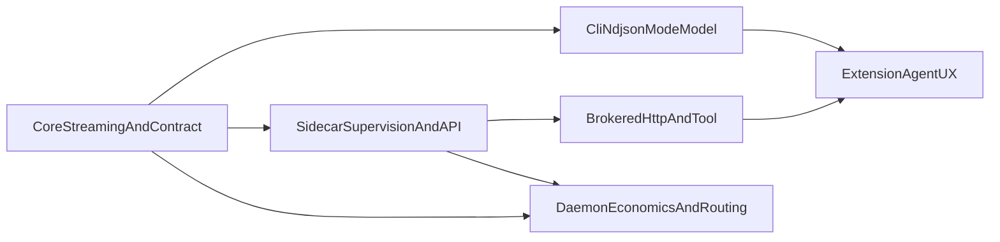

# Roadmap (study project, consolidated)

Rex is a **learning lab** and **small, testable reference** for local daemon + gRPC + thin clients ([README.md](../README.md)). This file is a **short** “what to explore next” view; deeper design is in the linked docs. [PRIORITIZATION.md](PRIORITIZATION.md) describes **light** bucketing and R-ICE-style scoring for ordering ideas.

**Spec and extension:** [MVP_SPEC.md](MVP_SPEC.md) scopes **Phase 1** protocol and shipped inference adapters; **[EXTENSION.md](EXTENSION.md)** captures the NDJSON consumer contract plus extension architecture; phased UX work stays in [EXTENSION_ROADMAP.md](EXTENSION_ROADMAP.md).

## What we are learning toward (right now)

**Primary product direction:** **`rex-daemon` owns** economics — routing hooks, caches, pipelines, observability ([ARCHITECTURE.md](ARCHITECTURE.md), [CONTEXT_EFFICIENCY.md](CONTEXT_EFFICIENCY.md)). **Phase 1 MVP:** basic **development agent** in the extension whose **runtime lives in a daemon-supervised sidecar** with **brokered HTTP** inference and **one brokered tool** ([MVP_SPEC.md](MVP_SPEC.md)). Transport (**UDS**, **NDJSON**) remains critical. CI uses **`mock`** / stub sidecar; product path uses sidecar + **`REX_OPENAI_COMPAT_*`**. Direct in-process HTTP without sidecar is **harness only**.

## Theme order (rough dependency mental model)

## Now — what matters first

| Priority | What / why | Source(s) | “Done enough” for a study cut | Where to work |
|----------|------------|-----------|--------------------------------|---------------|
| **Must** | UDS + gRPC + streaming **correct** under bad paths (races, cancel, errors) | [MVP_SPEC.md](MVP_SPEC.md), [ARCHITECTURE.md](ARCHITECTURE.md) | E2E/unit coverage + [CI](CI.md) green | daemon, rex-proto, rex-cli |
| **Must** | **Economics groundwork** documented + measurable signals started (optimization matrix **implemented**; router **planned**) | [CONTEXT_EFFICIENCY.md](CONTEXT_EFFICIENCY.md), [ADR 0004](architecture/decisions/0004-routing-daemon-first-optional-http-gateway.md) | Matrix + ADRs land; daemon logs/cache fields ready for eventual routing IDs | daemon, docs |
| **Must** | `rex-cli complete --format ndjson` stays line-safe and has **one** terminal event | [MVP_SPEC.md](MVP_SPEC.md), [EXTENSION.md](EXTENSION.md) | Tests + `MVP_SPEC` checklist | rex-cli, docs |
| **Must** | IDE dogfooding loop stays usable: develop `rex` via the extension without leaving the editor path | [MVP_SPEC.md](MVP_SPEC.md), [EXTENSION_ROADMAP.md](EXTENSION_ROADMAP.md) | Local E2E run confirms send/cancel/retry/status flow remains stable for normal coding sessions | extension, rex-cli, daemon |
| **Must** | **Sidecar supervision** (0 or 1 process; health; clear errors) | [MVP_SPEC.md](MVP_SPEC.md), [SIDECAR_RUNTIME.md](SIDECAR_RUNTIME.md) | **Implemented** — `supervisor.rs`, `REX_SIDECAR_*` | daemon |
| **Must** | **`rex.sidecar.v1` MVP verbs** + reference sidecar | [SIDECAR_RUNTIME.md](SIDECAR_RUNTIME.md), [ADR 0008](architecture/decisions/0008-dedicated-sidecar-control-plane-api.md) | **Implemented** — `rex-sidecar-stub`, roundtrip test | daemon, sidecar |
| **Must** | **`StreamInference` routes assistant modes through sidecar** | [MVP_SPEC.md](MVP_SPEC.md) | **Implemented** (product path); CI: `REX_SIDECAR_HARNESS=direct` | daemon |
| **Must** | **Brokered HTTP inference** (reuse `http_openai_compat`) | [ADAPTERS.md](ADAPTERS.md) | Mechanism **implemented**; sidecar product path uses supervisor | daemon |
| **Must** | **Brokered tool** (`fs.read`) | [AGENT_ACCESS_POLICY.md](AGENT_ACCESS_POLICY.md) | **Implemented** — `BrokerReadFile`, stub `__rex_read:` | daemon |
| **Must** | **Extension → CLI `mode`/`model`** on every `complete` | [MVP_SPEC.md](MVP_SPEC.md), [EXTENSION.md](EXTENSION.md) | Extension passes flags; daemon policy observes mode | extension, rex-cli |
| **Must** | **Extension agent UX** — modes, approvals, apply, cancel | [EXTENSION.md](EXTENSION.md), [MVP_SPEC.md](MVP_SPEC.md) | [EXTENSION_LOCAL_E2E.md](EXTENSION_LOCAL_E2E.md) with sidecar + HTTP backend | extension |
| **Should** | Logs you can **read** when something fails (trace, terminal paths) | [ARCHITECTURE.md](ARCHITECTURE.md) | No silent hang; enough context to debug | daemon |
| **Should** | Extension chat stays **usable** (cancel, status, clean return to idle) | [EXTENSION_ROADMAP.md](EXTENSION_ROADMAP.md) | “What remains” shrinks without breaking NDJSON | `extensions/rex-vscode` |

**Scope note (Must — core stream):** If an inference runtime omits the final `done` chunk, the daemon now yields a terminal gRPC error with a clear message. `rex-cli` has unit coverage for the NDJSON invariant (at most one `done` or `error` event per successful parse in sample outputs). Deeper UDS and interrupt coverage remains in [CI](CI.md) and `crates/rex-daemon/tests/uds_e2e.rs`. Remaining **Should** work (readability of logs, extension polish, adapter bounds) is tracked in the same table.

**Scope note (Should — observability / extension):** Daemon **startup and stream** stdout use `inference_runtime` and `stream.terminal` (and related) fields; [ARCHITECTURE.md](ARCHITECTURE.md) lists grep examples. The **Cursor CLI** (MVP) adapter surfaces **timeout** and **spawn** hints that point at [CONFIGURATION.md](CONFIGURATION.md); [ADAPTERS.md](ADAPTERS.md) documents **local verification** (UDS E2E can use a `printf` stub; real `cursor-agent` is optional for machines that have it). Extension **cancel and single terminal event** behavior is covered by local tests; long-running session stress remains a follow-up (see [EXTENSION_ROADMAP.md](EXTENSION_ROADMAP.md)).

**Scope note (operator path):** [README.md](../README.md) documents the **MVP local operator path**; [CI.md](CI.md) points at **local MVP preflight** via [scripts/verify_mvp_local.sh](../scripts/verify_mvp_local.sh); [EXTENSION_LOCAL_E2E.md](EXTENSION_LOCAL_E2E.md) covers install, `install-cli.sh --print-bin-path`, and editor verification; the extension contributes a **Get Started** walkthrough (see [EXTENSION_ROADMAP.md](EXTENSION_ROADMAP.md)). Track progress here and in those linked docs—**not** in committed per-PR or per-merge-train files (see **How to refresh** below).

**Scope note (architecture policy hub):** Cross-cutting **policies and ownership** (bounded contexts, policy vs mechanism, doc layering) live in [ARCHITECTURE_GUIDELINES.md](ARCHITECTURE_GUIDELINES.md). Backlog rows **R007** and **R008** are **Done** — daemon policy seams (`policy.rs`, layered cache, `cache_decision=` observability) and agent approvals (`approvals.rs`, `REX_AGENT_APPROVALS`) with extension `--approval-id` / `StreamInferenceRequest.approval_id` per [ADR 0009](architecture/decisions/0009-centralized-agent-approvals-and-checkpoints.md).

## Next — good follow-on topics (not all are started)

| Priority | What / why | Source(s) | “Done enough” (examples) | Where to work |
|----------|------------|-----------|---------------------------|---------------|
| **Done** | Daemon **approval context** from extension when `REX_AGENT_APPROVALS=1` | [ADR 0009](architecture/decisions/0009-centralized-agent-approvals-and-checkpoints.md) | `--approval-id` / `StreamInferenceRequest.approval_id` | extension, daemon |
| **Should** | Adaptive retrieval gate: retrieve only when needed, then expand context progressively | [CONTEXT_EFFICIENCY.md](CONTEXT_EFFICIENCY.md) | Lower average context tokens with measurable eval | daemon pipeline (optional sidecar only if justified) |
| **Should** | Query-aware prompt/context compression before local inference | [CONTEXT_EFFICIENCY.md](CONTEXT_EFFICIENCY.md), [ADAPTERS.md](ADAPTERS.md) | Fewer tokens; terminal correctness preserved | daemon pipeline |
| **Could** | Difficulty-based routing cascade (cheap local → escalate hard tasks) | [PLUGIN_ROADMAP.md](PLUGIN_ROADMAP.md), [ARCHITECTURE.md](ARCHITECTURE.md) | Explicit policy + logs ([ADR 0004](architecture/decisions/0004-routing-daemon-first-optional-http-gateway.md)) | daemon |
| **Harness only** | Direct daemon HTTP/mock **without** sidecar | [MVP_SPEC.md](MVP_SPEC.md) | CI and migration; not MVP product acceptance | daemon |
| **Could** | **Context** pipeline / token-budget per [CONTEXT_EFFICIENCY.md](CONTEXT_EFFICIENCY.md) | [CONTEXT_EFFICIENCY.md](CONTEXT_EFFICIENCY.md) | Respects adapter capabilities; docs stay true | daemon |
| **Done (docs)** | Sidecar/access/policy architecture hubs | [SIDECAR_RUNTIME.md](SIDECAR_RUNTIME.md), [AGENT_ACCESS_POLICY.md](AGENT_ACCESS_POLICY.md), [POLICY_ENGINE.md](POLICY_ENGINE.md), ADRs 0005/0008/0009 | Mac-first **process** sidecar; VM/container **not** default; diagrams not source listings | docs |

**Scope note (L1 cache shipped):** In-process **L1 exact** cache for **`ask`** with `l1_cache=hit` logs — [CACHING.md](CACHING.md), [ADR 0003](architecture/decisions/0003-layered-cache-agent-mode-policy.md).

**Scope note (Next — mode/model):** Extension passes `--mode` / `--model` per [EXTENSION.md](EXTENSION.md); [CACHING.md](CACHING.md) and [CONFIGURATION.md](CONFIGURATION.md) track daemon behavior.

**Scope note (Next — optimization evidence):** prioritize context-quality-per-token work backed by current evidence: adaptive retrieval ([Self-RAG](https://arxiv.org/abs/2310.11511)), prompt compression ([LLMLingua](https://arxiv.org/abs/2310.05736)), and context-order sensitivity in long prompts ([Lost in the Middle](https://aclanthology.org/2024.tacl-1.9/)). For routing/cascades, use budgeted model escalation patterns ([A Unified Approach to Routing and Cascading for LLMs](https://proceedings.mlr.press/v267/dekoninck25a.html)).

## Later — only if the core path stays healthy

| Priority | What | Source(s) | Notes |
|----------|------|-----------|--------|
| **Could** | L2 **semantic** cache, careful | [CACHING.md](CACHING.md), [PLUGIN_ROADMAP.md](PLUGIN_ROADMAP.md) | Can stay off a long time |
| **Could** | **Apple MLX** local model path | [ARCHITECTURE.md](ARCHITECTURE.md), [MVP_SPEC.md](MVP_SPEC.md) | Post-“core is boring” |
| **Later** | More sidecars or gateway adapters | [PLUGIN_ROADMAP.md](PLUGIN_ROADMAP.md), [ADR 0004](architecture/decisions/0004-routing-daemon-first-optional-http-gateway.md) | After daemon router story matures |
| **Won't (now)** | VM/container as **default Mac** sidecar envelope (Colima/Firecracker always-on) | [AGENT_ACCESS_POLICY.md](AGENT_ACCESS_POLICY.md), [AGENT_RUNTIME_ENVIRONMENT.md](AGENT_RUNTIME_ENVIRONMENT.md) deferred catalog | Process + sandbox + broker instead | — |

## Engineering backlog (refactor / contract IDs)

Migrated from superseded **`REFACTOR_PROPOSALS`** list — IDs kept for continuity.

| ID | Theme | Priority |
|----|-------|----------|
| R004 | CLI / extension NDJSON seam hardening | Done — piped NDJSON line flush in `rex-cli`; contract in [EXTENSION.md](EXTENSION.md), [MVP_SPEC.md](MVP_SPEC.md) |
| R005 | Cross-boundary contract conformance tests | Done — shared [fixtures/ndjson_contract/](../fixtures/ndjson_contract/README.md), `crates/rex-cli/tests/ndjson_contract_conformance.rs`, extension `ndjson_contract_fixture.test.ts`; contract [EXTENSION.md](EXTENSION.md) |
| R007 | Mode orchestrator unified policy boundary; policy/mechanism seams per [ARCHITECTURE_GUIDELINES.md](ARCHITECTURE_GUIDELINES.md) | Done — [POLICY_ENGINE.md](POLICY_ENGINE.md); `cache_decision=` per [CACHING.md](CACHING.md) |
| R008 | Agent execution approvals / checkpoints centralized | Done — [ADR 0009](architecture/decisions/0009-centralized-agent-approvals-and-checkpoints.md), [POLICY_ENGINE.md](POLICY_ENGINE.md); `REX_AGENT_APPROVALS`; extension `--approval-id` wired |

## Parked in design docs

| Topic | When to pull into planning | Source |
|--------|---------------------------|--------|
| **Remote** networking, **TLS**, **production auth** as a first-class product | **Operator story and threat model** are in place | [MVP_SPEC.md](MVP_SPEC.md), [ARCHITECTURE.md](ARCHITECTURE.md) |
| **Wasm** in-process plugins | **gRPC sidecar** path is mature enough to compare | [PLUGIN_ROADMAP.md](PLUGIN_ROADMAP.md) |
| **On-disk** config, **`rex config`**, file precedence beyond env | **Precedence and migration** are specified and testable | [CONFIGURATION.md](CONFIGURATION.md) |
| **Node gRPC `StreamInference`** in the extension (replace NDJSON chat path) | **New ADR** supersedes hybrid unary policy | [ADR 0007](architecture/decisions/0007-editor-extension-hybrid-transport-cli-and-grpc.md), [EXTENSION_ROADMAP.md](EXTENSION_ROADMAP.md) |
| **Large** multi-plugin orchestration | **Single-plugin** supervision is stable and documented | [PLUGIN_ROADMAP.md](PLUGIN_ROADMAP.md) |
| **Long-term / project memory** (durable store, retrieval, governance) | **Daemon economics** path is clear; treat as **design bet** until implemented | [LONG_TERM_MEMORY.md](LONG_TERM_MEMORY.md) |
| **VM/container sidecar envelope** (server/fleet only) | **Mac product path** uses process sidecar; pull when Linux deployment needs stronger isolation | [AGENT_RUNTIME_ENVIRONMENT.md](AGENT_RUNTIME_ENVIRONMENT.md) deferred catalog |

**CI:** Default automation follows [CI.md](CI.md) with **mock** / self-contained checks. **Cursor CLI** on shared runners is in scope for **required** jobs when [DEPENDENCIES.md](DEPENDENCIES.md) and the workflow **define** that path.

## How to refresh this file

Do this when **you** change direction or complete a chunk you care about (no fixed schedule required).

1. Skim the **source** docs you touched: at least [MVP_SPEC.md](MVP_SPEC.md), [ARCHITECTURE.md](ARCHITECTURE.md), [PLUGIN_ROADMAP.md](PLUGIN_ROADMAP.md), [EXTENSION_ROADMAP.md](EXTENSION_ROADMAP.md).
2. If two sources disagree, trust the **more specific** one (for example extension behavior → [EXTENSION_ROADMAP.md](EXTENSION_ROADMAP.md)). If it still confuses a future reader, add **one** line under **Scope note** or here.
3. Every row above (except this list) should **link** to a design file. New ideas get a home in a design doc first, then a row with a link.
4. Optionally re-check buckets with [PRIORITIZATION.md](PRIORITIZATION.md) when you add or move a row.
5. **Do not** add files to the repository whose only purpose is to describe a specific GitHub PR, branch name, or numbered merge step. Use the PR on GitHub, a local `TEMP_*` or gitignored handoff file (see the root [`.gitignore`](../.gitignore)), or `/tmp` for disposable PR bodies and checklists.

## Related

- [docs/README.md](README.md) — full documentation index
- [PRIORITIZATION.md](PRIORITIZATION.md) — bucketing and light scoring
