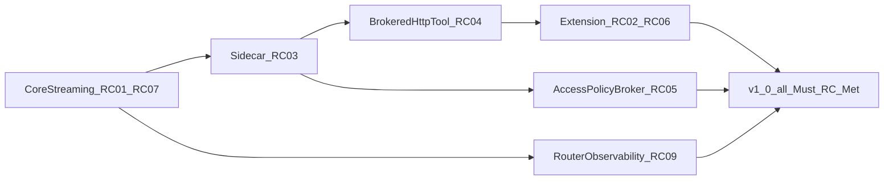

# Roadmap

**Purpose:** track progress until all **Must** release criteria in **[V1_0.md](V1_0.md)** are **Met**. That file is the **only** “done” definition. [PURPOSE_AND_PRINCIPLES.md](PURPOSE_AND_PRINCIPLES.md) states intent; [MVP_SPEC.md](MVP_SPEC.md) is Phase 1 **architecture and scope** (no separate completion status). [PRIORITIZATION.md](PRIORITIZATION.md) describes MoSCoW bucketing and light R-ICE scoring.

**Version:** workspace **`1.0.0`** — all Must **RC-*** in [V1_0.md](V1_0.md) are **Met**.

## Release criteria status

Canonical definitions and evidence: **[V1_0.md](V1_0.md)**. Update status there first, then this mirror.

| ID | Status |
|----|--------|
| RC-01 | Met |
| RC-02 | Met |
| RC-03 | Met |
| RC-04 | Met |
| RC-05 | Met |
| RC-06 | Met |
| RC-07 | Met |
| RC-08 | Met |
| RC-09 | Met |
| RC-10 | Met |

## Theme order (dependency mental model)

## Now — v1.0 Must criteria closed

All Must **RC-*** rows in [V1_0.md](V1_0.md) are **Met**. Follow-up work is **Should** / **Could** / **Later** below.

| Priority | What / why | RC-* | Notes |
|----------|------------|------|-------|
| **Should** | Long-session extension stress | RC-S2 | Cancel-to-idle under load |
| **Should** | Stream/log polish beyond baseline | RC-07 (Met) | Optional hardening only |

## Next — after v1.0 or in parallel if healthy

| Priority | What / why | Source(s) | Notes |
|----------|------------|-----------|--------|
| **Could** | **MCP** interoperability (design accepted; implementation deferred) | [CONTEXT_EFFICIENCY.md](CONTEXT_EFFICIENCY.md), [ADR 0008](architecture/decisions/0008-dedicated-sidecar-control-plane-api.md) | Formal MCP ADR when scheduled |
| **Could** | Learned / small-model compression; batching/async doc jobs | [CONTEXT_EFFICIENCY.md](CONTEXT_EFFICIENCY.md) | Matrix **planned** rows |
| **Could** | Layered prompts (system/project stack) | [CONFIGURATION.md](CONFIGURATION.md) | **planned** |
| **Could** | Difficulty-based routing cascade (ML escalation) | [PLUGIN_ROADMAP.md](PLUGIN_ROADMAP.md), [ADR 0004](architecture/decisions/0004-routing-daemon-first-optional-http-gateway.md) | Beyond **RC-09** env hook |
| **Harness only** | Direct daemon HTTP/mock without sidecar | [MVP_SPEC.md](MVP_SPEC.md) | CI only |

## Later — only if the core path stays healthy

| Priority | What | Source(s) | Notes |
|----------|------|-----------|--------|
| **Could** | L2 **semantic** cache | [CACHING.md](CACHING.md), [PLUGIN_ROADMAP.md](PLUGIN_ROADMAP.md) | Out of v1.0 |
| **Could** | **Apple MLX** local model path | [ARCHITECTURE.md](ARCHITECTURE.md), [MVP_SPEC.md](MVP_SPEC.md) | Post-v1.0 |
| **Later** | More sidecars or gateway adapters | [PLUGIN_ROADMAP.md](PLUGIN_ROADMAP.md), [ADR 0004](architecture/decisions/0004-routing-daemon-first-optional-http-gateway.md) | After router story matures |
| **Won't (now)** | VM/container as **default Mac** sidecar envelope | [AGENT_RUNTIME_ENVIRONMENT.md](AGENT_RUNTIME_ENVIRONMENT.md) | Process + broker instead |

## Engineering backlog (refactor / contract IDs)

| ID | Theme | Priority |
|----|-------|----------|
| R004 | CLI / extension NDJSON seam hardening | Done |
| R005 | Cross-boundary NDJSON conformance tests | Done |
| R007 | Policy engine / cache seams | Done |
| R008 | Centralized agent approvals | Done |
| R009 | Extension contract tests (approval-id, probe recovery) | Done |
| R010 | Broker `fs.write` | Done |
| R011 | Broker `exec.shell` allowlist | Done |
| **R012** | **AccessPolicy broker centralization** (RC-05) | **Done** |

## Parked in design docs

| Topic | When to pull in | Source |
|--------|-----------------|--------|
| **Remote** networking, **TLS**, **production auth** | Operator story + threat model ready | [MVP_SPEC.md](MVP_SPEC.md), [ARCHITECTURE.md](ARCHITECTURE.md) |
| **Wasm** in-process plugins | Sidecar path mature enough to compare | [PLUGIN_ROADMAP.md](PLUGIN_ROADMAP.md) |
| **On-disk** config, **`rex config`**, `.rex.toml` | Precedence specified | [CONFIGURATION.md](CONFIGURATION.md) |
| **Node gRPC `StreamInference`** in extension | New ADR supersedes hybrid policy | [ADR 0007](architecture/decisions/0007-editor-extension-hybrid-transport-cli-and-grpc.md) |
| **Large** multi-plugin orchestration | Single-plugin supervision stable | [PLUGIN_ROADMAP.md](PLUGIN_ROADMAP.md) |
| **Long-term / project memory** | Economics path clear | [LONG_TERM_MEMORY.md](LONG_TERM_MEMORY.md) |
| **VM/container sidecar envelope** (server/fleet) | Linux deployment needs stronger isolation | [AGENT_RUNTIME_ENVIRONMENT.md](AGENT_RUNTIME_ENVIRONMENT.md) |

**CI:** [CI.md](CI.md) — mock / self-contained default; live LLM not required on PRs.

## How to refresh this file

1. Update **[V1_0.md](V1_0.md)** **RC-*** status when a gap closes; mirror the compact table above.
2. Skim [MVP_SPEC.md](MVP_SPEC.md) when **scope** changes; [PLUGIN_ROADMAP.md](PLUGIN_ROADMAP.md), [EXTENSION_ROADMAP.md](EXTENSION_ROADMAP.md) for feature phasing.
3. **New product or feature ideas:** follow [DOCUMENTATION.md — Roadmap and new features](DOCUMENTATION.md#roadmap-and-new-features) (hub first, then row with **Source(s)** link).
4. Re-check [PRIORITIZATION.md](PRIORITIZATION.md) when moving rows.

## Related

- [V1_0.md](V1_0.md) — release criteria (canonical **done**)
- [MVP_SPEC.md](MVP_SPEC.md) — Phase 1 architecture
- [docs/README.md](README.md) — documentation index
- [PRIORITIZATION.md](PRIORITIZATION.md) — bucketing and scoring
