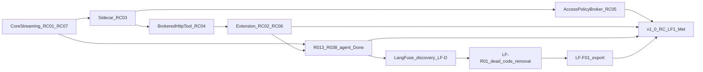

# Roadmap

**Purpose:** track **v1.0 closure** and **Could** follow-ups mapped to **[V1_0.md](V1_0.md)** release criteria. Must **RC-*** remain canonical in that hub. [PURPOSE_AND_PRINCIPLES.md](PURPOSE_AND_PRINCIPLES.md) states intent; [MVP_SPEC.md](MVP_SPEC.md) is Phase 1 **architecture and scope** (no separate completion status). [PRIORITIZATION.md](PRIORITIZATION.md) describes MoSCoW bucketing and light R-ICE scoring.

**Version:** workspace **`1.0.0`** preparatory in [Cargo.toml](../Cargo.toml); **v1.0 not Met** — observability Must **RC-LF1** open ([V1_0.md](V1_0.md)).

## Release criteria status

Canonical definitions and evidence: **[V1_0.md](V1_0.md)**. Update status there first, then this mirror.

| ID | Status |
|----|--------|
| RC-01 | Met |
| RC-02 | Met |
| RC-03 | Met |
| RC-04 | Met |
| RC-05 | Met |
| RC-06 | Met |
| RC-07 | Met |
| RC-08 | Met |
| RC-09 | Met |
| RC-10 | Met |
| RC-S3 | Superseded | Rex-owned store/Grafana — cancelled; see [LANGFUSE_INTEGRATION.md](LANGFUSE_INTEGRATION.md) |
| RC-S4 | Cancelled | CHCE mmap **R043–R049** |
| RC-S5 | Cancelled | Sidecar store API + SSE **R050–R051** |
| **RC-LF1** | Not met | LangFuse Cloud receives Rex economics export — [LANGFUSE_INTEGRATION.md](LANGFUSE_INTEGRATION.md) |

### Should criteria (not blocking `1.0.0`)

| ID | Status | Notes |
|----|--------|-------|
| RC-S1 | Met | Extension `rex.modelId` → `--model` — [EXTENSION_ROADMAP.md](EXTENSION_ROADMAP.md) |
| RC-S2 | Met | Long-session extension stress — cancel returns UI to idle |
| RC-S6 | Met | Opt-in live LLM economics smoke (**R039–R040**) — [ECONOMICS_VALIDATION.md](ECONOMICS_VALIDATION.md) |

## Theme order (dependency mental model)

**Current focus:** LangFuse discovery — **LF-D01** next — [LANGFUSE_DISCOVERY_ROADMAP.md](LANGFUSE_DISCOVERY_ROADMAP.md); [PRIORITIZATION.md — Current focus queue](PRIORITIZATION.md#current-focus-queue-audit-2026-06-09).

## Now — stable baseline

Streaming/agent Must **RC-01–RC-10** are **Met**. Observability Must **RC-LF1** is **open** (v1.0 **not Met**). **RC-S1–RC-S2** and **RC-S6** (extension / validation Should) are **Met**. Product agent program **R013–R038** is **Done**. Rex-owned observability program **R043–R054** is **Cancelled**.

| Priority | What | Notes |
|----------|------|-------|
| **Should** | Optional hardening | Stream/log polish beyond **RC-07** (Met); `cargo-deny`, Semgrep (**R026** Could) |
| **Maintenance** | Extension + release docs | [EXTENSION_ROADMAP.md](EXTENSION_ROADMAP.md) — E-UX01…E-UX11 **Done** |

## Next — prioritized queue (audit 2026-06-09)

Canonical scoring: [PRIORITIZATION.md — Current focus queue](PRIORITIZATION.md#current-focus-queue-audit-2026-06-09). **One PR per row** where feasible; merge-wait between slices.

| Rank | ID / theme | MoSCoW | RC-* | Source(s) | Status |
|------|------------|--------|------|-----------|--------|
| 1 | **LF-D01** — LangFuse Cloud project + OTLP ingest discovery | **Must** | RC-LF1 | [LANGFUSE_DISCOVERY_ROADMAP.md](LANGFUSE_DISCOVERY_ROADMAP.md) | Open |
| 2 | **LF-D02** — economics field mapping | **Must** | RC-LF1 | [LANGFUSE_INTEGRATION.md](LANGFUSE_INTEGRATION.md) | Open |
| 3 | **LF-D09** — v1.0 RC validation (**RC-LF1**) | **Must** | RC-LF1 | [V1_0.md](V1_0.md) | Open |
| 4 | **LF-R01** — remove Rex observability dead code | **Must** | — | [LANGFUSE_INTEGRATION.md](LANGFUSE_INTEGRATION.md) | Open — **after docs pivot merged** |
| 5 | **LF-D03–LF-D08** — parallel discovery spikes | **Should** | — | [LANGFUSE_DISCOVERY_ROADMAP.md](LANGFUSE_DISCOVERY_ROADMAP.md) | Open — **after LF-D01** |
| 6 | **LF-D10** — ADR supersession outline | **Should** | — | [LANGFUSE_DISCOVERY_ROADMAP.md](LANGFUSE_DISCOVERY_ROADMAP.md) | Open |
| 7 | **LF-F01** — daemon OTLP → LangFuse Cloud | **Must** | RC-LF1 | [LANGFUSE_INTEGRATION.md](LANGFUSE_INTEGRATION.md) | Open — **after LF-D01, LF-D02; LF-R01 recommended** |
| 8 | **R039** — opt-in Ollama live smoke | **Should** | RC-S6 | [ECONOMICS_VALIDATION.md](ECONOMICS_VALIDATION.md) | Met (harness shipped) |
| 9 | **R040** — nightly live-smoke workflow | **Should** | RC-S6 | [ECONOMICS_VALIDATION.md](ECONOMICS_VALIDATION.md), [CI.md](CI.md) | Open |
| 10 | **R042** — economics run manifest (LangFuse datasets) | **Could** | — | [ECONOMICS_VALIDATION.md](ECONOMICS_VALIDATION.md) | Open |
| 11 | **R041** — gateway-path live smoke | **Could** | — | [INFERENCE_GATEWAY.md](INFERENCE_GATEWAY.md) | Open |
| 12 | **R026** — Rex guidelines + optional Semgrep | **Could** | — | [CI_QUALITY_GATES.md](CI_QUALITY_GATES.md) | Open |
| 13 | **R036** — TRON static schema compression | **Could** | — | [ADR 0023](architecture/decisions/0023-hybrid-agent-serialization-boundaries.md) | Open |
| 14 | **R033** — MCP gRPC client | **Could** | — | [ADR 0016](architecture/decisions/0016-mcp-in-sidecar-envelope.md) | Open |
| 15 | **R056** — host + capability sidecar fleet | **Could** | — | [CAPABILITY_SIDECARS.md](CAPABILITY_SIDECARS.md) | Open |
| 16 | **R055** — `web.search` via SearXNG capability sidecar | **Could** | — | [WEB_SEARCH.md](WEB_SEARCH.md) | Open — **after R056** |
| 17 | **R016** — multi-active sidecar broadcast | **Could** | — | [ADR 0017](architecture/decisions/0017-single-active-sidecar-phase-1.md) | Deferred — capability fleet is near-term multi-process path |
| 18 | **R057** — parallel read-only tool batching | **Should** | — | [AGENT_GRAPH_ARCHITECTURE.md](AGENT_GRAPH_ARCHITECTURE.md) | Done |
| 19 | **R058** — per-mode step caps + mode prompts | **Should** | — | [PLANNING_TOOLS.md](PLANNING_TOOLS.md), [OPERATION_FEEDBACK.md](OPERATION_FEEDBACK.md) | Done |
| 20 | **R059** — `workspace.search` broker | **Should** | — | [AGENT_ACCESS_POLICY.md](AGENT_ACCESS_POLICY.md) | Open — **after R058** |
| 21 | **R060** — deterministic ask init + loop circuit breaker | **Must** | — | [AGENT_GRAPH_ARCHITECTURE.md](AGENT_GRAPH_ARCHITECTURE.md#loop-optimization-r060r065) | Open |
| 22 | **R061** — exact-match tool cache | **Should** | — | [AGENT_GRAPH_ARCHITECTURE.md](AGENT_GRAPH_ARCHITECTURE.md#loop-optimization-r060r065) | **Done** |
| 23 | **R062** — prefix-safe compaction config | **Should** | — | [AGENT_GRAPH_ARCHITECTURE.md](AGENT_GRAPH_ARCHITECTURE.md#loop-optimization-r060r065) | **Done** |
| 24 | **R063** — soft cap Continue UX | **Should** | — | [AGENT_GRAPH_ARCHITECTURE.md](AGENT_GRAPH_ARCHITECTURE.md#loop-optimization-r060r065) | **Done** |
| 25 | **R064** — loop observability + golden prompts | **Should** | — | [ECONOMICS_VALIDATION.md](ECONOMICS_VALIDATION.md) | **Done** |
| 26 | **R065** — injected files manifest | **Could** | — | [DEVELOPMENT_ASSISTANCE_CAPABILITIES.md](DEVELOPMENT_ASSISTANCE_CAPABILITIES.md) | Open — **after R064** |

### LangFuse integration (RC-LF1)

Hub: [LANGFUSE_INTEGRATION.md](LANGFUSE_INTEGRATION.md). Discovery: [LANGFUSE_DISCOVERY_ROADMAP.md](LANGFUSE_DISCOVERY_ROADMAP.md). Economics validation: [ECONOMICS_VALIDATION.md](ECONOMICS_VALIDATION.md).

| RC-* | Theme | Status |
|------|-------|--------|
| **RC-LF1** | LangFuse Cloud receives Rex daemon economics export (OTLP); operator can inspect traces in Cloud UI | **Not met** — discovery + **LF-F01** |
| **RC-S6** | Live LLM smoke (**R039–R040**) | **Met** / **R040** open |

### Cancelled — Rex-owned observability (RC-S3–S5, R043–R054)

Superseded by LangFuse-primary stance ([LANGFUSE_INTEGRATION.md](LANGFUSE_INTEGRATION.md)). Shipped code remains until **LF-R01**.

| Former RC / ID | Status |
|----------------|--------|
| **RC-S3** | **Superseded** |
| **RC-S4**, **R043–R049** | **Cancelled** — [CHCE_ROADMAP.md](CHCE_ROADMAP.md) |
| **RC-S5**, **R050–R051** | **Cancelled** |
| **R052–R054** | **Cancelled** |

### Done — product agent program

Canonical design: [AGENT_DELIVERY_ROADMAP.md](AGENT_DELIVERY_ROADMAP.md). **`rex-agent`** shipped; **`rex-sidecar-stub`** = CI/harness default.

**Done:** **R013–R022**, **R017–R019**, **R027–R032**, **R034**, **R031**, **R037**, **R038**, **R023–R025**. **Could follow-ups only:** **R016**, **R033**, **R036**.

## Later — only if the core path stays healthy

| Priority | What | Source(s) | Notes |
|----------|------|-----------|--------|
| **Could** | L2 **semantic** cache | [CACHING.md](CACHING.md), [PLUGIN_ROADMAP.md](PLUGIN_ROADMAP.md) | Out of v1.0 |
| **Could** | **Apple MLX** local model path | [ADAPTERS.md](ADAPTERS.md#local-mlx-path-planned) | Post-v1.0 |
| **Could** | Native Anthropic Messages adapter (secondary) | [ADAPTERS.md](ADAPTERS.md#direct-anthropic-messages-api-planned--secondary), [ADR 0018](architecture/decisions/0018-gateway-first-multi-provider-inference.md) | After LiteLLM profile |
| **Could** | Gateway adapters beyond broker HTTP | [PLUGIN_ROADMAP.md](PLUGIN_ROADMAP.md), [ADR 0004](architecture/decisions/0004-routing-daemon-first-optional-http-gateway.md) | After router story matures |
| **Could** | Vendor KV / prompt cache hints | [CACHING.md](CACHING.md#vendor-kv-and-prompt-cache-hints-planned) | Depends on outbound API |
| **Could** | **LF-F02–LF-F07** LangFuse features | [LANGFUSE_INTEGRATION.md](LANGFUSE_INTEGRATION.md) | After **LF-F01** |
| **Won't (now)** | VM/container as **default Mac** sidecar envelope | [AGENT_RUNTIME_ENVIRONMENT.md](AGENT_RUNTIME_ENVIRONMENT.md) | Process + broker instead |
| **Won't (now)** | Self-hosted LangFuse on Mac | [LANGFUSE_INTEGRATION.md](LANGFUSE_INTEGRATION.md) | Cloud default |

## Engineering backlog (refactor / contract IDs)

| ID | Theme | Priority |
|----|-------|----------|
| R004 | CLI / extension NDJSON seam hardening | Done |
| R005 | Cross-boundary NDJSON conformance tests | Done |
| R007 | Policy engine / cache seams | Done |
| R008 | Centralized agent approvals | Done |
| R009 | Extension contract tests (approval-id, probe recovery) | Done |
| R010 | Broker `fs.write` | Done |
| R011 | Broker `exec.shell` allowlist | Done |
| **R012** | **AccessPolicy broker centralization** (RC-05) | **Done** |
| **R013** | Platform enablers (`BrokerListDir`, `RunTurn.model`, stream passthrough) | Done |
| **R014** | Unified `rex` CLI | Done |
| **R015** | JSON config + `rex proto install` | Done |
| **R016** | Multi-active sidecar broadcast | Could — deferred |
| **R017–R038** | Product agent program | **Done** — see [AGENT_DELIVERY_ROADMAP.md](AGENT_DELIVERY_ROADMAP.md) |
| **R023–R025** | Supply chain / SAST / Ruff | **Done** |
| **R026** | Rex-specific guidelines + optional Semgrep | Could |
| **R039** | Ollama live smoke harness | **Should** — **Met** |
| **R040** | Nightly live-LLM workflow | **Should** — Open |
| **R041–R042** | Gateway smoke / run manifest | Could |
| **R044** | Operation feedback during daemon execution | **Done** — [OPERATION_FEEDBACK.md](OPERATION_FEEDBACK.md) |
| **R055** | `web.search` via SearXNG capability sidecar | Could — **after R056** — [WEB_SEARCH.md](WEB_SEARCH.md) |
| **R056** | Host + capability sidecar fleet | Could — [CAPABILITY_SIDECARS.md](CAPABILITY_SIDECARS.md) |
| **R043–R054** | CHCE / Rex observability store program | **Cancelled** — [LANGFUSE_INTEGRATION.md](LANGFUSE_INTEGRATION.md) |
| **LF-R01** | Remove Rex observability dead code | **Must** — after docs pivot merge |
| **LF-F01–LF-F07** | LangFuse integration features | **Should** — post-discovery |

## Parked in design docs

| Topic | When to pull in | Source |
|--------|-----------------|--------|
| **Remote** networking, **TLS**, **production auth** | Operator story + threat model ready | [MVP_SPEC.md](MVP_SPEC.md), [ARCHITECTURE.md](ARCHITECTURE.md) |
| **Wasm** in-process plugins | Sidecar path mature | [PLUGIN_ROADMAP.md](PLUGIN_ROADMAP.md) |
| **Node gRPC `StreamInference`** in extension | New ADR supersedes hybrid policy | [ADR 0007](architecture/decisions/0007-editor-extension-hybrid-transport-cli-and-grpc.md) |
| **Long-term / project memory** | After benchmark gate | [LONG_TERM_MEMORY.md](LONG_TERM_MEMORY.md) |
| **Agent knowledge** | After R015 | [AGENT_KNOWLEDGE.md](AGENT_KNOWLEDGE.md) |
| **MCP in sidecar** | Deferred | [ADR 0016](architecture/decisions/0016-mcp-in-sidecar-envelope.md) |
| **Capability sidecar fleet + web search** | After **RC-LF1** headroom | [CAPABILITY_SIDECARS.md](CAPABILITY_SIDECARS.md), [WEB_SEARCH.md](WEB_SEARCH.md) |
| **LangFuse integration** | **Active** — discovery **LF-D01** | [LANGFUSE_INTEGRATION.md](LANGFUSE_INTEGRATION.md), [LANGFUSE_DISCOVERY_ROADMAP.md](LANGFUSE_DISCOVERY_ROADMAP.md) |
| ~~**Rex-owned observability suite**~~ | **Cancelled** — removal **LF-R01** | [OBSERVABILITY_AND_ECONOMICS.md](OBSERVABILITY_AND_ECONOMICS.md) (superseded) |
| ~~**CHCE mmap program**~~ | **Cancelled** | [CHCE_ROADMAP.md](CHCE_ROADMAP.md) |

**CI:** [CI.md](CI.md) — **RC-10** Met; live smoke **R039** Met; **R040** open.

## How to refresh this file

1. Update **[V1_0.md](V1_0.md)** **RC-*** status when a gap closes; mirror the compact table above.
2. Skim [MVP_SPEC.md](MVP_SPEC.md) when **scope** changes.
3. **New product features:** hub first — [DOCUMENTATION.md](DOCUMENTATION.md#roadmap-and-new-features).
4. Re-check [PRIORITIZATION.md](PRIORITIZATION.md) when moving rows.

### Prioritization audit (2026-06-09)

Pivot: Rex-owned observability (**R043–R054**, **RC-S3–S5**) **cancelled**; **LangFuse Cloud** primary ([LANGFUSE_INTEGRATION.md](LANGFUSE_INTEGRATION.md)). **Next slice:** **LF-D01**. **v1.0 tag** blocked on **RC-LF1**. Prior audit: 2026-06-07.

## Related

- [V1_0.md](V1_0.md) — release criteria (canonical **done**)
- [LANGFUSE_INTEGRATION.md](LANGFUSE_INTEGRATION.md) — LangFuse hub
- [LANGFUSE_DISCOVERY_ROADMAP.md](LANGFUSE_DISCOVERY_ROADMAP.md) — discovery queue
- [docs/README.md](README.md) — documentation index
- [PRIORITIZATION.md](PRIORITIZATION.md) — bucketing and scoring
