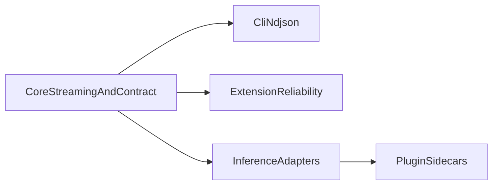

# Roadmap (study project, consolidated)

Rex is a **learning lab** and **small, testable reference** for local daemon + gRPC + thin clients ([README.md](../README.md)). This file is a **short** “what to explore next” view; deeper design is in the linked docs. [PRIORITIZATION.md](PRIORITIZATION.md) describes **light** bucketing and R-ICE-style scoring for ordering ideas.

**Spec and extension:** [MVP_SPEC.md](MVP_SPEC.md) defines the **Phase 1** protocol slice, including **enableable** default **inference plugins** (mock default, **Cursor CLI** to forward prompts); the [VS Code / Cursor extension](EXTENSION_ROADMAP.md) implements the `rex-cli` NDJSON path in the editor. Cross-links between those docs keep scope clear.

## What we are learning toward (right now)

**Primary focus:** a **reliable** local path: **daemon** on a **UDS**, **gRPC** streaming, **NDJSON** for tools, **mock** inference by default, and enough **tests and docs** to repeat the same run. **MVP** also includes the **enableable** **Cursor CLI** inference plugin (prompt forwarding) as the **minimum** for **AI-assisted** `rex` development; automation keeps **mock** unless opt-in. Build toward **local-first execution** by improving context quality-per-token and escalating to stronger runtimes only for harder tasks. **Optional** add-ons (for example layered cache beyond what ships) stay **documented, incremental, and compatible** with the default loop and with [CI](CI.md) expectations.

## Theme order (rough dependency mental model)

## Now — what matters first

| Priority | What / why | Source(s) | “Done enough” for a study cut | Where to work |
|----------|------------|-----------|--------------------------------|---------------|
| **Must** | UDS + gRPC + streaming **correct** under bad paths (races, cancel, errors) | [MVP_SPEC.md](MVP_SPEC.md), [ARCHITECTURE.md](ARCHITECTURE.md) | E2E/unit coverage + [CI](CI.md) green | daemon, rex-proto, rex-cli |
| **Must** | `rex-cli complete --format ndjson` stays line-safe and has **one** terminal event | [MVP_SPEC.md](MVP_SPEC.md), [EXTENSION_MVP.md](EXTENSION_MVP.md) | Tests + `MVP_SPEC` checklist | rex-cli, docs |
| **Must** | IDE dogfooding loop stays usable: develop `rex` via the extension without leaving the editor path | [MVP_SPEC.md](MVP_SPEC.md), [EXTENSION_ROADMAP.md](EXTENSION_ROADMAP.md) | Local E2E run confirms send/cancel/retry/status flow remains stable for normal coding sessions | extension, rex-cli, daemon |
| **Must** | **Default inference plugins:** mock default; **Cursor CLI** enableable, **forwards prompts**, bounded and terminal-correct for NDJSON | [MVP_SPEC.md](MVP_SPEC.md), [PLUGIN_ROADMAP.md](PLUGIN_ROADMAP.md), [ADAPTERS.md](ADAPTERS.md) | `REX_INFERENCE_RUNTIME=cursor-cli` path documented and testable locally; default **CI** remains **mock** per [DEPENDENCIES.md](DEPENDENCIES.md) | daemon |
| **Should** | Logs you can **read** when something fails (trace, terminal paths) | [ARCHITECTURE.md](ARCHITECTURE.md) | No silent hang; enough context to debug | daemon |
| **Should** | Extension chat stays **usable** (cancel, status, clean return to idle) | [EXTENSION_ROADMAP.md](EXTENSION_ROADMAP.md) | “What remains” shrinks without breaking NDJSON | `extensions/rex-vscode` |

**Scope note (Must — core stream):** If an inference runtime omits the final `done` chunk, the daemon now yields a terminal gRPC error with a clear message. `rex-cli` has unit coverage for the NDJSON invariant (at most one `done` or `error` event per successful parse in sample outputs). Deeper UDS and interrupt coverage remains in [CI](CI.md) and `crates/rex-daemon/tests/uds_e2e.rs`. Remaining **Should** work (readability of logs, extension polish, adapter bounds) is tracked in the same table.

**Scope note (Should — observability / extension):** Daemon **startup and stream** stdout use `inference_runtime` and `stream.terminal` (and related) fields; [ARCHITECTURE.md](ARCHITECTURE.md) lists grep examples. The **Cursor CLI** (MVP) adapter surfaces **timeout** and **spawn** hints that point at [CONFIGURATION.md](CONFIGURATION.md); [ADAPTERS.md](ADAPTERS.md) documents **local verification** (UDS E2E can use a `printf` stub; real `cursor-agent` is optional for machines that have it). Extension **cancel and single terminal event** behavior is covered by local tests; long-running session stress remains a follow-up (see [EXTENSION_ROADMAP.md](EXTENSION_ROADMAP.md)).

**Scope note (operator path):** [README.md](../README.md) documents the **MVP local operator path**; [CI.md](CI.md) points at **local MVP preflight** via [scripts/verify_mvp_local.sh](../scripts/verify_mvp_local.sh); [EXTENSION_LOCAL_E2E.md](EXTENSION_LOCAL_E2E.md) covers install, `install-cli.sh --print-bin-path`, and editor verification; the extension contributes a **Get Started** walkthrough (see [EXTENSION_ROADMAP.md](EXTENSION_ROADMAP.md)). Track progress here and in those linked docs—**not** in committed per-PR or per-merge-train files (see **How to refresh** below).

## Next — good follow-on topics (not all are started)

| Priority | What / why | Source(s) | “Done enough” (examples) | Where to work |
|----------|------------|-----------|---------------------------|---------------|
| **Should** | L1 **exact** response cache (safe modes) | [PLUGIN_ROADMAP.md](PLUGIN_ROADMAP.md), [CACHING.md](CACHING.md) | In-memory LRU + `l1_cache=hit` in daemon logs; **agent** / **plan** not served from L1 | daemon (`l1_cache` module) |
| **Should** | Optional **mode/model** on the wire and CLI, backward compatible | [PLUGIN_ROADMAP.md](PLUGIN_ROADMAP.md), [ADAPTERS.md](ADAPTERS.md) | Proto + `rex-cli` flags; [CONFIGURATION.md](CONFIGURATION.md) | `proto/`, `rex-proto`, `rex-cli`, daemon |
| **Should** | Adaptive retrieval gate: retrieve only when needed, then expand context progressively | [CONTEXT_EFFICIENCY.md](CONTEXT_EFFICIENCY.md), [PLUGIN_ROADMAP.md](PLUGIN_ROADMAP.md) | Lower average context tokens with no quality regression on local eval set | daemon + sidecar plugin |
| **Should** | Query-aware prompt/context compression before local inference | [CONTEXT_EFFICIENCY.md](CONTEXT_EFFICIENCY.md), [ADAPTERS.md](ADAPTERS.md) | Fewer input tokens per request while preserving terminal correctness and answer utility | daemon + sidecar plugin |
| **Could** | Difficulty-based routing cascade (small local model first, escalate only hard tasks) | [PLUGIN_ROADMAP.md](PLUGIN_ROADMAP.md), [ARCHITECTURE.md](ARCHITECTURE.md) | Local-first path handles bounded tasks; escalation policy is explicit and testable | daemon + sidecar plugin |
| **Could** | **One** sidecar / plugin process supervised by the daemon | [PLUGIN_ROADMAP.md](PLUGIN_ROADMAP.md), [MVP_SPEC.md](MVP_SPEC.md) (sidecar sketch) | 0 or 1 plugin, clear errors | daemon |
| **Could** | **Context** pipeline / token-budget per [CONTEXT_EFFICIENCY.md](CONTEXT_EFFICIENCY.md) | [CONTEXT_EFFICIENCY.md](CONTEXT_EFFICIENCY.md) | Respects adapter capabilities; docs stay true | daemon |

**Scope note (Next — L1 and mode/model):** [CACHING.md](CACHING.md) and [CONFIGURATION.md](CONFIGURATION.md) track behavior; the editor extension can pass `--model` / `--mode` in a follow-up if needed (CLI supports them; NDJSON line shape unchanged).

**Scope note (Next — optimization evidence):** prioritize context-quality-per-token work backed by current evidence: adaptive retrieval ([Self-RAG](https://arxiv.org/abs/2310.11511)), prompt compression ([LLMLingua](https://arxiv.org/abs/2310.05736)), and context-order sensitivity in long prompts ([Lost in the Middle](https://aclanthology.org/2024.tacl-1.9/)). For routing/cascades, use budgeted model escalation patterns ([A Unified Approach to Routing and Cascading for LLMs](https://proceedings.mlr.press/v267/dekoninck25a.html)).

## Later — only if the core path stays healthy

| Priority | What | Source(s) | Notes |
|----------|------|-----------|--------|
| **Could** | L2 **semantic** cache, careful | [CACHING.md](CACHING.md), [PLUGIN_ROADMAP.md](PLUGIN_ROADMAP.md) | Can stay off a long time |
| **Could** | **Apple MLX** local model path | [ARCHITECTURE.md](ARCHITECTURE.md), [MVP_SPEC.md](MVP_SPEC.md) | Post-“core is boring” |
| **Could** | More sidecars, hybrid routing | [PLUGIN_ROADMAP.md](PLUGIN_ROADMAP.md) | When one-plugin story exists |

## Parked in design docs

| Topic | When to pull into planning | Source |
|--------|---------------------------|--------|
| **Remote** networking, **TLS**, **production auth** as a first-class product | **Operator story and threat model** are in place | [MVP_SPEC.md](MVP_SPEC.md), [ARCHITECTURE.md](ARCHITECTURE.md) |
| **Wasm** in-process plugins | **gRPC sidecar** path is mature enough to compare | [PLUGIN_ROADMAP.md](PLUGIN_ROADMAP.md) |
| **On-disk** config, **`rex config`**, file precedence beyond env | **Precedence and migration** are specified and testable | [CONFIGURATION.md](CONFIGURATION.md) |
| **Node gRPC** in the extension (vs `rex-cli`) | Extension **Non-goals** in the design are revisited | [EXTENSION_ROADMAP.md](EXTENSION_ROADMAP.md) **Non-goals** |
| **Large** multi-plugin orchestration | **Single-plugin** supervision is stable and documented | [PLUGIN_ROADMAP.md](PLUGIN_ROADMAP.md) |

**CI:** Default automation follows [CI.md](CI.md) with **mock** / self-contained checks. **Cursor CLI** on shared runners is in scope for **required** jobs when [DEPENDENCIES.md](DEPENDENCIES.md) and the workflow **define** that path.

## How to refresh this file

Do this when **you** change direction or complete a chunk you care about (no fixed schedule required).

1. Skim the **source** docs you touched: at least [MVP_SPEC.md](MVP_SPEC.md), [ARCHITECTURE.md](ARCHITECTURE.md), [PLUGIN_ROADMAP.md](PLUGIN_ROADMAP.md), [EXTENSION_ROADMAP.md](EXTENSION_ROADMAP.md).
2. If two sources disagree, trust the **more specific** one (for example extension behavior → [EXTENSION_ROADMAP.md](EXTENSION_ROADMAP.md)). If it still confuses a future reader, add **one** line under **Scope note** or here.
3. Every row above (except this list) should **link** to a design file. New ideas get a home in a design doc first, then a row with a link.
4. Optionally re-check buckets with [PRIORITIZATION.md](PRIORITIZATION.md) when you add or move a row.
5. **Do not** add files to the repository whose only purpose is to describe a specific GitHub PR, branch name, or numbered merge step. Use the PR on GitHub, a local `TEMP_*` or gitignored handoff file (see the root [`.gitignore`](../.gitignore)), or `/tmp` for disposable PR bodies and checklists.

## Related

- [docs/README.md](README.md) — full documentation index
- [PRIORITIZATION.md](PRIORITIZATION.md) — bucketing and light scoring
