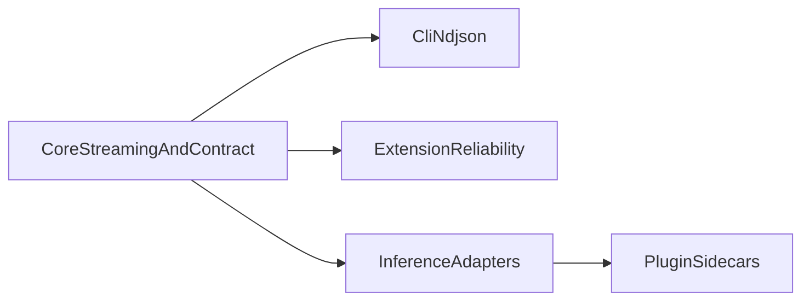

# Roadmap (study project, consolidated)

Rex is a **learning lab** and **small, testable reference** for local daemon + gRPC + thin clients ([README.md](../README.md)). This file is a **short** “what to explore next” view; deeper design is in the linked docs. [PRIORITIZATION.md](PRIORITIZATION.md) describes **light** bucketing and R-ICE-style scoring for ordering ideas.

**Spec and extension:** [MVP_SPEC.md](../MVP_SPEC.md) defines the **Phase 1** protocol slice; the [VS Code / Cursor extension](EXTENSION_ROADMAP.md) implements the `rex-cli` NDJSON path in the editor. Cross-links between those docs keep scope clear.

## What we are learning toward (right now)

**Primary focus:** a **reliable** local path: **daemon** on a **UDS**, **gRPC** streaming, **NDJSON** for tools, **mock** inference by default, and enough **tests and docs** to repeat the same run. **Optional** paths (for example `REX_INFERENCE_RUNTIME=cursor-cli`, layered cache) stay **documented, incremental, and compatible** with the default loop and with [CI](CI.md) expectations.

## Theme order (rough dependency mental model)

## Now — what matters first

| Priority | What / why | Source(s) | “Done enough” for a study cut | Where to work |
|----------|------------|-----------|--------------------------------|---------------|
| **Must** | UDS + gRPC + streaming **correct** under bad paths (races, cancel, errors) | [MVP_SPEC.md](../MVP_SPEC.md), [ARCHITECTURE.md](../ARCHITECTURE.md) | E2E/unit coverage + [CI](CI.md) green | daemon, rex-proto, rex-cli |
| **Must** | `rex-cli complete --format ndjson` stays line-safe and has **one** terminal event | [MVP_SPEC.md](../MVP_SPEC.md), [EXTENSION_MVP.md](EXTENSION_MVP.md) | Tests + `MVP_SPEC` checklist | rex-cli, docs |
| **Should** | Logs you can **read** when something fails (trace, terminal paths) | [ARCHITECTURE.md](../ARCHITECTURE.md) | No silent hang; enough context to debug | daemon |
| **Should** | Extension chat stays **usable** (cancel, status, clean return to idle) | [EXTENSION_ROADMAP.md](EXTENSION_ROADMAP.md) | “What remains” shrinks without breaking NDJSON | `extensions/rex-vscode` |
| **Should** | Optional **Cursor CLI** path stays **bounded** (time limit, clear errors) | [PLUGIN_ROADMAP.md](PLUGIN_ROADMAP.md), [ADAPTERS.md](ADAPTERS.md), [CONFIGURATION.md](CONFIGURATION.md) | **Local** try path documented; **CI** stays **mock**-first per [DEPENDENCIES.md](DEPENDENCIES.md) | daemon |

## Next — good follow-on topics (not all are started)

| Priority | What / why | Source(s) | “Done enough” (examples) | Where to work |
|----------|------------|-----------|---------------------------|---------------|
| **Should** | L1 **exact** response cache (safe modes) | [PLUGIN_ROADMAP.md](PLUGIN_ROADMAP.md), [CACHING.md](CACHING.md) | Observable hit path where implemented; **agent** path follows [CACHING.md](CACHING.md) safety rules | daemon |
| **Should** | Optional **mode/model** on the wire and CLI, backward compatible | [PLUGIN_ROADMAP.md](PLUGIN_ROADMAP.md), [ADAPTERS.md](ADAPTERS.md) | Old clients work; [CONFIGURATION.md](CONFIGURATION.md) updated | rex-proto, rex-cli, daemon |
| **Could** | **One** sidecar / plugin process supervised by the daemon | [PLUGIN_ROADMAP.md](PLUGIN_ROADMAP.md), [MVP_SPEC.md](../MVP_SPEC.md) (sidecar sketch) | 0 or 1 plugin, clear errors | daemon |
| **Could** | **Context** pipeline / token-budget per [CONTEXT_EFFICIENCY.md](CONTEXT_EFFICIENCY.md) | [CONTEXT_EFFICIENCY.md](CONTEXT_EFFICIENCY.md) | Respects adapter capabilities; docs stay true | daemon |

## Later — only if the core path stays healthy

| Priority | What | Source(s) | Notes |
|----------|------|-----------|--------|
| **Could** | L2 **semantic** cache, careful | [CACHING.md](CACHING.md), [PLUGIN_ROADMAP.md](PLUGIN_ROADMAP.md) | Can stay off a long time |
| **Could** | **Apple MLX** local model path | [ARCHITECTURE.md](../ARCHITECTURE.md), [MVP_SPEC.md](../MVP_SPEC.md) | Post-“core is boring” |
| **Could** | More sidecars, hybrid routing | [PLUGIN_ROADMAP.md](PLUGIN_ROADMAP.md) | When one-plugin story exists |

## Parked in design docs

| Topic | When to pull into planning | Source |
|--------|---------------------------|--------|
| **Remote** networking, **TLS**, **production auth** as a first-class product | **Operator story and threat model** are in place | [MVP_SPEC.md](../MVP_SPEC.md), [ARCHITECTURE.md](../ARCHITECTURE.md) |
| **Wasm** in-process plugins | **gRPC sidecar** path is mature enough to compare | [PLUGIN_ROADMAP.md](PLUGIN_ROADMAP.md) |
| **On-disk** config, **`rex config`**, file precedence beyond env | **Precedence and migration** are specified and testable | [CONFIGURATION.md](CONFIGURATION.md) |
| **Node gRPC** in the extension (vs `rex-cli`) | Extension **Non-goals** in the design are revisited | [EXTENSION_ROADMAP.md](EXTENSION_ROADMAP.md) **Non-goals** |
| **Large** multi-plugin orchestration | **Single-plugin** supervision is stable and documented | [PLUGIN_ROADMAP.md](PLUGIN_ROADMAP.md) |

**CI:** Default automation follows [CI.md](CI.md) with **mock** / self-contained checks. **Cursor CLI** on shared runners is in scope for **required** jobs when [DEPENDENCIES.md](DEPENDENCIES.md) and the workflow **define** that path.

## How to refresh this file

Do this when **you** change direction or complete a chunk you care about (no fixed schedule required).

1. Skim the **source** docs you touched: at least [MVP_SPEC.md](../MVP_SPEC.md), [ARCHITECTURE.md](../ARCHITECTURE.md), [PLUGIN_ROADMAP.md](PLUGIN_ROADMAP.md), [EXTENSION_ROADMAP.md](EXTENSION_ROADMAP.md).
2. If two sources disagree, trust the **more specific** one (for example extension behavior → [EXTENSION_ROADMAP.md](EXTENSION_ROADMAP.md)). If it still confuses a future reader, add **one** line under **Scope note** or here.
3. Every row above (except this list) should **link** to a design file. New ideas get a home in a design doc first, then a row with a link.
4. Optionally re-check buckets with [PRIORITIZATION.md](PRIORITIZATION.md) when you add or move a row.

## Related

- [docs/README.md](README.md) — full documentation index
- [PRIORITIZATION.md](PRIORITIZATION.md) — bucketing and light scoring
