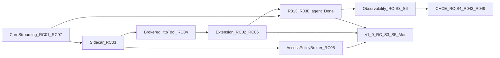

# Roadmap

**Purpose:** track **v1.0 closure** and **Could** follow-ups mapped to **[V1_0.md](V1_0.md)** release criteria. Must **RC-*** remain canonical in that hub. [PURPOSE_AND_PRINCIPLES.md](PURPOSE_AND_PRINCIPLES.md) states intent; [MVP_SPEC.md](MVP_SPEC.md) is Phase 1 **architecture and scope** (no separate completion status). [PRIORITIZATION.md](PRIORITIZATION.md) describes MoSCoW bucketing and light R-ICE scoring.

**Version:** workspace **`1.0.0`** preparatory in [Cargo.toml](../Cargo.toml); **v1.0 not Met** — observability Must **RC-S3–RC-S5** open ([V1_0.md](V1_0.md)).

## Release criteria status

Canonical definitions and evidence: **[V1_0.md](V1_0.md)**. Update status there first, then this mirror.

| ID | Status |
|----|--------|
| RC-01 | Met |
| RC-02 | Met |
| RC-03 | Met |
| RC-04 | Met |
| RC-05 | Met |
| RC-06 | Met |
| RC-07 | Met |
| RC-08 | Met |
| RC-09 | Met |
| RC-10 | Met |
| RC-S3 | Partial | Observability baseline — [OBSERVABILITY_AND_ECONOMICS.md](OBSERVABILITY_AND_ECONOMICS.md) |
| RC-S4 | Not met | CHCE mmap Program A (**R043–R049**) — [CHCE_ROADMAP.md](CHCE_ROADMAP.md) |
| RC-S5 | Not met | Sidecar observability API + SSE live tail (**R050–R051**) |

### Should criteria (not blocking `1.0.0`)

| ID | Status | Notes |
|----|--------|-------|
| RC-S1 | Met | Extension `rex.modelId` → `--model` — [EXTENSION_ROADMAP.md](EXTENSION_ROADMAP.md) |
| RC-S2 | Met | Long-session extension stress — cancel returns UI to idle |
| RC-S6 | Not met | Opt-in live LLM economics smoke (**R039–R040**) — [ECONOMICS_VALIDATION.md](ECONOMICS_VALIDATION.md) |

## Theme order (dependency mental model)

**Current focus:** Close observability Must **RC-S3–RC-S5** for v1.0 tag — see [PRIORITIZATION.md — Current focus queue](PRIORITIZATION.md#current-focus-queue-audit-2026-06-07).

## Now — stable baseline

Streaming/agent Must **RC-01–RC-10** are **Met**. Observability Must **RC-S3–RC-S5** are **open** (v1.0 **not Met**). **RC-S1–RC-S2** (extension Should) are **Met**. Product agent program **R013–R038** is **Done**.

| Priority | What | Notes |
|----------|------|-------|
| **Should** | Optional hardening | Stream/log polish beyond **RC-07** (Met); `cargo-deny`, Semgrep (**R026** Could) |
| **Maintenance** | Extension + release docs | [EXTENSION_ROADMAP.md](EXTENSION_ROADMAP.md) — E-UX01…E-UX11 **Done** |

## Next — prioritized queue (audit 2026-06-07)

Canonical scoring: [PRIORITIZATION.md — Current focus queue](PRIORITIZATION.md#current-focus-queue-audit-2026-06-07). **One PR per row** where feasible; merge-wait between slices.

| Rank | ID / theme | MoSCoW | RC-* | Source(s) | Status |
|------|------------|--------|------|-----------|--------|
| 1 | **R043** — CHCE `StorePort` + engine dispatch | **Must** | RC-S4 | [CHCE_ROADMAP.md](CHCE_ROADMAP.md) | Open |
| 2 | **RC-S3** — observability baseline gaps (Phase 2 OTLP, read API rollups) | **Must** | RC-S3 | [OBSERVABILITY_AND_ECONOMICS.md](OBSERVABILITY_AND_ECONOMICS.md) | **Partial** |
| 3 | **R044** — CHCE hot-path `LiveRingBuffer` | **Must** | RC-S4 | [CHCE_ROADMAP.md](CHCE_ROADMAP.md) | Open — **after R043** |
| 4 | **R045** — CHCE global dictionary | **Must** | RC-S4 | [CHCE_ROADMAP.md](CHCE_ROADMAP.md) | Open |
| 5 | **R046** — CHCE page seal pipeline | **Must** | RC-S4 | [CHCE_ROADMAP.md](CHCE_ROADMAP.md) | Open |
| 6 | **R047** — CHCE write API parity | **Must** | RC-S4 | [CHCE_ROADMAP.md](CHCE_ROADMAP.md) | Open |
| 7 | **R048** — CHCE historical read parity | **Must** | RC-S4 | [CHCE_ROADMAP.md](CHCE_ROADMAP.md) | Open |
| 8 | **R049** — CHCE verification harness | **Must** | RC-S4 | [CHCE_ROADMAP.md](CHCE_ROADMAP.md) | Open |
| 9 | **R050** — SSE live tail (read API) | **Must** | RC-S5 | [OBS_READ_API.md](OBS_READ_API.md), [CHCE_ROADMAP.md](CHCE_ROADMAP.md) | Open — **after R049** |
| 10 | **R051** — sparse trace index + spans | **Must** | RC-S5 | [CHCE_ROADMAP.md](CHCE_ROADMAP.md) | Open |
| 11 | **R039** — opt-in Ollama live smoke (`ask` + brokered read/policy) | **Should** | RC-S6 | [ECONOMICS_VALIDATION.md](ECONOMICS_VALIDATION.md) | Open |
| 12 | **R040** — nightly live-smoke workflow (non-blocking) | **Should** | RC-S6 | [ECONOMICS_VALIDATION.md](ECONOMICS_VALIDATION.md), [CI.md](CI.md) | Open — **after R039** |
| 13 | **R042** — economics run manifest from harness | **Could** | — | [ECONOMICS_VALIDATION.md](ECONOMICS_VALIDATION.md) | Open — **after R039** |
| 14 | **R041** — gateway-path live smoke | **Could** | — | [INFERENCE_GATEWAY.md](INFERENCE_GATEWAY.md) | Open |
| 15 | **R026** — Rex guidelines + optional Semgrep | **Could** | — | [CI_QUALITY_GATES.md](CI_QUALITY_GATES.md) | Open |
| 16 | **R036** — TRON static schema compression | **Could** | — | [ADR 0023](architecture/decisions/0023-hybrid-agent-serialization-boundaries.md) | Open |
| 17 | **R033** — MCP gRPC client | **Could** | — | [ADR 0016](architecture/decisions/0016-mcp-in-sidecar-envelope.md) | Open |
| 18 | **R016** — multi-active sidecar broadcast | **Could** | — | [ADR 0017](architecture/decisions/0017-single-active-sidecar-phase-1.md) | Deferred |

### Observability suite (RC-S3–RC-S6)

Hub: [OBSERVABILITY_AND_ECONOMICS.md](OBSERVABILITY_AND_ECONOMICS.md). **CHCE** program: [CHCE_ROADMAP.md](CHCE_ROADMAP.md). Live validation: [ECONOMICS_VALIDATION.md](ECONOMICS_VALIDATION.md).

| RC-* | Theme | Shipped | Open |
|------|-------|---------|------|
| **RC-S3** | SQLite store, read API, `rex obs up`, Grafana plugin | Phases 3, 5; partial Phase 2 + 4 | OTLP completeness; rollups; operator Grafana binary (doc-only for Phase 4) |
| **RC-S4** | CHCE mmap Program A (**R043–R049**) | Design + fail-closed dispatch | Implementation |
| **RC-S5** | Sidecar observability API + SSE (**R050–R051**) | — | Phase 6 |
| **RC-S6** | Live LLM smoke (**R039–R040**) | Operator script pattern ([`verify_native_tools_live.sh`](../scripts/verify_native_tools_live.sh)) | **R039** harness; **R040** nightly |

### Done — product agent program

Canonical design: [AGENT_DELIVERY_ROADMAP.md](AGENT_DELIVERY_ROADMAP.md). **`rex-agent`** shipped; **`rex-sidecar-stub`** = CI/harness default.

**Done:** **R013–R022**, **R017–R019**, **R027–R032**, **R034**, **R031**, **R037**, **R038**, **R023–R025**. **Could follow-ups only:** **R016**, **R033**, **R036**.

## Later — only if the core path stays healthy

| Priority | What | Source(s) | Notes |
|----------|------|-----------|--------|
| **Could** | L2 **semantic** cache | [CACHING.md](CACHING.md), [PLUGIN_ROADMAP.md](PLUGIN_ROADMAP.md) | Out of v1.0 |
| **Could** | **Apple MLX** local model path | [ADAPTERS.md](ADAPTERS.md#local-mlx-path-planned) | Post-v1.0 |
| **Could** | Native Anthropic Messages adapter (secondary) | [ADAPTERS.md](ADAPTERS.md#direct-anthropic-messages-api-planned--secondary), [ADR 0018](architecture/decisions/0018-gateway-first-multi-provider-inference.md) | After LiteLLM profile; broker dispatch + `anthropic` runtime |
| **Could** | Gateway adapters beyond broker HTTP | [PLUGIN_ROADMAP.md](PLUGIN_ROADMAP.md), [ADR 0004](architecture/decisions/0004-routing-daemon-first-optional-http-gateway.md) | After router story matures; multi-sidecar broadcast → **R016** |
| **Could** | Vendor KV / prompt cache hints | [CACHING.md](CACHING.md#vendor-kv-and-prompt-cache-hints-planned) | Depends on outbound API owning runtime |
| **Won't (now)** | VM/container as **default Mac** sidecar envelope | [AGENT_RUNTIME_ENVIRONMENT.md](AGENT_RUNTIME_ENVIRONMENT.md) | Process + broker instead |

## Engineering backlog (refactor / contract IDs)

| ID | Theme | Priority |
|----|-------|----------|
| R004 | CLI / extension NDJSON seam hardening | Done |
| R005 | Cross-boundary NDJSON conformance tests | Done |
| R007 | Policy engine / cache seams | Done |
| R008 | Centralized agent approvals | Done |
| R009 | Extension contract tests (approval-id, probe recovery) | Done |
| R010 | Broker `fs.write` | Done |
| R011 | Broker `exec.shell` allowlist | Done |
| **R012** | **AccessPolicy broker centralization** (RC-05) | **Done** |
| **R013** | Platform enablers (`BrokerListDir`, `RunTurn.model`, stream passthrough) | Done |
| **R014** | Unified `rex` CLI (replace `rex-cli` / `rex-daemon`) | Done |
| **R015** | JSON config + `rex proto install` + `proto.gen_root` | Done |
| **R016** | Multi-active sidecar broadcast | Could — deferred Phase 1 per [ADR 0017](architecture/decisions/0017-single-active-sidecar-phase-1.md) |
| **R017** | `rex-agent` scaffold (gRPC + broker client) | Done |
| **R018** | LangGraph agent core (ReAct, broker tools) | **Done** — [sidecars/rex-agent/DESIGN.md](../sidecars/rex-agent/DESIGN.md) |
| **R019** | Integration / E2E (operator path, extension defaults) | **Done** |
| **R020** | Broker access policy completion (ADR 0013; follows R012) | **Done** — [POLICY_ENGINE.md](POLICY_ENGINE.md), [AGENT_ACCESS_POLICY.md](AGENT_ACCESS_POLICY.md) |
| **R021** | Turn correlation Phase 1b (`turn_id`, `context_revision`) | **Done** — [DEVELOPMENT_ASSISTANCE_CAPABILITIES.md](DEVELOPMENT_ASSISTANCE_CAPABILITIES.md) |
| **R022** | Workspace binding product path (fail-closed daemon) | **Done** — [ADR 0011](architecture/decisions/0011-workspace-binding-and-turn-context-authority.md) |
| **R027** | Broker baseline hardening (`RexBrokerChatModel`) | **Done** — [AGENT_GRAPH_ARCHITECTURE.md](AGENT_GRAPH_ARCHITECTURE.md) |
| **R028** | Viewer/Editor subagent topology | **Done** — [ADR 0022](architecture/decisions/0022-viewer-editor-subagent-topology.md) |
| **R029** | Intra-turn state compaction + microcompaction tier | **Done** — [AGENT_GRAPH_ARCHITECTURE.md](AGENT_GRAPH_ARCHITECTURE.md) |
| **R034** | Raw delimited tool results | **Done** — [ADR 0023](architecture/decisions/0023-hybrid-agent-serialization-boundaries.md) |
| **R030** | Diff-only writes (sidecar patch path) | **Done** — [AGENT_GRAPH_ARCHITECTURE.md](AGENT_GRAPH_ARCHITECTURE.md) |
| **R031** | Task-aware read pruning | **Done** — [AGENT_GRAPH_ARCHITECTURE.md](AGENT_GRAPH_ARCHITECTURE.md) |
| **R032** | Token playbook + prefix SHA metrics | **Done** — [AGENT_GRAPH_ARCHITECTURE.md](AGENT_GRAPH_ARCHITECTURE.md) |
| **R036** | TRON static schema compression | Could — [ADR 0023](architecture/decisions/0023-hybrid-agent-serialization-boundaries.md) |
| **R033** | MCP gRPC client | Could — [ADR 0016](architecture/decisions/0016-mcp-in-sidecar-envelope.md) |
| **R038** | Native broker tool calling (`tools[]` / `tool_calls` on `BrokerInference`) | **Done** — [NATIVE_TOOL_CALLING.md](NATIVE_TOOL_CALLING.md) |
| **R023** | Supply chain: `cargo-audit`, Dependabot | **Done** — [CI_QUALITY_GATES.md](CI_QUALITY_GATES.md); `cargo-deny` deferred |
| **R024** | Security SAST: CodeQL (primary) | **Done** — [CI_QUALITY_GATES.md](CI_QUALITY_GATES.md), [`.github/workflows/codeql.yml`](../.github/workflows/codeql.yml) |
| **R025** | `rex-agent` static analysis: Ruff | **Done** — [CI_QUALITY_GATES.md](CI_QUALITY_GATES.md) |
| **R026** | Rex-specific guidelines + optional Semgrep | Could — [CI_QUALITY_GATES.md](CI_QUALITY_GATES.md) |
| **R039** | Ollama live smoke harness (direct HTTP; `ask` + brokered read/policy) | **Should** — [ECONOMICS_VALIDATION.md](ECONOMICS_VALIDATION.md); excludes plan tool-loop |
| **R040** | Nightly live-LLM workflow (informational; non-blocking) | **Should** — [ECONOMICS_VALIDATION.md](ECONOMICS_VALIDATION.md) |
| **R041** | Gateway-path live smoke (same scenarios as **R039**) | Could — [INFERENCE_GATEWAY.md](INFERENCE_GATEWAY.md) |
| **R042** | Economics run manifest from harness | Could — [ECONOMICS_VALIDATION.md](ECONOMICS_VALIDATION.md) |
| **R043** | CHCE `StorePort` + engine dispatch | **Should** — [CHCE_ROADMAP.md](CHCE_ROADMAP.md) |
| **R044** | CHCE hot-path `LiveRingBuffer` | **Should** — [CHCE_ROADMAP.md](CHCE_ROADMAP.md) |
| **R045** | CHCE global dictionary | **Should** — [CHCE_ROADMAP.md](CHCE_ROADMAP.md) |
| **R046** | CHCE page seal pipeline | **Should** — [CHCE_ROADMAP.md](CHCE_ROADMAP.md) |
| **R047** | CHCE write API parity | **Should** — [CHCE_ROADMAP.md](CHCE_ROADMAP.md) |
| **R048** | CHCE historical read parity | **Should** — [CHCE_ROADMAP.md](CHCE_ROADMAP.md) |
| **R049** | CHCE verification harness | **Should** — [CHCE_ROADMAP.md](CHCE_ROADMAP.md) |
| **R050** | CHCE SSE live tail | **Should** — RC-S5 — [CHCE_ROADMAP.md](CHCE_ROADMAP.md) |
| **R051** | CHCE sparse trace index + spans | **Should** — RC-S5 — [CHCE_ROADMAP.md](CHCE_ROADMAP.md) |
| **R052** | CHCE v2 codecs + benchmarks | Could — [CHCE_ROADMAP.md](CHCE_ROADMAP.md) |
| **R053** | CHCE retention + Parquet export | Could — [CHCE_ROADMAP.md](CHCE_ROADMAP.md) |
| **R054** | CHCE default engine promotion | Could — [CHCE_ROADMAP.md](CHCE_ROADMAP.md) |

## Parked in design docs

| Topic | When to pull in | Source |
|--------|-----------------|--------|
| **Remote** networking, **TLS**, **production auth** | Operator story + threat model ready | [MVP_SPEC.md](MVP_SPEC.md), [ARCHITECTURE.md](ARCHITECTURE.md) |
| **Wasm** in-process plugins | Sidecar path mature enough to compare | [PLUGIN_ROADMAP.md](PLUGIN_ROADMAP.md) |
| ~~JSON config via **R015**~~ | **Landed** — see engineering backlog **R015** Done | [AGENT_DELIVERY_ROADMAP.md](AGENT_DELIVERY_ROADMAP.md), [CONFIGURATION.md](CONFIGURATION.md) |
| **Node gRPC `StreamInference`** in extension | New ADR supersedes hybrid policy | [ADR 0007](architecture/decisions/0007-editor-extension-hybrid-transport-cli-and-grpc.md) |
| **Large** multi-plugin orchestration | Single-plugin supervision stable | [PLUGIN_ROADMAP.md](PLUGIN_ROADMAP.md) |
| **Long-term / project memory** | ADR 0014 accepted; implement after benchmark gate | [LONG_TERM_MEMORY.md](LONG_TERM_MEMORY.md), [ADR 0014](architecture/decisions/0014-long-term-memory-boundary.md) |
| **Agent knowledge** (curated docs for AI, remote/MCP) | ADR 0015 accepted; implement after R015 | [AGENT_KNOWLEDGE.md](AGENT_KNOWLEDGE.md), [ADR 0015](architecture/decisions/0015-agent-knowledge-bundles.md) |
| **MCP in sidecar** | ADR 0016 accepted; implementation deferred | [ADR 0016](architecture/decisions/0016-mcp-in-sidecar-envelope.md) |
| **Development assistance capabilities** (turn contract, budget pipeline) | Design hub + ADRs 0011–0017 | [DEVELOPMENT_ASSISTANCE_CAPABILITIES.md](DEVELOPMENT_ASSISTANCE_CAPABILITIES.md) |
| **Token-efficient agent graph** (Viewer/Editor, serialization, compaction) | Design accepted; **R027–R036** | [AGENT_GRAPH_ARCHITECTURE.md](AGENT_GRAPH_ARCHITECTURE.md), [ADR 0022](architecture/decisions/0022-viewer-editor-subagent-topology.md), [ADR 0023](architecture/decisions/0023-hybrid-agent-serialization-boundaries.md) |
| **Observability suite + economics validation** | **Active** — v1.0 blocked on **RC-S3–RC-S5**; **R043** next — [PRIORITIZATION.md](PRIORITIZATION.md#current-focus-queue-audit-2026-06-07) | [OBSERVABILITY_AND_ECONOMICS.md](OBSERVABILITY_AND_ECONOMICS.md), [CHCE_ROADMAP.md](CHCE_ROADMAP.md), [ECONOMICS_VALIDATION.md](ECONOMICS_VALIDATION.md) |
| ~~**CHCE mmap economics store**~~ | **Active program** — see **Next — CHCE mmap observability store** and [CHCE_ROADMAP.md](CHCE_ROADMAP.md) | [OBS_STORE_MMAP_FORMAT.md](OBS_STORE_MMAP_FORMAT.md), [ADR 0025](architecture/decisions/0025-dual-economics-store-engines.md), [ADR 0027](architecture/decisions/0027-chce-columnar-mmap-engine.md) |
| **VM/container sidecar envelope** (server/fleet) | Linux deployment needs stronger isolation | [AGENT_RUNTIME_ENVIRONMENT.md](AGENT_RUNTIME_ENVIRONMENT.md) |

**CI:** [CI.md](CI.md) — shipped gates (mock / self-contained default; live LLM not required on PRs — **RC-10**). **Planned:** live smoke tier **R039–R040**; [CI_QUALITY_GATES.md](CI_QUALITY_GATES.md) (**R026**; **R023–R025** Done).

## How to refresh this file

1. Update **[V1_0.md](V1_0.md)** **RC-*** status when a gap closes; mirror the compact table above.
2. Skim [MVP_SPEC.md](MVP_SPEC.md) when **scope** changes; [PLUGIN_ROADMAP.md](PLUGIN_ROADMAP.md), [EXTENSION_ROADMAP.md](EXTENSION_ROADMAP.md), [CHCE_ROADMAP.md](CHCE_ROADMAP.md) for feature phasing.
3. **New product or feature ideas:** follow [DOCUMENTATION.md — Roadmap and new features](DOCUMENTATION.md#roadmap-and-new-features) (hub first, then row with **Source(s)** link).
4. Re-check [PRIORITIZATION.md](PRIORITIZATION.md) when moving rows.

### Prioritization audit (2026-06-07)

Full reprioritization against [PRIORITIZATION.md](PRIORITIZATION.md): MoSCoW labels, R-ICE scores for **Should** ties, **RC-S3–RC-S6** alignment, hub links, economics-matrix coherence. **Next slice:** **R043** (CHCE `StorePort`). **v1.0 tag** blocked on **RC-S3–RC-S5** Must rows. Prior audit: 2026-05-23.

## Related

- [V1_0.md](V1_0.md) — release criteria (canonical **done**)
- [MVP_SPEC.md](MVP_SPEC.md) — Phase 1 architecture
- [docs/README.md](README.md) — documentation index
- [PRIORITIZATION.md](PRIORITIZATION.md) — bucketing and scoring
