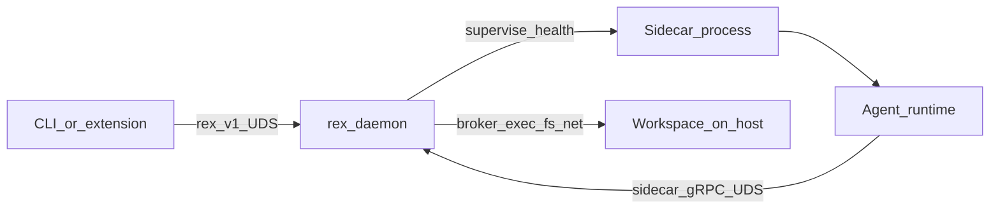

# Sidecar runtime (design hub)

Canonical design for Rex **sidecar agents**: a **supervised separate process** on the same Mac as `rex-daemon`, **not** a VM. The **IDE development assistant depends on this process** for agent behavior — see [MVP_SPEC.md](MVP_SPEC.md). **Implementation:** supervisor, `rex.sidecar.v1`, brokered HTTP inference, and `BrokerReadFile` are **implemented** — see [MVP_SPEC.md](MVP_SPEC.md) and [CONFIGURATION.md](CONFIGURATION.md) (`REX_SIDECAR_*`).

## Role in the architecture

| Component | Responsibility |
|-----------|----------------|
| **`rex-daemon`** | Economics, stream authority for `rex.v1` clients, policy, spawn/health, **capability broker**. |
| **Sidecar process** | Agent runtime (graph, prompts, MCP/tool wiring) in an isolated envelope. |
| **Clients** (CLI, extension) | **`rex.v1` over UDS** only — unchanged. |

## Multi-language plugins

Rex does **not** embed every agent stack in Rust. Each plugin is a **host process** started with the right **interpreter or binary**:

| Packaging | Example spawn |
|-----------|----------------|
| **Interpreter + entry** | `python3 -m rex_agent_plugin` |
| **Node** | `node dist/sidecar/main.js` |
| **Native binary** | `./rex-sidecar-plugin` |

The daemon validates **compatibility metadata** (OS, arch, min runtime version) at startup — see [DEPENDENCIES.md](DEPENDENCIES.md) plugin layer.

**Wire contract:** language-neutral **protobuf + gRPC** (design package name **`rex.sidecar.v1`** — spec deferred to implementation PR). Generated stubs per language; same pattern as `rex.v1` / `rex-proto`.

## Transport (same Mac, same kernel)

| Link | Transport |
|------|-----------|
| Client ↔ daemon | gRPC over UDS (`/tmp/rex.sock` — product default) |
| Sidecar ↔ daemon | gRPC over **UDS** on a dedicated socket path (for example `/tmp/rex-sidecar.sock`) |

Cross-VM bridging (loopback TCP, vsock) applies only if a **future server** envelope uses a different kernel — not the Mac-first path. See [AGENT_RUNTIME_ENVIRONMENT.md](AGENT_RUNTIME_ENVIRONMENT.md) deferred catalog.

## Supervision (0 or 1 process)

Per [PLUGIN_ROADMAP.md](PLUGIN_ROADMAP.md):

- Daemon supervises **zero or one** active plugin process.
- Health probes, timeouts, restart policy, graceful degraded mode when sidecar absent.

## Sandbox and broker

| Mechanism | Purpose |
|-----------|---------|
| **Optional OS sandbox** | Restrict the sidecar child process (no ambient host FS/net). |
| **Daemon broker** | Satisfy dev-agent needs: workspace shell, file access, network under [AGENT_ACCESS_POLICY.md](AGENT_ACCESS_POLICY.md). |

Agent code runs **inside** the sidecar; **real work** on the host goes through **authorized RPC** to the daemon.

## Agent inside the sidecar

- Reasoning graph, tool loop, and (later) MCP servers live in the guest process.
- Inference **intent** is expressed via sidecar API; **stream authority** for `rex.v1` clients remains daemon-side per [ADR 0008](architecture/decisions/0008-dedicated-sidecar-control-plane-api.md).
- The extension is **not** the agent — it only renders streams and enforces UX policy.

## MVP sidecar slice (Phase 1)

Minimum to satisfy [MVP_SPEC.md](MVP_SPEC.md):

| Requirement | Acceptance |
|-------------|------------|
| Supervision | Daemon spawns **0 or 1** sidecar; health probes; clear error if sidecar required but down |
| **`rex.sidecar.v1`** | Versioned API on dedicated UDS (e.g. `/tmp/rex-sidecar.sock`) — distinct from `rex.v1` |
| **Single-turn agent** | `RunTurn` (name illustrative): prompt + mode → streamed text deltas to daemon |
| **Brokered inference** | Sidecar requests completion; daemon invokes HTTP OpenAI-compat backend ([ADAPTERS.md](ADAPTERS.md)) |
| **Brokered tool** | At least **`fs.read`** under workspace policy ([AGENT_ACCESS_POLICY.md](AGENT_ACCESS_POLICY.md)) |

### Illustrative MVP verbs

| Verb | Purpose |
|------|---------|
| `Health` / `GetCapabilities` | Supervision and advertised features |
| `RunTurn` | One agent turn; stream assistant text to daemon |
| Inference broker RPC | Folded into `RunTurn` or separate `RequestInference` — implementation choice |
| Tool broker RPC | `RequestTool` with capability `fs.read` for MVP |

Proto package **`rex.sidecar.v1`** lands in an implementation PR; this hub defines intent only.

## Plugin manifest (intent)

| Field | Meaning |
|-------|---------|
| `command` | argv to exec sidecar process |
| `api_socket` | UDS path for gRPC |
| `health` | probe interval / timeout |
| `proto_version` | `rex.sidecar.v1` compatibility |
| `runtime_requires` | Python/Node version, arch |

## Non-goals (this hub)

- Shipping Firecracker/Colima as Rex’s default Mac envelope.
- Widening `rex.v1` for sidecar tunnels.
- Multi-plugin sprawl without operator demand.

## Planned: sidecar author quickstart (R015–R017)

**Not shipped.** Target operator flow for a Python sidecar such as **`rex-agent`**:

1. **`rex config init`** — create `$REX_HOME/config.json` with sidecar list and `proto.gen_root`.
2. **`rex proto install`** — materialize `{gen_root}/python/` stubs from repo protos.
3. Set **`sidecars.active`** to the sidecar name; daemon supervises that binary on startup.
4. Sidecar imports generated stubs from **`proto.gen_root`** only — no per-sidecar proto path in config.

Full design: [AGENT_DELIVERY_ROADMAP.md](AGENT_DELIVERY_ROADMAP.md). Today use **`REX_SIDECAR_*`** env vars and **`rex-sidecar-stub`**.

## Related

- [AGENT_ACCESS_POLICY.md](AGENT_ACCESS_POLICY.md) · [POLICY_ENGINE.md](POLICY_ENGINE.md)
- [ADR 0005](architecture/decisions/0005-rex-owns-sidecar-environment-not-agent-implementations.md) · [ADR 0008](architecture/decisions/0008-dedicated-sidecar-control-plane-api.md)
- [PLUGIN_ROADMAP.md](PLUGIN_ROADMAP.md) · [AGENT_DELIVERY_ROADMAP.md](AGENT_DELIVERY_ROADMAP.md) · [AGENT_RUNTIME_ENVIRONMENT.md](AGENT_RUNTIME_ENVIRONMENT.md)
