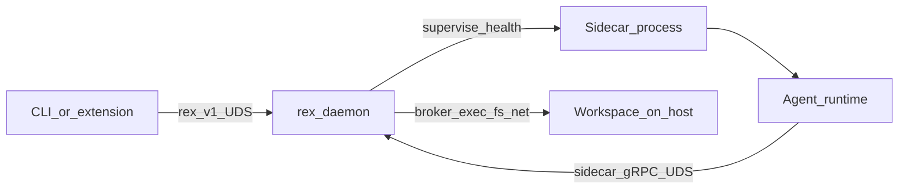

# Sidecar runtime (design hub)

Canonical design for Rex **sidecar agents**: a **supervised separate process** on the same Mac as `rex-daemon`, **not** a VM. The **IDE development assistant depends on this process** for agent behavior — see [MVP_SPEC.md](MVP_SPEC.md). **Implementation:** supervisor, `rex.sidecar.v1`, brokered HTTP inference, and `BrokerReadFile` are **implemented** — configure via JSON (`sidecars` in `$REX_ROOT/config.json`); legacy `REX_SIDECAR_*` env is deprecated — [CONFIGURATION.md](CONFIGURATION.md).

## Role in the architecture

| Component | Responsibility |
|-----------|----------------|
| **`rex-daemon`** | Economics, stream authority for `rex.v1` clients, policy, spawn/health, **capability broker**. |
| **Sidecar process** | Agent runtime (graph, prompts, MCP/tool wiring) in an isolated envelope. |
| **Clients** (CLI, extension) | **`rex.v1` over UDS** only — unchanged. |

**Non-goal:** The **Inference Gateway** (LiteLLM HTTP proxy) is **not** a sidecar plugin — it does not use `rex.sidecar.v1` or `sidecars.list`. Daemon supervises the gateway under `inference.gateway.*` when opted in. See [INFERENCE_GATEWAY.md](INFERENCE_GATEWAY.md), [ADR 0019](architecture/decisions/0019-inference-gateway-opt-in-litellm.md).

## Multi-language plugins

Rex does **not** embed every agent stack in Rust. Each plugin is a **host process** started with the right **interpreter or binary**:

| Packaging | Example spawn |
|-----------|----------------|
| **Interpreter + entry** | `python3 -m rex_agent_plugin` |
| **Node** | `node dist/sidecar/main.js` |
| **Native binary** | `./rex-sidecar-plugin` |

The daemon validates **compatibility metadata** (OS, arch, min runtime version) at startup — see [DEPENDENCIES.md](DEPENDENCIES.md) plugin layer.

**Wire contract:** language-neutral **protobuf + gRPC** (design package name **`rex.sidecar.v1`** — spec deferred to implementation PR). Generated stubs per language; same pattern as `rex.v1` / `rex-proto`.

## Transport (same Mac, same kernel)

| Link | Transport |
|------|-----------|
| Client ↔ daemon | gRPC over UDS (`daemon.socket` in JSON, default `/tmp/rex.sock`; bootstrap may use `REX_DAEMON_SOCKET`) |
| Sidecar ↔ daemon (broker) | gRPC over **sidecar control-plane UDS** (for example `/tmp/rex-sidecar.sock`) |
| Sidecar ↔ daemon (observability, planned) | **`SidecarObservabilityService`** on **daemon UDS** (`REX_DAEMON_SOCKET`) — not the sidecar socket |

Cross-VM bridging (loopback TCP, vsock) applies only if a **future server** envelope uses a different kernel — not the Mac-first path. See [AGENT_RUNTIME_ENVIRONMENT.md](AGENT_RUNTIME_ENVIRONMENT.md) deferred catalog.

## Supervision (host + capability sidecars)

**Shipped today:** daemon supervises **zero or one** host sidecar (`sidecars.active`). **Planned:** **one host** + **0..N capability** sidecars — [CAPABILITY_SIDECARS.md](CAPABILITY_SIDECARS.md), [ADR 0028](architecture/decisions/0028-host-and-capability-sidecar-fleet.md) (**R056**).

Per [PLUGIN_ROADMAP.md](PLUGIN_ROADMAP.md):

- Health probes, timeouts, restart policy, graceful degraded mode when host sidecar absent.

## Sandbox and broker

| Mechanism | Purpose |
|-----------|---------|
| **Optional OS sandbox** | Restrict the sidecar child process (no ambient host FS/net). |
| **Daemon broker** | Satisfy dev-agent needs: workspace shell, file access, network under [AGENT_ACCESS_POLICY.md](AGENT_ACCESS_POLICY.md). |

Agent code runs **inside** the sidecar; **real work** on the host goes through **authorized RPC** to the daemon.

## Agent inside the sidecar

- Reasoning graph, tool loop, and (later) MCP servers live in the guest process.
- Inference **intent** is expressed via sidecar API; **stream authority** for `rex.v1` clients remains daemon-side per [ADR 0008](architecture/decisions/0008-dedicated-sidecar-control-plane-api.md).
- The extension is **not** the agent — it only renders streams and enforces UX policy.

## MVP sidecar slice (Phase 1)

Minimum to satisfy [MVP_SPEC.md](MVP_SPEC.md):

| Requirement | Acceptance |
|-------------|------------|
| Supervision | Daemon spawns **0 or 1** sidecar; health probes; clear error if sidecar required but down |
| **`rex.sidecar.v1`** | Versioned API on dedicated UDS (e.g. `/tmp/rex-sidecar.sock`) — distinct from `rex.v1` |
| **Single-turn agent** | `RunTurn` (name illustrative): prompt + mode → streamed text deltas to daemon |
| **Brokered inference** | Sidecar requests completion; daemon invokes HTTP OpenAI-compat backend ([ADAPTERS.md](ADAPTERS.md)) |
| **Brokered tool** | At least **`fs.read`** under workspace policy ([AGENT_ACCESS_POLICY.md](AGENT_ACCESS_POLICY.md)) |

### Illustrative MVP verbs

| Verb | Purpose |
|------|---------|
| `Health` / `GetCapabilities` | Supervision and advertised features |
| `RunTurn` | One agent turn; stream assistant text to daemon |
| `RegisterMetric` / `RecordMetric` | Custom metrics via daemon OTLP export — **planned** ([ADR 0010](architecture/decisions/0010-daemon-exports-observability-via-otel-and-sidecar-api.md)) |
| `GetEconomicsSnapshot` | Bounded recent Rex economics for in-agent adaptation — **planned** |
| `ReportResourceStats` | Optional sidecar self-reported resource stats — **planned** |
| Inference broker RPC | Folded into `RunTurn` or separate `RequestInference` — implementation choice |
| Tool broker RPC | `RequestTool` with capability `fs.read` for MVP |

Proto package **`rex.sidecar.v1`** — broker RPCs on the sidecar socket; **`SidecarObservabilityService`** on daemon UDS lands in a dedicated implementation PR. See [OBSERVABILITY_AND_ECONOMICS.md](OBSERVABILITY_AND_ECONOMICS.md).

## Observability (sidecar → daemon)

Sidecars produce custom metrics **through the daemon**, not via a separate observability sidecar (**planned**):

1. Sidecar opens gRPC to **daemon UDS** (`REX_DAEMON_SOCKET`) and calls `SidecarObservabilityService.RegisterMetric`, then `RecordMetric`.
2. Daemon aggregates and exports on the same OTLP stream as daemon economics (`rex.sidecar.custom.*`).
3. Optional: sidecar calls `GetEconomicsSnapshot` on **daemon UDS** to read recent cache/route/token summaries for agent logic.

Broker RPCs (`RunTurn`, inference, tools) stay on the **sidecar control-plane socket**; observability RPCs use **daemon UDS** only — [ADR 0010](architecture/decisions/0010-daemon-exports-observability-via-otel-and-sidecar-api.md).

Operator setup: [OBSERVABILITY_INTEGRATIONS.md](OBSERVABILITY_INTEGRATIONS.md).

## Plugin manifest (intent)

| Field | Meaning |
|-------|---------|
| `command` | argv to exec sidecar process |
| `api_socket` | UDS path for gRPC |
| `health` | probe interval / timeout |
| `proto_version` | `rex.sidecar.v1` compatibility |
| `runtime_requires` | Python/Node version, arch |

## Non-goals (this hub)

- Shipping Firecracker/Colima as Rex’s default Mac envelope.
- Widening `rex.v1` for sidecar tunnels.
- Multi-plugin sprawl without operator demand.

## Sidecar author quickstart (`rex-agent` scaffold — R017)

**`rex-agent`** is shipped under [sidecars/rex-agent/](../sidecars/rex-agent/) (**R019** Done). **`rex-sidecar-stub`** remains the harness/CI default (explicit in tests); **`rex config init`** writes the **operator template** with **`rex-agent`** active and **mock web search** enabled. Install scripts attempt `rex-agent` setup by default; the extension merges agent settings into project `.rex/config.json` on workspace bind.

1. **`rex config init`** — create `$REX_ROOT/config.json` (layout root **`REX_ROOT`**, default `~/.rex`).
2. **`rex proto install`** — materialize Python stubs under `$REX_ROOT/proto/gen` (flat layout; not `gen/python/`).
3. **`./scripts/install-agent-sidecar.sh`** — venv at `$REX_ROOT/venv` and `~/.cargo/bin/rex-agent` wrapper (or maintainer: `pip install -e` with Python **>= 3.10**, or the repo [launcher](../sidecars/rex-agent/rex-agent)).
4. Add a `sidecars.list` entry with `"binary": "rex-agent"` and set **`sidecars.active`** to that name when dogfooding.

Broker calls from Python use `grpc.default_authority=localhost` on daemon UDS (interop with tonic). See [sidecars/rex-agent/README.md](../sidecars/rex-agent/README.md).

Full program: [AGENT_DELIVERY_ROADMAP.md](AGENT_DELIVERY_ROADMAP.md).

## R031 acceptance — task-aware read pruning (operator, not CI)

1. Set `"read_pruning_enabled": true` under `agent` in merged JSON ([CONFIGURATION.md](CONFIGURATION.md)).
2. Run **`rex-agent`** in **agent** mode against a workspace file with **>100 lines**.
3. Confirm tool output in the stream includes a `[pruned read:` prefix and fewer lines than the raw file.

## Related

- [AGENT_ACCESS_POLICY.md](AGENT_ACCESS_POLICY.md) · [POLICY_ENGINE.md](POLICY_ENGINE.md)
- [OBSERVABILITY_AND_ECONOMICS.md](OBSERVABILITY_AND_ECONOMICS.md) · [OBSERVABILITY_INTEGRATIONS.md](OBSERVABILITY_INTEGRATIONS.md) · [ADR 0010](architecture/decisions/0010-daemon-exports-observability-via-otel-and-sidecar-api.md)
- [ADR 0005](architecture/decisions/0005-rex-owns-sidecar-environment-not-agent-implementations.md) · [ADR 0008](architecture/decisions/0008-dedicated-sidecar-control-plane-api.md)
- [PLUGIN_ROADMAP.md](PLUGIN_ROADMAP.md) · [AGENT_DELIVERY_ROADMAP.md](AGENT_DELIVERY_ROADMAP.md) · [CAPABILITY_SIDECARS.md](CAPABILITY_SIDECARS.md) · [AGENT_RUNTIME_ENVIRONMENT.md](AGENT_RUNTIME_ENVIRONMENT.md)
