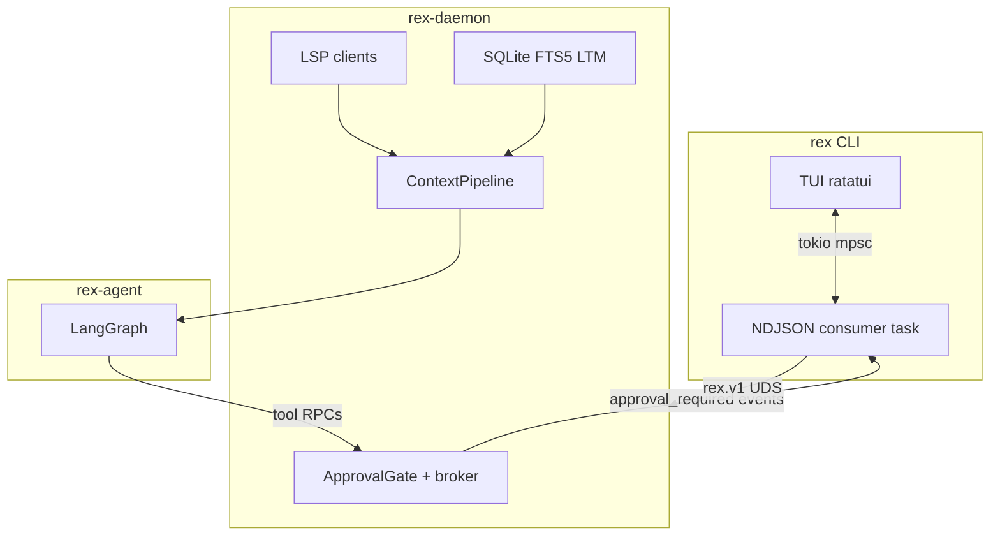
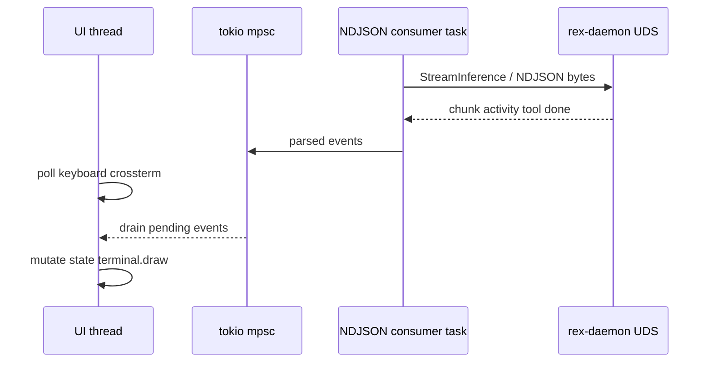
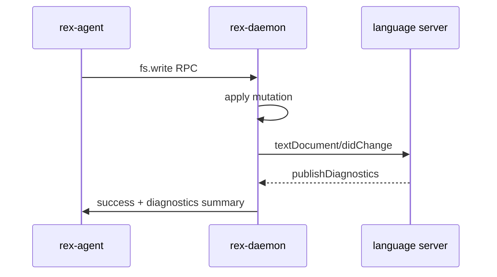

# Terminal harness architecture

> Role: explanation | Status: design accepted | Audience: contributors | Read when: terminal harness architecture
> Prefer: ## Purpose

**Status:** `design accepted` — implementation **R072–R073** planned; v2 daemon intelligence **R076–R078** Later. Product UX: [CLI_OPERATOR_UX.md](CLI_OPERATOR_UX.md). Decision record: [ADR 0039](architecture/decisions/0039-terminal-harness-presentation-and-daemon-intelligence.md).

## Purpose

Define the **technical architecture** for Rex’s terminal-first harness: how the CLI presentation layer consumes the NDJSON stream, renders a high-performance TUI, and stays decoupled from daemon-managed intelligence (LSP, memory, git policy, MCP approvals).

## Scope

**In:**

- Rendering stack (`ratatui`, `crossterm`, `mdstream`, synchronized output).
- Async message-passing topology between NDJSON consumer and UI thread.
- NDJSON → state machine → pane mapping.
- Architecture option C (presentation + daemon intelligence).
- Feature mappings for git broker, LSP, MCP, LTM, model hot-swap.
- Anti-patterns, risks, testing strategy, decision checklist.

**Out:**

- Full product UX copy (see [CLI_OPERATOR_UX.md](CLI_OPERATOR_UX.md)).
- Competitor comparative tables (external research repository).
- Implementation code in `crates/rex-cli/`.

## State-of-the-art harness traits

Modern terminal harnesses share characteristics Rex adopts within brokered-trust constraints:

| # | Trait | Rex mapping |
|---|-------|-------------|
| 1 | Incremental markdown rendering (O(1) tail updates) | **`mdstream`** committed/pending blocks in Output pane |
| 2 | Synchronized terminal output (`?2026`) | Optional via **`cli.ui.sync_output`** |
| 3 | Brokered git discipline before mutative edits | Daemon **`git.auto_commit_dirty`** interceptor (**R077**) |
| 4 | LSP-fed diagnostics in context pipeline | Daemon-owned LSP clients (**R076**) |
| 5 | Graph-ranked / semantic repo mapping | Existing indexer + future LSP references |
| 6 | Tiered, mid-session permission mutations | `ask` / `plan` / `agent` + **`Ctrl+Y`** bypass |
| 7 | Protocol-agnostic tool extensibility (MCP) | Sidecar envelope + daemon **`ApprovalGate`** (**R078**) |
| 8 | Bounded episodic and semantic memory | FTS5 in **`.rex/`** per workspace ([LONG_TERM_MEMORY.md](LONG_TERM_MEMORY.md)) |
| 9 | Progressive skill / capability disclosure | Daemon context pipeline stages |
| 10 | Decoupled presentation and execution | Long-lived daemon; TUI is ephemeral client |

## Accepted architecture (Option C)

Three options were evaluated:

| Option | Summary | Verdict |
|--------|---------|---------|
| **A** — Pure NDJSON consumer | TUI wraps subprocess only; zero business logic | Too rigid for approvals, model picker, memory search |
| **B** — Enriched CLI + local LSP | LSP in CLI process | Fragments intelligence; automation clients lose LSP |
| **C** — Presentation + daemon intelligence | TUI + gRPC client; daemon owns LSP, memory, git, MCP policy | **Accepted** |

**Rationale:** Any client connecting to the workspace socket inherits daemon intelligence. The TUI focuses on frame rendering and event propagation; heavy lifting stays in **`rex-daemon`**.

## Rendering stack

| Component | Role |
|-----------|------|
| **`ratatui`** | Immediate-mode GUI; full redraw per frame from current state |
| **`crossterm`** | Terminal backend; keyboard poll with microsecond timeout |
| **`mdstream`** | Streaming markdown: immutable committed blocks + single pending tail |
| **`?2026` DCS** | Atomic frame application on supported emulators; graceful degrade |

**Why not full-buffer parsers:** Reparsing entire markdown on each **`chunk`** is O(n²) and causes flicker. Only the pending tail re-parses per tick.

**License constraint:** Dependencies must be Apache 2.0 or MIT—no Fair Source License contamination.

## Async topology

Rules:

- Spawn dedicated **tokio** task for NDJSON consumption (subprocess or UDS stream).
- Deserialize into strongly-typed event enums matching [NDJSON_STREAM.md](NDJSON_STREAM.md).
- Main loop: **`crossterm::event::poll`** → handle input **or** drain **`mpsc`** → **`terminal.draw()`**.
- Never call blocking **`std::fs`** or synchronous HTTP on the UI thread.

## TurnState machine

| State | Entered when | Exit when |
|-------|--------------|-----------|
| **`Idle`** | Startup; after **`done`** / **`error`** | Operator submits prompt |
| **`Generating`** | First **`chunk`** or **`activity`** for turn | **`tool`** running or approval |
| **`ToolRunning`** | **`tool`** status `running` | **`tool`** completed / failed |
| **`ToolApproval`** | **`tool`** status `approval_required` | Operator approves / denies |
| **`Terminal`** | **`done`** or **`error`** received | Transition to **`Idle`** |

**Cancellation:** Esc / Ctrl+C sends cancel on **`rex.v1`** control plane; UI unlocks composer immediately; discard trailing events for canceled **`turn_id`**.

**Parallel tools:** Map active tools by **`tool_call_id`** dictionary—not a sequential stack. Late completion before init creates entry and marks completed.

## NDJSON → UI mapping

| Event | State mutation | UI target | Operator action |
|-------|----------------|-----------|-----------------|
| **`chunk`** | Stay **`Generating`**; append to **`mdstream`** pending | Output | Incremental markdown render |
| **`activity`** | Update phase enum | Activity | Localized phase string |
| **`tool`** `running` | → **`ToolRunning`** | Activity | Pending tool card |
| **`tool`** `completed` | → **`Generating`** | Activity | Success card + truncated output |
| **`tool`** `approval_required` | → **`ToolApproval`** | Modal overlay | Approve / Deny keystrokes |
| **`step`** / **`plan`** | Append structural metadata | Activity | Subagent / checklist node |
| **`done`** | → **`Terminal`** → **`Idle`** | Composer / Header | Re-enable input; token metrics |
| **`error`** | → **`Terminal`** → **`Idle`** | Footer / Timeline | Error block + recovery hint |

Truncation of large tool outputs must match automation consumer logic ([NDJSON_STREAM.md](NDJSON_STREAM.md)).

## Feature deep-dives (Rex mapping)

### Git-native workflow (R077)

Before **`fs.write`** on a dirty file, daemon broker runs pre-commit sequence when **`git.auto_commit_dirty`** is true. Activity timeline shows “Safely committed unpushed changes prior to edit.” Sidecar never runs raw git commands.

### LSP integration (R076)

LSP client lifecycle lives in **`rex-daemon`** (not ephemeral sidecar). After **`fs.write`**, daemon notifies LSP; diagnostics feed next context assembly. TUI header shows active servers (v2).

### MCP rollout (R078)

Per [ADR 0016](architecture/decisions/0016-mcp-in-sidecar-envelope.md): schema parsing in sidecar envelope; execution brokered. Daemon registers MCP capabilities in **`ApprovalGate`**. TUI renders **dynamic** approval modals from JSON schema—no hardcoded UI per tool.

### Memory, context, and harness session transcript

| Layer | Responsibility | Storage |
|-------|----------------|---------|
| **Daemon** | Durable **session context** per `harness_session_id`; agent turn seed | Append-only log under `.rex/sessions/` ([ADR 0040](architecture/decisions/0040-harness-session-transcript-authority.md)) |
| **TUI** | All **UI logic** — viewport cache, pagination, scroll, motion | In-memory only; not source of truth |

Daemon SQLite FTS5 index under project **`.rex/`** ([ADR 0014](architecture/decisions/0014-long-term-memory-boundary.md)) supports lexical retrieval. **`ProjectMemoryRetrieval`** caps at 10% token budget. **LTM** ingests extracted facts — not the operational session log.

**Fetch APIs (sketch):** `FetchSessionEvents` — incremental (`after_sequence`) and retroactive (`before_sequence`) cursors. Live tail remains on `StreamInference`. TUI merge rule: retroactive fetch **prepends**; **hot tail never evicted** on backfill.

**Motion:** in-flight harness work must show choreographed motion per [TUI_DESIGN.md](TUI_DESIGN.md) § In-flight operations invariant.

### Provider and model picker

API keys remain in daemon. **`Ctrl+M`** overlay sends configuration override via unary gRPC; sidecar unaware of model change. Header updates immediately.

### Subagents and graph topology

**`plan`** mode restricts broker to read-only + **`plan.save`**—Editor subgraph blocked at daemon boundary. Activity timeline shows active subgraph.

## Anti-patterns and risks

| Anti-pattern | Risk | Mitigation |
|--------------|------|------------|
| Tool execution in TUI or sidecar | Breaks brokered trust | All mutations via daemon |
| Blocking I/O on UI thread | Frozen TUI during token flood | tokio consumer + **`mpsc`** |
| Full-buffer markdown reparsing | O(n²) CPU, flicker | **`mdstream`** only |
| Raw ANSI from LLM/tool output | Terminal escape injection | Sanitize before render |
| Per-workspace daemon fleet without idle shutdown | RAM exhaustion | **R071b** idle shutdown |
| Divergent NDJSON parsing in TUI vs pipe | Broken automation parity | Shared parser crate / tests |

## Testing strategy

| Layer | Approach |
|-------|----------|
| State machine | Headless unit tests on pure state transitions |
| NDJSON fixtures | Pipe `fixtures/ndjson_contract/*.ndjson` through consumer |
| TUI snapshots | **`ratatui`** buffer snapshots vs expected ASCII |
| Parity | Same fixtures assert pipe and TUI consumer produce equivalent tool truncation |
| Agent-driven live TUI | External live harness (**tuiwright** MCP): `tui_open` → keys / wait → `tui_snapshot` with **text** format → `tui_close`. Prefer text over image/both on MCP stdio ([TUI_DESIGN.md](TUI_DESIGN.md#validation)) |
| Presentation / motion (**R080–R081**) | Must pass [TUI_DESIGN.md](TUI_DESIGN.md) acceptance; sequential snapshots must show **region** change (not one-cell blink) |
| Visual identity v2 (**R090–R096**) | Tiered compositor, Braille flux, harness stepped clock — [ADR 0041](architecture/decisions/0041-tui-hybrid-compositor-and-tiered-frame-budget.md) |
| Deterministic motion | tuiwright probe fixture (`REX_ROOT` + cwd): F12 steps animation clock 16 ms; mid-frame text snapshots |
| Dirty-rect diff (**R095**) | Double-buffer cell diff after compositor; sync wraps damage spans only |

**Out of scope:** a Rex **headless** TUI adapter (NDJSON replay + ANSI snapshot command for external harnesses). Live PTY validation is enough; that adapter is **not** a Rex requirement ([ROADMAP.md](ROADMAP.md) — **Won't**).

## Decision checklist

All items **accepted** for implementation ([ADR 0039](architecture/decisions/0039-terminal-harness-presentation-and-daemon-intelligence.md)):

| # | Decision | Accepted choice |
|---|----------|-----------------|
| 1 | TUI framework | **`ratatui`** (immediate mode) |
| 2 | Markdown engine | **`mdstream`** (incremental) |
| 3 | LSP runtime location | **`rex-daemon`** |
| 4 | Git pre-commit on dirty files | Daemon broker policy (**`git.auto_commit_dirty`**) |
| 5 | NDJSON transport | UDS gRPC for interactive TUI; NDJSON subprocess preserved for automation |
| 6 | Synchronized output | **`?2026`** default-on with config fallback |
| 7 | Mode switching | **`Shift+Tab`** + `/mode` slash fallback |
| 8 | Memory index location | Per-project **`.rex/`** |
| 9 | Permission bypass | Mid-session **`Ctrl+Y`** |
| 10 | Tool output truncation | Inline truncate; expand via overlay |
| 11 | Cancellation | Single Ctrl+C = cancel turn; double = exit CLI |
| 12 | Core NDJSON parsing | Strict parity with automation path |
| 13 | MCP modal UI | Dynamic schema-driven |
| 14 | Daemon recovery | Auto-restart with operator prompt |
| 15 | Theme | Adaptive from terminal capabilities |

## Phased delivery (implementation)

| Phase | Roadmap | Scope summary |
|-------|---------|---------------|
| 1 | **R072** | TurnState consumer, **`mdstream`**, messaging on stdout path |
| 2 | **R073** | **`ratatui`** chrome, **`mpsc`**, composer loop |
| 3 | **R073** | Approval modals, modes, bypass, **`?2026`** |
| 4 | **R076–R078** | Daemon LSP, git broker, MCP dynamic UI |

## Related

- [CLI_OPERATOR_UX.md](CLI_OPERATOR_UX.md) — product hub
- [ADR 0035](architecture/decisions/0035-cli-operator-ux-daemon-lifecycle-and-terminal-ui.md)
- [ADR 0038](architecture/decisions/0038-cli-ndjson-stream-transport.md)
- [ADR 0039](architecture/decisions/0039-terminal-harness-presentation-and-daemon-intelligence.md)
- [NDJSON_STREAM.md](NDJSON_STREAM.md)
- [POLICY_ENGINE.md](POLICY_ENGINE.md)
- [LONG_TERM_MEMORY.md](LONG_TERM_MEMORY.md)
